# EAAGF Governance Standard Specification

## Overview

The Enterprise AI Agent Governance Framework (EAAGF) is a protocol-level governance standard — analogous to CNI, CSI, and MCP — that defines *how* AI agents are governed across the enterprise, independent of the platform they run on. This document serves as the normative specification that all product teams, platform owners, and AI governance stakeholders reference when building, deploying, and operating AI agents.

This specification does not prescribe a specific software implementation. Instead, it defines:

1. **Governance Protocols** — The rules, decision flows, and enforcement points that govern agent behavior
2. **Data Schemas** — The canonical data models for agent identity, classification, conformance, and audit
3. **Process Flows** — The step-by-step governance processes for registration, authorization, oversight, and lifecycle management
4. **Conformance Criteria** — The verifiable requirements that platforms and agents must satisfy to be EAAGF-compliant
5. **Compliance Mappings** — The linkage between EAAGF controls and EU AI Act, NIST AI RMF, and ISO 42001 obligations

The framework is owned and enforced by the AI Governance Team. It establishes binding standards that all product teams must conform to, with tiered oversight requirements based on agent risk classification.

### Scope

This specification covers governance of AI agents across seven enterprise platforms:
- Databricks
- Salesforce AgentForce
- Snowflake Cortex
- Microsoft Copilot Studio
- AWS Bedrock
- Azure AI Foundry
- GCP Vertex AI

### Audience

- AI Governance Team members
- Platform engineering teams
- Product teams deploying AI agents
- Security and compliance teams
- External auditors

---

## Architecture

### Governance Architecture Overview

The EAAGF governance architecture is structured in three layers. Each layer defines a set of responsibilities and interfaces that must be satisfied by any conforming implementation.

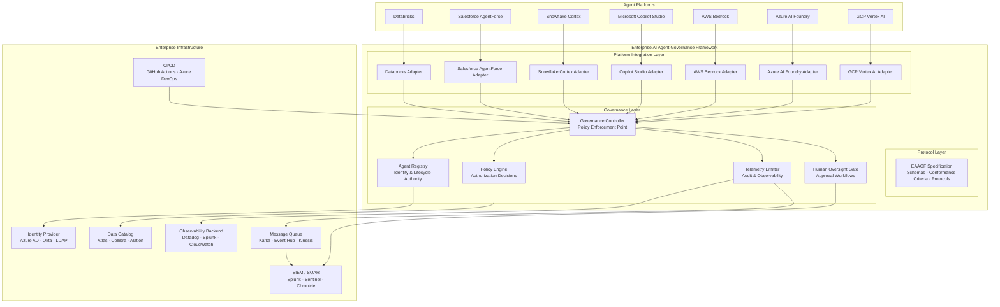

### Governance Decision Flow

Every agent action passes through the following governance decision flow. This is the core enforcement pattern that all platform adapters must implement.

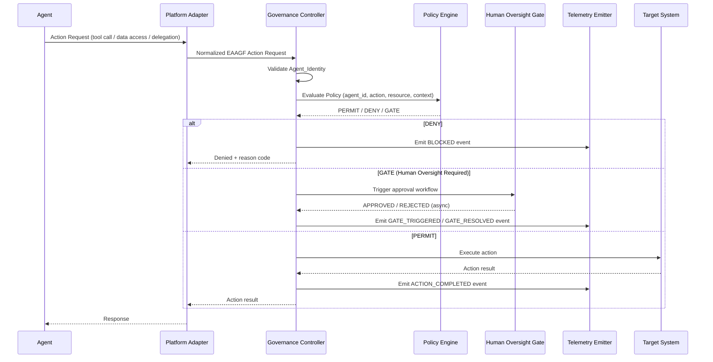

---

## Governance Domains and Standards

### Domain 1: Agent Identity and Registration

The Agent Registry is the authoritative source of truth for all agent identities and lifecycle states. Every agent deployed in the enterprise MUST be registered before it can perform any governed action.

#### Agent Registration Flow

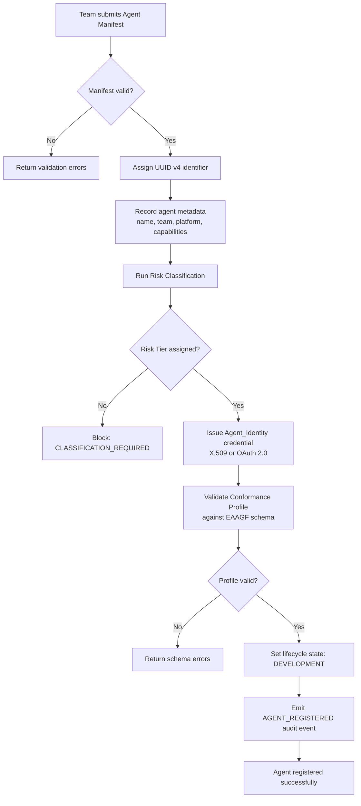

#### Agent Record Schema

```json
{
  "agent_id": "uuid-v4",
  "name": "string",
  "version": "semver",
  "owning_team": "string",
  "platform": "DATABRICKS | SALESFORCE | SNOWFLAKE | COPILOT_STUDIO | AWS | AZURE | GCP",
  "risk_tier": "T1 | T2 | T3 | T4",
  "lifecycle_state": "DEVELOPMENT | STAGING | PRODUCTION | DECOMMISSIONED",
  "conformance_profile": { "$ref": "#/ConformanceProfile" },
  "identity": {
    "credential_type": "X509 | OAUTH2",
    "credential_id": "string",
    "issued_at": "ISO8601",
    "expires_at": "ISO8601"
  },
  "created_at": "ISO8601",
  "created_by": "string",
  "last_modified_at": "ISO8601",
  "last_modified_by": "string",
  "compliance_flags": ["EU_AI_ACT_HIGH_RISK", "GDPR_SCOPED", "CCPA_SCOPED"]
}
```

#### Credential Lifecycle Flow

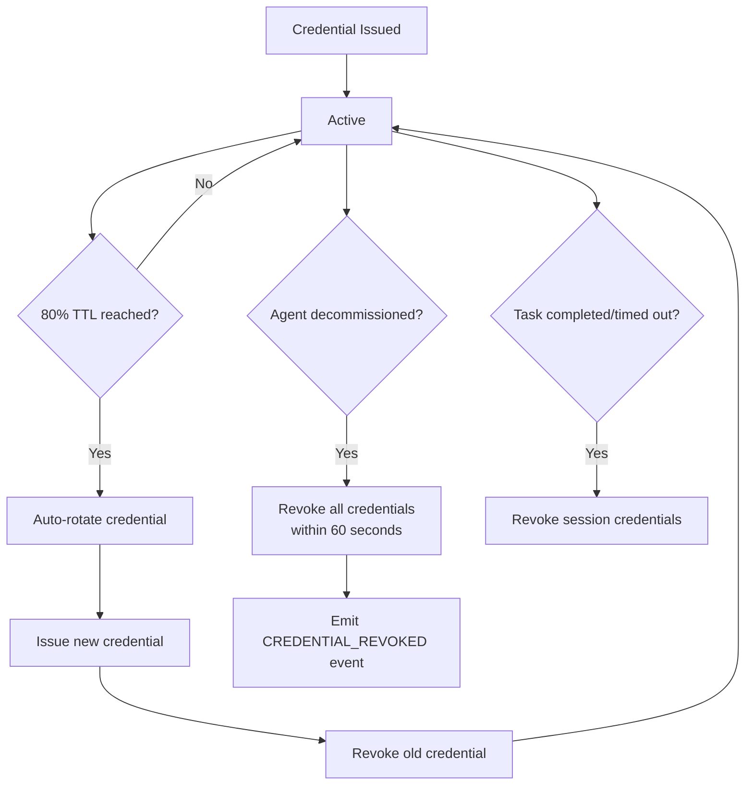

#### Conformance Profile Schema

```json
{
  "schema_version": "1.0",
  "agent_id": "uuid-v4",
  "capabilities": ["TOOL_CALL", "DATA_READ", "DATA_WRITE", "AGENT_DELEGATION", "EXTERNAL_CONNECTION"],
  "declared_permissions": [
    { "resource": "snowflake://db/schema/table", "actions": ["SELECT"] },
    { "resource": "salesforce://sobject/Account", "actions": ["READ", "UPDATE"] }
  ],
  "approved_mcp_servers": ["mcp://enterprise-catalog/salesforce-crm"],
  "approved_egress_endpoints": ["api.internal.company.com", "*.salesforce.com"],
  "data_classifications_accessed": ["INTERNAL", "CONFIDENTIAL"],
  "oversight_mode": "SUPERVISED | FULL_AUTO | APPROVAL_REQUIRED | HUMAN_IN_LOOP",
  "max_session_duration_seconds": 3600,
  "max_actions_per_minute": 100,
  "context_compartments": ["crm-context", "finance-context"],
  "geographic_constraints": ["EU", "US"],
  "protocols_supported": ["MCP_1_0", "A2A_1_0"],
  "disclosure_mode": "SESSION_START | PERIODIC | CONTINUOUS",
  "disclosure_interval_seconds": 300,
  "content_provenance_mode": "LABEL_ONLY | METADATA_ONLY | FULL"
}
```

---

### Domain 2: Risk Classification and Tiering

All agents MUST be classified into exactly one of four Risk Tiers based on three dimensions: autonomy level, data sensitivity, and action scope. The Risk Tier determines the governance controls applied.

#### Risk Classification Flow

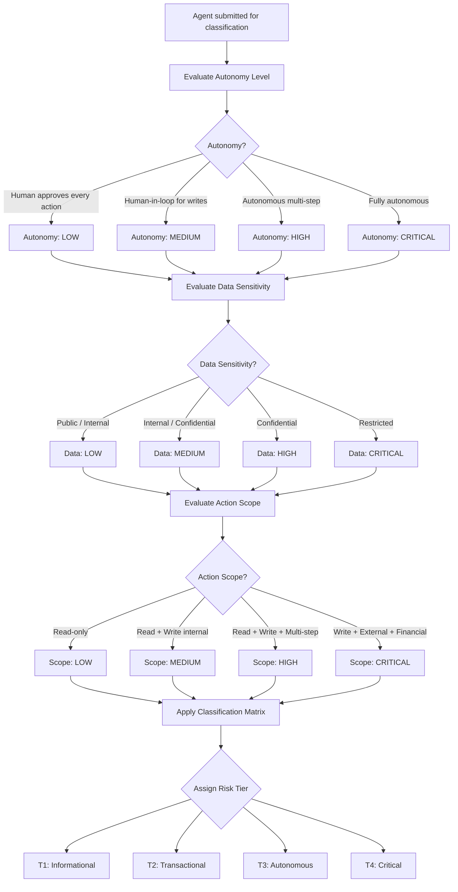

#### Risk Tier Classification Matrix

| Dimension | T1 (Informational) | T2 (Transactional) | T3 (Autonomous) | T4 (Critical) |
|---|---|---|---|---|
| Autonomy | Human approves every action | Human-in-loop for writes | Autonomous multi-step | Fully autonomous |
| Data Sensitivity | Public / Internal | Internal / Confidential | Confidential | Restricted |
| Action Scope | Read-only | Read + Write (internal) | Read + Write + Multi-step | Write + External + Financial |
| Default Oversight Mode | HUMAN_IN_LOOP | SUPERVISED | APPROVAL_REQUIRED | APPROVAL_REQUIRED |
| Credential TTL | 1 hour | 1 hour | 15 minutes | 15 minutes |
| Re-validation Period | 180 days | 180 days | 90 days | 90 days |
| AI Governance Approval Required | No | No | Yes | Yes |
| EU AI Act High-Risk Candidate | No | Possible | Likely | Yes |

#### Multi-Platform Tier Resolution

When an agent spans multiple platforms, the assigned tier MUST equal the maximum tier across all platform contexts. For example, if an agent is T2 on Salesforce and T3 on Databricks, the agent is classified as T3.

---

### Domain 3: Authorization and Least Privilege

The Policy Engine evaluates every agent action request against governance policies using an attribute-based access control (ABAC) model.

#### Authorization Decision Flow

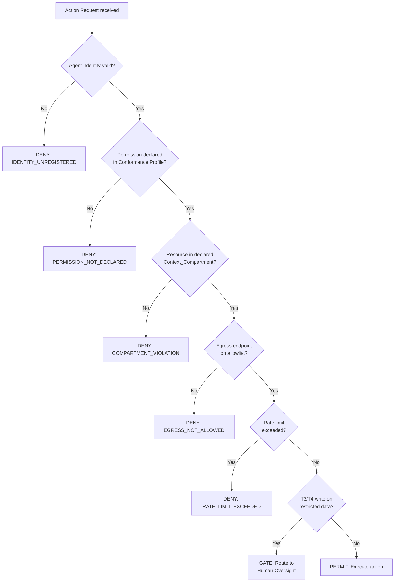

#### Policy Evaluation Model

```
Decision = f(agent_attributes, action_attributes, resource_attributes, environment_attributes)

agent_attributes    = { agent_id, risk_tier, lifecycle_state, conformance_profile }
action_attributes   = { action_type, declared_in_profile, rate_within_limit }
resource_attributes = { classification, compartment, geographic_region }
environment_attributes = { time_of_day, active_incidents, platform }
```

#### Credential TTL Rules

| Risk Tier | Maximum Credential TTL | Session Behavior |
|---|---|---|
| T1 | 3600 seconds (1 hour) | Revoke on task completion |
| T2 | 3600 seconds (1 hour) | Revoke on task completion |
| T3 | 900 seconds (15 minutes) | Revoke on task completion or timeout |
| T4 | 900 seconds (15 minutes) | Revoke on task completion or timeout |

---

### Domain 4: Observability and Audit Trail

Every governance decision MUST produce a standardized audit event. The audit trail is immutable and retained for a minimum of 7 years.

#### Audit Event Schema (OTLP Span Attributes)

```json
{
  "eaagf.agent.id": "uuid",
  "eaagf.agent.risk_tier": "T1|T2|T3|T4",
  "eaagf.agent.platform": "DATABRICKS|SALESFORCE|...",
  "eaagf.action.type": "TOOL_CALL|DATA_ACCESS|AGENT_DELEGATION|EXTERNAL_CONNECTION",
  "eaagf.action.target": "resource URI",
  "eaagf.action.outcome": "PERMITTED|DENIED|GATED|BLOCKED",
  "eaagf.action.reason_code": "string",
  "eaagf.task.id": "uuid",
  "eaagf.task.correlation_id": "uuid",
  "eaagf.gate.id": "uuid (if gated)",
  "eaagf.gate.approver": "string (if gated)",
  "eaagf.gate.decision": "APPROVED|REJECTED (if gated)",
  "eaagf.data.classification": "PUBLIC|INTERNAL|CONFIDENTIAL|RESTRICTED",
  "eaagf.security.prompt_injection_score": "float",
  "eaagf.compliance.eu_ai_act_applicable": "bool",
  "timestamp": "ISO8601 UTC"
}
```

---

### Domain 5: Human Oversight Controls

The framework defines four oversight modes and a gate-based approval workflow for high-stakes agent decisions.

#### Oversight Modes

| Mode | Description | Default For |
|---|---|---|
| FULL_AUTO | No human gates | — (requires explicit authorization) |
| SUPERVISED | Gates on write operations | T2 agents |
| APPROVAL_REQUIRED | Gates on all non-trivial actions | T3, T4 agents |
| HUMAN_IN_LOOP | Human approves every action | T1 agents |

#### Human Oversight Gate Workflow

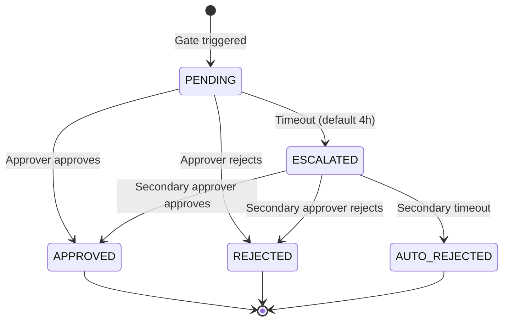

#### Human Oversight Decision Flow

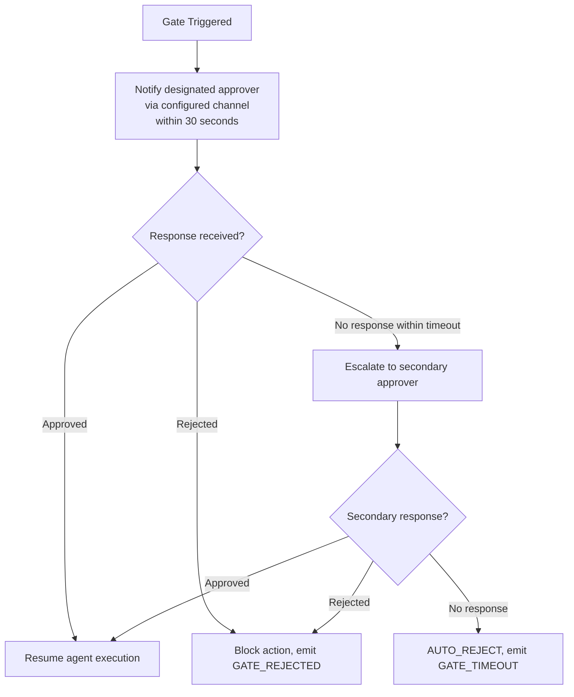

---

### Domain 6: Interoperability Standards

All agents MUST communicate using MCP (Model Context Protocol) for tool connections and A2A (Agent-to-Agent Protocol) for peer delegation. Platform adapters bridge platform-native APIs to EAAGF-compliant interfaces.

#### Platform Adapter Compatibility Matrix

| Platform | Integration Point | MCP Support | A2A Support |
|---|---|---|---|
| Databricks | MLflow Model Serving, Unity Catalog | Via compatibility shim | Via compatibility shim |
| Salesforce AgentForce | AgentForce Command Center API | Native | Native |
| Snowflake Cortex | Cortex Agent API, Snowpark | Via compatibility shim | Via compatibility shim |
| Microsoft Copilot Studio | Power Platform connectors | Native | Via compatibility shim |
| AWS Bedrock | Bedrock Agents API, Lambda | Via compatibility shim | Via compatibility shim |
| Azure AI Foundry | AI Foundry SDK, Azure API Management | Native | Via compatibility shim |
| GCP Vertex AI | Vertex AI Agent Builder API | Via compatibility shim | Via compatibility shim |

#### Agent-to-Agent Delegation Flow

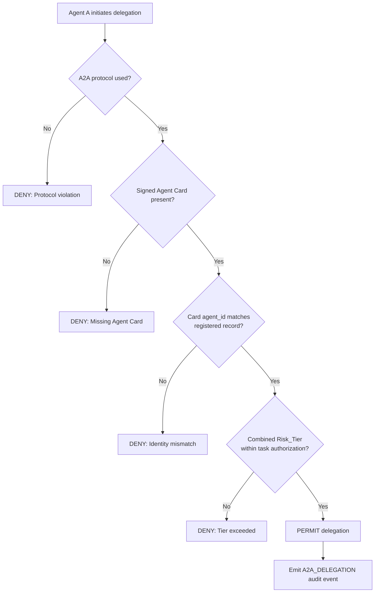

#### MCP Enterprise Directory Entry Schema

```json
{
  "mcp_server_id": "mcp://enterprise-catalog/salesforce-crm",
  "display_name": "Salesforce CRM MCP Server",
  "provider": "Salesforce",
  "version": "3.1.0",
  "security_attestation": {
    "last_reviewed": "2025-01-15",
    "reviewed_by": "AI Governance Team",
    "vulnerability_scan_passed": true,
    "data_classification_max": "CONFIDENTIAL"
  },
  "approved_risk_tiers": ["T1", "T2", "T3"],
  "capabilities": ["account_read", "opportunity_read", "case_create"],
  "endpoint": "https://mcp.salesforce.internal.company.com"
}
```

---

### Domain 7: Data Governance and Privacy

Agents MUST respect enterprise data classification policies. Sensitive data MUST be compartmentalized within task contexts.

#### Data Governance Decision Flow

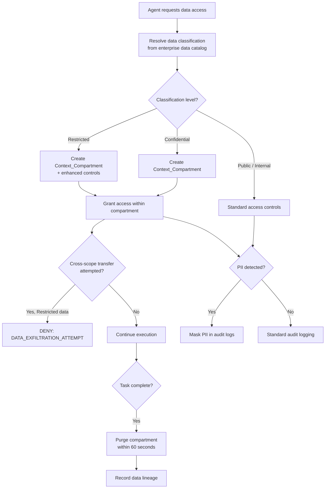

#### Data Classification Controls

| Classification | Compartment Required | Cross-Scope Transfer | PII Masking | Geographic Constraints |
|---|---|---|---|---|
| Public | No | Allowed | If PII detected | None |
| Internal | No | Allowed | If PII detected | None |
| Confidential | Yes | Restricted | Required | If GDPR/CCPA scoped |
| Restricted | Yes | Blocked | Required | Enforced |

---

### Domain 8: Security Controls

The framework defines defense-in-depth security controls applied at agent action boundaries.

#### Security Control Chain

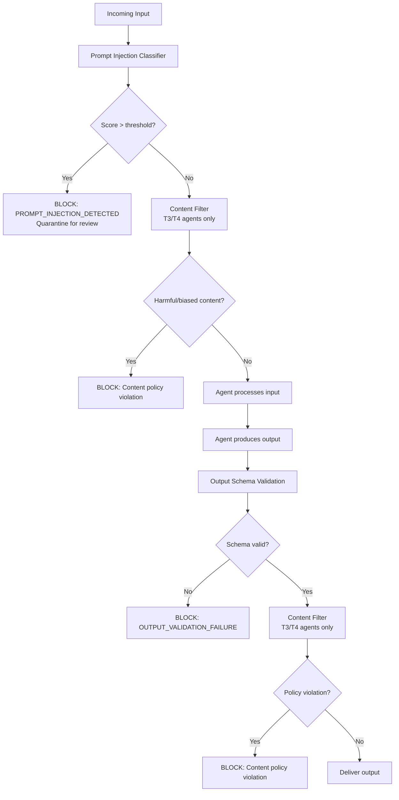

#### Rate Limiting Rules

| Risk Tier | Max Actions/Minute | Breach Action |
|---|---|---|
| T1 | 100 | Throttle + RATE_LIMIT_EXCEEDED event |
| T2 | 100 | Throttle + RATE_LIMIT_EXCEEDED event |
| T3 | 20 | Throttle + RATE_LIMIT_EXCEEDED event |
| T4 | 20 | Throttle + RATE_LIMIT_EXCEEDED event |

#### Self-Modification Prevention

Any agent action targeting its own Conformance_Profile, Risk_Tier, oversight mode, or governance controls MUST be denied with reason code SELF_MODIFICATION_ATTEMPT.

---

### Domain 9: Compliance and Regulatory Alignment

The framework provides built-in mappings to EU AI Act, NIST AI RMF, and ISO 42001.

#### Compliance Mapping Registry Schema

```json
{
  "control_id": "EAAGF-AUTH-001",
  "control_name": "Least Privilege Authorization",
  "requirement_refs": ["3.1", "3.2", "3.3"],
  "regulatory_mappings": {
    "eu_ai_act": ["Article 9 - Risk Management", "Article 13 - Transparency"],
    "nist_ai_rmf": ["GOVERN 1.1", "MANAGE 2.2", "MEASURE 2.5"],
    "iso_42001": ["Clause 6.1 - Risk Assessment", "Clause 8.4 - AI System Operation"]
  },
  "evidence_sources": ["policy_engine_logs", "credential_issuance_records", "permission_denial_events"]
}
```

---

### Domain 10: Agent Lifecycle Management

All agents follow a four-stage lifecycle with governance gates at each transition.

#### Agent Lifecycle State Machine

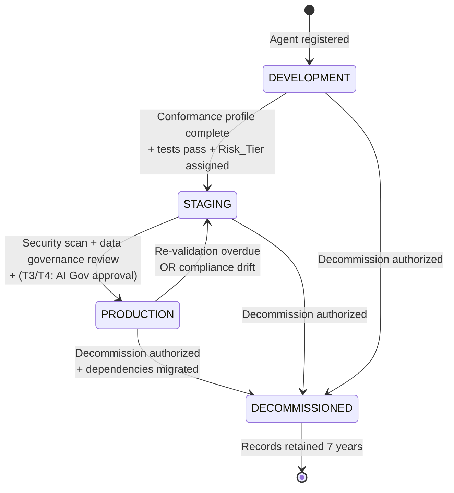

#### Lifecycle Transition Gates

| Transition | Prerequisites |
|---|---|
| DEVELOPMENT → STAGING | Completed Conformance_Profile, passing conformance tests, Risk_Tier assigned |
| STAGING → PRODUCTION | Security scan attestation, data governance review, AI Gov approval (T3/T4) |
| PRODUCTION → STAGING | Triggered by re-validation overdue or compliance drift |
| Any → DECOMMISSIONED | Decommission authorization, dependency migration verified (or override) |

#### Agent Lifecycle Management Flow

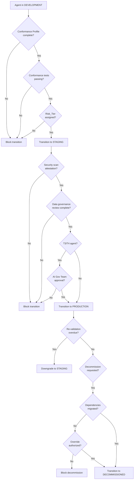

#### Incident Response Flow

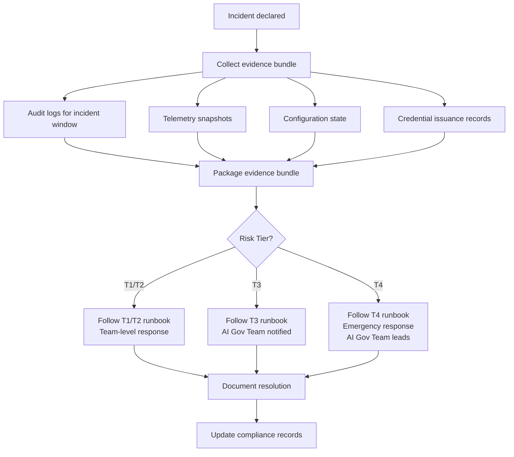

---

### Domain 11: Transparency and AI Disclosure Controls

Agents MUST disclose their AI nature to users. The Governance_Controller enforces disclosure requirements as an output-level control, analogous to output schema validation. Disclosure cadence is configured per agent via the `disclosure_mode` field in the Conformance_Profile.

#### Disclosure Mode Configuration

| Disclosure Mode | Behavior | Default For |
|---|---|---|
| SESSION_START | Disclosure at session initiation only | T1, T2 agents |
| PERIODIC | Disclosure at session start + configurable intervals | T3 agents |
| CONTINUOUS | Disclosure attached to every output | T4 agents, AI companions |

#### Disclosure Enforcement Flow

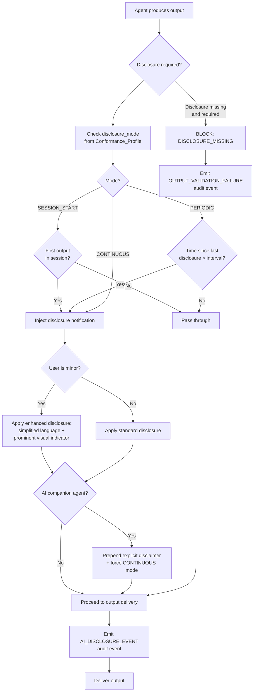

#### AI Disclosure Event Schema

```json
{
  "eaagf.disclosure.type": "SESSION_START | PERIODIC | CONTINUOUS",
  "eaagf.disclosure.format": "TEXT | AUDIO | VISUAL",
  "eaagf.disclosure.enhanced": "bool (true if minor or AI companion)",
  "eaagf.disclosure.agent_id": "uuid",
  "eaagf.disclosure.session_id": "uuid",
  "eaagf.disclosure.interval_seconds": "int (configured interval)",
  "eaagf.disclosure.last_disclosure_at": "ISO8601",
  "timestamp": "ISO8601 UTC"
}
```

#### Disclosure Suppression Prevention

Any agent action that attempts to suppress, obscure, or misrepresent the AI nature of the agent MUST be denied with reason code SELF_MODIFICATION_ATTEMPT. This includes:
- Removing disclosure text from outputs
- Claiming to be human
- Instructing users to ignore disclosure notices

---

### Domain 12: Synthetic Content Identification and Provenance

All AI-generated content MUST carry provenance markers identifying it as synthetic. The Governance_Controller enforces provenance marking as an output-level control. Provenance strategy is configured per agent via the `content_provenance_mode` field in the Conformance_Profile.

#### Content Provenance Mode Configuration

| Provenance Mode | Explicit Marker | Implicit Marker (C2PA) | Default For |
|---|---|---|---|
| LABEL_ONLY | Yes (visible label) | No | T1 text-only agents |
| METADATA_ONLY | No | Yes (C2PA embedded) | Internal-use agents |
| FULL | Yes (visible label) | Yes (C2PA embedded) | T3/T4 agents, deepfake-relevant |

#### Provenance Enforcement Flow

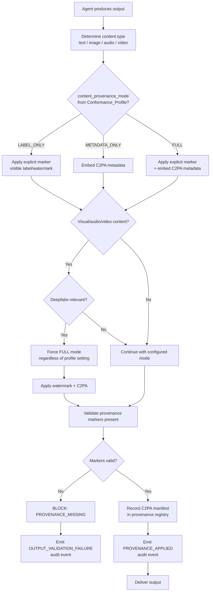

#### Provenance Event Schema

```json
{
  "eaagf.provenance.marker_type": "EXPLICIT | IMPLICIT | BOTH",
  "eaagf.provenance.content_type": "TEXT | IMAGE | AUDIO | VIDEO | MULTIMODAL",
  "eaagf.provenance.c2pa_manifest_id": "string (C2PA manifest reference)",
  "eaagf.provenance.agent_id": "uuid",
  "eaagf.provenance.mode": "LABEL_ONLY | METADATA_ONLY | FULL",
  "eaagf.provenance.deepfake_relevant": "bool",
  "eaagf.provenance.forced_full_mode": "bool",
  "timestamp": "ISO8601 UTC"
}
```

#### Provenance Marker Integrity

Any agent action that attempts to remove, alter, or strip provenance markers from content MUST be denied with reason code SELF_MODIFICATION_ATTEMPT. This applies to:
- Markers on the agent's own outputs
- Markers on content received from other agents via A2A delegation
- Markers on content retrieved from external sources

#### Provenance Registry

The Governance_Controller maintains a provenance registry that stores the C2PA manifest for every piece of AI-generated content. This registry enables:
- Downstream verification of content origin
- Chain of custody tracking across agent delegations
- Regulatory audit of synthetic content production

```json
{
  "provenance_record_id": "uuid-v4",
  "agent_id": "uuid-v4",
  "content_hash": "SHA-256 hash of content",
  "c2pa_manifest": { "$ref": "#/C2PA_Manifest" },
  "content_type": "TEXT | IMAGE | AUDIO | VIDEO | MULTIMODAL",
  "created_at": "ISO8601",
  "platform": "DATABRICKS | SALESFORCE | SNOWFLAKE | COPILOT_STUDIO | AWS | AZURE | GCP",
  "downstream_consumers": ["agent_id_1", "agent_id_2"]
}
```

---

## Correctness Properties

*A property is a characteristic or behavior that should hold true across all valid executions of a system — essentially, a formal statement about what the system should do. Properties serve as the bridge between human-readable specifications and machine-verifiable correctness guarantees.*

The following properties cover the two new governance domains (11 and 12). Properties for Domains 1–10 are covered by the existing specification.

### Property 1: Session-start disclosure is always present

*For any* agent session and any disclosure_mode setting (SESSION_START, PERIODIC, or CONTINUOUS), the first output of the session shall contain a disclosure notification.

**Validates: Requirements 11.1, 11.5**

### Property 2: Periodic disclosure cadence enforcement

*For any* agent with disclosure_mode PERIODIC and any sequence of outputs, if the elapsed time since the last disclosure exceeds the configured interval, the next output shall contain a disclosure notification.

**Validates: Requirements 11.2, 11.5**

### Property 3: Continuous disclosure completeness

*For any* agent with disclosure_mode CONTINUOUS, every output produced by the agent shall contain a disclosure indicator.

**Validates: Requirements 11.3, 11.5**

### Property 4: Minor enhanced disclosure enforcement

*For any* agent session where the user is identified as a minor, the disclosure notification shall include enhanced formatting (simplified language and prominent visual indicator), regardless of the base disclosure_mode.

**Validates: Requirements 11.4**

### Property 5: AI companion forced continuous mode

*For any* agent classified as an AI companion, the effective disclosure_mode shall be CONTINUOUS regardless of the Conformance_Profile setting, and every output shall be prepended with an explicit disclaimer.

**Validates: Requirements 11.9**

### Property 6: Disclosure blocking on missing notification

*For any* agent output that requires a disclosure notification (per the agent's disclosure_mode and elapsed time), if the disclosure is absent, the output shall be blocked and an OUTPUT_VALIDATION_FAILURE event with reason code DISCLOSURE_MISSING shall be emitted.

**Validates: Requirements 11.7**

### Property 7: Disclosure audit trail completeness

*For any* disclosure notification delivered to a user, a corresponding AI_DISCLOSURE_EVENT audit event shall be emitted containing the disclosure type, format, recipient context, and timestamp.

**Validates: Requirements 11.8**

### Property 8: Explicit provenance marker presence

*For any* agent output where content_provenance_mode is LABEL_ONLY or FULL, the output shall contain a visible provenance marker indicating AI origin.

**Validates: Requirements 12.1, 12.4**

### Property 9: Implicit provenance marker presence

*For any* agent output where content_provenance_mode is METADATA_ONLY or FULL, the output shall contain embedded C2PA metadata identifying AI origin.

**Validates: Requirements 12.2, 12.4**

### Property 10: Deepfake-relevant content forced full mode

*For any* agent generating visual, audio, or video content that could be mistaken for human-created content, the effective content_provenance_mode shall be FULL regardless of the Conformance_Profile setting, and both watermarking and C2PA metadata shall be applied.

**Validates: Requirements 12.3, 12.9**

### Property 11: Provenance blocking on missing markers

*For any* agent output that requires provenance markers (per the agent's content_provenance_mode), if the markers are absent, the output shall be blocked and an OUTPUT_VALIDATION_FAILURE event with reason code PROVENANCE_MISSING shall be emitted.

**Validates: Requirements 12.5**

### Property 12: Provenance marker immutability

*For any* agent action that attempts to remove, alter, or strip provenance markers from any content, the action shall be denied and a SELF_MODIFICATION_ATTEMPT security event shall be emitted.

**Validates: Requirements 12.6**

### Property 13: Provenance audit trail completeness

*For any* provenance marker application, a corresponding PROVENANCE_APPLIED audit event shall be emitted containing the marker type, content type, C2PA manifest reference, and timestamp.

**Validates: Requirements 12.7**

### Property 14: Provenance registry round-trip

*For any* AI-generated content with a C2PA manifest recorded in the provenance registry, querying the registry by content hash shall return the original C2PA manifest and agent origin.

**Validates: Requirements 12.10**

---

## Error Code Registry

| Code | Category | Description | Recovery |
|---|---|---|---|
| IDENTITY_UNREGISTERED | Identity | Agent has no valid registered identity | Register agent before use |
| PERMISSION_NOT_DECLARED | Authorization | Requested permission not in Conformance_Profile | Update Conformance_Profile |
| COMPARTMENT_VIOLATION | Authorization | Access to resource outside declared compartment | Declare compartment in profile |
| EGRESS_NOT_ALLOWED | Authorization | Outbound connection to non-allowlisted endpoint | Add endpoint to approved_egress_endpoints |
| CLASSIFICATION_REQUIRED | Lifecycle | Agent has no Risk_Tier assignment | Complete risk classification |
| UNAPPROVED_MCP_SERVER | Interoperability | MCP server not in enterprise directory | Request MCP server approval |
| PROMPT_INJECTION_DETECTED | Security | Input classified as prompt injection | Review and sanitize input |
| OUTPUT_VALIDATION_FAILURE | Security | Agent output failed schema validation | Review agent output logic |
| SELF_MODIFICATION_ATTEMPT | Security | Agent attempted to modify own governance controls | Governance controls are immutable by agents |
| DATA_EXFILTRATION_ATTEMPT | Data Governance | Restricted data transfer outside authorized scope | Review data handling logic |
| RATE_LIMIT_EXCEEDED | Security | Agent exceeded action rate limit | Reduce action frequency or request limit increase |
| PLAN_DEVIATION | Oversight | Agent action sequence deviated from declared plan | Human review required |
| COMPLIANCE_DRIFT | Compliance | Agent compliance posture has degraded | Remediate within 24 hours |
| GATE_TIMEOUT_ESCALATION | Oversight | Human gate not responded to within timeout | Secondary approver notified |
| EMERGENCY_STOPPED | Oversight | Agent has been emergency stopped | Requires AI Governance Team review |
| DISCLOSURE_MISSING | Transparency | Agent output missing required AI disclosure notification | Add disclosure to output or check disclosure_mode configuration |
| PROVENANCE_MISSING | Provenance | Agent output missing required content provenance markers | Apply provenance markers per content_provenance_mode |

---

## Agent Manifest Format

The canonical agent manifest format used for registration:

```yaml
apiVersion: eaagf/v1
kind: AgentManifest
metadata:
  name: "sales-forecast-agent"
  version: "1.2.0"
  owning_team: "revenue-analytics"
  platform: "DATABRICKS"
spec:
  risk_tier: "T2"
  capabilities:
    - TOOL_CALL
    - DATA_READ
    - DATA_WRITE
  declared_permissions:
    - resource: "snowflake://analytics/sales/forecast"
      actions: ["SELECT", "INSERT"]
    - resource: "salesforce://sobject/Opportunity"
      actions: ["READ"]
  approved_mcp_servers:
    - "mcp://enterprise-catalog/snowflake-query"
    - "mcp://enterprise-catalog/salesforce-crm"
  approved_egress_endpoints:
    - "api.internal.company.com"
  data_classifications_accessed:
    - "INTERNAL"
    - "CONFIDENTIAL"
  oversight_mode: "SUPERVISED"
  max_session_duration_seconds: 3600
  max_actions_per_minute: 100
  context_compartments:
    - "sales-analytics-context"
  geographic_constraints:
    - "US"
    - "EU"
  protocols_supported:
    - "MCP_1_0"
  disclosure_mode: "SESSION_START"
  disclosure_interval_seconds: 300
  content_provenance_mode: "LABEL_ONLY"
```
