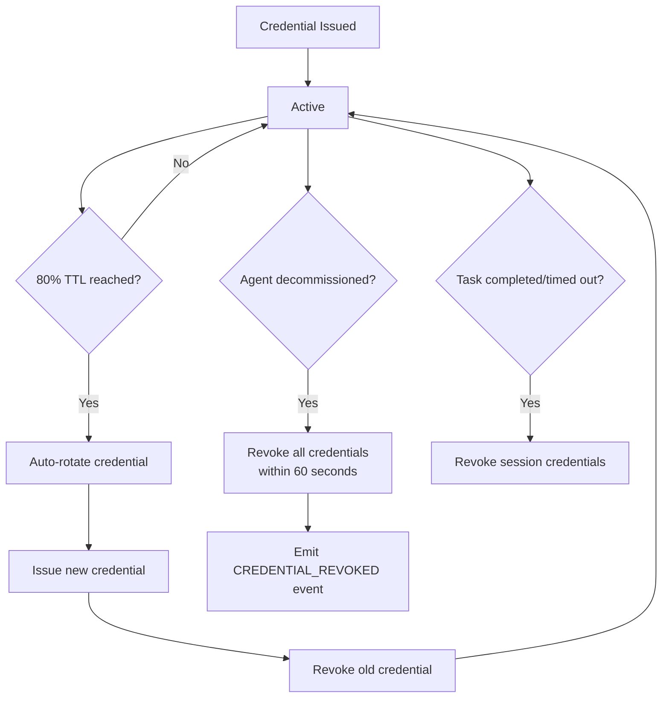
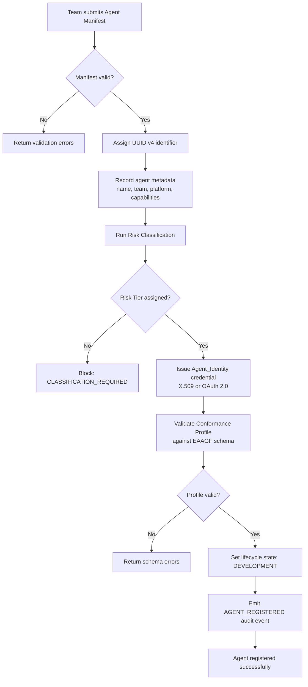

# EAAGF Specification — Agent Identity and Registration Standard

**Document ID:** EAAGF-SPEC-02  
**Version:** 1.0.0  
**Status:** Draft  
**Last Updated:** 2025-07-14  
**Owner:** AI Governance Team

---

## 1. Purpose

This document defines the normative standard for agent identity and registration within the Enterprise AI Agent Governance Framework (EAAGF). It specifies how agents are uniquely identified, how their identities are issued and managed, and how the Agent_Registry operates as the authoritative source of truth for all agent records.

Every AI agent deployed in the enterprise MUST be registered in the Agent_Registry before it can perform any governed action. This standard ensures that all agents are trackable, auditable, and manageable from a single authoritative source across all platforms.

The key words "MUST", "MUST NOT", "REQUIRED", "SHALL", "SHALL NOT", "SHOULD", "SHOULD NOT", "RECOMMENDED", "MAY", and "OPTIONAL" in this document are to be interpreted as described in [RFC 2119](https://www.rfc-editor.org/rfc/rfc2119).

---

## 2. Scope

This standard applies to:

- All AI agents deployed on any enterprise-supported platform (Databricks, Salesforce AgentForce, Snowflake Cortex, Microsoft Copilot Studio, AWS Bedrock, Azure AI Foundry, GCP Vertex AI)
- The Agent_Registry component and its interfaces
- All teams that develop, deploy, or operate AI agents within the enterprise

For related standards, see:

| Related Domain | Document |
|---|---|
| Risk Classification | [03 — Risk Classification Standard](./03-risk-classification-standard.md) |
| Authorization | [04 — Authorization Standard](./04-authorization-standard.md) |
| Observability | [05 — Observability Standard](./05-observability-standard.md) |
| Interoperability | [07 — Interoperability Standard](./07-interoperability-standard.md) |
| Lifecycle Management | [11 — Lifecycle Management Standard](./11-lifecycle-management-standard.md) |

---

## 3. Agent Identifier Assignment

### 3.1 Unique Identifier Requirement

The Agent_Registry SHALL assign a globally unique identifier to every agent at registration time. The identifier MUST conform to UUID version 4 as defined in [RFC 4122](https://www.rfc-editor.org/rfc/rfc4122).

**Normative rules:**

1. Each agent identifier MUST be a UUID v4 generated using a cryptographically secure random number generator.
2. The identifier SHALL be assigned at the moment of successful registration and MUST NOT be reused, even after agent decommission.
3. The identifier SHALL serve as the primary key for all agent records, audit events, and cross-references within the EAAGF.
4. Platform-specific agent identifiers (e.g., Databricks model IDs, Salesforce agent IDs) MAY be stored as supplementary metadata but SHALL NOT replace the EAAGF UUID v4 identifier.

> **Validates: Requirement 1.1** — The Agent_Registry SHALL assign a globally unique identifier (UUID v4) to every agent at registration time.

---

## 4. Agent Record

### 4.1 Required Record Fields

WHEN an agent is registered, the Agent_Registry SHALL record the following fields. All fields marked as REQUIRED MUST be present for registration to succeed.

| Field | Type | Required | Description |
|---|---|---|---|
| `agent_id` | UUID v4 | REQUIRED | Globally unique agent identifier, assigned by the Agent_Registry |
| `name` | string | REQUIRED | Human-readable agent name |
| `version` | semver | REQUIRED | Agent version following [Semantic Versioning 2.0.0](https://semver.org/) |
| `owning_team` | string | REQUIRED | The team responsible for the agent |
| `platform` | enum | REQUIRED | Target platform (see Section 2 for supported values) |
| `risk_tier` | enum | REQUIRED | Assigned Risk_Tier: `T1`, `T2`, `T3`, or `T4` |
| `lifecycle_state` | enum | REQUIRED | Current lifecycle state (see [11 — Lifecycle Management Standard](./11-lifecycle-management-standard.md)) |
| `conformance_profile` | object | REQUIRED | The agent's Conformance_Profile (see Section 7) |
| `identity` | object | REQUIRED | Agent_Identity credential record (see Section 5) |
| `created_at` | ISO 8601 | REQUIRED | Timestamp of initial registration (UTC) |
| `created_by` | string | REQUIRED | Identity of the human or system that registered the agent |
| `last_modified_at` | ISO 8601 | REQUIRED | Timestamp of last record modification (UTC) |
| `last_modified_by` | string | REQUIRED | Identity of the human or system that last modified the record |
| `compliance_flags` | array | OPTIONAL | Applicable compliance flags (e.g., `EU_AI_ACT_HIGH_RISK`, `GDPR_SCOPED`, `CCPA_SCOPED`) |

> **Validates: Requirement 1.2** — WHEN an agent is registered, the Agent_Registry SHALL record the agent's name, owning team, platform, Risk_Tier, creation timestamp, and Conformance_Profile.

### 4.2 Agent Record Schema (JSON)

The following JSON schema defines the canonical structure of an agent record. All conforming implementations of the Agent_Registry MUST store records that validate against this schema.

```json
{
  "$schema": "https://json-schema.org/draft/2020-12/schema",
  "$id": "https://eaagf.enterprise.com/schemas/agent-record/v1",
  "title": "EAAGF Agent Record",
  "description": "Canonical schema for an agent registration record in the Agent_Registry.",
  "type": "object",
  "required": [
    "agent_id", "name", "version", "owning_team", "platform",
    "risk_tier", "lifecycle_state", "conformance_profile", "identity",
    "created_at", "created_by", "last_modified_at", "last_modified_by"
  ],
  "properties": {
    "agent_id": {
      "type": "string",
      "format": "uuid",
      "description": "Globally unique UUID v4 identifier assigned by the Agent_Registry."
    },
    "name": {
      "type": "string",
      "minLength": 1,
      "maxLength": 256,
      "description": "Human-readable agent name."
    },
    "version": {
      "type": "string",
      "pattern": "^(0|[1-9]\\d*)\\.(0|[1-9]\\d*)\\.(0|[1-9]\\d*)$",
      "description": "Agent version following Semantic Versioning 2.0.0."
    },
    "owning_team": {
      "type": "string",
      "minLength": 1,
      "description": "Team responsible for the agent."
    },
    "platform": {
      "type": "string",
      "enum": ["DATABRICKS", "SALESFORCE", "SNOWFLAKE", "COPILOT_STUDIO", "AWS", "AZURE", "GCP"],
      "description": "Target deployment platform."
    },
    "risk_tier": {
      "type": "string",
      "enum": ["T1", "T2", "T3", "T4"],
      "description": "Assigned Risk_Tier classification."
    },
    "lifecycle_state": {
      "type": "string",
      "enum": ["DEVELOPMENT", "STAGING", "PRODUCTION", "DECOMMISSIONED"],
      "description": "Current lifecycle state."
    },
    "conformance_profile": {
      "$ref": "#/$defs/ConformanceProfile",
      "description": "The agent's declared Conformance_Profile."
    },
    "identity": {
      "$ref": "#/$defs/AgentIdentity",
      "description": "Agent_Identity credential record."
    },
    "created_at": {
      "type": "string",
      "format": "date-time",
      "description": "ISO 8601 UTC timestamp of initial registration."
    },
    "created_by": {
      "type": "string",
      "description": "Identity of the human or system that registered the agent."
    },
    "last_modified_at": {
      "type": "string",
      "format": "date-time",
      "description": "ISO 8601 UTC timestamp of last record modification."
    },
    "last_modified_by": {
      "type": "string",
      "description": "Identity of the human or system that last modified the record."
    },
    "compliance_flags": {
      "type": "array",
      "items": {
        "type": "string",
        "enum": ["EU_AI_ACT_HIGH_RISK", "GDPR_SCOPED", "CCPA_SCOPED"]
      },
      "description": "Applicable compliance flags."
    }
  }
}
```

> **Note:** The `$defs/ConformanceProfile` and `$defs/AgentIdentity` sub-schemas are defined in Sections 7 and 5 respectively.

### 4.3 Record Modification Tracking

WHEN an agent's owning team, platform, or any other record field changes, the Agent_Registry SHALL:

1. Record the change with a UTC timestamp in the `last_modified_at` field.
2. Record the identity of the human who authorized the change in the `last_modified_by` field.
3. Maintain an immutable audit trail of all record modifications, including the previous and new values.

Automated systems MAY initiate record modifications (e.g., credential rotation), but changes to `owning_team` or `platform` MUST be authorized by a human and the authorizing human's identity MUST be recorded.

> **Validates: Requirement 1.8** — WHEN an agent's owning team or platform changes, the Agent_Registry SHALL record the change with a timestamp and the identity of the human who authorized the change.

---

## 5. Agent Identity Credentials

### 5.1 Credential Issuance

The Agent_Registry SHALL issue a unique Agent_Identity credential to each registered agent. The credential MUST be one of the following types:

| Credential Type | Format | Use Case |
|---|---|---|
| **X.509 Certificate** | Per [RFC 5280](https://www.rfc-editor.org/rfc/rfc5280) | Long-lived agent identities, mutual TLS authentication, platform-to-platform trust |
| **OAuth 2.0 Token** | Per [RFC 6749](https://www.rfc-editor.org/rfc/rfc6749) | Short-lived session credentials, API-based authentication, delegated access |

**Normative rules:**

1. The Agent_Registry SHALL issue exactly one primary credential per agent at registration time.
2. The credential MUST be cryptographically bound to the agent's UUID v4 identifier.
3. The credential record MUST include: `credential_type`, `credential_id`, `issued_at` (ISO 8601 UTC), and `expires_at` (ISO 8601 UTC).
4. X.509 certificates SHALL include the agent's UUID v4 in the Subject Alternative Name (SAN) extension.
5. OAuth 2.0 tokens SHALL include the agent's UUID v4 in the `sub` (subject) claim.

> **Validates: Requirement 1.3** — The Agent_Registry SHALL issue a unique Agent_Identity (X.509 certificate or short-lived OAuth 2.0 token) to each registered agent.

### 5.2 Agent Identity Sub-Schema (JSON)

```json
{
  "$defs": {
    "AgentIdentity": {
      "type": "object",
      "required": ["credential_type", "credential_id", "issued_at", "expires_at"],
      "properties": {
        "credential_type": {
          "type": "string",
          "enum": ["X509", "OAUTH2"],
          "description": "Type of Agent_Identity credential."
        },
        "credential_id": {
          "type": "string",
          "description": "Unique identifier for the credential (certificate serial number or token ID)."
        },
        "issued_at": {
          "type": "string",
          "format": "date-time",
          "description": "ISO 8601 UTC timestamp when the credential was issued."
        },
        "expires_at": {
          "type": "string",
          "format": "date-time",
          "description": "ISO 8601 UTC timestamp when the credential expires."
        }
      }
    }
  }
}
```

### 5.3 Credential Rotation

The Agent_Registry SHALL automatically rotate agent credentials to prevent expiration-related outages and maintain continuous identity validity.

**Normative rules:**

1. WHEN an Agent_Identity credential reaches 80% of its configured TTL, the Agent_Registry SHALL automatically initiate credential rotation.
2. The rotation process SHALL:
   a. Issue a new credential with a fresh TTL.
   b. Activate the new credential before revoking the old credential.
   c. Revoke the old credential only after the new credential is confirmed active.
3. Credential rotation MUST NOT require agent downtime. The agent SHALL continue operating with the existing credential until the new credential is active.
4. The Agent_Registry SHALL emit a `CREDENTIAL_ROTATED` audit event upon successful rotation, including the old and new `credential_id` values.
5. If automatic rotation fails, the Agent_Registry SHALL emit a `CREDENTIAL_ROTATION_FAILED` audit event and notify the owning team.

> **Validates: Requirement 1.4** — WHEN an Agent_Identity credential reaches 80% of its configured TTL, the Agent_Registry SHALL automatically rotate the credential without requiring agent downtime.

### 5.4 Credential Lifecycle Flow

The following diagram illustrates the credential lifecycle from issuance through rotation and revocation. For the full rendered diagram, see [Credential Lifecycle Flow](../flows/credential-lifecycle-flow.md).



---

## 6. Decommission and Credential Revocation

### 6.1 Decommission Credential Revocation

WHEN an agent is decommissioned, the Agent_Registry SHALL revoke all associated Agent_Identity credentials within 60 seconds of the decommission event.

**Normative rules:**

1. The 60-second revocation window begins at the timestamp of the decommission event.
2. ALL credentials associated with the agent MUST be revoked, including:
   - The primary Agent_Identity credential (X.509 or OAuth 2.0)
   - Any active session-scoped credentials
   - Any pending rotation credentials
3. The Agent_Registry SHALL emit a `CREDENTIAL_REVOKED` audit event for each revoked credential.
4. After revocation, any attempt to use the revoked credentials MUST be rejected by all EAAGF components.
5. The Agent_Registry SHALL publish credential revocation status to all connected Platform Adapters within the 60-second window.

> **Validates: Requirement 1.5** — WHEN an agent is decommissioned, the Agent_Registry SHALL revoke all associated Agent_Identity credentials within 60 seconds of the decommission event.

### 6.2 Identity Enforcement

IF an agent attempts to perform any action without a valid registered Agent_Identity, THEN the Governance_Controller SHALL:

1. Deny the action immediately.
2. Emit an audit event with reason code `IDENTITY_UNREGISTERED`.
3. Return a structured error response to the calling Platform Adapter.

This enforcement applies to all action types: tool calls, data access, agent delegation, and external connections. There are no exceptions.

> **Validates: Requirement 1.6** — IF an agent attempts to perform any action without a valid registered Agent_Identity, THEN the Governance_Controller SHALL deny the action and emit an audit event with reason code IDENTITY_UNREGISTERED.

For the complete error code definition, see the [Error Codes Reference](../reference/error-codes-reference.md).

---

## 7. Conformance Profile

### 7.1 Conformance Profile Requirement

Every registered agent MUST have a valid Conformance_Profile that declares its capabilities, permissions, and oversight requirements. The Conformance_Profile is a machine-readable document validated against the schema defined in this section.

### 7.2 Conformance Profile Schema (JSON)

```json
{
  "$schema": "https://json-schema.org/draft/2020-12/schema",
  "$id": "https://eaagf.enterprise.com/schemas/conformance-profile/v1",
  "title": "EAAGF Conformance Profile",
  "description": "Machine-readable declaration of an agent's capabilities, permissions, and oversight requirements.",
  "type": "object",
  "required": [
    "schema_version", "agent_id", "capabilities", "declared_permissions",
    "oversight_mode", "max_session_duration_seconds", "max_actions_per_minute",
    "protocols_supported"
  ],
  "properties": {
    "schema_version": {
      "type": "string",
      "const": "1.0",
      "description": "Conformance Profile schema version."
    },
    "agent_id": {
      "type": "string",
      "format": "uuid",
      "description": "UUID v4 of the agent this profile belongs to."
    },
    "capabilities": {
      "type": "array",
      "items": {
        "type": "string",
        "enum": ["TOOL_CALL", "DATA_READ", "DATA_WRITE", "AGENT_DELEGATION", "EXTERNAL_CONNECTION"]
      },
      "minItems": 1,
      "description": "Declared agent capabilities."
    },
    "declared_permissions": {
      "type": "array",
      "items": {
        "type": "object",
        "required": ["resource", "actions"],
        "properties": {
          "resource": {
            "type": "string",
            "description": "Resource URI (e.g., snowflake://db/schema/table, salesforce://sobject/Account)."
          },
          "actions": {
            "type": "array",
            "items": { "type": "string" },
            "minItems": 1,
            "description": "Permitted actions on the resource (e.g., SELECT, READ, UPDATE, INSERT)."
          }
        }
      },
      "description": "Explicit list of resource permissions the agent requires."
    },
    "approved_mcp_servers": {
      "type": "array",
      "items": { "type": "string" },
      "description": "List of approved MCP server URIs from the enterprise MCP directory."
    },
    "approved_egress_endpoints": {
      "type": "array",
      "items": { "type": "string" },
      "description": "Allowlisted outbound network endpoints. Supports exact hostnames and wildcard patterns."
    },
    "data_classifications_accessed": {
      "type": "array",
      "items": {
        "type": "string",
        "enum": ["PUBLIC", "INTERNAL", "CONFIDENTIAL", "RESTRICTED"]
      },
      "description": "Data classification levels the agent will access."
    },
    "oversight_mode": {
      "type": "string",
      "enum": ["FULL_AUTO", "SUPERVISED", "APPROVAL_REQUIRED", "HUMAN_IN_LOOP"],
      "description": "Human oversight mode applied to this agent."
    },
    "max_session_duration_seconds": {
      "type": "integer",
      "minimum": 1,
      "description": "Maximum credential TTL in seconds. Default: 3600 (T1/T2), 900 (T3/T4)."
    },
    "max_actions_per_minute": {
      "type": "integer",
      "minimum": 1,
      "description": "Rate limit for agent actions. Default: 100 (T1/T2), 20 (T3/T4)."
    },
    "context_compartments": {
      "type": "array",
      "items": { "type": "string" },
      "description": "Declared Context_Compartment identifiers for data isolation."
    },
    "geographic_constraints": {
      "type": "array",
      "items": { "type": "string" },
      "description": "Geographic regions where the agent is authorized to process data (e.g., EU, US)."
    },
    "protocols_supported": {
      "type": "array",
      "items": {
        "type": "string",
        "enum": ["MCP_1_0", "A2A_1_0"]
      },
      "minItems": 1,
      "description": "Interoperability protocols supported by the agent."
    }
  }
}
```

### 7.3 Conformance Profile Validation

The Agent_Registry SHALL validate every Conformance_Profile against the schema defined in Section 7.2 before accepting an agent registration. If validation fails, the Agent_Registry SHALL return the specific schema validation errors and reject the registration.

---

## 8. Agent Registry API

### 8.1 Read-Only Query API

The Agent_Registry SHALL expose a read-only API that allows authorized teams to query agent information. The API MUST support the following query capabilities:

| Query Capability | Description |
|---|---|
| Registration status | Whether an agent is registered and its current lifecycle state |
| Credential validity | Whether an agent's credentials are valid, expired, or revoked |
| Lifecycle state | Current state: `DEVELOPMENT`, `STAGING`, `PRODUCTION`, or `DECOMMISSIONED` |
| Agent metadata | Name, owning team, platform, Risk_Tier, version |
| Conformance profile | The agent's declared capabilities and permissions |

**Normative rules:**

1. The API SHALL require authentication and authorization. Only teams with explicit read access SHALL be permitted to query agent records.
2. The API SHALL support filtering by: `agent_id`, `owning_team`, `platform`, `risk_tier`, `lifecycle_state`, and `credential_validity`.
3. The API SHALL return results in JSON format conforming to the Agent Record Schema (Section 4.2).
4. The API MUST be read-only. No mutations to agent records SHALL be permitted through this interface.
5. The API SHOULD support pagination for result sets exceeding 100 records.

> **Validates: Requirement 1.7** — The Agent_Registry SHALL expose a read-only API that allows authorized teams to query agent registration status, credential validity, and lifecycle state.

---

## 9. Bulk Registration

### 9.1 Bulk Registration via Manifest

The Agent_Registry SHALL support bulk registration of up to 1,000 agents in a single operation via a declarative manifest format.

**Normative rules:**

1. The bulk registration manifest MUST be in YAML format conforming to the Agent Manifest schema defined in Section 10.
2. A single bulk registration request SHALL accept a manifest containing up to 1,000 agent declarations.
3. The Agent_Registry SHALL validate each agent declaration independently. If any individual agent fails validation, the Agent_Registry SHALL:
   a. Register all agents that pass validation.
   b. Return a detailed error report listing each failed agent and the specific validation errors.
4. The Agent_Registry SHALL process bulk registrations atomically per agent — the failure of one agent registration MUST NOT prevent the registration of other valid agents in the same manifest.
5. The Agent_Registry SHALL emit an `AGENT_REGISTERED` audit event for each successfully registered agent.
6. The bulk registration response SHALL include a summary: total submitted, total succeeded, total failed, and per-agent status.

> **Validates: Requirement 1.9** — The Agent_Registry SHALL support bulk registration of up to 1,000 agents via a declarative manifest format (YAML or JSON).

### 9.2 Bulk Manifest Structure

A bulk registration manifest wraps multiple agent declarations in a single document:

```yaml
apiVersion: eaagf/v1
kind: AgentManifestList
metadata:
  submitted_by: "platform-engineering"
  submission_timestamp: "2025-07-14T10:00:00Z"
items:
  - apiVersion: eaagf/v1
    kind: AgentManifest
    metadata:
      name: "sales-forecast-agent"
      version: "1.2.0"
      owning_team: "revenue-analytics"
      platform: "DATABRICKS"
    spec:
      # ... (see Section 10 for full spec)
  - apiVersion: eaagf/v1
    kind: AgentManifest
    metadata:
      name: "customer-support-agent"
      version: "1.0.0"
      owning_team: "customer-experience"
      platform: "SALESFORCE"
    spec:
      # ... (see Section 10 for full spec)
  # Up to 1,000 items
```

---

## 10. Agent Manifest Format

### 10.1 Manifest Specification

The Agent Manifest is the canonical declarative format used by teams to register agents with the Agent_Registry. The manifest MUST be in YAML format and conform to the structure defined in this section.

### 10.2 Manifest Schema

```yaml
# Required: API version of the EAAGF manifest format
apiVersion: eaagf/v1

# Required: Resource type — always "AgentManifest" for single-agent registration
kind: AgentManifest

# Required: Agent metadata
metadata:
  # Required: Human-readable agent name (1–256 characters)
  name: "<string>"

  # Required: Semantic version of the agent (e.g., "1.0.0")
  version: "<semver>"

  # Required: Team responsible for the agent
  owning_team: "<string>"

  # Required: Target deployment platform
  # Allowed values: DATABRICKS, SALESFORCE, SNOWFLAKE, COPILOT_STUDIO, AWS, AZURE, GCP
  platform: "<enum>"

# Required: Agent specification
spec:
  # Required: Risk_Tier classification
  # Allowed values: T1, T2, T3, T4
  risk_tier: "<enum>"

  # Required: List of agent capabilities
  # Allowed values: TOOL_CALL, DATA_READ, DATA_WRITE, AGENT_DELEGATION, EXTERNAL_CONNECTION
  capabilities:
    - "<enum>"

  # Required: Explicit resource permissions
  declared_permissions:
    - resource: "<resource-uri>"
      actions:
        - "<action>"

  # Optional: Approved MCP server URIs from the enterprise MCP directory
  approved_mcp_servers:
    - "<mcp-uri>"

  # Optional: Allowlisted outbound network endpoints
  approved_egress_endpoints:
    - "<hostname-or-pattern>"

  # Optional: Data classification levels the agent will access
  # Allowed values: PUBLIC, INTERNAL, CONFIDENTIAL, RESTRICTED
  data_classifications_accessed:
    - "<enum>"

  # Required: Human oversight mode
  # Allowed values: FULL_AUTO, SUPERVISED, APPROVAL_REQUIRED, HUMAN_IN_LOOP
  oversight_mode: "<enum>"

  # Required: Maximum credential TTL in seconds
  # Default: 3600 (T1/T2), 900 (T3/T4)
  max_session_duration_seconds: <integer>

  # Required: Rate limit for agent actions per minute
  # Default: 100 (T1/T2), 20 (T3/T4)
  max_actions_per_minute: <integer>

  # Optional: Context_Compartment identifiers for data isolation
  context_compartments:
    - "<string>"

  # Optional: Geographic regions for data processing constraints
  geographic_constraints:
    - "<region-code>"

  # Required: Supported interoperability protocols
  # Allowed values: MCP_1_0, A2A_1_0
  protocols_supported:
    - "<enum>"
```

### 10.3 Annotated Example — T2 Agent (Transactional)

The following example shows a complete manifest for a T2 sales forecast agent deployed on Databricks:

```yaml
apiVersion: eaagf/v1
kind: AgentManifest
metadata:
  # Agent name: should be descriptive and unique within the owning team
  name: "sales-forecast-agent"

  # Semantic version: increment on each deployment
  version: "1.2.0"

  # Owning team: must match a registered team in the enterprise directory
  owning_team: "revenue-analytics"

  # Platform: the primary platform where this agent runs
  platform: "DATABRICKS"

spec:
  # T2: Transactional — performs writes on internal data with human-in-loop
  risk_tier: "T2"

  # This agent calls tools, reads data, and writes data
  capabilities:
    - TOOL_CALL
    - DATA_READ
    - DATA_WRITE

  # Explicit permissions: only these resources and actions are authorized
  declared_permissions:
    - resource: "snowflake://analytics/sales/forecast"
      actions: ["SELECT", "INSERT"]
    - resource: "salesforce://sobject/Opportunity"
      actions: ["READ"]

  # MCP servers: only connections to these approved servers are permitted
  approved_mcp_servers:
    - "mcp://enterprise-catalog/snowflake-query"
    - "mcp://enterprise-catalog/salesforce-crm"

  # Egress: outbound connections restricted to this allowlist
  approved_egress_endpoints:
    - "api.internal.company.com"

  # Data classifications: this agent accesses Internal and Confidential data
  data_classifications_accessed:
    - "INTERNAL"
    - "CONFIDENTIAL"

  # Oversight: SUPERVISED mode — human gates on write operations
  oversight_mode: "SUPERVISED"

  # Credential TTL: 1 hour (3600 seconds) — standard for T2
  max_session_duration_seconds: 3600

  # Rate limit: 100 actions/minute — standard for T2
  max_actions_per_minute: 100

  # Context compartment: isolates this agent's data scope
  context_compartments:
    - "sales-analytics-context"

  # Geographic constraints: data processing restricted to US and EU
  geographic_constraints:
    - "US"
    - "EU"

  # Protocols: MCP for tool connections
  protocols_supported:
    - "MCP_1_0"
```

### 10.4 Annotated Example — T4 Agent (Critical)

The following example shows a manifest for a T4 critical agent that performs financial transactions:

```yaml
apiVersion: eaagf/v1
kind: AgentManifest
metadata:
  name: "payment-processing-agent"
  version: "2.0.1"
  owning_team: "treasury-operations"
  platform: "AWS"

spec:
  # T4: Critical — operates on restricted data, executes financial transactions
  risk_tier: "T4"

  capabilities:
    - TOOL_CALL
    - DATA_READ
    - DATA_WRITE
    - EXTERNAL_CONNECTION

  declared_permissions:
    - resource: "rds://finance/payments/transactions"
      actions: ["SELECT", "INSERT", "UPDATE"]
    - resource: "s3://finance-restricted/audit-reports"
      actions: ["READ"]

  approved_mcp_servers:
    - "mcp://enterprise-catalog/payment-gateway"
    - "mcp://enterprise-catalog/finance-db"

  approved_egress_endpoints:
    - "payments.provider.com"
    - "api.internal.company.com"

  data_classifications_accessed:
    - "CONFIDENTIAL"
    - "RESTRICTED"

  # T4 agents default to APPROVAL_REQUIRED — cannot be set to FULL_AUTO
  # without explicit AI Governance Team authorization
  oversight_mode: "APPROVAL_REQUIRED"

  # Credential TTL: 15 minutes (900 seconds) — mandatory for T4
  max_session_duration_seconds: 900

  # Rate limit: 20 actions/minute — mandatory for T4
  max_actions_per_minute: 20

  context_compartments:
    - "payment-processing-context"
    - "finance-restricted-context"

  geographic_constraints:
    - "US"

  protocols_supported:
    - "MCP_1_0"
    - "A2A_1_0"
```

---

## 11. Record Retention

### 11.1 Retention Requirements

WHILE an agent is in `DECOMMISSIONED` state, the Agent_Registry SHALL retain its registration record and audit history for a minimum of 7 years to support compliance requirements.

**Normative rules:**

1. The 7-year retention period begins at the timestamp of the decommission event.
2. Retained records MUST include:
   - The complete agent registration record (all fields defined in Section 4)
   - All credential issuance, rotation, and revocation events
   - All record modification history (ownership changes, platform changes, etc.)
   - The agent's Conformance_Profile at time of decommission
3. Retained records SHALL be immutable. No modification or deletion of decommissioned agent records is permitted during the retention period.
4. The Agent_Registry SHALL make retained records available for compliance queries, audit investigations, and regulatory reporting throughout the retention period.
5. After the 7-year retention period expires, the Agent_Registry MAY archive or purge the records in accordance with the enterprise data retention policy.
6. This retention requirement applies regardless of the agent's Risk_Tier at time of decommission.

> **Validates: Requirement 1.10** — WHILE an agent is in DECOMMISSIONED state, the Agent_Registry SHALL retain its registration record and audit history for a minimum of 7 years to support compliance requirements.

---

## 12. Agent Registration Flow

### 12.1 Registration Process

The following flow describes the end-to-end agent registration process. For the full rendered diagram, see [Agent Registration Flow](../flows/agent-registration-flow.md).



### 12.2 Registration Steps

| Step | Action | Failure Behavior |
|---|---|---|
| 1 | Team submits Agent Manifest (YAML) | — |
| 2 | Agent_Registry validates manifest against schema | Return validation errors; reject registration |
| 3 | Agent_Registry assigns UUID v4 identifier | — |
| 4 | Agent_Registry records agent metadata | — |
| 5 | Governance_Controller runs risk classification | Block with `CLASSIFICATION_REQUIRED` if tier cannot be assigned |
| 6 | Agent_Registry issues Agent_Identity credential | — |
| 7 | Agent_Registry validates Conformance_Profile | Return schema errors; reject registration |
| 8 | Agent_Registry sets lifecycle state to `DEVELOPMENT` | — |
| 9 | Telemetry_Emitter emits `AGENT_REGISTERED` audit event | Buffer event if telemetry backend unavailable |
| 10 | Return success response with agent record | — |

---

## 13. Conformance Requirements Summary

The following table maps each normative requirement in this standard to its source acceptance criterion.

| Section | Requirement | Source |
|---|---|---|
| 3.1 | UUID v4 assignment for every agent | Requirement 1.1 |
| 4.1 | Required record fields (name, team, platform, Risk_Tier, timestamp, Conformance_Profile) | Requirement 1.2 |
| 5.1 | Agent_Identity credential issuance (X.509 or OAuth 2.0) | Requirement 1.3 |
| 5.3 | Automatic credential rotation at 80% TTL | Requirement 1.4 |
| 6.1 | Credential revocation within 60 seconds of decommission | Requirement 1.5 |
| 6.2 | Deny actions without valid Agent_Identity; emit `IDENTITY_UNREGISTERED` | Requirement 1.6 |
| 8.1 | Read-only API for registration status, credential validity, lifecycle state | Requirement 1.7 |
| 4.3 | Record ownership/platform changes with timestamp and authorizer identity | Requirement 1.8 |
| 9.1 | Bulk registration of up to 1,000 agents via manifest | Requirement 1.9 |
| 11.1 | 7-year record retention for decommissioned agents | Requirement 1.10 |

---

## 14. References

- [01 — EAAGF Overview](./01-overview.md)
- [03 — Risk Classification Standard](./03-risk-classification-standard.md)
- [04 — Authorization Standard](./04-authorization-standard.md)
- [05 — Observability Standard](./05-observability-standard.md)
- [07 — Interoperability Standard](./07-interoperability-standard.md)
- [11 — Lifecycle Management Standard](./11-lifecycle-management-standard.md)
- [Agent Registration Flow](../flows/agent-registration-flow.md)
- [Credential Lifecycle Flow](../flows/credential-lifecycle-flow.md)
- [Glossary](../reference/glossary.md)
- [Error Codes Reference](../reference/error-codes-reference.md)
