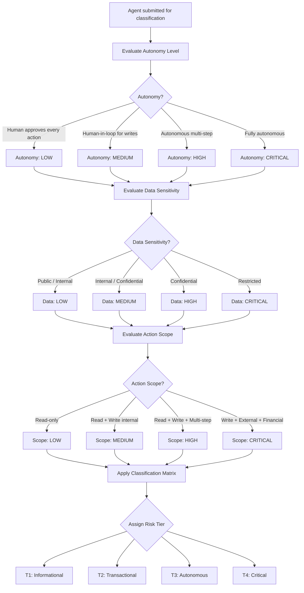

# EAAGF Specification — Risk Classification and Tiering Standard

**Document ID:** EAAGF-SPEC-03  
**Version:** 1.0.0  
**Status:** Draft  
**Last Updated:** 2025-07-14  
**Owner:** AI Governance Team

---

## 1. Purpose

This document defines the normative standard for agent risk classification and tiering within the Enterprise AI Agent Governance Framework (EAAGF). It specifies how agents are evaluated across three classification dimensions, how Risk Tiers are assigned, and how tier assignments govern the level of oversight, authorization, and compliance controls applied to each agent.

Every registered agent MUST be classified into exactly one Risk Tier before it can be deployed. The Risk Tier determines the governance controls applied throughout the agent's lifecycle — from credential TTLs and rate limits to human oversight modes and regulatory obligations.

The key words "MUST", "MUST NOT", "REQUIRED", "SHALL", "SHALL NOT", "SHOULD", "SHOULD NOT", "RECOMMENDED", "MAY", and "OPTIONAL" in this document are to be interpreted as described in [RFC 2119](https://www.rfc-editor.org/rfc/rfc2119).

---

## 2. Scope

This standard applies to:

- All AI agents deployed on any enterprise-supported platform (Databricks, Salesforce AgentForce, Snowflake Cortex, Microsoft Copilot Studio, AWS Bedrock, Azure AI Foundry, GCP Vertex AI)
- The Governance_Controller component responsible for classification decisions
- All teams that develop, deploy, or operate AI agents within the enterprise

For related standards, see:

| Related Domain | Document |
|---|---|
| Agent Identity | [02 — Agent Identity Standard](./02-agent-identity-standard.md) |
| Authorization | [04 — Authorization Standard](./04-authorization-standard.md) |
| Human Oversight | [06 — Human Oversight Standard](./06-human-oversight-standard.md) |
| Compliance | [10 — Compliance Standard](./10-compliance-standard.md) |
| Lifecycle Management | [11 — Lifecycle Management Standard](./11-lifecycle-management-standard.md) |

---

## 3. Classification Requirement

### 3.1 Mandatory Classification

The Governance_Controller SHALL classify every registered agent into exactly one of four Risk_Tiers:

| Risk Tier | Name | Description |
|---|---|---|
| **T1** | Informational | Read-only agents operating on non-sensitive data with full human approval |
| **T2** | Transactional | Agents performing transactional writes on internal data with human-in-the-loop |
| **T3** | Autonomous | Agents operating autonomously on confidential data or performing multi-step writes |
| **T4** | Critical | Agents operating on restricted data, interacting with external systems, or executing financial transactions |

An agent MUST NOT hold more than one Risk_Tier at any given time. The assigned tier applies uniformly across all governance controls for that agent.

> **Validates: Requirement 2.1** — THE Governance_Controller SHALL classify every registered agent into exactly one of four Risk_Tiers: T1 (Informational), T2 (Transactional), T3 (Autonomous), or T4 (Critical).

---

## 4. Three-Dimension Classification Model

### 4.1 Classification Dimensions

WHEN classifying an agent, the Governance_Controller SHALL evaluate three dimensions. Each dimension captures a distinct aspect of the agent's risk profile.

| Dimension | Description | Evaluation Criteria |
|---|---|---|
| **Autonomy Level** | The degree of human involvement in the agent's decision-making | How much human approval is required before the agent acts |
| **Data Sensitivity** | The classification level of data the agent accesses or processes | The highest data classification label the agent touches |
| **Action Scope** | The breadth and impact of actions the agent can perform | Whether the agent reads, writes, interacts externally, or executes financial operations |

All three dimensions MUST be evaluated for every classification. A classification is invalid if any dimension is unresolved.

> **Validates: Requirement 2.2** — WHEN classifying an agent, THE Governance_Controller SHALL evaluate three dimensions: autonomy level (human-in-loop vs. fully autonomous), data sensitivity (public vs. internal vs. confidential vs. restricted), and action scope (read-only vs. write vs. external-facing).

### 4.2 Autonomy Level

The autonomy dimension measures the degree of human control over the agent's actions.

| Level | Label | Description |
|---|---|---|
| LOW | Human approves every action | The agent proposes actions; a human MUST approve each one before execution. |
| MEDIUM | Human-in-loop for writes | The agent executes read operations independently but requires human approval for write operations. |
| HIGH | Autonomous multi-step | The agent executes multi-step workflows autonomously, including writes, without per-action human approval. |
| CRITICAL | Fully autonomous | The agent operates with full autonomy, making decisions and executing actions without any human intervention. |

### 4.3 Data Sensitivity

The data sensitivity dimension reflects the highest classification level of data the agent accesses.

| Level | Label | Data Classifications |
|---|---|---|
| LOW | Non-sensitive | Public, Internal |
| MEDIUM | Moderately sensitive | Internal, Confidential |
| HIGH | Highly sensitive | Confidential |
| CRITICAL | Restricted | Restricted |

Data classification labels (Public, Internal, Confidential, Restricted) SHALL be resolved from the enterprise data catalog at classification time. See [08 — Data Governance Standard](./08-data-governance-standard.md) for data classification enforcement rules.

### 4.4 Action Scope

The action scope dimension captures the breadth and external impact of the agent's operations.

| Level | Label | Permitted Actions |
|---|---|---|
| LOW | Read-only | Read operations only; no data modification or external interaction |
| MEDIUM | Internal read/write | Read and write operations on internal systems only |
| HIGH | Multi-step read/write | Read, write, and multi-step orchestration on internal systems |
| CRITICAL | External/financial | Write operations on external systems, financial transactions, or the ability to modify other agents or governance controls |

---

## 5. Risk Tier Definitions and Assignment Rules

### 5.1 T1 — Informational

The Governance_Controller SHALL assign T1 to agents that satisfy ALL of the following criteria:

1. **Autonomy:** The agent is read-only and requires human approval for every action (Autonomy: LOW).
2. **Data Sensitivity:** The agent operates exclusively on non-sensitive data — Public or Internal classification (Data: LOW).
3. **Action Scope:** The agent performs read-only operations with no write, external, or financial actions (Scope: LOW).

T1 agents represent the lowest risk. They retrieve and present information but do not modify data or interact with external systems.

> **Validates: Requirement 2.3** — THE Governance_Controller SHALL assign T1 to agents that are read-only, operate on non-sensitive data, and require human approval for every action.

### 5.2 T2 — Transactional

The Governance_Controller SHALL assign T2 to agents that satisfy ALL of the following criteria:

1. **Autonomy:** The agent performs transactional writes with human-in-the-loop approval for write operations (Autonomy: MEDIUM).
2. **Data Sensitivity:** The agent operates on Internal or Confidential data (Data: MEDIUM).
3. **Action Scope:** The agent performs read and write operations on internal systems only (Scope: MEDIUM).

T2 agents perform data modifications but with human oversight on write operations and no external system interaction.

> **Validates: Requirement 2.4** — THE Governance_Controller SHALL assign T2 to agents that perform transactional writes on internal data with human-in-the-loop approval for write operations.

### 5.3 T3 — Autonomous

The Governance_Controller SHALL assign T3 to agents that meet ANY of the following criteria:

1. **Autonomy:** The agent operates autonomously on confidential data (Autonomy: HIGH, Data: HIGH).
2. **Action Scope:** The agent performs multi-step write operations without per-action human approval (Scope: HIGH).

T3 agents operate with significant autonomy and access sensitive data. They require AI Governance Team approval for production deployment.

> **Validates: Requirement 2.5** — THE Governance_Controller SHALL assign T3 to agents that operate autonomously on confidential data or perform multi-step write operations without per-action human approval.

### 5.4 T4 — Critical

The Governance_Controller SHALL assign T4 to agents that meet ANY of the following criteria:

1. **Data Sensitivity:** The agent operates on Restricted data (Data: CRITICAL).
2. **Action Scope:** The agent interacts with external systems (Scope: CRITICAL).
3. **Action Scope:** The agent executes financial transactions (Scope: CRITICAL).
4. **Action Scope:** The agent has the ability to modify other agents or governance controls (Scope: CRITICAL).

T4 agents represent the highest risk. They require the strictest governance controls, including mandatory AI Governance Team approval, short credential TTLs, and low rate limits.

> **Validates: Requirement 2.6** — THE Governance_Controller SHALL assign T4 to agents that operate on restricted data, interact with external systems, execute financial transactions, or have the ability to modify other agents or governance controls.

### 5.5 Assignment Precedence

When an agent's dimension scores map to multiple tiers, the Governance_Controller SHALL assign the highest applicable tier. For example:

- An agent with Autonomy: LOW, Data: CRITICAL, Scope: LOW → **T4** (Restricted data triggers T4 regardless of other dimensions).
- An agent with Autonomy: HIGH, Data: MEDIUM, Scope: MEDIUM → **T3** (High autonomy triggers T3).

---

## 6. Risk Tier Classification Matrix

The following matrix defines the complete mapping between classification dimensions and Risk Tiers. This matrix is normative — all conforming implementations MUST apply these mappings.

| Dimension | T1 (Informational) | T2 (Transactional) | T3 (Autonomous) | T4 (Critical) |
|---|---|---|---|---|
| **Autonomy** | Human approves every action | Human-in-loop for writes | Autonomous multi-step | Fully autonomous |
| **Data Sensitivity** | Public / Internal | Internal / Confidential | Confidential | Restricted |
| **Action Scope** | Read-only | Read + Write (internal) | Read + Write + Multi-step | Write + External + Financial |
| **Default Oversight Mode** | HUMAN_IN_LOOP | SUPERVISED | APPROVAL_REQUIRED | APPROVAL_REQUIRED |
| **Credential TTL** | 1 hour (3600s) | 1 hour (3600s) | 15 minutes (900s) | 15 minutes (900s) |
| **Max Actions/Minute** | 100 | 100 | 20 | 20 |
| **Re-validation Period** | 180 days | 180 days | 90 days | 90 days |
| **AI Governance Approval Required** | No | No | Yes | Yes |
| **EU AI Act High-Risk Candidate** | No | Possible | Likely | Yes |

### 6.1 Governance Controls by Tier

The Risk Tier directly determines the following governance parameters. These values are defaults — they MAY be made stricter but MUST NOT be relaxed below the tier minimum.

**Credential TTL:**
- T1 and T2 agents: Maximum credential TTL of 3600 seconds (1 hour).
- T3 and T4 agents: Maximum credential TTL of 900 seconds (15 minutes).

See [04 — Authorization Standard](./04-authorization-standard.md) for complete credential TTL rules.

**Rate Limiting:**
- T1 and T2 agents: Maximum 100 actions per minute.
- T3 and T4 agents: Maximum 20 actions per minute.

See [09 — Security Standard](./09-security-standard.md) for rate limiting enforcement.

**Human Oversight:**
- T1: HUMAN_IN_LOOP (human approves every action).
- T2: SUPERVISED (gates on write operations).
- T3: APPROVAL_REQUIRED (gates on all non-trivial actions).
- T4: APPROVAL_REQUIRED (gates on all non-trivial actions; MUST NOT be set to FULL_AUTO without explicit AI Governance Team authorization).

See [06 — Human Oversight Standard](./06-human-oversight-standard.md) for oversight mode definitions.

**Re-validation:**
- T1 and T2 agents: Re-validation required every 180 days.
- T3 and T4 agents: Re-validation required every 90 days.

See [11 — Lifecycle Management Standard](./11-lifecycle-management-standard.md) for re-validation enforcement.

---

## 7. Risk Classification Flow

The following diagram illustrates the end-to-end risk classification process. For the full rendered diagram, see [Risk Classification Flow](../flows/risk-classification-flow.md).

---

## 8. Multi-Platform Tier Resolution

### 8.1 Maximum Tier Rule

WHERE an agent spans multiple platforms, the Governance_Controller SHALL assign the highest applicable Risk_Tier across all platform contexts.

**Normative rules:**

1. The Governance_Controller SHALL evaluate the agent's classification dimensions independently for each platform context where the agent operates.
2. The final assigned Risk_Tier SHALL equal the maximum tier determined across all platform evaluations.
3. The maximum tier rule applies regardless of the number of platforms involved.
4. The Governance_Controller SHALL record the per-platform tier evaluations alongside the final assigned tier for audit purposes.

**Example:**

| Platform | Autonomy | Data Sensitivity | Action Scope | Platform Tier |
|---|---|---|---|---|
| Salesforce | MEDIUM | MEDIUM | MEDIUM | T2 |
| Databricks | HIGH | HIGH | HIGH | T3 |

In this example, the agent's final assigned Risk_Tier is **T3** — the maximum across both platform contexts. All governance controls (credential TTL, rate limits, oversight mode, re-validation period) SHALL be applied at the T3 level across all platforms.

5. When a platform context is added or removed, the Governance_Controller SHALL re-evaluate the maximum tier and update the assignment accordingly.

> **Validates: Requirement 2.10** — WHERE an agent spans multiple platforms, THE Governance_Controller SHALL assign the highest applicable Risk_Tier across all platform contexts.

---

## 9. Self-Service Risk Classification Questionnaire

### 9.1 Questionnaire Requirement

The Governance_Controller SHALL provide a self-service risk classification questionnaire that guides teams through the three classification dimensions and produces a recommended Risk_Tier.

### 9.2 Questionnaire Structure

The questionnaire SHALL be structured as three sequential sections, one per classification dimension. Each section presents a set of questions with predefined answer options that map to dimension levels.

#### Section 1: Autonomy Level

| # | Question | Answer Options | Dimension Level |
|---|---|---|---|
| A1 | Does the agent require human approval before executing every action? | Yes → LOW | LOW |
| A2 | Does the agent execute read operations independently but require human approval for writes? | Yes → MEDIUM | MEDIUM |
| A3 | Does the agent execute multi-step workflows (including writes) without per-action human approval? | Yes → HIGH | HIGH |
| A4 | Does the agent operate with full autonomy, making all decisions without human intervention? | Yes → CRITICAL | CRITICAL |

The questionnaire SHALL present these questions in order. The first "Yes" answer determines the autonomy level. If multiple answers are "Yes", the highest level SHALL apply.

#### Section 2: Data Sensitivity

| # | Question | Answer Options | Dimension Level |
|---|---|---|---|
| D1 | Does the agent access only Public or Internal data? | Yes → LOW | LOW |
| D2 | Does the agent access Confidential data? | Yes → HIGH | HIGH |
| D3 | Does the agent access Restricted data? | Yes → CRITICAL | CRITICAL |

If the agent accesses data at multiple classification levels, the highest level SHALL apply.

#### Section 3: Action Scope

| # | Question | Answer Options | Dimension Level |
|---|---|---|---|
| S1 | Does the agent perform read-only operations? | Yes → LOW | LOW |
| S2 | Does the agent perform write operations on internal systems? | Yes → MEDIUM | MEDIUM |
| S3 | Does the agent perform multi-step write operations or orchestrate workflows? | Yes → HIGH | HIGH |
| S4 | Does the agent interact with external systems, execute financial transactions, or modify other agents/governance controls? | Yes → CRITICAL | CRITICAL |

The highest applicable scope level SHALL be used.

### 9.3 Tier Recommendation Logic

After all three sections are completed, the questionnaire SHALL apply the classification matrix (Section 6) and the assignment precedence rules (Section 5.5) to produce a recommended Risk_Tier.

The recommended tier SHALL be presented to the team along with:

1. The dimension-level scores that produced the recommendation.
2. A summary of the governance controls that apply at the recommended tier.
3. An option to submit the recommendation for Governance_Controller approval.

The Governance_Controller SHALL review and confirm or override the questionnaire recommendation. The final tier assignment is authoritative — the questionnaire recommendation is advisory only.

### 9.4 Questionnaire Availability

The questionnaire SHALL be available as:

1. A machine-readable specification (JSON Schema) that platform teams can integrate into their onboarding workflows.
2. A human-readable guide that teams can follow manually. See [Risk Assessment Guide](../guidelines/risk-assessment-guide.md) for the team-facing walkthrough.

> **Validates: Requirement 2.9** — THE Governance_Controller SHALL provide a self-service risk classification questionnaire that guides teams through the three classification dimensions and produces a recommended Risk_Tier.

---

## 10. Re-Classification Triggers

### 10.1 Capability Change Re-Classification

WHEN an agent's capabilities change such that its classification dimensions change, the Governance_Controller SHALL re-evaluate and update the Risk_Tier within 24 hours.

**Normative rules:**

1. The 24-hour re-classification window begins at the timestamp when the capability change is detected or reported.
2. The following changes SHALL trigger re-classification:
   - A change to the agent's `capabilities` field in its Conformance_Profile (e.g., adding `EXTERNAL_CONNECTION` or `AGENT_DELEGATION`).
   - A change to the agent's `data_classifications_accessed` field (e.g., adding `RESTRICTED`).
   - A change to the agent's `oversight_mode` (e.g., moving from `SUPERVISED` to `FULL_AUTO`).
   - A change to the agent's `declared_permissions` that introduces new resource types or action types.
   - A change to the agent's platform context (e.g., deploying to an additional platform).
3. The Governance_Controller SHALL automatically detect capability changes by monitoring Conformance_Profile updates.
4. During the re-classification window, the agent SHALL continue operating under its current Risk_Tier. If the re-classification results in a higher tier, the new tier's controls SHALL be applied immediately upon assignment.
5. If the re-classification results in a lower tier, the Governance_Controller SHOULD apply the lower tier's controls but MAY require AI Governance Team approval before downgrading T3 or T4 agents.
6. The Governance_Controller SHALL emit a `RISK_TIER_CHANGED` audit event recording the previous tier, new tier, triggering change, and timestamp.

> **Validates: Requirement 2.7** — WHEN an agent's capabilities change such that its classification dimensions change, THE Governance_Controller SHALL re-evaluate and update the Risk_Tier within 24 hours.

### 10.2 Re-Classification Triggers Summary

| Trigger | Source | Re-Classification Window |
|---|---|---|
| Conformance_Profile capability change | Automated detection | 24 hours |
| Data classification access change | Automated detection | 24 hours |
| Oversight mode change | Automated detection | 24 hours |
| Permission scope change | Automated detection | 24 hours |
| Platform context addition/removal | Automated detection | 24 hours |
| Manual re-classification request | Team or AI Governance Team | 24 hours |
| Periodic re-validation | Scheduled (90/180 days) | At re-validation time |

---

## 11. Deployment Blocking Without Risk_Tier

### 11.1 Classification-Required Enforcement

IF a team attempts to deploy an agent without a valid Risk_Tier assignment, THEN the Governance_Controller SHALL block the deployment and return a `CLASSIFICATION_REQUIRED` error.

**Normative rules:**

1. The deployment block SHALL apply at all lifecycle transitions that move an agent toward production:
   - DEVELOPMENT → STAGING
   - STAGING → PRODUCTION
2. The Governance_Controller SHALL return a structured error response containing:
   - Error code: `CLASSIFICATION_REQUIRED`
   - Message: A human-readable description indicating that the agent must complete risk classification before deployment.
   - Agent ID: The UUID v4 of the agent that was blocked.
   - Recommended action: A link to the self-service risk classification questionnaire (Section 9).
3. The Governance_Controller SHALL emit a `CLASSIFICATION_REQUIRED` audit event recording the blocked deployment attempt, including the agent ID, requesting team, and timestamp.
4. The deployment block MUST NOT be bypassed. There are no exceptions or override mechanisms for deploying an unclassified agent.

> **Validates: Requirement 2.8** — IF a team attempts to deploy an agent without a valid Risk_Tier assignment, THEN THE Governance_Controller SHALL block deployment and return a CLASSIFICATION_REQUIRED error.

For the complete error code definition, see the [Error Codes Reference](../reference/error-codes-reference.md).

---

## 12. Classification Examples

The following examples illustrate how the three-dimension model and classification matrix produce tier assignments for representative agent types.

### 12.1 Example: Internal FAQ Bot (T1)

| Dimension | Value | Level |
|---|---|---|
| Autonomy | Human approves every response before delivery | LOW |
| Data Sensitivity | Accesses only Public knowledge base articles | LOW |
| Action Scope | Read-only — retrieves and presents information | LOW |

**Assigned Tier:** T1 (Informational)  
**Governance Controls:** HUMAN_IN_LOOP oversight, 1-hour credential TTL, 100 actions/min, 180-day re-validation.

### 12.2 Example: CRM Update Agent (T2)

| Dimension | Value | Level |
|---|---|---|
| Autonomy | Reads CRM data independently; human approves all writes | MEDIUM |
| Data Sensitivity | Accesses Internal and Confidential customer records | MEDIUM |
| Action Scope | Reads and writes to internal CRM system | MEDIUM |

**Assigned Tier:** T2 (Transactional)  
**Governance Controls:** SUPERVISED oversight, 1-hour credential TTL, 100 actions/min, 180-day re-validation.

### 12.3 Example: Data Pipeline Orchestrator (T3)

| Dimension | Value | Level |
|---|---|---|
| Autonomy | Executes multi-step ETL workflows without per-action approval | HIGH |
| Data Sensitivity | Processes Confidential financial data | HIGH |
| Action Scope | Reads, transforms, and writes across multiple internal systems | HIGH |

**Assigned Tier:** T3 (Autonomous)  
**Governance Controls:** APPROVAL_REQUIRED oversight, 15-minute credential TTL, 20 actions/min, 90-day re-validation, AI Governance Team approval for production.

### 12.4 Example: Payment Processing Agent (T4)

| Dimension | Value | Level |
|---|---|---|
| Autonomy | Fully autonomous transaction processing | CRITICAL |
| Data Sensitivity | Accesses Restricted payment card data | CRITICAL |
| Action Scope | Executes financial transactions with external payment providers | CRITICAL |

**Assigned Tier:** T4 (Critical)  
**Governance Controls:** APPROVAL_REQUIRED oversight (cannot be FULL_AUTO), 15-minute credential TTL, 20 actions/min, 90-day re-validation, AI Governance Team approval for production, EU AI Act high-risk candidate.

### 12.5 Example: Multi-Platform Agent (T3 via Maximum Tier Rule)

An agent deployed on both Salesforce (T2 context) and Databricks (T3 context):

| Platform | Autonomy | Data Sensitivity | Action Scope | Platform Tier |
|---|---|---|---|---|
| Salesforce | MEDIUM | MEDIUM | MEDIUM | T2 |
| Databricks | HIGH | HIGH | HIGH | T3 |

**Assigned Tier:** T3 — the maximum across both platform contexts. T3 governance controls apply on all platforms.

---

## 13. Conformance Requirements

### 13.1 Implementation Requirements

Any conforming implementation of the EAAGF risk classification standard MUST satisfy the following:

1. The implementation SHALL evaluate all three classification dimensions (autonomy, data sensitivity, action scope) for every agent classification.
2. The implementation SHALL apply the classification matrix defined in Section 6 to determine the Risk_Tier.
3. The implementation SHALL enforce the maximum tier rule for multi-platform agents as defined in Section 8.
4. The implementation SHALL provide the self-service questionnaire as defined in Section 9.
5. The implementation SHALL detect capability changes and trigger re-classification within 24 hours as defined in Section 10.
6. The implementation SHALL block deployment of unclassified agents as defined in Section 11.
7. The implementation SHALL emit audit events for all classification decisions, re-classifications, and deployment blocks.

### 13.2 Audit Event Requirements

The following audit events MUST be emitted by the classification system:

| Event | Trigger | Required Fields |
|---|---|---|
| `AGENT_CLASSIFIED` | Initial tier assignment | agent_id, risk_tier, autonomy_level, data_sensitivity, action_scope, timestamp |
| `RISK_TIER_CHANGED` | Re-classification | agent_id, previous_tier, new_tier, trigger_reason, timestamp |
| `CLASSIFICATION_REQUIRED` | Deployment blocked | agent_id, requesting_team, blocked_transition, timestamp |
| `QUESTIONNAIRE_COMPLETED` | Self-service questionnaire submitted | agent_id, recommended_tier, dimension_scores, submitted_by, timestamp |

---

## 14. Regulatory Alignment

### 14.1 EU AI Act Mapping

The EAAGF Risk Tier model maps to the EU AI Act risk categories as follows:

| EAAGF Tier | EU AI Act Risk Category | Obligations |
|---|---|---|
| T1 | Minimal / Limited risk | Transparency obligations only |
| T2 | Limited risk (possible high-risk) | Transparency obligations; high-risk assessment if applicable |
| T3 | Likely high-risk | Full high-risk obligations: risk management, data governance, transparency, human oversight, accuracy, robustness, cybersecurity |
| T4 | High-risk | Full high-risk obligations plus enhanced documentation and conformity assessment |

When an agent is classified as T3 or T4, the Governance_Controller SHALL evaluate whether the agent meets the EU AI Act high-risk system criteria. If so, the agent SHALL be flagged as `EU_AI_ACT_HIGH_RISK`. See [10 — Compliance Standard](./10-compliance-standard.md) for detailed compliance obligations.

### 14.2 NIST AI RMF Mapping

| EAAGF Control | NIST AI RMF Function |
|---|---|
| Three-dimension classification model | MAP 1.1 — Intended purpose and context of use |
| Tier assignment and governance controls | GOVERN 1.1 — Legal and regulatory requirements |
| Re-classification triggers | MANAGE 4.1 — Risk treatment and response |
| Self-service questionnaire | MAP 1.5 — Stakeholder engagement |

### 14.3 ISO 42001 Mapping

| EAAGF Control | ISO 42001 Clause |
|---|---|
| Risk classification process | Clause 6.1 — Actions to address risks and opportunities |
| Classification matrix | Clause 6.1.2 — AI risk assessment |
| Re-classification triggers | Clause 8.2 — AI system lifecycle processes |
| Deployment blocking | Clause 8.4 — AI system operation |

