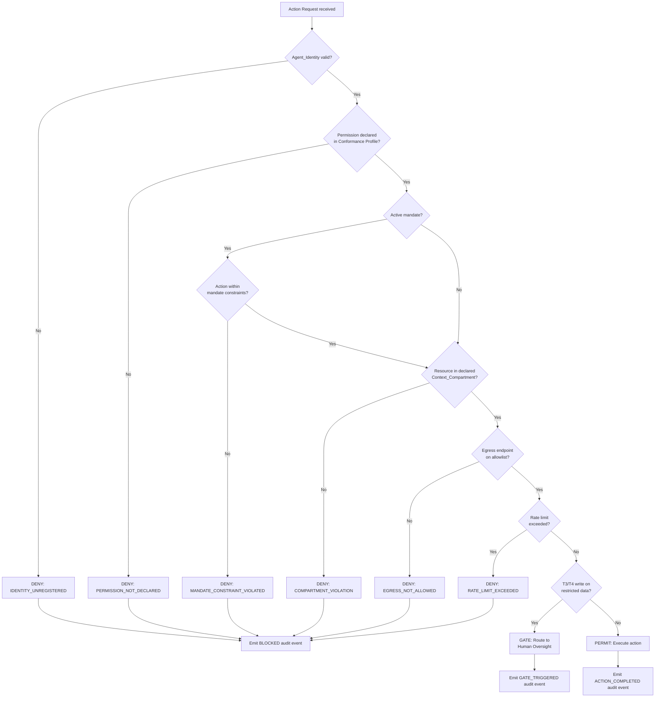

# EAAGF Specification — Authorization and Least Privilege Standard

**Document ID:** EAAGF-SPEC-04  
**Version:** 1.0.0  
**Status:** Draft  
**Last Updated:** 2025-07-14  
**Owner:** AI Governance Team

---

## 1. Purpose

This document defines the normative standard for authorization and least-privilege enforcement within the Enterprise AI Agent Governance Framework (EAAGF). It specifies how the Policy_Engine evaluates agent action requests, how credentials are scoped and time-limited, and how authorization policies are enforced across all governed agent operations.

Every agent action — tool calls, data access, agent delegation, and external connections — MUST pass through the Policy_Engine before execution. The Policy_Engine uses an attribute-based access control (ABAC) model to produce PERMIT, DENY, or GATE decisions for each request.

The key words "MUST", "MUST NOT", "REQUIRED", "SHALL", "SHALL NOT", "SHOULD", "SHOULD NOT", "RECOMMENDED", "MAY", and "OPTIONAL" in this document are to be interpreted as described in [RFC 2119](https://www.rfc-editor.org/rfc/rfc2119).

---

## 2. Scope

This standard applies to:

- All AI agents deployed on any enterprise-supported platform (Databricks, Salesforce AgentForce, Snowflake Cortex, Microsoft Copilot Studio, AWS Bedrock, Azure AI Foundry, GCP Vertex AI)
- The Policy_Engine component and its authorization interfaces
- The Governance_Controller component responsible for enforcing authorization decisions
- All teams that develop, deploy, or operate AI agents within the enterprise

For related standards, see:

| Related Domain | Document |
|---|---|
| Agent Identity | [02 — Agent Identity Standard](./02-agent-identity-standard.md) |
| Risk Classification | [03 — Risk Classification Standard](./03-risk-classification-standard.md) |
| Observability | [05 — Observability Standard](./05-observability-standard.md) |
| Human Oversight | [06 — Human Oversight Standard](./06-human-oversight-standard.md) |
| Data Governance | [08 — Data Governance Standard](./08-data-governance-standard.md) |
| Security | [09 — Security Standard](./09-security-standard.md) |

---

## 3. Least-Privilege Enforcement

### 3.1 Minimum Permission Principle

The Policy_Engine SHALL grant each agent only the minimum set of permissions required to complete its declared task scope, as defined in its registered Conformance_Profile.

**Normative rules:**

1. An agent's effective permissions SHALL be the intersection of:
   - The permissions declared in the agent's Conformance_Profile (`declared_permissions` field).
   - The permissions authorized for the agent's Risk_Tier.
   - The permissions available within the agent's assigned Context_Compartment(s).
2. The Policy_Engine SHALL NOT grant permissions beyond those explicitly declared in the Conformance_Profile, regardless of the agent's Risk_Tier or platform capabilities.
3. Permissions SHALL be scoped to specific resources and actions. Wildcard permissions (e.g., `*` on all resources) are NOT permitted.
4. The Policy_Engine SHALL evaluate permissions at the individual action level — each action request MUST be independently authorized.

> **Validates: Requirement 3.1** — THE Policy_Engine SHALL grant each agent only the minimum set of permissions required to complete its declared task scope, as defined in its registered Conformance_Profile.

### 3.2 Undeclared Permission Denial

IF an agent requests a permission not declared in its registered Conformance_Profile, THEN the Policy_Engine SHALL:

1. Deny the request immediately.
2. Emit an audit event with reason code `PERMISSION_NOT_DECLARED`.
3. Return a structured error response to the calling Platform Adapter containing the error code, the denied permission, and the agent's declared permission set.

There are no exceptions to this rule. An agent MUST NOT acquire permissions at runtime that were not declared at registration time.

> **Validates: Requirement 3.3** — IF an agent requests a permission not declared in its registered Conformance_Profile, THEN THE Policy_Engine SHALL deny the request and emit an audit event with reason code PERMISSION_NOT_DECLARED.

---

## 4. Credential Issuance and TTL Rules

### 4.1 Scope-Bound Credential Issuance

WHEN an agent requests a credential, the Policy_Engine SHALL issue a scope-bound token that satisfies the following constraints:

1. The credential SHALL be scoped to the specific task the agent is executing. The credential MUST NOT grant access to resources outside the task scope.
2. The credential SHALL include the agent's UUID v4 identifier, the authorized resource set, the authorized action set, and the expiration timestamp.
3. The credential TTL MUST NOT exceed the agent's configured maximum session duration, as defined by its Risk_Tier.

### 4.2 Credential TTL Rules

The following table defines the maximum credential TTL by Risk Tier. These values are normative — conforming implementations MUST enforce these maximums.

| Risk Tier | Maximum Credential TTL | Default Value | Session Behavior |
|---|---|---|---|
| **T1** (Informational) | ≤ 3600 seconds | 3600 seconds (1 hour) | Revoke on task completion |
| **T2** (Transactional) | ≤ 3600 seconds | 3600 seconds (1 hour) | Revoke on task completion |
| **T3** (Autonomous) | ≤ 900 seconds | 900 seconds (15 minutes) | Revoke on task completion or timeout |
| **T4** (Critical) | ≤ 900 seconds | 900 seconds (15 minutes) | Revoke on task completion or timeout |

**Normative rules:**

1. T1 and T2 agents SHALL have a maximum credential TTL of 3600 seconds (1 hour). Teams MAY configure a shorter TTL but MUST NOT exceed 3600 seconds.
2. T3 and T4 agents SHALL have a maximum credential TTL of 900 seconds (15 minutes). Teams MAY configure a shorter TTL but MUST NOT exceed 900 seconds.
3. The `max_session_duration_seconds` field in the agent's Conformance_Profile MUST respect these tier-based maximums. The Policy_Engine SHALL reject Conformance_Profiles that declare a TTL exceeding the tier maximum.
4. If an agent's Conformance_Profile does not specify a `max_session_duration_seconds` value, the Policy_Engine SHALL apply the default value for the agent's Risk_Tier.

> **Validates: Requirement 3.2** — WHEN an agent requests a credential, THE Policy_Engine SHALL issue a scope-bound token with a TTL not exceeding the agent's configured maximum session duration (default: 1 hour for T1/T2, 15 minutes for T3/T4).

---

## 5. Constrained Delegation Mandates

### 5.1 Pre-Authorized Action Mandates

WHEN a human user delegates a bounded autonomous task to a T3 or T4 agent, the Policy_Engine SHALL support Constrained_Delegation_Mandates — cryptographically signed authorization objects that define the explicit boundaries within which the agent may act without per-action human approval.

**Normative rules:**

1. A Constrained_Delegation_Mandate is a structured, signed authorization object that captures a human's explicit intent and the constraints under which an agent may act autonomously. It is distinct from the agent's Conformance_Profile, which defines static capabilities. The mandate defines dynamic, task-specific boundaries.
2. A Constrained_Delegation_Mandate SHALL contain the following fields:

| Field | Type | Required | Description |
|---|---|---|---|
| `mandate_id` | UUID v4 | REQUIRED | Unique identifier for this mandate |
| `agent_id` | UUID v4 | REQUIRED | The agent authorized to act under this mandate |
| `delegator_identity` | string | REQUIRED | The identity of the human who signed the mandate, resolved from the enterprise IdP |
| `intent_description` | string | REQUIRED | Natural language description of the delegated task as understood by the agent and confirmed by the human |
| `permitted_action_types` | array | REQUIRED | Action types the agent may perform under this mandate (subset of Conformance_Profile capabilities) |
| `permitted_resources` | array | REQUIRED | Resource URIs the agent may access under this mandate (subset of Conformance_Profile declared_permissions) |
| `constraints` | object | REQUIRED | Quantitative boundaries: `max_actions` (integer), `max_data_volume_bytes` (integer), `permitted_data_classifications` (array) |
| `expires_at` | ISO 8601 | REQUIRED | Mandate expiration timestamp. MUST NOT exceed the agent's credential TTL |
| `signature` | string | REQUIRED | Cryptographic signature over all fields except `signature`, produced by the delegator's enterprise credential |
| `issued_at` | ISO 8601 | REQUIRED | Timestamp when the mandate was signed |

3. The Policy_Engine SHALL validate the Constrained_Delegation_Mandate before permitting any action under it:
   a. The `agent_id` MUST match the requesting agent's registered identity.
   b. The `delegator_identity` MUST resolve to a valid, active user in the enterprise IdP.
   c. The `permitted_action_types` MUST be a subset of the agent's Conformance_Profile capabilities.
   d. The `permitted_resources` MUST be a subset of the agent's Conformance_Profile declared_permissions.
   e. The `expires_at` timestamp MUST NOT have passed.
   f. The `signature` MUST be cryptographically valid against the delegator's public key.
4. WHEN an agent operates under a Constrained_Delegation_Mandate, the Policy_Engine SHALL evaluate each action against both the Conformance_Profile AND the mandate constraints. The effective permission is the intersection of both — the mandate cannot grant permissions beyond the Conformance_Profile, and the Conformance_Profile cannot override mandate constraints.
5. IF an agent's action violates any mandate constraint (exceeds `max_actions`, targets a resource not in `permitted_resources`, exceeds `max_data_volume_bytes`, or accesses data above `permitted_data_classifications`), the Policy_Engine SHALL:
   a. Deny the action immediately.
   b. Emit a `MANDATE_CONSTRAINT_VIOLATED` audit event containing the mandate_id, the violated constraint, the attempted action, and the constraint value.
   c. Trigger a Human_Oversight_Gate with reason code `MANDATE_CONSTRAINT_VIOLATED` to notify the delegator.
6. The `intent_description` field SHALL be included in all audit events for actions performed under the mandate. This provides a human-readable record of what the agent was authorized to do, enabling post-hoc review of whether the agent's actions matched the delegator's intent.
7. Constrained_Delegation_Mandates SHALL be immutable once signed. The agent MUST NOT modify any field of an active mandate. Modification attempts SHALL be treated as `SELF_MODIFICATION_ATTEMPT` security events per [09 — Security Standard](./09-security-standard.md).
8. The Governance_Controller SHALL revoke all active mandates when an agent's credentials are revoked, when the agent is paused or emergency-stopped, or when the delegator's enterprise account is disabled.

> **Validates: Requirement 3.11** — WHEN a human user delegates a bounded autonomous task to a T3 or T4 agent, THE Policy_Engine SHALL support Constrained_Delegation_Mandates that define explicit boundaries within which the agent may act without per-action human approval.

### 5.2 Constrained_Delegation_Mandate Schema (JSON)

```json
{
  "$schema": "https://json-schema.org/draft/2020-12/schema",
  "$id": "https://eaagf.enterprise.com/schemas/constrained-delegation-mandate/v1",
  "title": "EAAGF Constrained Delegation Mandate",
  "description": "A signed authorization object that defines the boundaries within which an agent may act autonomously on behalf of a human delegator.",
  "type": "object",
  "required": [
    "mandate_id", "agent_id", "delegator_identity", "intent_description",
    "permitted_action_types", "permitted_resources", "constraints",
    "expires_at", "signature", "issued_at"
  ],
  "properties": {
    "mandate_id": {
      "type": "string",
      "format": "uuid",
      "description": "Unique identifier for this mandate."
    },
    "agent_id": {
      "type": "string",
      "format": "uuid",
      "description": "The agent authorized to act under this mandate."
    },
    "delegator_identity": {
      "type": "string",
      "description": "Identity of the human delegator, resolved from the enterprise IdP."
    },
    "intent_description": {
      "type": "string",
      "maxLength": 4096,
      "description": "Natural language description of the delegated task as confirmed by the human."
    },
    "permitted_action_types": {
      "type": "array",
      "items": {
        "type": "string",
        "enum": ["TOOL_CALL", "DATA_READ", "DATA_WRITE", "AGENT_DELEGATION", "EXTERNAL_CONNECTION"]
      },
      "minItems": 1,
      "description": "Action types permitted under this mandate."
    },
    "permitted_resources": {
      "type": "array",
      "items": {
        "type": "object",
        "required": ["resource", "actions"],
        "properties": {
          "resource": { "type": "string" },
          "actions": { "type": "array", "items": { "type": "string" } }
        }
      },
      "description": "Resource-action pairs permitted under this mandate."
    },
    "constraints": {
      "type": "object",
      "required": ["max_actions"],
      "properties": {
        "max_actions": {
          "type": "integer",
          "minimum": 1,
          "description": "Maximum number of actions the agent may perform under this mandate."
        },
        "max_data_volume_bytes": {
          "type": "integer",
          "minimum": 0,
          "description": "Maximum data volume the agent may process under this mandate."
        },
        "permitted_data_classifications": {
          "type": "array",
          "items": {
            "type": "string",
            "enum": ["PUBLIC", "INTERNAL", "CONFIDENTIAL", "RESTRICTED"]
          },
          "description": "Data classification levels permitted under this mandate."
        }
      },
      "description": "Quantitative boundaries for the mandate."
    },
    "expires_at": {
      "type": "string",
      "format": "date-time",
      "description": "ISO 8601 UTC expiration timestamp."
    },
    "signature": {
      "type": "string",
      "description": "Cryptographic signature (RS256 or ES256) over all fields except signature."
    },
    "issued_at": {
      "type": "string",
      "format": "date-time",
      "description": "ISO 8601 UTC timestamp when the mandate was signed."
    }
  }
}
```

---

## 6. T3/T4 Write Gate on Restricted Data

### 6.1 Human Oversight Gate for Restricted Writes

WHEN a T3 or T4 agent attempts a write operation on data classified as Restricted, the Governance_Controller SHALL pause execution and route the action to a Human_Oversight_Gate before proceeding.

**Normative rules:**

1. This gate applies to ALL write operations (INSERT, UPDATE, DELETE, or equivalent) targeting resources with a `RESTRICTED` data classification label.
2. The Governance_Controller SHALL pause the agent's execution immediately upon detecting the restricted write attempt. No partial execution of the write operation is permitted before the gate is resolved.
3. The gate request SHALL include:
   - The agent's UUID v4 identifier and Risk_Tier.
   - The target resource URI and its data classification.
   - The requested write action and a summary of the data to be written.
   - The task context and correlation ID.
4. The Human_Oversight_Gate SHALL follow the approval workflow defined in [06 — Human Oversight Standard](./06-human-oversight-standard.md), including notification, escalation, and timeout handling.
5. IF the gate is approved, the Governance_Controller SHALL resume execution and permit the write operation.
6. IF the gate is rejected or times out, the Governance_Controller SHALL deny the write operation and emit a `GATE_REJECTED` or `GATE_TIMEOUT` audit event.

> **Validates: Requirement 3.4** — WHEN a T3 or T4 agent attempts a write operation on restricted data, THE Governance_Controller SHALL pause execution and route the action to a Human_Oversight_Gate before proceeding.

---

## 7. Egress Allowlist Enforcement

### 7.1 Network Egress Controls

The Policy_Engine SHALL enforce network egress controls that restrict agent outbound connections to a pre-approved allowlist of endpoints declared in the agent's Conformance_Profile.

**Normative rules:**

1. The allowlist is defined in the `approved_egress_endpoints` field of the agent's Conformance_Profile.
2. The Policy_Engine SHALL evaluate every outbound connection request against the agent's declared allowlist before permitting the connection.
3. Allowlist entries SHALL support:
   - Exact hostname matching (e.g., `api.internal.company.com`).
   - Wildcard subdomain matching (e.g., `*.salesforce.com` matches `na1.salesforce.com` and `login.salesforce.com`).
4. IF an agent attempts an outbound connection to an endpoint NOT on its declared allowlist, THEN the Policy_Engine SHALL:
   a. Deny the connection immediately.
   b. Emit an audit event with reason code `EGRESS_NOT_ALLOWED`.
   c. Return a structured error response to the agent.
5. Agents with no `approved_egress_endpoints` declared in their Conformance_Profile SHALL be denied ALL outbound connections.
6. The egress allowlist is enforced in addition to any platform-level network controls. The EAAGF egress policy is the most restrictive layer — platform-level allowlists do not override EAAGF restrictions.

> **Validates: Requirement 3.5** — THE Policy_Engine SHALL enforce network egress controls that restrict agent outbound connections to a pre-approved allowlist of endpoints declared in the agent's Conformance_Profile.

---

## 8. Session Credential Revocation

### 8.1 Revocation on Task Completion

WHEN an agent's task completes or times out, the Policy_Engine SHALL immediately revoke all session-scoped credentials issued for that task.

**Normative rules:**

1. "Immediately" means the revocation process SHALL begin within 1 second of the task completion or timeout event.
2. ALL session-scoped credentials associated with the task SHALL be revoked, including:
   - The primary session credential issued for the task.
   - Any derived or delegated credentials issued during the task (e.g., credentials passed to sub-tasks or delegated agents).
3. After revocation, any attempt to use the revoked credentials MUST be rejected by all EAAGF components.
4. The Policy_Engine SHALL emit a `SESSION_CREDENTIAL_REVOKED` audit event for each revoked credential, including the task ID, agent ID, credential ID, and revocation timestamp.
5. Credential revocation SHALL be propagated to all connected Platform Adapters to ensure platform-level enforcement.
6. For T3 and T4 agents, credential revocation SHALL also occur when the credential TTL expires, even if the task has not completed. The agent MUST re-authenticate and obtain a new credential to continue.

> **Validates: Requirement 3.6** — WHEN an agent's task completes or times out, THE Policy_Engine SHALL immediately revoke all session-scoped credentials issued for that task.

---

## 9. Role-Based Permission Templates

### 9.1 Permission Template Support

The Policy_Engine SHALL support role-based permission templates that teams can reference in their Conformance_Profile declarations to reduce configuration overhead.

**Normative rules:**

1. A permission template is a named, reusable set of resource permissions and action authorizations maintained by the AI Governance Team.
2. Teams MAY reference one or more permission templates in their agent's Conformance_Profile instead of (or in addition to) declaring individual permissions.
3. When a template is referenced, the Policy_Engine SHALL expand the template into its constituent permissions at policy evaluation time.
4. The effective permission set for an agent referencing templates SHALL be the union of all template permissions and any individually declared permissions.
5. Permission templates SHALL be versioned. When a template is updated, the Policy_Engine SHALL apply the updated template to all agents referencing it, subject to the policy hot-reload rules defined in Section 13.
6. The AI Governance Team SHALL maintain a catalog of approved permission templates. Teams SHOULD use templates where applicable to ensure consistency and reduce misconfiguration risk.

**Example permission template:**

```json
{
  "template_id": "crm-read-only",
  "template_version": "1.0",
  "description": "Read-only access to CRM objects",
  "permissions": [
    { "resource": "salesforce://sobject/Account", "actions": ["READ"] },
    { "resource": "salesforce://sobject/Contact", "actions": ["READ"] },
    { "resource": "salesforce://sobject/Opportunity", "actions": ["READ"] }
  ],
  "applicable_tiers": ["T1", "T2", "T3", "T4"],
  "maintained_by": "AI Governance Team"
}
```

> **Validates: Requirement 3.7** — THE Policy_Engine SHALL support role-based permission templates that teams can reference in their Conformance_Profile declarations to reduce configuration overhead.

---

## 10. Context_Compartment Isolation

### 10.1 Compartment Enforcement

IF an agent attempts to access a resource outside its declared Context_Compartment, THEN the Policy_Engine SHALL deny the access and emit an audit event with reason code `COMPARTMENT_VIOLATION`.

**Normative rules:**

1. An agent's declared Context_Compartments are defined in the `context_compartments` field of its Conformance_Profile.
2. Each Context_Compartment defines an isolated data scope. Resources within a compartment are accessible only to agents that declare that compartment in their profile.
3. The Policy_Engine SHALL evaluate compartment membership for every resource access request. The evaluation SHALL verify that the target resource belongs to at least one of the agent's declared compartments.
4. IF the target resource is not within any of the agent's declared compartments, THEN the Policy_Engine SHALL:
   a. Deny the access immediately.
   b. Emit an audit event with reason code `COMPARTMENT_VIOLATION`.
   c. Return a structured error response containing the denied resource, the agent's declared compartments, and the resource's compartment assignment.
5. Context_Compartment isolation prevents cross-contamination of sensitive data between agent tasks. An agent operating in compartment `finance-context` MUST NOT access resources assigned to compartment `hr-context`, even if the agent has the correct resource-level permissions.
6. Compartment assignments for resources SHALL be resolved from the enterprise data catalog or configured by the AI Governance Team. See [08 — Data Governance Standard](./08-data-governance-standard.md) for compartment management rules.

> **Validates: Requirement 3.8** — IF an agent attempts to access a resource outside its declared Context_Compartment, THEN THE Policy_Engine SHALL deny the access and emit an audit event with reason code COMPARTMENT_VIOLATION.

---

## 11. Enterprise Identity Provider Integration

### 11.1 IdP Integration Requirement

The Policy_Engine SHALL integrate with enterprise identity providers to resolve human-delegated permissions for agents acting on behalf of users.

**Normative rules:**

1. The Policy_Engine SHALL support integration with the following enterprise identity providers:
   - LDAP directories
   - Azure Active Directory (Azure AD / Entra ID)
   - Okta
2. When an agent acts on behalf of a human user (delegated access), the Policy_Engine SHALL resolve the delegating user's permissions from the enterprise IdP.
3. The agent's effective permissions in a delegated access scenario SHALL be the intersection of:
   - The agent's declared permissions (from its Conformance_Profile).
   - The delegating user's permissions (from the enterprise IdP).
4. An agent acting on behalf of a user MUST NOT exceed the user's own permissions, even if the agent's Conformance_Profile declares broader access.
5. The Policy_Engine SHALL validate the delegating user's identity and authorization status with the IdP at credential issuance time. If the user's account is disabled, locked, or lacks the required permissions, the Policy_Engine SHALL deny the credential request.
6. IdP integration SHALL use standard protocols:
   - LDAP: LDAP v3 with TLS (LDAPS).
   - Azure AD: OAuth 2.0 / OpenID Connect.
   - Okta: OAuth 2.0 / OpenID Connect with SCIM for user provisioning.
7. The Policy_Engine SHALL cache IdP responses for a configurable duration (default: 300 seconds) to reduce latency. Cache entries SHALL be invalidated when a policy update is received or when the cache TTL expires.

> **Validates: Requirement 3.9** — THE Policy_Engine SHALL integrate with enterprise identity providers (LDAP, Azure AD, Okta) to resolve human-delegated permissions for agents acting on behalf of users.

---

## 12. Policy Evaluation Model

### 12.1 ABAC Policy Model

The Policy_Engine evaluates every agent action request using an attribute-based access control (ABAC) model. The decision function considers four attribute categories:

```
Decision = f(agent_attributes, action_attributes, resource_attributes, environment_attributes)
```

#### 12.1.1 Attribute Categories

| Category | Attributes | Source |
|---|---|---|
| **Agent Attributes** | `agent_id`, `risk_tier`, `lifecycle_state`, `conformance_profile`, `owning_team`, `platform` | Agent_Registry |
| **Action Attributes** | `action_type`, `declared_in_profile`, `rate_within_limit`, `is_write`, `is_external` | Action request + Conformance_Profile |
| **Resource Attributes** | `resource_uri`, `data_classification`, `compartment`, `geographic_region`, `owner` | Enterprise data catalog |
| **Environment Attributes** | `time_of_day`, `active_incidents`, `platform`, `policy_version`, `idp_user_context` | Runtime context |

#### 12.1.2 Decision Outcomes

The Policy_Engine SHALL return exactly one of three decision outcomes for each evaluation:

| Outcome | Description | Action |
|---|---|---|
| **PERMIT** | The action is authorized | Execute the action and emit an `ACTION_COMPLETED` audit event |
| **DENY** | The action is not authorized | Block the action, emit a `BLOCKED` audit event with the applicable reason code |
| **GATE** | The action requires human approval | Pause execution and route to a Human_Oversight_Gate |

#### 12.1.3 Evaluation Order

The Policy_Engine SHALL evaluate authorization checks in the following order. Evaluation stops at the first DENY or GATE result.

1. **Identity Validation** — Is the agent's Agent_Identity valid and registered?
   - DENY with `IDENTITY_UNREGISTERED` if invalid.
2. **Permission Check** — Is the requested action declared in the agent's Conformance_Profile?
   - DENY with `PERMISSION_NOT_DECLARED` if not declared.
3. **Compartment Check** — Is the target resource within the agent's declared Context_Compartment(s)?
   - DENY with `COMPARTMENT_VIOLATION` if outside compartment.
4. **Egress Check** — If the action involves an outbound connection, is the target endpoint on the agent's egress allowlist?
   - DENY with `EGRESS_NOT_ALLOWED` if not allowlisted.
5. **Rate Limit Check** — Is the agent within its configured action rate limit?
   - DENY with `RATE_LIMIT_EXCEEDED` if over limit.
6. **Restricted Data Write Gate** — Is this a T3/T4 agent attempting a write on Restricted data?
   - GATE: Route to Human_Oversight_Gate.
7. **PERMIT** — All checks passed; authorize the action.

### 12.2 Policy Evaluation Pseudocode

```
function evaluate(request):
    agent = registry.get(request.agent_id)

    // Step 1: Identity validation
    if agent is null or agent.identity is invalid:
        return DENY(IDENTITY_UNREGISTERED)

    // Step 2: Permission check
    if request.permission not in agent.conformance_profile.declared_permissions:
        return DENY(PERMISSION_NOT_DECLARED)

    // Step 3: Mandate constraint check (if operating under a mandate)
    if request.active_mandate is not null:
        mandate = request.active_mandate
        if mandate.expires_at < now():
            return DENY(MANDATE_EXPIRED)
        if request.action_type not in mandate.permitted_action_types:
            return DENY(MANDATE_CONSTRAINT_VIOLATED)
        if request.resource not in mandate.permitted_resources:
            return DENY(MANDATE_CONSTRAINT_VIOLATED)
        if mandate.constraints.max_actions <= mandate.actions_completed:
            return DENY(MANDATE_CONSTRAINT_VIOLATED)

    // Step 4: Compartment check
    resource_compartment = catalog.get_compartment(request.resource)
    if resource_compartment not in agent.conformance_profile.context_compartments:
        return DENY(COMPARTMENT_VIOLATION)

    // Step 5: Egress check
    if request.is_external_connection:
        if request.target_endpoint not in agent.conformance_profile.approved_egress_endpoints:
            return DENY(EGRESS_NOT_ALLOWED)

    // Step 6: Rate limit check
    if agent.action_count_this_minute >= agent.conformance_profile.max_actions_per_minute:
        return DENY(RATE_LIMIT_EXCEEDED)

    // Step 7: Restricted data write gate
    if agent.risk_tier in [T3, T4]
       and request.is_write
       and request.resource.classification == RESTRICTED:
        return GATE(HUMAN_OVERSIGHT_REQUIRED)

    // Step 8: All checks passed
    return PERMIT
```

---

## 13. Policy Hot-Reload

### 13.1 Policy Update Propagation

WHEN a permission policy is updated, the Policy_Engine SHALL apply the updated policy to all active agent sessions within 30 seconds without requiring agent restart.

**Normative rules:**

1. The 30-second window begins at the timestamp when the policy update is committed to the policy store.
2. "All active agent sessions" includes every agent currently executing a task, regardless of platform or Risk_Tier.
3. The Policy_Engine SHALL support hot-reload of the following policy types:
   - Permission policies (declared_permissions changes).
   - Egress allowlist policies (approved_egress_endpoints changes).
   - Rate limit policies (max_actions_per_minute changes).
   - Compartment assignment policies (context_compartments changes).
   - Permission template updates (see Section 9).
4. Policy hot-reload MUST NOT require agent restart, re-authentication, or session re-establishment. Active sessions SHALL seamlessly transition to the updated policy.
5. If a policy update revokes a permission that an agent is currently using, the Policy_Engine SHALL deny subsequent requests for that permission starting from the next evaluation after the update is applied.
6. The Policy_Engine SHALL emit a `POLICY_UPDATED` audit event for each policy update, including the policy type, previous version, new version, and the timestamp when the update was applied.
7. If the Policy_Engine cannot apply an update within the 30-second window (e.g., due to infrastructure failure), it SHALL emit a `POLICY_UPDATE_DELAYED` alert and retry until the update is successfully propagated.

> **Validates: Requirement 3.10** — WHEN a permission policy is updated, THE Policy_Engine SHALL apply the updated policy to all active agent sessions within 30 seconds without requiring agent restart.

---

## 14. Authorization Decision Flow

The following diagram illustrates the complete authorization decision flow. Each step corresponds to an evaluation stage defined in Section 12.1.3. For the full rendered diagram, see [Authorization Decision Flow](../flows/authorization-decision-flow.md).



---

## 15. Authorization Error Codes

The following error codes are specific to the authorization domain. For the complete error code registry, see the [Error Codes Reference](../reference/error-codes-reference.md).

| Code | Trigger | Description | Recovery Action |
|---|---|---|---|
| `IDENTITY_UNREGISTERED` | Agent has no valid registered identity | The agent's Agent_Identity is missing, expired, or revoked | Register the agent or renew credentials via the Agent_Registry |
| `PERMISSION_NOT_DECLARED` | Requested permission not in Conformance_Profile | The agent requested an action or resource not declared in its profile | Update the agent's Conformance_Profile to include the required permission |
| `COMPARTMENT_VIOLATION` | Resource access outside declared compartment | The target resource belongs to a compartment not declared in the agent's profile | Add the compartment to the agent's `context_compartments` or reassign the resource |
| `EGRESS_NOT_ALLOWED` | Outbound connection to non-allowlisted endpoint | The agent attempted to connect to an endpoint not in its `approved_egress_endpoints` | Add the endpoint to the agent's egress allowlist in the Conformance_Profile |
| `RATE_LIMIT_EXCEEDED` | Agent exceeded action rate limit | The agent's action rate exceeded `max_actions_per_minute` for its Risk_Tier | Reduce action frequency or request a rate limit increase from the AI Governance Team |
| `MANDATE_CONSTRAINT_VIOLATED` | Action violates Constrained_Delegation_Mandate | The agent attempted an action outside the boundaries of its active mandate | Review mandate constraints; the delegator may need to issue a new mandate with broader scope |

---

## 16. Audit Event Requirements

The following audit events MUST be emitted by the authorization system. All events SHALL conform to the audit event schema defined in [05 — Observability Standard](./05-observability-standard.md).

| Event | Trigger | Required Fields |
|---|---|---|
| `ACTION_PERMITTED` | Action authorized by Policy_Engine | agent_id, action_type, resource_uri, risk_tier, timestamp |
| `ACTION_BLOCKED` | Action denied by Policy_Engine | agent_id, action_type, resource_uri, risk_tier, reason_code, timestamp |
| `GATE_TRIGGERED` | Action routed to Human_Oversight_Gate | agent_id, action_type, resource_uri, risk_tier, gate_id, timestamp |
| `SESSION_CREDENTIAL_ISSUED` | Scope-bound credential issued | agent_id, credential_id, scope, ttl_seconds, timestamp |
| `SESSION_CREDENTIAL_REVOKED` | Session credential revoked on task completion/timeout | agent_id, credential_id, task_id, revocation_reason, timestamp |
| `POLICY_UPDATED` | Permission policy hot-reloaded | policy_type, previous_version, new_version, affected_agents_count, timestamp |
| `COMPARTMENT_VIOLATION` | Cross-compartment access denied | agent_id, resource_uri, declared_compartments, resource_compartment, timestamp |
| `EGRESS_DENIED` | Outbound connection blocked | agent_id, target_endpoint, approved_endpoints, timestamp |
| `MANDATE_ACTIVATED` | Constrained_Delegation_Mandate validated and activated | agent_id, mandate_id, delegator_identity, intent_description, expires_at, timestamp |
| `MANDATE_CONSTRAINT_VIOLATED` | Action violated mandate constraint | agent_id, mandate_id, violated_constraint, attempted_action, constraint_value, timestamp |
| `MANDATE_EXPIRED` | Mandate TTL reached | agent_id, mandate_id, actions_completed, timestamp |
| `MANDATE_REVOKED` | Mandate revoked (credential revocation, pause, or emergency stop) | agent_id, mandate_id, revocation_reason, timestamp |

---

## 17. Conformance Requirements

### 17.1 Implementation Requirements

Any conforming implementation of the EAAGF authorization standard MUST satisfy the following:

1. The implementation SHALL enforce least-privilege authorization as defined in Section 3, granting only permissions declared in the agent's Conformance_Profile.
2. The implementation SHALL issue scope-bound credentials with TTLs conforming to the tier-based rules in Section 4.2.
3. The implementation SHALL support Constrained_Delegation_Mandates for T3/T4 agents as defined in Section 5, including mandate validation, constraint enforcement, and revocation.
4. The implementation SHALL enforce the T3/T4 restricted data write gate as defined in Section 6.
5. The implementation SHALL enforce egress allowlist controls as defined in Section 7.
6. The implementation SHALL revoke session credentials on task completion or timeout as defined in Section 8.
7. The implementation SHALL support role-based permission templates as defined in Section 9.
8. The implementation SHALL enforce Context_Compartment isolation as defined in Section 10.
9. The implementation SHALL integrate with enterprise identity providers as defined in Section 11.
10. The implementation SHALL evaluate policies using the ABAC model and evaluation order defined in Section 12.
11. The implementation SHALL support policy hot-reload within 30 seconds as defined in Section 13.
12. The implementation SHALL emit all audit events defined in Section 16.

### 17.2 Conformance Test Cases

The Conformance_Test_Suite SHALL include the following test cases for the authorization domain:

| Test ID | Description | Validates |
|---|---|---|
| AUTH-001 | Verify agent receives only declared permissions | Section 3.1 |
| AUTH-002 | Verify undeclared permission request is denied with `PERMISSION_NOT_DECLARED` | Section 3.2 |
| AUTH-003 | Verify T1/T2 credential TTL does not exceed 3600 seconds | Section 4.2 |
| AUTH-004 | Verify T3/T4 credential TTL does not exceed 900 seconds | Section 4.2 |
| AUTH-005 | Verify T3/T4 write on Restricted data triggers Human_Oversight_Gate | Section 6 |
| AUTH-006 | Verify outbound connection to non-allowlisted endpoint is denied | Section 7 |
| AUTH-007 | Verify session credentials are revoked on task completion | Section 8 |
| AUTH-008 | Verify cross-compartment access is denied with `COMPARTMENT_VIOLATION` | Section 10 |
| AUTH-009 | Verify IdP integration resolves delegated user permissions | Section 11 |
| AUTH-010 | Verify policy update is applied within 30 seconds without agent restart | Section 13 |
| AUTH-011 | Verify Constrained_Delegation_Mandate is validated before permitting actions (agent_id, delegator, scope, expiry, signature) | Section 5 |
| AUTH-012 | Verify action exceeding mandate `max_actions` constraint is denied with `MANDATE_CONSTRAINT_VIOLATED` | Section 5 |
| AUTH-013 | Verify action targeting resource outside mandate `permitted_resources` is denied | Section 5 |
| AUTH-014 | Verify mandate is revoked when agent credentials are revoked or agent is emergency-stopped | Section 5 |
| AUTH-015 | Verify mandate modification attempt by agent is treated as `SELF_MODIFICATION_ATTEMPT` | Section 5 |

---

## 18. Regulatory Alignment

### 18.1 EU AI Act Mapping

| EAAGF Control | EU AI Act Article | Alignment |
|---|---|---|
| Least-privilege enforcement (Section 3) | Article 9 — Risk Management | Minimizes risk by restricting agent capabilities to declared scope |
| Credential TTL rules (Section 4) | Article 15 — Accuracy, Robustness, Cybersecurity | Short-lived credentials reduce exposure window for compromised agents |
| T3/T4 write gate (Section 6) | Article 14 — Human Oversight | Ensures human control over high-risk write operations |
| Egress controls (Section 7) | Article 15 — Accuracy, Robustness, Cybersecurity | Prevents unauthorized external communication |
| Context_Compartment isolation (Section 10) | Article 10 — Data and Data Governance | Enforces data isolation and prevents cross-contamination |

### 18.2 NIST AI RMF Mapping

| EAAGF Control | NIST AI RMF Function | Alignment |
|---|---|---|
| ABAC policy model (Section 12) | MANAGE 2.2 — Mechanisms for risk mitigation | Attribute-based evaluation provides granular risk controls |
| Credential TTL rules (Section 4) | GOVERN 1.1 — Legal and regulatory requirements | Time-bound credentials enforce session security |
| Policy hot-reload (Section 13) | MANAGE 4.1 — Risk treatment and response | Rapid policy updates enable responsive risk management |

### 18.3 ISO 42001 Mapping

| EAAGF Control | ISO 42001 Clause | Alignment |
|---|---|---|
| Least-privilege enforcement (Section 3) | Clause 8.4 — AI system operation | Operational controls restrict agent behavior to declared scope |
| Authorization decision flow (Section 14) | Clause 6.1 — Risk Assessment | Structured evaluation process for every agent action |
| Audit events (Section 16) | Clause 9.1 — Monitoring, measurement, analysis | Comprehensive audit trail for authorization decisions |
