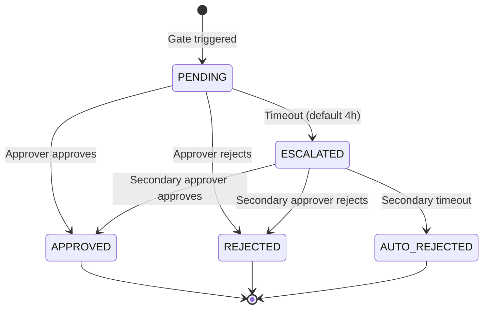
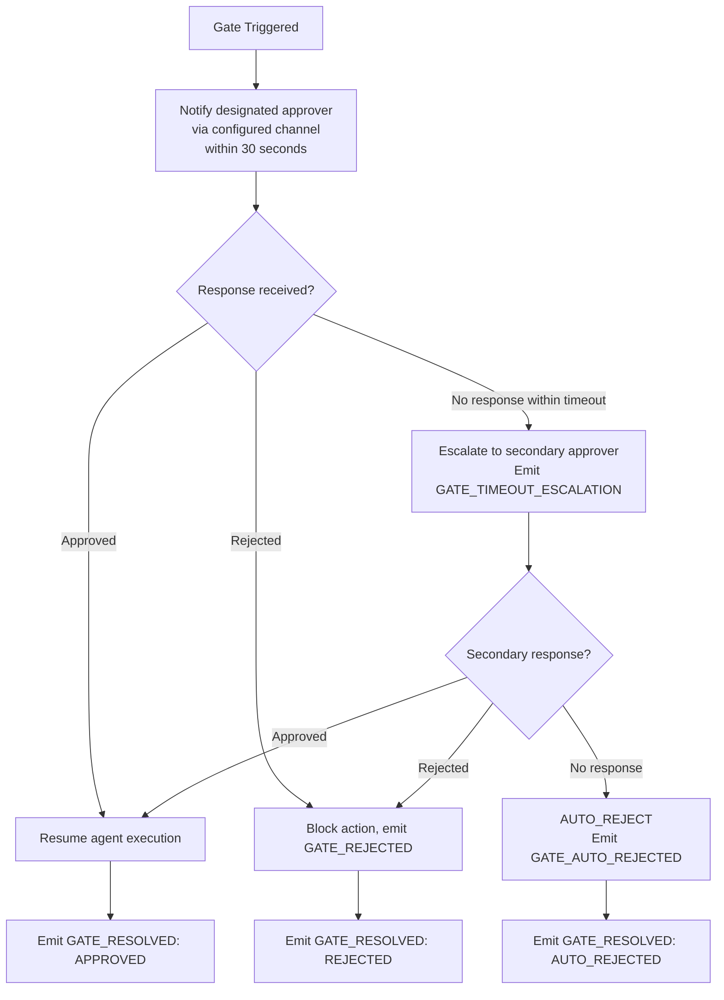

# EAAGF Specification — Human Oversight Controls Standard

**Document ID:** EAAGF-SPEC-06  
**Version:** 1.0.0  
**Status:** Draft  
**Last Updated:** 2025-07-14  
**Owner:** AI Governance Team

---

## 1. Purpose

This document defines the normative standard for human oversight controls within the Enterprise AI Agent Governance Framework (EAAGF). It specifies how the Governance_Controller enforces configurable human oversight over agent actions, how approval gates operate, and how authorized operators can pause, resume, roll back, and emergency-stop agent execution.

Human oversight is the mechanism by which humans retain meaningful control over high-stakes agent decisions. The framework provides four oversight modes with increasing levels of human involvement, a gate-based approval workflow with notification and escalation, and operational controls for real-time intervention. These controls ensure that agents — particularly those classified as T3 (Autonomous) or T4 (Critical) — cannot execute consequential actions without appropriate human authorization.

The key words "MUST", "MUST NOT", "REQUIRED", "SHALL", "SHALL NOT", "SHOULD", "SHOULD NOT", "RECOMMENDED", "MAY", and "OPTIONAL" in this document are to be interpreted as described in [RFC 2119](https://www.rfc-editor.org/rfc/rfc2119).

---

## 2. Scope

This standard applies to:

- All AI agents deployed on any enterprise-supported platform (Databricks, Salesforce AgentForce, Snowflake Cortex, Microsoft Copilot Studio, AWS Bedrock, Azure AI Foundry, GCP Vertex AI)
- The Governance_Controller component and its oversight enforcement interfaces
- The Human_Oversight_Gate component and its approval workflow
- All teams that develop, deploy, or operate AI agents within the enterprise

For related standards, see:

| Related Domain | Document |
|---|---|
| Agent Identity | [02 — Agent Identity Standard](./02-agent-identity-standard.md) |
| Risk Classification | [03 — Risk Classification Standard](./03-risk-classification-standard.md) |
| Authorization | [04 — Authorization Standard](./04-authorization-standard.md) |
| Observability | [05 — Observability Standard](./05-observability-standard.md) |
| Security | [09 — Security Standard](./09-security-standard.md) |
| Compliance | [10 — Compliance Standard](./10-compliance-standard.md) |
| Lifecycle Management | [11 — Lifecycle Management Standard](./11-lifecycle-management-standard.md) |

---

## 3. Oversight Modes

### 3.1 Supported Oversight Modes

The Governance_Controller SHALL support four oversight modes that define the level of human involvement required for agent actions. Each mode specifies which agent actions trigger a Human_Oversight_Gate.

| Mode | Description | Gate Trigger | Default For |
|---|---|---|---|
| **FULL_AUTO** | No human gates. All actions proceed without human approval. | None | — (requires explicit AI Governance Team authorization) |
| **SUPERVISED** | Gates on write operations. Read-only actions proceed automatically. | Write operations (INSERT, UPDATE, DELETE, or equivalent) | T2 (Transactional) agents |
| **APPROVAL_REQUIRED** | Gates on all non-trivial actions. Only trivial read operations proceed automatically. | All non-trivial actions (writes, external connections, agent delegations, multi-step operations) | T3 (Autonomous), T4 (Critical) agents |
| **HUMAN_IN_LOOP** | Human approves every action. No action proceeds without explicit human approval. | Every action | T1 (Informational) agents |

**Normative rules:**

1. The Governance_Controller SHALL enforce exactly one oversight mode per agent at any given time. The active oversight mode is declared in the agent's Conformance_Profile (`oversight_mode` field).
2. The oversight mode SHALL be evaluated by the Policy_Engine as part of the authorization decision flow defined in [04 — Authorization Standard](./04-authorization-standard.md). When the oversight mode requires a gate for the requested action type, the Policy_Engine SHALL return a GATE decision.
3. The following table defines which action types trigger a gate under each oversight mode:

| Action Type | FULL_AUTO | SUPERVISED | APPROVAL_REQUIRED | HUMAN_IN_LOOP |
|---|---|---|---|---|
| Read-only data access | No gate | No gate | No gate | Gate |
| Write operation (internal) | No gate | Gate | Gate | Gate |
| Write operation (external) | No gate | Gate | Gate | Gate |
| External connection | No gate | No gate | Gate | Gate |
| Agent delegation (A2A) | No gate | No gate | Gate | Gate |
| Multi-step operation | No gate | No gate | Gate | Gate |
| Trivial read (e.g., health check) | No gate | No gate | No gate | Gate |

4. Conforming implementations SHALL treat the oversight mode as an additional policy layer evaluated after the standard authorization checks (identity, permission, compartment, egress, rate limit) defined in [04 — Authorization Standard](./04-authorization-standard.md).
5. An agent's oversight mode MAY be changed by an authorized operator at runtime. The change SHALL take effect within 30 seconds, consistent with the policy hot-reload rules in [04 — Authorization Standard](./04-authorization-standard.md), Section 13.

> **Validates: Requirement 5.1** — THE Governance_Controller SHALL support four oversight modes: FULL_AUTO (no human gates), SUPERVISED (gates on write operations), APPROVAL_REQUIRED (gates on all non-trivial actions), and HUMAN_IN_LOOP (human approves every action).

---

## 4. T4 Agent Oversight Defaults

### 4.1 Mandatory APPROVAL_REQUIRED Default for T4 Agents

WHEN a T4 (Critical) agent is deployed, the Governance_Controller SHALL default its oversight mode to APPROVAL_REQUIRED and SHALL NOT allow it to be set to FULL_AUTO without explicit AI Governance Team authorization.

**Normative rules:**

1. At registration time, if a T4 agent's Conformance_Profile does not specify an `oversight_mode`, the Governance_Controller SHALL automatically set it to `APPROVAL_REQUIRED`.
2. If a T4 agent's Conformance_Profile explicitly declares `oversight_mode: FULL_AUTO`, the Governance_Controller SHALL reject the Conformance_Profile with a validation error unless the profile includes a valid AI Governance Team authorization reference.
3. The AI Governance Team authorization for T4 FULL_AUTO mode SHALL be:
   - Issued by a named member of the AI Governance Team (not an automated process).
   - Time-bound with a maximum validity of 90 days, after which the authorization MUST be renewed.
   - Recorded in the Audit_Log with the authorizer's identity, justification, and expiration date.
4. T4 agents MAY be set to `SUPERVISED`, `APPROVAL_REQUIRED`, or `HUMAN_IN_LOOP` without additional authorization. Only `FULL_AUTO` requires the explicit AI Governance Team authorization described above.
5. If a T4 agent's FULL_AUTO authorization expires, the Governance_Controller SHALL automatically revert the agent's oversight mode to `APPROVAL_REQUIRED` and emit a `T4_OVERSIGHT_REVERTED` audit event.
6. T3 agents SHALL default to `APPROVAL_REQUIRED` but MAY be set to any oversight mode, including `FULL_AUTO`, by the owning team without AI Governance Team authorization.
7. T1 and T2 agents MAY be set to any oversight mode by the owning team.

> **Validates: Requirement 5.2** — WHEN a T4 agent is deployed, THE Governance_Controller SHALL default its oversight mode to APPROVAL_REQUIRED and SHALL NOT allow it to be set to FULL_AUTO without explicit AI Governance Team authorization.

---

## 5. Gate Notification

### 5.1 30-Second Notification SLA

WHEN a Human_Oversight_Gate is triggered, the Governance_Controller SHALL notify the designated approver via configured channels within 30 seconds.

**Normative rules:**

1. The 30-second window begins at the timestamp when the Human_Oversight_Gate transitions to the `PENDING` state and ends when the notification is delivered to the configured notification channel.
2. "Delivered" means the notification has been accepted by the notification channel's API (e.g., Slack API returns 200 OK, email relay accepts the message). Delivery to the approver's device is outside the scope of this SLA.
3. The Governance_Controller SHALL support the following notification channels:
   - **Email** — SMTP-based notification to the approver's registered email address.
   - **Slack** — Message to a configured Slack channel or direct message via Slack API.
   - **Microsoft Teams** — Message to a configured Teams channel or direct message via Teams API.
   - **PagerDuty** — Incident creation via PagerDuty Events API for urgent gates.
4. The notification SHALL include the following information:
   - The agent's name, UUID, and Risk_Tier.
   - The action type and target resource that triggered the gate.
   - The reason the gate was triggered (e.g., oversight mode, plan deviation, restricted data write).
   - A direct link to the gate approval interface.
   - The configured timeout duration and escalation target.
5. Teams SHALL configure at least one notification channel for each agent. If no notification channel is configured, the Governance_Controller SHALL use the owning team's default notification channel as registered in the Agent_Registry.
6. The Governance_Controller SHALL support configuring multiple notification channels per gate. For example, a T4 agent gate MAY simultaneously notify via Slack and PagerDuty.
7. IF the primary notification channel is unavailable (e.g., Slack API returns an error), the Governance_Controller SHALL attempt delivery via the next configured channel. If all channels fail, the Governance_Controller SHALL emit a `GATE_NOTIFICATION_FAILURE` alert and log the failure.
8. The Governance_Controller SHALL emit a `GATE_NOTIFICATION_SENT` audit event for each successful notification delivery, including the channel type, recipient, and delivery timestamp.

> **Validates: Requirement 5.3** — WHEN a Human_Oversight_Gate is triggered, THE Governance_Controller SHALL notify the designated approver via configured channels (email, Slack, Teams, PagerDuty) within 30 seconds.

---

## 6. Timeout and Escalation Rules

### 6.1 Gate Timeout and Escalation

IF a Human_Oversight_Gate receives no response within the configured timeout, THEN the Governance_Controller SHALL escalate to the secondary approver and emit a `GATE_TIMEOUT_ESCALATION` audit event.

**Normative rules:**

1. The default gate timeout is **4 hours** (14,400 seconds), measured from the timestamp when the gate entered the `PENDING` state.
2. The timeout duration is configurable per agent via the agent's Conformance_Profile or per gate type via governance policy. Teams MAY configure shorter timeouts but SHOULD NOT configure timeouts shorter than 15 minutes to allow reasonable response time.
3. WHEN the timeout expires without an approver response, the Governance_Controller SHALL:
   a. Transition the gate state from `PENDING` to `ESCALATED`.
   b. Notify the secondary approver via the configured notification channels, following the same 30-second notification SLA defined in Section 5.
   c. Emit a `GATE_TIMEOUT_ESCALATION` audit event containing:
      - The gate ID.
      - The original (primary) approver identity.
      - The escalation target (secondary approver) identity.
      - The timeout duration that elapsed.
      - The agent ID, action type, and target resource.
4. The secondary approver SHALL be configured per agent or per team. If no secondary approver is configured, the Governance_Controller SHALL escalate to the AI Governance Team.
5. The secondary approver SHALL have the same approval authority as the primary approver — they MAY approve or reject the gated action.
6. IF the secondary approver also does not respond within the configured timeout (default: 4 hours from escalation), the Governance_Controller SHALL:
   a. Transition the gate state to `AUTO_REJECTED`.
   b. Deny the gated action.
   c. Emit a `GATE_AUTO_REJECTED` audit event.
   d. Notify both the primary and secondary approvers of the auto-rejection.
7. The total maximum gate duration (primary timeout + secondary timeout) SHALL NOT exceed a configurable maximum (default: 24 hours). After the maximum duration, the gate SHALL be auto-rejected regardless of escalation state.
8. Conforming implementations SHALL support configuring different timeout durations for different Risk Tiers. The RECOMMENDED defaults are:

| Risk Tier | Primary Timeout | Secondary Timeout | Maximum Gate Duration |
|---|---|---|---|
| T1 | 4 hours | 4 hours | 24 hours |
| T2 | 4 hours | 4 hours | 24 hours |
| T3 | 2 hours | 2 hours | 12 hours |
| T4 | 1 hour | 1 hour | 8 hours |

> **Validates: Requirement 5.4** — IF a Human_Oversight_Gate receives no response within the configured timeout (default: 4 hours), THEN THE Governance_Controller SHALL escalate to the secondary approver and emit a GATE_TIMEOUT_ESCALATION audit event.

---

## 7. Pause and Resume Capability

### 7.1 Agent Pause

The Governance_Controller SHALL provide a pause capability that immediately suspends all actions of a running agent while preserving its current execution state.

**Normative rules:**

1. The pause command SHALL be available to the following authorized roles:
   - The agent's owning team lead.
   - The AI Governance Team.
   - Any operator with the `AGENT_PAUSE` permission in the enterprise identity provider.
2. WHEN a pause command is issued, the Governance_Controller SHALL:
   a. Immediately suspend all pending and in-flight actions for the specified agent. "Immediately" means within 5 seconds of receiving the pause command.
   b. Preserve the agent's current execution state, including: the task queue, completed actions, pending actions, active credentials, and context data.
   c. Prevent the agent from initiating any new actions while paused.
   d. Emit an `AGENT_PAUSED` audit event containing the agent ID, the operator who issued the pause, and the pause timestamp.
3. Actions that are already in-flight (i.e., submitted to a target system but not yet completed) at the time of the pause SHALL be allowed to complete, but their results SHALL be held and not forwarded to the agent until the agent is resumed.
4. A paused agent's credentials SHALL remain valid for the duration of the pause, up to their original TTL. If credentials expire during the pause, the agent SHALL re-authenticate upon resume.
5. The Governance_Controller SHALL maintain the paused state durably. A system restart SHALL NOT cause a paused agent to resume automatically.

### 7.2 Task Queue Inspection

WHEN an agent is paused, the Governance_Controller SHALL allow authorized operators to inspect the agent's current task queue, completed actions, and pending actions before deciding to resume or terminate.

**Normative rules:**

1. The inspection interface SHALL expose the following information for a paused agent:
   - **Task Queue** — The ordered list of pending actions the agent intends to execute, including action type, target resource, and priority.
   - **Completed Actions** — The list of actions already executed in the current task, including action type, target resource, outcome, and timestamp.
   - **Pending Actions** — Actions that were in-flight at the time of the pause, including their current status (waiting for target system response, held result).
   - **Execution State** — The agent's current reasoning context, task plan, and any intermediate data.
   - **Active Credentials** — The credentials currently issued to the agent, including scope, TTL, and remaining validity.
2. The inspection interface SHALL be read-only. Operators SHALL NOT be able to modify the agent's task queue or execution state through the inspection interface.
3. Access to the inspection interface SHALL be restricted to the same authorized roles that can issue pause commands (Section 7.1, rule 1).
4. After inspection, the authorized operator SHALL choose one of the following actions:
   - **Resume** — Continue agent execution from the paused state.
   - **Terminate** — Stop the agent and revoke all credentials. The agent's task is marked as failed.
   - **Rollback** — Reverse completed actions before deciding to resume or terminate (see Section 8).

> **Validates: Requirement 5.5** — THE Governance_Controller SHALL provide a pause capability that immediately suspends all actions of a running agent while preserving its current execution state.

> **Validates: Requirement 5.6** — WHEN an agent is paused, THE Governance_Controller SHALL allow authorized operators to inspect the agent's current task queue, completed actions, and pending actions before deciding to resume or terminate.

---

## 8. Rollback Capability

### 8.1 Action Rollback

The Governance_Controller SHALL provide a rollback capability for T2, T3, and T4 agents that reverses the last N completed actions, where N is configurable per agent.

**Normative rules:**

1. The rollback capability SHALL be available for agents classified as T2 (Transactional), T3 (Autonomous), and T4 (Critical). T1 (Informational) agents are read-only and do not require rollback.
2. The default rollback depth is **10 actions**. Teams MAY configure a different rollback depth per agent via the agent's Conformance_Profile or governance policy.
3. The Governance_Controller SHALL maintain a rollback log for each agent task execution. The rollback log SHALL record sufficient information to reverse each completed action, including:
   - The action type and target resource.
   - The pre-action state of the target resource (snapshot or delta).
   - The post-action state of the target resource.
   - The timestamp of the action.
4. WHEN a rollback is requested, the Governance_Controller SHALL:
   a. Reverse the specified number of actions in reverse chronological order (most recent first).
   b. For each reversed action, restore the target resource to its pre-action state.
   c. Emit an `ACTION_ROLLED_BACK` audit event for each reversed action, including the original action ID, the rollback operator, and the rollback timestamp.
   d. Emit a `ROLLBACK_COMPLETED` audit event when all requested actions have been reversed.
5. Rollback SHALL be an atomic operation — either all requested actions are reversed, or none are. If a rollback fails partway through (e.g., a target system rejects the reversal), the Governance_Controller SHALL:
   a. Halt the rollback.
   b. Emit a `ROLLBACK_FAILED` audit event with the failure reason and the number of actions successfully reversed.
   c. Notify the operator of the partial rollback state.
6. Actions that are not reversible (e.g., sending an email, triggering an external webhook) SHALL be flagged as `NON_REVERSIBLE` in the rollback log. The Governance_Controller SHALL warn the operator before attempting to roll back a sequence that includes non-reversible actions.
7. The rollback capability SHALL be available to the same authorized roles that can issue pause commands (Section 7.1, rule 1).
8. Rollback MAY be initiated while the agent is paused or after the agent has completed its task. Rollback SHALL NOT be available while the agent is actively executing (the agent MUST be paused first).

> **Validates: Requirement 5.7** — THE Governance_Controller SHALL provide a rollback capability for T2, T3, and T4 agents that reverses the last N completed actions, where N is configurable per agent (default: 10).

---

## 9. Plan Deviation Detection

### 9.1 Automatic Gate on Plan Deviation

IF an agent's action sequence deviates from its declared task plan by more than a configurable threshold, THEN the Governance_Controller SHALL automatically trigger a Human_Oversight_Gate with reason code `PLAN_DEVIATION`.

**Normative rules:**

1. Agents operating in `SUPERVISED`, `APPROVAL_REQUIRED`, or `HUMAN_IN_LOOP` modes SHALL declare a task plan as part of their task execution context. The task plan is an ordered sequence of intended actions that the agent expects to perform.
2. The Governance_Controller SHALL compare each agent action against the declared task plan in real time. Deviation is measured as the percentage of actions that do not match the declared plan.
3. The configurable deviation threshold is expressed as a percentage (default: **20%**). When the cumulative deviation exceeds the threshold, the Governance_Controller SHALL trigger a Human_Oversight_Gate.
4. The following conditions constitute a plan deviation:
   - The agent performs an action not listed in the declared task plan.
   - The agent performs actions in a different order than declared.
   - The agent skips a declared action.
   - The agent targets a resource not listed in the declared plan.
5. WHEN a `PLAN_DEVIATION` gate is triggered, the Governance_Controller SHALL:
   a. Pause the agent's execution.
   b. Notify the designated approver with the deviation details, including: the declared plan, the actual action sequence, the deviation percentage, and the specific deviating action.
   c. Emit a `PLAN_DEVIATION` audit event containing the gate ID, agent ID, deviation percentage, and the deviating action details.
6. The approver SHALL choose one of the following responses:
   - **Approve and continue** — Accept the deviation and allow the agent to continue with its modified plan.
   - **Approve and update plan** — Accept the deviation and update the declared task plan to reflect the new action sequence.
   - **Reject** — Deny the deviating action and pause the agent for further inspection.
7. Agents operating in `FULL_AUTO` mode are exempt from plan deviation detection, as they have no human oversight gates. However, the Governance_Controller SHALL still log deviation metrics for `FULL_AUTO` agents for post-hoc analysis.
8. The deviation threshold MAY be configured per agent, per Risk_Tier, or globally. The RECOMMENDED thresholds are:

| Risk Tier | Default Deviation Threshold |
|---|---|
| T1 | 30% |
| T2 | 25% |
| T3 | 20% |
| T4 | 10% |

> **Validates: Requirement 5.8** — IF an agent's action sequence deviates from its declared task plan by more than a configurable threshold, THEN THE Governance_Controller SHALL automatically trigger a Human_Oversight_Gate with reason code PLAN_DEVIATION.

### 9.2 Mandate-Aware Deviation Detection

WHEN an agent operates under a Constrained_Delegation_Mandate (as defined in [04 — Authorization Standard](./04-authorization-standard.md), Section 5), the Governance_Controller SHALL measure plan deviation against the mandate's constraints in addition to the declared task plan.

**Normative rules:**

1. For agents operating under a Constrained_Delegation_Mandate, deviation SHALL be measured across two dimensions:
   - **Structural deviation** — The standard plan deviation measurement defined in Section 9.1 (action sequence vs. declared plan).
   - **Intent deviation** — Whether the agent's actions are consistent with the mandate's `intent_description` and `constraints`. Intent deviation is assessed by comparing the agent's cumulative resource access, action types, and data volume against the mandate's `permitted_resources`, `permitted_action_types`, and `constraints` fields.
2. The Governance_Controller SHALL track mandate utilization metrics in real time:
   - `actions_completed` / `constraints.max_actions` — Action budget consumption.
   - `data_volume_processed` / `constraints.max_data_volume_bytes` — Data volume budget consumption.
   - Resources accessed vs. `permitted_resources` — Resource scope adherence.
3. WHEN mandate utilization reaches 80% of any constraint limit, the Governance_Controller SHALL emit a `MANDATE_UTILIZATION_WARNING` audit event. This is an informational alert, not a gate trigger.
4. WHEN mandate utilization reaches 100% of any constraint limit, the Governance_Controller SHALL deny subsequent actions and emit a `MANDATE_CONSTRAINT_VIOLATED` audit event as defined in [04 — Authorization Standard](./04-authorization-standard.md).
5. The mandate's `intent_description` SHALL be included in all `PLAN_DEVIATION` audit events when the agent is operating under a mandate. This enables post-hoc review of whether the deviation was consistent with the delegator's stated intent.

---

### 9.3 Downstream Challenge Gates

WHEN an agent operating under a Constrained_Delegation_Mandate encounters a target system or peer agent that requires additional human confirmation before proceeding, the Governance_Controller SHALL support Downstream_Challenge_Gates that bring the delegating human back into the approval loop.

**Normative rules:**

1. A Downstream_Challenge_Gate is a specialized Human_Oversight_Gate triggered not by the Governance_Controller's own policy evaluation, but by a signal from a target system, peer agent, or external service indicating that the current authorization is insufficient to proceed.
2. The following conditions SHALL trigger a Downstream_Challenge_Gate:
   - A target system returns a structured challenge response indicating that additional human confirmation is required (e.g., a step-up authentication challenge, an ambiguity resolution request, or a confirmation of high-impact action).
   - A peer agent in an A2A delegation chain returns a `CHALLENGE_REQUIRED` response indicating that the delegating agent's mandate does not provide sufficient specificity for the peer to proceed.
   - The Governance_Controller detects that the agent's next action would cross a boundary not anticipated by the mandate (e.g., the agent discovered that completing the task requires accessing a resource not in the mandate's `permitted_resources`).
3. WHEN a Downstream_Challenge_Gate is triggered, the Governance_Controller SHALL:
   a. Pause the agent's execution.
   b. Notify the delegating human (the `delegator_identity` from the active mandate) via the configured notification channels, following the same 30-second notification SLA defined in Section 5.
   c. Present the challenge context to the delegator, including: the original mandate's `intent_description`, the challenge reason, the specific information or confirmation requested, and the agent's current progress.
   d. Emit a `DOWNSTREAM_CHALLENGE_TRIGGERED` audit event containing the gate ID, agent ID, mandate ID, challenge source, and challenge reason.
4. The delegating human SHALL choose one of the following responses:
   - **Confirm and continue** — Provide the requested confirmation or information. The Governance_Controller SHALL update the agent's execution context with the human's response and resume execution.
   - **Confirm and update mandate** — Provide confirmation and issue an updated Constrained_Delegation_Mandate with broader scope (e.g., adding a new resource to `permitted_resources`). The updated mandate MUST be signed by the delegator.
   - **Reject** — Deny the challenge and terminate the agent's task. The Governance_Controller SHALL emit a `DOWNSTREAM_CHALLENGE_REJECTED` audit event.
5. Downstream_Challenge_Gates SHALL follow the same timeout and escalation rules defined in Section 6. If the delegator does not respond within the configured timeout, the gate SHALL escalate to the secondary approver.
6. The Downstream_Challenge_Gate mechanism ensures that autonomous agents operating under mandates can gracefully handle situations where the pre-authorized scope is insufficient, without failing silently or exceeding their authority. It provides a structured re-entry point for human judgment within an otherwise autonomous workflow.

> **Validates: Requirement 5.11** — WHEN an agent operating under a Constrained_Delegation_Mandate encounters a target system that requires additional human confirmation, THE Governance_Controller SHALL support Downstream_Challenge_Gates that bring the delegating human back into the approval loop.

---

## 10. Emergency Stop Procedure

### 10.1 Emergency Stop Command

The Governance_Controller SHALL support emergency stop — a single authorized command that immediately terminates all actions of a specified agent and revokes all its credentials.

**Normative rules:**

1. The emergency stop command SHALL be available to the following authorized roles:
   - The AI Governance Team (all members).
   - The agent's owning team lead.
   - Any operator with the `EMERGENCY_STOP` permission in the enterprise identity provider.
2. WHEN an emergency stop command is issued, the Governance_Controller SHALL execute the following sequence:
   a. **Immediately terminate all agent actions** — All pending, in-flight, and queued actions SHALL be cancelled. "Immediately" means within 5 seconds of receiving the command.
   b. **Revoke all credentials** — All active credentials (session credentials, delegated credentials, platform tokens) associated with the agent SHALL be revoked. Revocation SHALL be propagated to all connected Platform Adapters.
   c. **Block new actions** — The agent SHALL be prevented from initiating any new actions until explicitly re-authorized by the AI Governance Team.
   d. **Preserve execution state** — The agent's execution state at the time of the emergency stop SHALL be preserved for post-incident investigation, including: task queue, completed actions, pending actions, reasoning context, and active data.
3. The emergency stop SHALL take precedence over all other governance operations. If the agent is currently in a Human_Oversight_Gate workflow, the gate SHALL be immediately cancelled and the gated action denied.
4. Emergency stop is a non-reversible operation. To resume the agent after an emergency stop, the AI Governance Team MUST explicitly re-authorize the agent through a new approval workflow.

### 10.2 60-Second Notification SLA

WHEN an emergency stop is executed, the Governance_Controller SHALL emit an `EMERGENCY_STOP` audit event and notify the AI Governance Team within 60 seconds.

**Normative rules:**

1. The `EMERGENCY_STOP` audit event SHALL be emitted within 5 seconds of the emergency stop command execution. The event SHALL include:
   - The agent ID, name, and Risk_Tier.
   - The operator who issued the emergency stop command.
   - The timestamp of the emergency stop.
   - The reason for the emergency stop (if provided by the operator).
   - The number of actions terminated, credentials revoked, and gates cancelled.
2. The AI Governance Team notification SHALL be delivered within 60 seconds of the emergency stop command. The 60-second window begins at the timestamp when the emergency stop command is received.
3. The notification SHALL be delivered via the AI Governance Team's configured notification channels (email, Slack, Teams, PagerDuty). At minimum, the notification SHALL be sent to the AI Governance Team's primary Slack or Teams channel AND via PagerDuty if the agent is T3 or T4.
4. The notification SHALL include:
   - The agent's name, UUID, Risk_Tier, and platform.
   - The operator who initiated the emergency stop.
   - The reason for the emergency stop.
   - A link to the agent's preserved execution state for investigation.
   - A link to the incident response runbook for the agent's Risk_Tier (see [11 — Lifecycle Management Standard](./11-lifecycle-management-standard.md)).
5. IF the notification cannot be delivered within 60 seconds (e.g., all notification channels are unavailable), the Governance_Controller SHALL:
   a. Retry delivery every 30 seconds until successful.
   b. Emit a `EMERGENCY_STOP_NOTIFICATION_FAILURE` alert.
   c. Log the notification failure for post-incident review.
6. The emergency stop audit event and notification are independent of the telemetry backend availability. Even if the primary telemetry backend is unavailable, the emergency stop event SHALL be written to the local WAL as defined in [05 — Observability Standard](./05-observability-standard.md), Section 12.

> **Validates: Requirement 5.9** — THE Governance_Controller SHALL support emergency stop — a single authorized command that immediately terminates all actions of a specified agent and revokes all its credentials.

> **Validates: Requirement 5.10** — WHEN an emergency stop is executed, THE Governance_Controller SHALL emit an EMERGENCY_STOP audit event and notify the AI Governance Team within 60 seconds.

---

## 11. Gate Workflow State Machine

### 11.1 Gate States

The Human_Oversight_Gate follows a state machine with the following states and transitions. This state machine governs the lifecycle of every gate instance from trigger to resolution.



### 11.2 State Definitions

| State | Description | Entry Condition | Exit Condition |
|---|---|---|---|
| **PENDING** | Gate has been triggered and is awaiting primary approver response. | Gate triggered by oversight mode, plan deviation, or restricted data write. | Approver responds (→ APPROVED or REJECTED) or timeout expires (→ ESCALATED). |
| **APPROVED** | The gated action has been approved by a human approver. | Primary or secondary approver approves the action. | Terminal state. Agent execution resumes. |
| **REJECTED** | The gated action has been rejected by a human approver. | Primary or secondary approver rejects the action. | Terminal state. Action is denied. |
| **ESCALATED** | The primary approver did not respond within the timeout. The gate has been escalated to the secondary approver. | Primary timeout expires without response. | Secondary approver responds (→ APPROVED or REJECTED) or secondary timeout expires (→ AUTO_REJECTED). |
| **AUTO_REJECTED** | Neither the primary nor secondary approver responded within their respective timeouts. The action is automatically rejected. | Secondary timeout expires without response. | Terminal state. Action is denied. |

### 11.3 State Transition Rules

1. A gate SHALL transition from `PENDING` to `APPROVED` or `REJECTED` only upon receiving an explicit decision from the designated primary approver.
2. A gate SHALL transition from `PENDING` to `ESCALATED` only when the configured primary timeout expires without a response.
3. A gate in the `ESCALATED` state SHALL follow the same approval/rejection logic as the `PENDING` state, but with the secondary approver as the decision-maker.
4. Terminal states (`APPROVED`, `REJECTED`, `AUTO_REJECTED`) are immutable — once a gate reaches a terminal state, it SHALL NOT transition to any other state.
5. Each state transition SHALL produce an audit event as defined in Section 14.
6. An emergency stop (Section 10) SHALL force any active gate to the `REJECTED` state immediately, regardless of its current state.

For the full rendered gate workflow diagram, see [Human Oversight Flow](../flows/human-oversight-flow.md).

---

## 12. Human Oversight Decision Flow

The following diagram illustrates the end-to-end human oversight decision flow, from gate trigger through notification, approval/rejection, escalation, and resolution. For the full rendered diagram, see [Human Oversight Flow](../flows/human-oversight-flow.md).



---

## 13. Gate Configuration Schema

### 13.1 Gate Configuration

The following configuration schema defines the configurable parameters for Human_Oversight_Gate behavior. These parameters MAY be set per agent, per team, or globally.

```json
{
  "gate_config": {
    "primary_approver": {
      "identity": "string (user ID or group ID)",
      "notification_channels": ["SLACK", "EMAIL", "TEAMS", "PAGERDUTY"],
      "timeout_seconds": 14400
    },
    "secondary_approver": {
      "identity": "string (user ID or group ID)",
      "notification_channels": ["SLACK", "EMAIL", "TEAMS", "PAGERDUTY"],
      "timeout_seconds": 14400
    },
    "max_gate_duration_seconds": 86400,
    "plan_deviation_threshold_percent": 20,
    "rollback_depth": 10,
    "emergency_stop_notification_channels": ["SLACK", "PAGERDUTY"],
    "auto_reject_on_double_timeout": true
  }
}
```

### 13.2 Configuration Precedence

When gate configuration is specified at multiple levels, the following precedence order applies (highest to lowest):

1. **Per-gate override** — Configuration specified at the time a gate is triggered (e.g., by the Policy_Engine for a specific action).
2. **Per-agent configuration** — Configuration in the agent's Conformance_Profile.
3. **Per-team configuration** — Configuration set by the owning team for all their agents.
4. **Global default** — The EAAGF default values defined in this standard.

---

## 14. Audit Event Requirements

The following audit events MUST be emitted by the human oversight system. All events SHALL conform to the audit event schema defined in [05 — Observability Standard](./05-observability-standard.md).

| Event | Trigger | Required Fields |
|---|---|---|
| `GATE_TRIGGERED` | Human_Oversight_Gate enters PENDING state | agent_id, gate_id, action_type, target_resource, risk_tier, oversight_mode, trigger_reason, timestamp |
| `GATE_NOTIFICATION_SENT` | Notification delivered to approver | gate_id, channel_type, recipient, delivery_timestamp |
| `GATE_RESOLVED` | Gate reaches terminal state (APPROVED, REJECTED, AUTO_REJECTED) | gate_id, agent_id, decision, approver_identity, decision_timestamp, gate_duration_seconds |
| `GATE_TIMEOUT_ESCALATION` | Primary timeout expires, gate escalated | gate_id, primary_approver, secondary_approver, timeout_duration, timestamp |
| `GATE_AUTO_REJECTED` | Both primary and secondary timeouts expire | gate_id, agent_id, total_gate_duration, timestamp |
| `GATE_NOTIFICATION_FAILURE` | Notification delivery failed on all channels | gate_id, attempted_channels, failure_reason, timestamp |
| `AGENT_PAUSED` | Agent execution paused by operator | agent_id, operator_identity, pause_reason, timestamp |
| `AGENT_RESUMED` | Agent execution resumed after pause | agent_id, operator_identity, pause_duration_seconds, timestamp |
| `ACTION_ROLLED_BACK` | Individual action reversed during rollback | agent_id, original_action_id, target_resource, rollback_operator, timestamp |
| `ROLLBACK_COMPLETED` | All requested rollback actions reversed | agent_id, actions_rolled_back_count, rollback_operator, timestamp |
| `ROLLBACK_FAILED` | Rollback failed partway through | agent_id, actions_reversed, actions_remaining, failure_reason, timestamp |
| `PLAN_DEVIATION` | Agent action sequence deviated beyond threshold | agent_id, gate_id, deviation_percent, declared_plan_hash, deviating_action, timestamp |
| `MANDATE_UTILIZATION_WARNING` | Mandate constraint utilization reached 80% | agent_id, mandate_id, constraint_type, utilization_percent, timestamp |
| `DOWNSTREAM_CHALLENGE_TRIGGERED` | Target system or peer agent requires additional human confirmation | agent_id, gate_id, mandate_id, challenge_source, challenge_reason, timestamp |
| `DOWNSTREAM_CHALLENGE_REJECTED` | Delegator rejected a downstream challenge | agent_id, gate_id, mandate_id, timestamp |
| `EMERGENCY_STOP` | Emergency stop executed | agent_id, operator_identity, reason, actions_terminated, credentials_revoked, timestamp |
| `T4_OVERSIGHT_REVERTED` | T4 agent FULL_AUTO authorization expired | agent_id, previous_mode, new_mode, authorization_expiry, timestamp |

---

## 15. Oversight Error Codes

The following error codes are specific to the human oversight domain. For the complete error code registry, see the [Error Codes Reference](../reference/error-codes-reference.md).

| Code | Trigger | Description | Recovery Action |
|---|---|---|---|
| `PLAN_DEVIATION` | Agent action sequence deviates beyond threshold | The agent's actions diverged from its declared task plan | Human review required; approver decides to continue, update plan, or reject |
| `GATE_TIMEOUT_ESCALATION` | Primary approver did not respond within timeout | The gate timed out and was escalated to the secondary approver | Secondary approver must respond; review notification channel configuration |
| `EMERGENCY_STOPPED` | Emergency stop command executed | The agent has been emergency stopped; all actions terminated and credentials revoked | AI Governance Team must review and explicitly re-authorize the agent |
| `T4_FULL_AUTO_UNAUTHORIZED` | T4 agent set to FULL_AUTO without authorization | A T4 agent's Conformance_Profile declares FULL_AUTO without valid AI Governance Team authorization | Obtain AI Governance Team authorization or change oversight mode |
| `GATE_NOTIFICATION_FAILURE` | All notification channels failed | The gate notification could not be delivered to any configured channel | Review and repair notification channel configuration |

---

## 16. Conformance Requirements

### 16.1 Implementation Requirements

Any conforming implementation of the EAAGF human oversight standard MUST satisfy the following:

1. The implementation SHALL support all four oversight modes (FULL_AUTO, SUPERVISED, APPROVAL_REQUIRED, HUMAN_IN_LOOP) as defined in Section 3.
2. The implementation SHALL enforce the T4 APPROVAL_REQUIRED default and FULL_AUTO restriction as defined in Section 4.
3. The implementation SHALL deliver gate notifications within 30 seconds as defined in Section 5.
4. The implementation SHALL enforce gate timeout and escalation rules as defined in Section 6, with a default primary timeout of 4 hours.
5. The implementation SHALL provide pause and resume capabilities as defined in Section 7, including task queue inspection for paused agents.
6. The implementation SHALL provide rollback capability for T2, T3, and T4 agents as defined in Section 8, with a default rollback depth of 10 actions.
7. The implementation SHALL detect plan deviations and trigger gates as defined in Section 9, including mandate-aware deviation detection (Section 9.2) and Downstream_Challenge_Gates (Section 9.3).
8. The implementation SHALL support emergency stop with credential revocation and 60-second AI Governance Team notification as defined in Section 10.
9. The implementation SHALL implement the gate workflow state machine as defined in Section 11.
10. The implementation SHALL emit all audit events defined in Section 14.

### 16.2 Conformance Test Cases

The Conformance_Test_Suite SHALL include the following test cases for the human oversight domain:

| Test ID | Description | Validates |
|---|---|---|
| HOC-001 | Verify FULL_AUTO mode does not trigger gates for any action type | Section 3 |
| HOC-002 | Verify SUPERVISED mode triggers gates on write operations only | Section 3 |
| HOC-003 | Verify APPROVAL_REQUIRED mode triggers gates on all non-trivial actions | Section 3 |
| HOC-004 | Verify HUMAN_IN_LOOP mode triggers gates on every action | Section 3 |
| HOC-005 | Verify T4 agent defaults to APPROVAL_REQUIRED when no oversight mode is specified | Section 4 |
| HOC-006 | Verify T4 agent cannot be set to FULL_AUTO without AI Governance Team authorization | Section 4 |
| HOC-007 | Verify gate notification is delivered within 30 seconds | Section 5 |
| HOC-008 | Verify gate escalates to secondary approver after primary timeout (4 hours) | Section 6 |
| HOC-009 | Verify gate auto-rejects after both primary and secondary timeouts | Section 6 |
| HOC-010 | Verify pause command suspends agent actions within 5 seconds | Section 7 |
| HOC-011 | Verify paused agent task queue is inspectable | Section 7 |
| HOC-012 | Verify rollback reverses the last N actions for T2/T3/T4 agents | Section 8 |
| HOC-013 | Verify plan deviation triggers gate when threshold is exceeded | Section 9 |
| HOC-014 | Verify mandate-aware deviation detection tracks utilization and emits warning at 80% | Section 9.2 |
| HOC-015 | Verify Downstream_Challenge_Gate is triggered when target system returns challenge response | Section 9.3 |
| HOC-016 | Verify emergency stop terminates all actions and revokes credentials | Section 10 |
| HOC-017 | Verify emergency stop notification reaches AI Governance Team within 60 seconds | Section 10 |
| HOC-018 | Verify gate state machine transitions follow defined rules | Section 11 |

---

## 17. Regulatory Alignment

### 17.1 EU AI Act Mapping

| EAAGF Control | EU AI Act Article | Alignment |
|---|---|---|
| Four oversight modes (Section 3) | Article 14 — Human Oversight | Provides configurable human oversight proportionate to risk level |
| T4 APPROVAL_REQUIRED default (Section 4) | Article 14(4) — Effective oversight measures | Ensures high-risk AI systems have mandatory human oversight |
| Gate notification and escalation (Sections 5–6) | Article 14(4)(b) — Ability to intervene | Enables timely human intervention in agent decision-making |
| Pause/resume/rollback (Sections 7–8) | Article 14(4)(d) — Ability to override or reverse | Provides mechanisms to override and reverse agent actions |
| Emergency stop (Section 10) | Article 14(4)(e) — Ability to stop | Enables immediate cessation of AI system operation |
| Plan deviation detection (Section 9) | Article 14(4)(a) — Understand capabilities and limitations | Detects when agent behavior deviates from expected patterns |

### 17.2 NIST AI RMF Mapping

| EAAGF Control | NIST AI RMF Function | Alignment |
|---|---|---|
| Oversight modes (Section 3) | GOVERN 1.4 — Oversight processes | Defines structured oversight processes proportionate to risk |
| Gate workflow (Section 11) | MANAGE 2.2 — Mechanisms for risk mitigation | Provides approval-based risk mitigation for high-stakes actions |
| Pause and rollback (Sections 7–8) | MANAGE 4.1 — Risk treatment and response | Enables operational risk treatment through intervention |
| Emergency stop (Section 10) | MANAGE 4.2 — Incident response | Provides immediate incident response capability |
| Plan deviation (Section 9) | MEASURE 2.5 — Monitoring and evaluation | Monitors agent behavior against expected patterns |

### 17.3 ISO 42001 Mapping

| EAAGF Control | ISO 42001 Clause | Alignment |
|---|---|---|
| Oversight modes (Section 3) | Clause 8.4 — AI system operation | Defines operational controls for AI system oversight |
| Gate workflow (Section 11) | Clause 8.4 — AI system operation | Provides structured approval workflows for AI operations |
| Pause/resume/rollback (Sections 7–8) | Clause 8.4 — AI system operation | Enables operational intervention and correction |
| Emergency stop (Section 10) | Clause 8.2 — AI system lifecycle processes | Provides lifecycle control for immediate system shutdown |
| Audit events (Section 14) | Clause 9.1 — Monitoring, measurement, analysis | Produces evidence for monitoring and evaluation |
