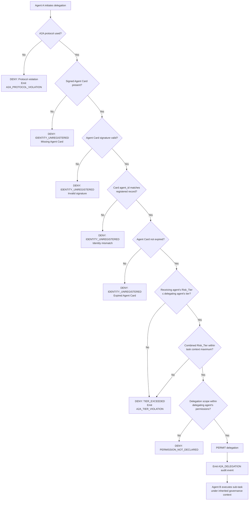

# EAAGF Specification — Interoperability Standard

**Document ID:** EAAGF-SPEC-07  
**Version:** 1.0.0  
**Status:** Draft  
**Last Updated:** 2025-07-14  
**Owner:** AI Governance Team

---

## 1. Purpose

This document defines the normative standard for interoperability within the Enterprise AI Agent Governance Framework (EAAGF). It specifies the protocols, interfaces, and conformance requirements that ensure governance controls apply uniformly across all platforms and agent interactions, regardless of the underlying technology stack.

Interoperability in the EAAGF context means that any agent, on any supported platform, communicating with any tool or peer agent, does so through standardized protocols that the Governance_Controller can inspect, enforce, and audit. This standard defines MCP as the baseline protocol for agent-to-tool connections, A2A as the protocol for agent-to-agent delegation, and the Platform Adapter interface that bridges platform-native APIs to EAAGF-compliant interfaces.

The key words "MUST", "MUST NOT", "REQUIRED", "SHALL", "SHALL NOT", "SHOULD", "SHOULD NOT", "RECOMMENDED", "MAY", and "OPTIONAL" in this document are to be interpreted as described in [RFC 2119](https://www.rfc-editor.org/rfc/rfc2119).

---

## 2. Scope

This standard applies to:

- All AI agents deployed on any enterprise-supported platform (Databricks, Salesforce AgentForce, Snowflake Cortex, Microsoft Copilot Studio, AWS Bedrock, Azure AI Foundry, GCP Vertex AI)
- The Governance_Controller component and its interoperability enforcement interfaces
- All Platform_Adapters that bridge platform-native APIs to EAAGF-compliant interfaces
- All teams that develop, deploy, or operate AI agents within the enterprise

For related standards, see:

| Related Domain | Document |
|---|---|
| Agent Identity | [02 — Agent Identity Standard](./02-agent-identity-standard.md) |
| Risk Classification | [03 — Risk Classification Standard](./03-risk-classification-standard.md) |
| Authorization | [04 — Authorization Standard](./04-authorization-standard.md) |
| Observability | [05 — Observability Standard](./05-observability-standard.md) |
| Human Oversight | [06 — Human Oversight Standard](./06-human-oversight-standard.md) |
| Data Governance | [08 — Data Governance Standard](./08-data-governance-standard.md) |
| Security | [09 — Security Standard](./09-security-standard.md) |

---

## 3. MCP as Baseline Protocol

### 3.1 MCP Requirement for Agent-to-Tool Connections

The EAAGF SHALL define MCP (Model Context Protocol) as the baseline protocol for all agent-to-tool connections. Every Platform_Adapter SHALL implement MCP server and client interfaces.

**Normative rules:**

1. All agent-to-tool connections within the enterprise MUST use MCP version 1.0 or later. Proprietary or platform-specific tool connection protocols are NOT permitted unless wrapped by a Platform_Adapter that provides equivalent MCP-compliant governance enforcement.
2. Every Platform_Adapter SHALL implement both an MCP server interface (to expose platform tools to agents) and an MCP client interface (to allow agents to invoke tools on other platforms).
3. The Governance_Controller SHALL intercept all MCP tool calls at the Platform_Adapter boundary to apply authorization, rate limiting, and audit logging as defined in [04 — Authorization Standard](./04-authorization-standard.md) and [05 — Observability Standard](./05-observability-standard.md).
4. MCP tool calls SHALL include the calling agent's Agent_Identity in the request headers. The Governance_Controller SHALL validate the identity before forwarding the call to the target MCP server.
5. The MCP server interface exposed by each Platform_Adapter SHALL declare its available tools in a machine-readable tool manifest. The tool manifest SHALL include, for each tool: the tool name, description, input schema, output schema, required permissions, and maximum data classification handled.
6. Agents SHALL only invoke MCP tools that are listed in the enterprise MCP directory (Section 7) or explicitly approved in the agent's Conformance_Profile (`approved_mcp_servers` field).
7. Platform_Adapters SHALL propagate EAAGF governance metadata (agent ID, risk tier, correlation ID, task ID) as MCP protocol extensions in all tool call requests and responses.

> **Validates: Requirement 6.1** — THE EAAGF SHALL define MCP as the baseline protocol for all agent-to-tool connections; every Platform_Adapter SHALL implement MCP server/client interfaces.

---

## 4. A2A Protocol for Agent Delegation

### 4.1 A2A Requirement for Agent-to-Agent Delegation

WHEN an agent delegates a sub-task to another agent, the Governance_Controller SHALL require the delegation to use A2A (Agent-to-Agent) protocol with a signed Agent Card that includes the delegating agent's identity and Risk_Tier.

**Normative rules:**

1. All agent-to-agent task delegations within the enterprise MUST use A2A protocol version 1.0 or later. Direct API calls between agents that bypass A2A are NOT permitted.
2. Every A2A delegation request SHALL include a signed Agent Card. The Agent Card is a cryptographically signed JSON document that attests the delegating agent's identity and authorization context.
3. The Agent Card SHALL be signed using the delegating agent's Agent_Identity credential (X.509 certificate or OAuth 2.0 token) as issued by the Agent_Registry. The signature algorithm SHALL be RS256 or ES256.
4. The Governance_Controller SHALL validate the Agent Card signature before permitting any A2A delegation. An unsigned or invalidly signed Agent Card SHALL result in a DENY decision with reason code `IDENTITY_UNREGISTERED`.
5. The Governance_Controller SHALL verify that the delegating agent's identity in the Agent Card matches the registered record in the Agent_Registry. A mismatch SHALL result in a DENY decision.
6. A2A delegations SHALL be subject to the same authorization checks defined in [04 — Authorization Standard](./04-authorization-standard.md), Section 12.1.3, including identity validation, permission checks, compartment checks, and rate limiting.
7. The Governance_Controller SHALL emit an `A2A_DELEGATION` audit event for every A2A delegation attempt, including the delegating agent ID, the receiving agent ID, the task context, and the delegation outcome (PERMITTED or DENIED).

### 4.2 Signed Agent Card Requirements

The Agent Card is the trust anchor for A2A delegation. The following fields are REQUIRED in every Agent Card:

```json
{
  "agent_id": "uuid-v4 of the delegating agent",
  "agent_name": "string",
  "risk_tier": "T1 | T2 | T3 | T4",
  "platform": "DATABRICKS | SALESFORCE | SNOWFLAKE | COPILOT_STUDIO | AWS | AZURE | GCP",
  "task_id": "uuid-v4 of the current task",
  "delegation_scope": {
    "sub_task_description": "string",
    "permitted_actions": ["TOOL_CALL", "DATA_READ"],
    "permitted_resources": ["resource URI list"],
    "max_risk_tier": "T1 | T2 | T3 | T4"
  },
  "issued_at": "ISO8601 UTC",
  "expires_at": "ISO8601 UTC",
  "issuer": "Agent_Registry endpoint URI",
  "signature": "base64-encoded signature"
}
```

**Normative rules for Agent Card fields:**

1. `agent_id` SHALL match the UUID v4 assigned by the Agent_Registry at registration time.
2. `risk_tier` SHALL match the Risk_Tier recorded in the Agent_Registry. An Agent Card that declares a lower Risk_Tier than the registered value SHALL be rejected.
3. `delegation_scope.max_risk_tier` SHALL NOT exceed the delegating agent's own Risk_Tier. An agent MUST NOT delegate to a higher-tier agent than itself.
4. `expires_at` SHALL NOT exceed the delegating agent's current credential TTL. The Agent Card validity window MUST be within the delegating agent's active session.
5. The `signature` SHALL cover all fields in the Agent Card except the `signature` field itself, using the canonical JSON serialization (RFC 8785).

> **Validates: Requirement 6.2** — WHEN an agent delegates a sub-task to another agent, THE Governance_Controller SHALL require the delegation to use A2A protocol with a signed Agent Card that includes the delegating agent's identity and Risk_Tier.

---

## 5. Platform Adapter Interface Specification

### 5.1 Platform Adapter Requirements

The Platform_Adapter for each supported platform SHALL translate platform-native agent APIs into EAAGF-compliant interfaces.

**Normative rules:**

1. Every Platform_Adapter SHALL implement the following EAAGF interface contract:
   - **Action Normalization** — Translate platform-native action requests (tool calls, data access, agent invocations) into the EAAGF normalized action request format before forwarding to the Governance_Controller.
   - **Identity Propagation** — Extract or inject the agent's Agent_Identity in all requests and responses.
   - **Governance Metadata** — Attach EAAGF governance metadata (agent ID, risk tier, task ID, correlation ID) to all platform-native API calls.
   - **Decision Enforcement** — Enforce PERMIT, DENY, and GATE decisions returned by the Governance_Controller. A DENY decision MUST result in the platform-native action being blocked. A GATE decision MUST pause execution until the Human_Oversight_Gate is resolved.
   - **Audit Forwarding** — Forward all platform-native events to the Telemetry_Emitter in OTLP format as defined in [05 — Observability Standard](./05-observability-standard.md).
2. Platform_Adapters SHALL be stateless with respect to governance decisions. All governance state (agent identity, policy, audit log) is maintained by the Governance_Controller and Agent_Registry.
3. Platform_Adapters SHALL implement the MCP server and client interfaces as defined in Section 3.
4. Platform_Adapters SHALL implement the A2A delegation interface as defined in Section 4, or provide a compatibility shim as defined in Section 10.
5. Platform_Adapters SHALL expose a health check endpoint that the Governance_Controller can poll to verify adapter availability.
6. Platform_Adapters SHALL support hot configuration reload — changes to the adapter's configuration (e.g., Governance_Controller endpoint, credential rotation) SHALL take effect without requiring adapter restart.

### 5.2 Normalized Action Request Format

All Platform_Adapters SHALL translate platform-native requests into the following normalized format before submitting to the Governance_Controller:

```json
{
  "request_id": "uuid-v4",
  "agent_id": "uuid-v4",
  "task_id": "uuid-v4",
  "correlation_id": "uuid-v4",
  "platform": "DATABRICKS | SALESFORCE | SNOWFLAKE | COPILOT_STUDIO | AWS | AZURE | GCP",
  "action_type": "TOOL_CALL | DATA_READ | DATA_WRITE | AGENT_DELEGATION | EXTERNAL_CONNECTION",
  "target_resource": "resource URI",
  "input_summary": "string (truncated to 1024 chars)",
  "requested_permissions": ["permission list"],
  "timestamp": "ISO8601 UTC",
  "agent_card": { "$ref": "#/AgentCard (for AGENT_DELEGATION only)" }
}
```

> **Validates: Requirement 6.3** — THE Platform_Adapter for each supported platform SHALL translate platform-native agent APIs into EAAGF-compliant interfaces.

---

## 6. Conformance Profile Validation

### 6.1 Platform Adapter Conformance Profile Validation

WHEN a Platform_Adapter is registered, the Governance_Controller SHALL validate its Conformance_Profile against the EAAGF conformance schema before accepting agent registrations from that adapter.

**Normative rules:**

1. Every Platform_Adapter SHALL declare a Conformance_Profile at registration time. The Conformance_Profile declares which EAAGF capabilities the adapter implements.
2. The Governance_Controller SHALL validate the Platform_Adapter's Conformance_Profile against the EAAGF Conformance Profile JSON Schema (Section 6.2) before the adapter is permitted to register agents.
3. If the Conformance_Profile fails validation, the Governance_Controller SHALL reject the adapter registration and return a structured error response listing all validation failures.
4. A Platform_Adapter's Conformance_Profile SHALL declare at minimum:
   - The EAAGF specification version it conforms to.
   - The MCP version(s) it supports.
   - Whether it supports native A2A or requires a compatibility shim.
   - The platforms it bridges.
   - The maximum Risk_Tier of agents it can host.
5. The Governance_Controller SHALL re-validate a Platform_Adapter's Conformance_Profile whenever the adapter declares a configuration update.
6. Agents registered through a Platform_Adapter SHALL inherit the adapter's capability constraints. An agent MUST NOT declare capabilities that exceed those of its hosting Platform_Adapter.

### 6.2 Conformance Profile JSON Schema

The following JSON Schema defines the structure that all agents and Platform_Adapters MUST populate to declare their capabilities, permissions, and oversight requirements:

```json
{
  "$schema": "https://json-schema.org/draft/2020-12/schema",
  "$id": "https://eaagf.enterprise.internal/schemas/conformance-profile/v1.0",
  "title": "EAAGF Conformance Profile",
  "type": "object",
  "required": [
    "schema_version", "agent_id", "capabilities", "declared_permissions",
    "oversight_mode", "max_session_duration_seconds", "protocols_supported"
  ],
  "properties": {
    "schema_version": {
      "type": "string",
      "const": "1.0",
      "description": "EAAGF Conformance Profile schema version"
    },
    "agent_id": {
      "type": "string",
      "format": "uuid",
      "description": "UUID v4 assigned by the Agent_Registry"
    },
    "capabilities": {
      "type": "array",
      "items": {
        "type": "string",
        "enum": ["TOOL_CALL", "DATA_READ", "DATA_WRITE", "AGENT_DELEGATION", "EXTERNAL_CONNECTION"]
      },
      "minItems": 1,
      "description": "The set of action types this agent is authorized to perform"
    },
    "declared_permissions": {
      "type": "array",
      "items": {
        "type": "object",
        "required": ["resource", "actions"],
        "properties": {
          "resource": { "type": "string", "description": "Resource URI (e.g., snowflake://db/schema/table)" },
          "actions": {
            "type": "array",
            "items": { "type": "string" },
            "description": "Permitted actions on this resource (e.g., SELECT, INSERT, READ, UPDATE)"
          }
        }
      },
      "description": "Explicit resource-action permission declarations"
    },
    "approved_mcp_servers": {
      "type": "array",
      "items": { "type": "string", "format": "uri" },
      "description": "MCP server URIs from the enterprise directory that this agent may connect to"
    },
    "approved_egress_endpoints": {
      "type": "array",
      "items": { "type": "string" },
      "description": "Hostnames or wildcard patterns for permitted outbound connections"
    },
    "data_classifications_accessed": {
      "type": "array",
      "items": {
        "type": "string",
        "enum": ["PUBLIC", "INTERNAL", "CONFIDENTIAL", "RESTRICTED"]
      },
      "description": "Data classification levels this agent is authorized to access"
    },
    "oversight_mode": {
      "type": "string",
      "enum": ["FULL_AUTO", "SUPERVISED", "APPROVAL_REQUIRED", "HUMAN_IN_LOOP"],
      "description": "The human oversight mode for this agent"
    },
    "max_session_duration_seconds": {
      "type": "integer",
      "minimum": 1,
      "maximum": 3600,
      "description": "Maximum credential TTL in seconds. Must not exceed tier maximum (3600 for T1/T2, 900 for T3/T4)"
    },
    "max_actions_per_minute": {
      "type": "integer",
      "minimum": 1,
      "maximum": 100,
      "description": "Maximum actions per minute. Must not exceed tier maximum (100 for T1/T2, 20 for T3/T4)"
    },
    "context_compartments": {
      "type": "array",
      "items": { "type": "string" },
      "description": "Named data compartments this agent is authorized to access"
    },
    "geographic_constraints": {
      "type": "array",
      "items": { "type": "string" },
      "description": "ISO 3166-1 alpha-2 country codes or region identifiers (e.g., EU, US) for data residency enforcement"
    },
    "protocols_supported": {
      "type": "array",
      "items": {
        "type": "string",
        "enum": ["MCP_1_0", "A2A_1_0"]
      },
      "minItems": 1,
      "description": "EAAGF interoperability protocols supported by this agent or adapter"
    },
    "permission_templates": {
      "type": "array",
      "items": { "type": "string" },
      "description": "Named permission templates from the AI Governance Team catalog to include"
    }
  },
  "additionalProperties": false
}
```

> **Validates: Requirement 6.4** — WHEN a Platform_Adapter is registered, THE Governance_Controller SHALL validate its Conformance_Profile against the EAAGF conformance schema before accepting agent registrations from that adapter.

> **Validates: Requirement 6.5** — THE EAAGF SHALL define a Conformance_Profile schema (JSON Schema) that all agents and Platform_Adapters must populate to declare their capabilities, permissions, and oversight requirements.

---

## 7. MCP Enterprise Directory

### 7.1 Enterprise MCP Directory Specification

The EAAGF SHALL maintain an enterprise MCP directory — a curated catalog of approved MCP servers with security attestations — that agents may connect to without additional approval.

**Normative rules:**

1. The enterprise MCP directory is the authoritative catalog of MCP servers that are approved for use by enterprise agents. Only MCP servers listed in this directory may be referenced in an agent's `approved_mcp_servers` Conformance_Profile field.
2. The AI Governance Team is responsible for maintaining the enterprise MCP directory. Product teams MAY submit MCP servers for inclusion via a formal approval process.
3. Each MCP server in the directory SHALL have a current security attestation. The attestation SHALL include:
   - A vulnerability scan result (no critical or high CVEs).
   - A data classification ceiling (the maximum data classification the server is approved to handle).
   - A review date and the identity of the AI Governance Team member who approved the entry.
   - An expiration date (maximum 12 months from the review date). Expired entries SHALL be treated as unapproved.
4. The enterprise MCP directory SHALL be versioned. Each update to the directory SHALL increment the version and emit a `MCP_DIRECTORY_UPDATED` audit event.
5. The Governance_Controller SHALL cache the enterprise MCP directory locally and refresh it at a configurable interval (default: 5 minutes). If the directory service is unavailable, the Governance_Controller SHALL use the cached version and emit a `MCP_DIRECTORY_STALE` alert if the cache is older than 1 hour.
6. Agents SHALL NOT connect to MCP servers not listed in the enterprise directory, even if the server is reachable on the network. The Governance_Controller SHALL enforce this restriction as part of the egress allowlist check defined in [04 — Authorization Standard](./04-authorization-standard.md), Section 7.

### 7.2 MCP Server Allowlist Enforcement

WHEN an agent communicates with an external MCP server not in the enterprise-approved MCP directory, the Governance_Controller SHALL block the connection and emit a `UNAPPROVED_MCP_SERVER` audit event.

**Normative rules:**

1. The Governance_Controller SHALL evaluate every MCP tool call against the enterprise MCP directory before forwarding the call to the target server.
2. The evaluation SHALL check that:
   a. The target MCP server URI matches an entry in the enterprise directory.
   b. The directory entry has a valid (non-expired) security attestation.
   c. The data classification of the data being passed to the MCP server does not exceed the server's approved data classification ceiling.
3. IF any of the above checks fail, the Governance_Controller SHALL:
   a. Block the MCP tool call immediately.
   b. Emit an `UNAPPROVED_MCP_SERVER` audit event containing: the agent ID, the target MCP server URI, the reason for blocking (not in directory, expired attestation, or classification ceiling exceeded), and the timestamp.
   c. Return a structured error response to the agent with the reason code `UNAPPROVED_MCP_SERVER`.
4. The `UNAPPROVED_MCP_SERVER` event SHALL be forwarded to the SIEM integration as a security event, as defined in [05 — Observability Standard](./05-observability-standard.md), Section 10.

### 7.3 MCP Enterprise Directory Entry Schema

Each entry in the enterprise MCP directory SHALL conform to the following schema:

```json
{
  "mcp_server_id": "mcp://enterprise-catalog/{server-name}",
  "display_name": "string",
  "provider": "string",
  "version": "semver",
  "description": "string",
  "endpoint": "https://hostname.internal.company.com",
  "security_attestation": {
    "last_reviewed": "ISO8601 date",
    "reviewed_by": "string (AI Governance Team member name)",
    "vulnerability_scan_passed": true,
    "vulnerability_scan_date": "ISO8601 date",
    "data_classification_max": "PUBLIC | INTERNAL | CONFIDENTIAL | RESTRICTED",
    "expires_at": "ISO8601 date"
  },
  "approved_risk_tiers": ["T1", "T2", "T3", "T4"],
  "capabilities": ["string list of tool names"],
  "tool_manifest_uri": "https://hostname.internal.company.com/.well-known/mcp-tools",
  "added_at": "ISO8601 date",
  "added_by": "string (AI Governance Team member name)"
}
```

**Example entry:**

```json
{
  "mcp_server_id": "mcp://enterprise-catalog/salesforce-crm",
  "display_name": "Salesforce CRM MCP Server",
  "provider": "Salesforce",
  "version": "3.1.0",
  "description": "Provides read and write access to Salesforce CRM objects including Accounts, Contacts, Opportunities, and Cases.",
  "endpoint": "https://mcp.salesforce.internal.company.com",
  "security_attestation": {
    "last_reviewed": "2025-06-01",
    "reviewed_by": "AI Governance Team",
    "vulnerability_scan_passed": true,
    "vulnerability_scan_date": "2025-05-28",
    "data_classification_max": "CONFIDENTIAL",
    "expires_at": "2026-06-01"
  },
  "approved_risk_tiers": ["T1", "T2", "T3"],
  "capabilities": ["account_read", "account_update", "opportunity_read", "case_create"],
  "tool_manifest_uri": "https://mcp.salesforce.internal.company.com/.well-known/mcp-tools",
  "added_at": "2025-01-15",
  "added_by": "AI Governance Team"
}
```

> **Validates: Requirement 6.6** — WHEN an agent communicates with an external MCP server not in the enterprise-approved MCP directory, THE Governance_Controller SHALL block the connection and emit a UNAPPROVED_MCP_SERVER audit event.

> **Validates: Requirement 6.7** — THE EAAGF SHALL maintain an enterprise MCP directory — a curated catalog of approved MCP servers with security attestations — that agents may connect to without additional approval.

---

## 8. A2A Combined Risk_Tier Enforcement

### 8.1 Combined Risk_Tier Limit for A2A Coordination

WHEN two agents coordinate via A2A, the Governance_Controller SHALL enforce that the combined Risk_Tier of the agent pair does not exceed the maximum tier authorized for the task context.

**Normative rules:**

1. The "combined Risk_Tier" of an A2A agent pair is determined by taking the maximum Risk_Tier of the two agents. For example, if Agent A is T2 and Agent B is T3, the combined tier is T3.
2. The task context defines the maximum authorized combined Risk_Tier. The task context is established when the top-level agent begins its task and is propagated to all delegated sub-tasks via the Agent Card.
3. The Governance_Controller SHALL evaluate the combined Risk_Tier at the time of each A2A delegation request. If the combined tier exceeds the task context maximum, the delegation SHALL be denied.
4. The `delegation_scope.max_risk_tier` field in the Agent Card (Section 4.2) declares the maximum Risk_Tier the delegating agent is authorized to delegate to. The Governance_Controller SHALL enforce this constraint.
5. An agent MUST NOT delegate to a peer agent whose Risk_Tier exceeds the delegating agent's own Risk_Tier. For example, a T2 agent MUST NOT delegate to a T3 or T4 agent.
6. IF a combined Risk_Tier violation is detected, the Governance_Controller SHALL:
   a. Deny the A2A delegation.
   b. Emit an `A2A_TIER_VIOLATION` audit event containing: the delegating agent ID and tier, the receiving agent ID and tier, the combined tier, the authorized maximum tier, and the task context ID.
   c. Return a structured error response with reason code `TIER_EXCEEDED`.
7. The combined Risk_Tier enforcement applies to all A2A delegation chains, not just direct delegations. If Agent A (T2) delegates to Agent B (T2), and Agent B attempts to delegate to Agent C (T3), the Governance_Controller SHALL deny the B→C delegation because it would exceed the T2 task context established by Agent A.

> **Validates: Requirement 6.8** — WHEN two agents coordinate via A2A, THE Governance_Controller SHALL enforce that the combined Risk_Tier of the agent pair does not exceed the maximum tier authorized for the task context.

---

## 8.2 Capability Negotiation for Multi-Agent Interactions

WHEN an agent initiates an A2A delegation or connects to an MCP server, the Governance_Controller SHALL enforce a capability negotiation step that establishes the intersection of capabilities between the two parties before any data exchange or action execution occurs.

**Normative rules:**

1. Capability negotiation is a pre-flight handshake that determines the shared capability set between two interacting parties (agent-to-agent or agent-to-tool). The negotiated capability set defines the contract for the interaction — both parties know exactly what data structures, action types, and protocols they can use.
2. The Governance_Controller SHALL enforce capability negotiation for the following interaction types:
   - **A2A delegation** — Before a delegating agent can send a task to a receiving agent, the Governance_Controller SHALL compute the intersection of the delegating agent's `capabilities` and the receiving agent's `capabilities` as declared in their respective Conformance_Profiles.
   - **MCP tool invocation** — Before an agent can invoke a tool on an MCP server, the Governance_Controller SHALL verify that the agent's declared capabilities include the capability required by the tool (as declared in the MCP server's tool manifest in the enterprise MCP directory).
3. The negotiated capability set SHALL be the intersection of:
   - The initiating agent's Conformance_Profile `capabilities`.
   - The target agent's or MCP server's declared capabilities.
   - The governance constraints imposed by the initiating agent's Risk_Tier (e.g., a T2 agent cannot negotiate `EXTERNAL_CONNECTION` capability with a peer, even if both declare it, unless the T2 agent's Conformance_Profile explicitly includes it).
4. IF the negotiated capability set is empty (no common capabilities), the Governance_Controller SHALL deny the interaction and emit a `CAPABILITY_NEGOTIATION_FAILED` audit event containing the initiating agent ID, the target agent or server ID, and the non-overlapping capability sets.
5. The negotiated capability set SHALL be recorded in the audit event for the interaction as `eaagf.negotiated_capabilities`. This provides a record of what was agreed upon, enabling post-hoc analysis of whether the interaction stayed within the negotiated scope.
6. WHEN an agent attempts an action that falls outside the negotiated capability set during an active interaction, the Governance_Controller SHALL deny the action with reason code `CAPABILITY_NOT_NEGOTIATED`.
7. Capability negotiation results SHALL be cached for the duration of the interaction session. Re-negotiation SHALL occur when:
   - Either party's Conformance_Profile is updated (via policy hot-reload).
   - The interaction session is re-established after a timeout or failure.
   - The delegating agent issues a new Agent Card with different `delegation_scope`.
8. The Governance_Controller SHALL emit a `CAPABILITY_NEGOTIATION_COMPLETED` audit event upon successful negotiation, including the initiating agent ID, target ID, negotiated capabilities, and timestamp.

> **Validates: Requirement 6.9** — WHEN an agent initiates an A2A delegation or MCP tool invocation, THE Governance_Controller SHALL enforce a capability negotiation step that establishes the intersection of capabilities before any data exchange occurs.

---

## 9. Agent Manifest Format

### 9.1 Platform-Agnostic Agent Manifest

The EAAGF SHALL define a platform-agnostic agent manifest format (YAML) that teams use to declare agent identity, capabilities, Risk_Tier, and platform target.

**Normative rules:**

1. All agent registrations SHALL use the EAAGF agent manifest format. Platform-specific registration formats are NOT permitted unless the Platform_Adapter translates them into the EAAGF manifest format before submitting to the Agent_Registry.
2. The agent manifest SHALL be a valid YAML document conforming to the schema defined in Section 9.2.
3. The Agent_Registry SHALL validate the manifest against the schema before processing the registration. Invalid manifests SHALL be rejected with a structured error response listing all validation failures.
4. The manifest `spec.risk_tier` field is the team's self-declared Risk_Tier. The Governance_Controller SHALL validate this declaration against the risk classification rules defined in [03 — Risk Classification Standard](./03-risk-classification-standard.md). If the declared tier is lower than the computed tier, the Governance_Controller SHALL use the computed tier and notify the owning team.
5. The manifest `spec.protocols_supported` field SHALL list at minimum `MCP_1_0`. Agents that support A2A delegation SHALL also list `A2A_1_0`.
6. The manifest supports bulk registration of up to 1,000 agents via a YAML list document, as defined in [02 — Agent Identity Standard](./02-agent-identity-standard.md), Section 9.

### 9.2 Agent Manifest Schema

```yaml
# EAAGF Agent Manifest — Schema Definition
# apiVersion: eaagf/v1
# kind: AgentManifest

apiVersion: eaagf/v1
kind: AgentManifest
metadata:
  name: string                    # REQUIRED. Human-readable agent name (kebab-case, max 64 chars)
  version: string                 # REQUIRED. Semantic version (e.g., "1.0.0")
  owning_team: string             # REQUIRED. Team identifier (e.g., "revenue-analytics")
  platform: string                # REQUIRED. One of: DATABRICKS, SALESFORCE, SNOWFLAKE,
                                  #   COPILOT_STUDIO, AWS, AZURE, GCP
spec:
  risk_tier: string               # REQUIRED. Self-declared tier: T1, T2, T3, or T4
  capabilities:                   # REQUIRED. List of action types the agent performs
    - TOOL_CALL                   # Invokes MCP tools
    - DATA_READ                   # Reads data from enterprise data sources
    - DATA_WRITE                  # Writes data to enterprise data sources
    - AGENT_DELEGATION            # Delegates sub-tasks to other agents via A2A
    - EXTERNAL_CONNECTION         # Connects to external (non-enterprise) endpoints
  declared_permissions:           # REQUIRED. Explicit resource-action permissions
    - resource: string            # Resource URI (e.g., snowflake://db/schema/table)
      actions:                    # Permitted actions (e.g., SELECT, INSERT, READ, UPDATE)
        - string
  approved_mcp_servers:           # OPTIONAL. MCP server URIs from the enterprise directory
    - string
  approved_egress_endpoints:      # OPTIONAL. Permitted outbound hostnames or wildcard patterns
    - string
  data_classifications_accessed:  # REQUIRED. Data classification levels accessed
    - PUBLIC | INTERNAL | CONFIDENTIAL | RESTRICTED
  oversight_mode: string          # REQUIRED. One of: FULL_AUTO, SUPERVISED,
                                  #   APPROVAL_REQUIRED, HUMAN_IN_LOOP
  max_session_duration_seconds: integer  # OPTIONAL. Default: 3600 (T1/T2), 900 (T3/T4)
  max_actions_per_minute: integer        # OPTIONAL. Default: 100 (T1/T2), 20 (T3/T4)
  context_compartments:           # OPTIONAL. Named data compartments
    - string
  geographic_constraints:         # OPTIONAL. Data residency constraints (ISO 3166-1 or region)
    - string
  protocols_supported:            # REQUIRED. Must include MCP_1_0 at minimum
    - MCP_1_0
    - A2A_1_0                     # Include if agent supports A2A delegation
  permission_templates:           # OPTIONAL. Named templates from AI Governance Team catalog
    - string
```

### 9.3 Annotated Manifest Examples

**T1 (Informational) Agent — Read-only CRM query agent:**

```yaml
apiVersion: eaagf/v1
kind: AgentManifest
metadata:
  name: "crm-query-agent"
  version: "1.0.0"
  owning_team: "sales-ops"
  platform: "SALESFORCE"
spec:
  risk_tier: "T1"
  capabilities:
    - TOOL_CALL
    - DATA_READ
  declared_permissions:
    - resource: "salesforce://sobject/Account"
      actions: ["READ"]
    - resource: "salesforce://sobject/Opportunity"
      actions: ["READ"]
  approved_mcp_servers:
    - "mcp://enterprise-catalog/salesforce-crm"
  data_classifications_accessed:
    - "INTERNAL"
  oversight_mode: "HUMAN_IN_LOOP"
  max_session_duration_seconds: 3600
  max_actions_per_minute: 100
  context_compartments:
    - "crm-read-context"
  protocols_supported:
    - "MCP_1_0"
```

**T3 (Autonomous) Agent — Multi-step data pipeline agent:**

```yaml
apiVersion: eaagf/v1
kind: AgentManifest
metadata:
  name: "data-pipeline-agent"
  version: "2.1.0"
  owning_team: "data-engineering"
  platform: "DATABRICKS"
spec:
  risk_tier: "T3"
  capabilities:
    - TOOL_CALL
    - DATA_READ
    - DATA_WRITE
    - AGENT_DELEGATION
  declared_permissions:
    - resource: "snowflake://analytics/sales/forecast"
      actions: ["SELECT", "INSERT", "UPDATE"]
    - resource: "databricks://catalog/main/pipeline_results"
      actions: ["SELECT", "INSERT"]
  approved_mcp_servers:
    - "mcp://enterprise-catalog/snowflake-query"
    - "mcp://enterprise-catalog/databricks-sql"
  data_classifications_accessed:
    - "INTERNAL"
    - "CONFIDENTIAL"
  oversight_mode: "APPROVAL_REQUIRED"
  max_session_duration_seconds: 900
  max_actions_per_minute: 20
  context_compartments:
    - "analytics-pipeline-context"
  geographic_constraints:
    - "US"
    - "EU"
  protocols_supported:
    - "MCP_1_0"
    - "A2A_1_0"
```

> **Validates: Requirement 6.9** — THE EAAGF SHALL define a platform-agnostic agent manifest format (YAML) that teams use to declare agent identity, capabilities, Risk_Tier, and platform target.

---

## 10. Compatibility Shim Requirements

### 10.1 Shim Requirements for Non-Native Platforms

WHERE a platform does not natively support MCP or A2A, the Platform_Adapter SHALL implement a compatibility shim that provides equivalent governance enforcement at the platform boundary.

**Normative rules:**

1. A compatibility shim is a software component deployed at the platform boundary that translates platform-native agent communication patterns into EAAGF-compliant MCP or A2A interactions.
2. A compatibility shim SHALL provide functional equivalence to native MCP/A2A support. "Functional equivalence" means:
   - All agent-to-tool calls are intercepted and forwarded through the Governance_Controller.
   - All agent-to-agent delegations are wrapped in A2A protocol with a signed Agent Card.
   - All governance metadata (agent ID, risk tier, task ID, correlation ID) is propagated.
   - All PERMIT, DENY, and GATE decisions are enforced.
   - All audit events are emitted.
3. Compatibility shims SHALL be deployed as a sidecar, proxy, or gateway component at the platform boundary. They MUST NOT be embedded in the agent's application code.
4. The Platform_Adapter's Conformance_Profile SHALL declare whether it uses native MCP/A2A support or a compatibility shim. The declaration SHALL specify the shim version and the protocols it emulates.
5. Compatibility shims SHALL be maintained and versioned by the AI Governance Team or the platform team under AI Governance Team oversight. Third-party shims are NOT permitted without AI Governance Team approval.
6. The AI Governance Team SHALL conduct a conformance test of each compatibility shim before it is approved for production use. The shim MUST pass all applicable tests in the Conformance_Test_Suite.
7. Compatibility shims SHALL support the same hot configuration reload requirement as Platform_Adapters (Section 5.1, rule 6).

### 10.2 Shim Deployment Patterns

The following deployment patterns are RECOMMENDED for compatibility shims on non-native platforms:

| Pattern | Description | Applicable Platforms |
|---|---|---|
| **Sidecar** | Shim deployed as a sidecar container alongside the agent container. Intercepts all network traffic. | Databricks (K8s), Snowflake Cortex (K8s), AWS Bedrock (Lambda + container) |
| **Gateway** | Shim deployed as a standalone API gateway that all agent traffic routes through. | AWS Bedrock, GCP Vertex AI, Snowflake Cortex |
| **SDK Wrapper** | Shim implemented as a thin SDK layer that wraps the platform's native agent SDK. | AWS Bedrock (SDK), GCP Vertex AI (SDK), Databricks (MLflow SDK) |

> **Validates: Requirement 6.10** — WHERE a platform does not natively support MCP or A2A, THE Platform_Adapter SHALL implement a compatibility shim that provides equivalent governance enforcement at the platform boundary.

---

## 11. Platform Adapter Compatibility Matrix

The following table summarizes the integration points, MCP support, A2A support, and recommended deployment pattern for each supported enterprise platform.

| Platform | Integration Point | MCP Support | A2A Support | Recommended Deployment Pattern |
|---|---|---|---|---|
| **Databricks** | MLflow Model Serving, Unity Catalog event hooks | Via compatibility shim | Via compatibility shim | K8s sidecar or SDK wrapper |
| **Salesforce AgentForce** | AgentForce Command Center API | Native | Native | Gateway (AgentForce Command Center) |
| **Snowflake Cortex** | Cortex Agent API, Snowpark hooks | Via compatibility shim | Via compatibility shim | Gateway or K8s sidecar |
| **Microsoft Copilot Studio** | Power Platform connectors | Native | Via compatibility shim | Gateway (Power Platform) |
| **AWS Bedrock** | Bedrock Agents API, Lambda hooks | Via compatibility shim | Via compatibility shim | Gateway + SDK wrapper |
| **Azure AI Foundry** | AI Foundry SDK, Azure API Management | Native | Via compatibility shim | Azure API Management gateway |
| **GCP Vertex AI** | Vertex AI Agent Builder API | Via compatibility shim | Via compatibility shim | Gateway + SDK wrapper |

**Notes:**

- "Native" means the platform provides built-in MCP or A2A protocol support that the Platform_Adapter can leverage directly without a compatibility shim.
- "Via compatibility shim" means the Platform_Adapter MUST deploy a shim component to provide equivalent governance enforcement.
- All platforms, regardless of native support, MUST route agent actions through the Governance_Controller for policy evaluation and audit logging.

---

## 12. Agent-to-Agent Delegation Flow

The following diagram illustrates the complete A2A delegation flow, from delegation initiation through Agent Card validation, Risk_Tier enforcement, and audit event emission. For the full rendered diagram, see [Agent-to-Agent Delegation Flow](../flows/agent-to-agent-delegation-flow.md).



---

## 13. Interoperability Error Codes

The following error codes are specific to the interoperability domain. For the complete error code registry, see the [Error Codes Reference](../reference/error-codes-reference.md).

| Code | Trigger | Description | Recovery Action |
|---|---|---|---|
| `UNAPPROVED_MCP_SERVER` | MCP server not in enterprise directory | Agent attempted to connect to an MCP server not in the approved directory | Request MCP server approval from the AI Governance Team |
| `TIER_EXCEEDED` | A2A combined Risk_Tier exceeds task context maximum | The receiving agent's tier exceeds the delegating agent's tier or task context limit | Use an agent with an equal or lower Risk_Tier for delegation |
| `A2A_PROTOCOL_VIOLATION` | Agent delegation did not use A2A protocol | Agent attempted direct API call to another agent without A2A | Implement A2A protocol for all agent-to-agent delegations |
| `CONFORMANCE_PROFILE_INVALID` | Conformance_Profile failed schema validation | The agent or adapter's Conformance_Profile does not conform to the EAAGF schema | Correct the Conformance_Profile fields listed in the validation error response |
| `CAPABILITY_NOT_NEGOTIATED` | Action outside negotiated capability set | The agent attempted an action not in the negotiated capability intersection | Re-negotiate capabilities or update Conformance_Profiles to include the required capability |
| `CAPABILITY_NEGOTIATION_FAILED` | No common capabilities between parties | The initiating and target agents/servers have no overlapping capabilities | Verify both parties declare compatible capabilities in their Conformance_Profiles |

---

## 14. Audit Event Requirements

The following audit events MUST be emitted by the interoperability system. All events SHALL conform to the audit event schema defined in [05 — Observability Standard](./05-observability-standard.md).

| Event | Trigger | Required Fields |
|---|---|---|
| `A2A_DELEGATION` | A2A delegation attempt (permitted or denied) | delegating_agent_id, receiving_agent_id, combined_risk_tier, outcome, reason_code, timestamp |
| `A2A_TIER_VIOLATION` | A2A delegation denied due to tier violation | delegating_agent_id, delegating_tier, receiving_agent_id, receiving_tier, combined_tier, max_authorized_tier, timestamp |
| `UNAPPROVED_MCP_SERVER` | MCP connection to non-directory server blocked | agent_id, target_mcp_server_uri, reason (not_in_directory / expired_attestation / classification_exceeded), timestamp |
| `MCP_DIRECTORY_UPDATED` | Enterprise MCP directory updated | updated_by, previous_version, new_version, entries_added, entries_removed, timestamp |
| `PLATFORM_ADAPTER_REGISTERED` | Platform_Adapter registered with Governance_Controller | adapter_id, platform, conformance_profile_version, mcp_support, a2a_support, timestamp |
| `CONFORMANCE_PROFILE_VALIDATED` | Conformance_Profile validated (pass or fail) | agent_id, validation_outcome, validation_errors, timestamp |
| `CAPABILITY_NEGOTIATION_COMPLETED` | Capability negotiation succeeded | initiating_agent_id, target_id, negotiated_capabilities, timestamp |
| `CAPABILITY_NEGOTIATION_FAILED` | Capability negotiation failed (empty intersection) | initiating_agent_id, target_id, initiating_capabilities, target_capabilities, timestamp |

---

## 15. Conformance Requirements

### 15.1 Implementation Requirements

Any conforming implementation of the EAAGF interoperability standard MUST satisfy the following:

1. The implementation SHALL enforce MCP as the baseline protocol for all agent-to-tool connections as defined in Section 3.
2. The implementation SHALL require A2A protocol with a signed Agent Card for all agent-to-agent delegations as defined in Section 4.
3. The implementation SHALL validate Agent Card signatures and enforce the delegation constraints defined in Section 4.2.
4. The implementation SHALL translate platform-native APIs into EAAGF-compliant interfaces as defined in Section 5.
5. The implementation SHALL validate Platform_Adapter Conformance_Profiles against the JSON Schema defined in Section 6.2.
6. The implementation SHALL maintain and enforce the enterprise MCP directory as defined in Section 7.
7. The implementation SHALL block connections to unapproved MCP servers and emit `UNAPPROVED_MCP_SERVER` events as defined in Section 7.2.
8. The implementation SHALL enforce combined Risk_Tier limits for A2A agent pairs as defined in Section 8.
9. The implementation SHALL enforce capability negotiation for A2A delegations and MCP tool invocations as defined in Section 8.2, including denying interactions with empty negotiated capability sets.
10. The implementation SHALL accept agent registrations in the YAML manifest format defined in Section 9.
11. The implementation SHALL deploy compatibility shims for non-native platforms as defined in Section 10.
12. The implementation SHALL emit all audit events defined in Section 14.

### 15.2 Conformance Test Cases

The Conformance_Test_Suite SHALL include the following test cases for the interoperability domain:

| Test ID | Description | Validates |
|---|---|---|
| INTEROP-001 | Verify all agent-to-tool calls use MCP protocol | Section 3.1 |
| INTEROP-002 | Verify A2A delegation requires a signed Agent Card | Section 4.1 |
| INTEROP-003 | Verify Agent Card with invalid signature is rejected | Section 4.1, rule 4 |
| INTEROP-004 | Verify Agent Card with mismatched agent_id is rejected | Section 4.1, rule 5 |
| INTEROP-005 | Verify Platform_Adapter Conformance_Profile is validated at registration | Section 6.1 |
| INTEROP-006 | Verify connection to unapproved MCP server is blocked with UNAPPROVED_MCP_SERVER | Section 7.2 |
| INTEROP-007 | Verify MCP server with expired attestation is treated as unapproved | Section 7.1, rule 3 |
| INTEROP-008 | Verify A2A delegation to higher-tier agent is denied with TIER_EXCEEDED | Section 8, rule 5 |
| INTEROP-009 | Verify agent manifest YAML is validated against schema at registration | Section 9.1, rule 3 |
| INTEROP-010 | Verify compatibility shim provides equivalent governance enforcement | Section 10.1, rule 2 |
| INTEROP-011 | Verify capability negotiation computes correct intersection and denies interactions with empty capability set | Section 8.2 |
| INTEROP-012 | Verify action outside negotiated capability set is denied with `CAPABILITY_NOT_NEGOTIATED` | Section 8.2, rule 6 |

---

## 16. Regulatory Alignment

### 16.1 EU AI Act Mapping

| EAAGF Control | EU AI Act Article | Alignment |
|---|---|---|
| MCP baseline protocol (Section 3) | Article 9 — Risk Management | Standardized protocols enable consistent governance enforcement |
| A2A signed Agent Card (Section 4) | Article 13 — Transparency | Cryptographic identity attestation ensures traceable agent interactions |
| Platform Adapter interface (Section 5) | Article 9 — Risk Management | Uniform governance enforcement across all platforms |
| Conformance Profile validation (Section 6) | Article 17 — Quality Management | Declared capabilities enable systematic conformance verification |
| MCP enterprise directory (Section 7) | Article 15 — Cybersecurity | Approved server catalog prevents connections to untrusted tools |
| A2A Risk_Tier enforcement (Section 8) | Article 14 — Human Oversight | Tier constraints prevent unauthorized escalation of agent capabilities |

### 16.2 NIST AI RMF Mapping

| EAAGF Control | NIST AI RMF Function | Alignment |
|---|---|---|
| MCP/A2A protocol standards (Sections 3, 4) | GOVERN 1.1 — Policies and procedures | Standardized protocols establish consistent governance boundaries |
| Platform Adapter conformance (Section 5) | MANAGE 2.2 — Risk mitigation mechanisms | Adapter interface ensures governance controls apply at every platform boundary |
| Enterprise MCP directory (Section 7) | IDENTIFY 2.2 — AI risk identification | Curated server catalog identifies and controls tool connection risks |
| A2A tier enforcement (Section 8) | MANAGE 3.1 — Risk treatment | Tier constraints manage risk escalation in multi-agent systems |

### 16.3 ISO 42001 Mapping

| EAAGF Control | ISO 42001 Clause | Alignment |
|---|---|---|
| Conformance Profile schema (Section 6.2) | Clause 8.4 — AI system operation | Machine-readable capability declarations support systematic operation controls |
| Agent manifest format (Section 9) | Clause 6.1 — Risk assessment | Standardized manifest enables consistent risk assessment at registration |
| Compatibility shim requirements (Section 10) | Clause 8.3 — AI system design | Shim requirements ensure governance controls are embedded in system design |
