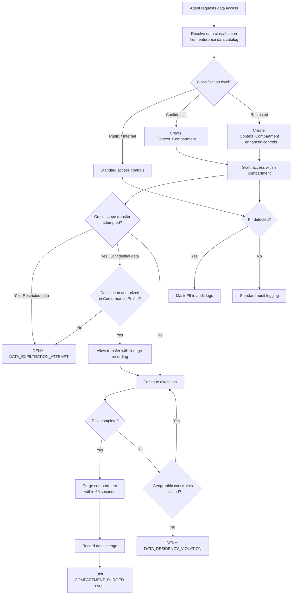

# EAAGF Specification — Data Governance and Privacy Standard

**Document ID:** EAAGF-SPEC-08  
**Version:** 1.0.0  
**Status:** Draft  
**Last Updated:** 2025-07-14  
**Owner:** AI Governance Team

---

## 1. Purpose

This document defines the normative standard for data governance and privacy within the Enterprise AI Agent Governance Framework (EAAGF). It specifies how the Governance_Controller enforces enterprise data classification policies, creates and manages Context_Compartments for sensitive data isolation, detects and masks PII, enforces geographic data residency constraints, handles data subject deletion requests, and integrates with enterprise data catalogs.

Data governance is the mechanism by which the enterprise ensures that AI agents respect data classification boundaries, compartmentalize sensitive information within task contexts, and comply with privacy regulations including GDPR and CCPA. These controls prevent unauthorized data exposure, cross-contamination of sensitive data between agent tasks, and data exfiltration beyond authorized scopes.

The key words "MUST", "MUST NOT", "REQUIRED", "SHALL", "SHALL NOT", "SHOULD", "SHOULD NOT", "RECOMMENDED", "MAY", and "OPTIONAL" in this document are to be interpreted as described in [RFC 2119](https://www.rfc-editor.org/rfc/rfc2119).

---

## 2. Scope

This standard applies to:

- All AI agents deployed on any enterprise-supported platform (Databricks, Salesforce AgentForce, Snowflake Cortex, Microsoft Copilot Studio, AWS Bedrock, Azure AI Foundry, GCP Vertex AI)
- The Governance_Controller component and its data governance enforcement interfaces
- The Context_Compartment isolation mechanism
- The PII detection and masking pipeline
- All teams that develop, deploy, or operate AI agents within the enterprise

For related standards, see:

| Related Domain | Document |
|---|---|
| Agent Identity | [02 — Agent Identity Standard](./02-agent-identity-standard.md) |
| Risk Classification | [03 — Risk Classification Standard](./03-risk-classification-standard.md) |
| Authorization | [04 — Authorization Standard](./04-authorization-standard.md) |
| Observability | [05 — Observability Standard](./05-observability-standard.md) |
| Human Oversight | [06 — Human Oversight Standard](./06-human-oversight-standard.md) |
| Interoperability | [07 — Interoperability Standard](./07-interoperability-standard.md) |
| Security | [09 — Security Standard](./09-security-standard.md) |
| Compliance | [10 — Compliance Standard](./10-compliance-standard.md) |

---

## 3. Data Classification Enforcement

### 3.1 Classification Label Enforcement

The Governance_Controller SHALL enforce data classification labels on all data accessed by agents, aligned with the enterprise data classification policy.

**Normative rules:**

1. The Governance_Controller SHALL recognize and enforce four data classification levels, ordered from least to most sensitive:
   - **Public** — Data intended for unrestricted distribution.
   - **Internal** — Data intended for use within the enterprise but not publicly available.
   - **Confidential** — Sensitive business data requiring access controls and compartmentalization.
   - **Restricted** — Highly sensitive data (PII, financial, regulated) requiring the strictest controls.
2. Every data resource accessed by an agent SHALL have a classification label resolved at the time of access. The classification label SHALL be resolved using one of the following mechanisms, in order of precedence:
   a. **Enterprise data catalog** — Classification labels retrieved from integrated data catalogs (Apache Atlas, Collibra, Alation) as defined in Section 11.
   b. **Resource metadata** — Classification labels embedded in the resource's metadata (e.g., database column tags, object storage metadata).
   c. **Conformance_Profile declaration** — Classification labels declared in the agent's `data_classifications_accessed` field.
   d. **Default classification** — If no classification can be resolved, the resource SHALL be treated as **Confidential** (fail-closed).
3. The resolved classification label SHALL be included in the audit event as the `eaagf.data.classification` attribute, as defined in [05 — Observability Standard](./05-observability-standard.md), Section 5.
4. The Governance_Controller SHALL deny access to any data resource whose classification level exceeds the maximum classification declared in the agent's Conformance_Profile (`data_classifications_accessed` field). For example, an agent that declares access to `["PUBLIC", "INTERNAL"]` SHALL be denied access to Confidential or Restricted data.
5. Classification labels SHALL be immutable for the duration of an agent task. If a resource's classification changes during task execution, the change SHALL take effect on the next task execution, not the current one.

> **Validates: Requirement 7.1** — THE Governance_Controller SHALL enforce data classification labels (Public, Internal, Confidential, Restricted) on all data accessed by agents, aligned with the enterprise data classification policy.

---

## 4. Context Compartment Creation and Isolation

### 4.1 Mandatory Compartmentalization for Sensitive Data

WHEN an agent accesses data classified as Confidential or Restricted, the Governance_Controller SHALL create a Context_Compartment that isolates that data from other concurrent agent tasks.

**Normative rules:**

1. A Context_Compartment is a logical isolation boundary that prevents data from one agent task from being accessible to other concurrent agent tasks, other agents, or other platform processes.
2. The Governance_Controller SHALL automatically create a Context_Compartment when an agent accesses data classified as Confidential or Restricted. Compartment creation SHALL occur before the data is delivered to the agent's execution context.
3. Each Context_Compartment SHALL be uniquely identified by a compartment ID (UUID v4) and SHALL be associated with exactly one agent task execution (identified by `eaagf.task.id`).
4. Data within a Context_Compartment SHALL be accessible only to the agent task that created the compartment. No other agent, task, or process SHALL be able to read, write, or reference data within the compartment.
5. Context_Compartments SHALL enforce the following isolation guarantees:
   - **Memory isolation** — Compartment data SHALL NOT be accessible via shared memory, global variables, or cross-task references.
   - **Storage isolation** — Compartment data written to temporary storage SHALL be encrypted at rest and accessible only via the compartment's access token.
   - **Network isolation** — Compartment data SHALL NOT be transmittable outside the compartment boundary without explicit authorization (see Section 5).
6. An agent MAY have multiple active Context_Compartments within a single task execution if it accesses data from multiple sensitive sources. Each compartment SHALL be independently managed.
7. The Governance_Controller SHALL emit a `COMPARTMENT_CREATED` audit event when a new Context_Compartment is created, including the compartment ID, agent ID, task ID, and the data classification level that triggered the compartment.
8. Agents that declare `context_compartments` in their Conformance_Profile SHALL have those compartments pre-created at task start. Additional compartments MAY be created dynamically during task execution as the agent accesses new sensitive data sources.

> **Validates: Requirement 7.2** — WHEN an agent accesses data classified as Confidential or Restricted, THE Governance_Controller SHALL create a Context_Compartment that isolates that data from other concurrent agent tasks.

---

## 5. Cross-Scope Transfer Blocking

### 5.1 Restricted Data Exfiltration Prevention

IF an agent attempts to pass Restricted data to an external system or another agent outside its authorized scope, THEN the Governance_Controller SHALL block the transfer and emit a `DATA_EXFILTRATION_ATTEMPT` audit event.

**Normative rules:**

1. The Governance_Controller SHALL monitor all data egress from Context_Compartments containing Restricted data. Egress includes:
   - Passing data to another agent via A2A delegation.
   - Sending data to an external system via API call or MCP tool invocation.
   - Writing data to a storage location outside the compartment boundary.
   - Including data in agent output delivered to end users.
   - Embedding data in logs, telemetry, or debugging output.
2. WHEN an agent attempts to transfer Restricted data outside its authorized scope, the Governance_Controller SHALL:
   a. Block the transfer immediately, before any data leaves the compartment boundary.
   b. Emit a `DATA_EXFILTRATION_ATTEMPT` audit event containing:
      - The agent ID and task ID.
      - The compartment ID from which the data was being transferred.
      - The intended destination (external system URI, target agent ID, or output channel).
      - The data classification level (Restricted).
      - The timestamp of the blocked transfer.
   c. Return a `DATA_EXFILTRATION_ATTEMPT` error to the agent with a sanitized error message that does not reveal the data content.
3. For Confidential data, cross-scope transfers SHALL be restricted but not unconditionally blocked. The Governance_Controller SHALL allow Confidential data transfers only when:
   - The destination agent or system has a Conformance_Profile that declares access to Confidential data.
   - The transfer is within the same Context_Compartment or to a compartment with equal or higher classification controls.
   - The transfer is explicitly authorized in the agent's Conformance_Profile (`approved_egress_endpoints`).
4. For Public and Internal data, cross-scope transfers SHALL be allowed subject to the standard egress controls defined in [04 — Authorization Standard](./04-authorization-standard.md), Section 5.
5. The Governance_Controller SHALL apply deep content inspection to detect Restricted data embedded within larger payloads (e.g., Restricted fields within an otherwise Internal dataset). If Restricted data is detected in a mixed payload, the entire payload SHALL be treated as Restricted for transfer purposes.

> **Validates: Requirement 7.3** — IF an agent attempts to pass Restricted data to an external system or another agent outside its authorized scope, THEN THE Governance_Controller SHALL block the transfer and emit a DATA_EXFILTRATION_ATTEMPT audit event.

---

## 6. PII Detection and Masking

### 6.1 PII Detection Pipeline

The Governance_Controller SHALL detect PII in agent inputs and outputs using a configurable PII detection pipeline and SHALL mask or redact PII in audit logs according to the enterprise data retention policy.

**Normative rules:**

1. The Governance_Controller SHALL operate a PII detection pipeline that scans agent inputs and outputs for personally identifiable information. The pipeline SHALL be applied to:
   - Agent action inputs before they are logged in audit events (`eaagf.action.input_summary`).
   - Agent action outputs before they are logged in audit events (`eaagf.action.output_summary`).
   - Reasoning chain summaries before they are logged (`eaagf.reasoning.chain_summary`).
   - Data written to Context_Compartments.
2. The PII detection pipeline SHALL detect the following PII categories at minimum:
   - **Direct identifiers** — Full names, email addresses, phone numbers, national identification numbers (SSN, NIN), passport numbers, driver's license numbers.
   - **Financial identifiers** — Credit card numbers, bank account numbers, tax identification numbers.
   - **Location identifiers** — Physical addresses, GPS coordinates (when associated with an individual).
   - **Digital identifiers** — IP addresses, device identifiers, biometric data hashes.
   - **Health identifiers** — Medical record numbers, health insurance identifiers.
3. The PII detection pipeline SHALL support configurable detection sensitivity. The default sensitivity level SHALL be **HIGH**, which prioritizes recall (detecting all PII) over precision (minimizing false positives). Teams MAY configure a **BALANCED** or **LOW** sensitivity level for specific use cases.
4. WHEN PII is detected in audit log fields, the Governance_Controller SHALL apply one of the following masking strategies, configurable per PII category:
   - **Redaction** — Replace the PII value with a redaction marker (e.g., `[REDACTED:EMAIL]`). This is the default strategy.
   - **Tokenization** — Replace the PII value with a reversible token that can be de-tokenized by authorized personnel for investigation purposes.
   - **Hashing** — Replace the PII value with a one-way hash (SHA-256) for correlation purposes without exposing the original value.
5. PII masking SHALL be applied before the audit event is written to the Audit_Log. Unmasked PII SHALL NOT be present in the immutable audit record.
6. The PII detection pipeline SHALL process inputs and outputs synchronously with the governance decision flow. PII detection latency SHALL NOT exceed 200 milliseconds per input/output pair under normal operating conditions.
7. The Governance_Controller SHALL maintain a PII detection audit trail that records: the number of PII instances detected per event, the PII categories detected, and the masking strategy applied. This metadata SHALL be included in the audit event but the PII values themselves SHALL NOT.
8. Conforming implementations SHALL support extending the PII detection pipeline with custom PII patterns specific to the enterprise (e.g., internal employee IDs, custom account number formats).

> **Validates: Requirement 7.4** — THE Governance_Controller SHALL detect PII in agent inputs and outputs using a configurable PII detection pipeline and SHALL mask or redact PII in audit logs according to the enterprise data retention policy.

---

## 7. Compartment Purge

### 7.1 60-Second Purge SLA

WHEN an agent task completes, the Governance_Controller SHALL purge all Confidential and Restricted data from the agent's active Context_Compartment within 60 seconds.

**Normative rules:**

1. The 60-second purge window begins at the timestamp when the agent task transitions to a terminal state (completed, failed, or terminated) and ends when all Confidential and Restricted data has been securely erased from the Context_Compartment.
2. "Securely erased" means the data is overwritten or cryptographically shredded such that it cannot be recovered. Simple deletion (removing file references) is NOT sufficient. Conforming implementations SHALL use one of the following erasure methods:
   - **Cryptographic shredding** — Destroy the encryption key used to encrypt compartment data at rest, rendering the encrypted data unrecoverable.
   - **Secure overwrite** — Overwrite the data storage with random bytes (minimum one pass).
3. The purge SHALL cover all data within the Context_Compartment, including:
   - Data in the agent's active memory or execution context.
   - Data written to temporary storage during task execution.
   - Cached copies of data held by Platform Adapters.
   - Intermediate computation results derived from Confidential or Restricted data.
4. The Governance_Controller SHALL emit a `COMPARTMENT_PURGED` audit event upon successful purge, including:
   - The compartment ID.
   - The agent ID and task ID.
   - The purge timestamp.
   - The purge method used (cryptographic shredding or secure overwrite).
   - The elapsed time from task completion to purge completion.
5. IF the purge cannot be completed within 60 seconds (e.g., due to storage system latency), the Governance_Controller SHALL:
   a. Immediately revoke all access tokens associated with the compartment, preventing any further reads.
   b. Continue the purge operation asynchronously.
   c. Emit a `COMPARTMENT_PURGE_DELAYED` alert with the compartment ID and the reason for the delay.
   d. Complete the purge within a maximum of 5 minutes. If the purge is still incomplete after 5 minutes, emit a `COMPARTMENT_PURGE_FAILED` security alert and notify the AI Governance Team.
6. Public and Internal data within a Context_Compartment MAY be retained after task completion for caching purposes, subject to the standard data retention policies. Only Confidential and Restricted data MUST be purged within the 60-second SLA.
7. The Governance_Controller SHALL track compartment purge metrics (p50, p95, p99 latency) and report them via the observability pipeline defined in [05 — Observability Standard](./05-observability-standard.md).

> **Validates: Requirement 7.5** — WHEN an agent task completes, THE Governance_Controller SHALL purge all Confidential and Restricted data from the agent's active Context_Compartment within 60 seconds.

---

## 8. Cross-Platform Data Lineage

### 8.1 Data Lineage Recording

The Governance_Controller SHALL maintain cross-platform data lineage records that track which agents accessed which data assets, enabling data impact analysis for compliance reporting.

**Normative rules:**

1. The Governance_Controller SHALL record a data lineage entry for every data access event, regardless of the data classification level. Each lineage entry SHALL include:
   - **Agent ID** — The agent that accessed the data.
   - **Data Asset URI** — The fully qualified URI of the data resource (e.g., `snowflake://db/schema/table`, `salesforce://sobject/Account`).
   - **Access Type** — The type of access performed (READ, WRITE, DELETE).
   - **Data Classification** — The classification label of the accessed data.
   - **Platform** — The platform on which the access occurred.
   - **Timestamp** — The UTC timestamp of the access.
   - **Task ID** — The task execution context in which the access occurred.
   - **Compartment ID** — The Context_Compartment ID, if applicable.
2. Data lineage records SHALL span across platforms. When an agent on Databricks reads data from Snowflake and writes results to Salesforce, the lineage SHALL capture the complete data flow across all three platforms.
3. The Governance_Controller SHALL support lineage queries that answer the following questions:
   - **Forward lineage** — "Which agents and systems consumed data from this asset?"
   - **Backward lineage** — "Where did the data in this agent's output originate?"
   - **Impact analysis** — "If this data asset is modified or deleted, which agents and downstream systems are affected?"
4. Data lineage records SHALL be retained for the same duration as audit records (minimum 7 years), as defined in [05 — Observability Standard](./05-observability-standard.md), Section 8.
5. The Governance_Controller SHALL publish data lineage events to the enterprise data catalog integration (Section 11) so that lineage information is available in the organization's centralized data governance tools.
6. Data lineage recording SHALL be asynchronous and SHALL NOT block the agent's data access path. Lineage events SHALL be buffered using the same WAL mechanism defined in [05 — Observability Standard](./05-observability-standard.md), Section 12, if the lineage backend is unavailable.

> **Validates: Requirement 7.6** — THE Governance_Controller SHALL maintain cross-platform data lineage records that track which agents accessed which data assets, enabling data impact analysis for compliance reporting.

---

## 9. GDPR/CCPA Data Residency Enforcement

### 9.1 Geographic Data Residency Constraints

WHERE an agent operates on data subject to GDPR or CCPA, the Governance_Controller SHALL enforce data residency constraints that prevent the data from being processed outside its authorized geographic region.

**Normative rules:**

1. The Governance_Controller SHALL enforce geographic data residency constraints based on the agent's Conformance_Profile (`geographic_constraints` field) and the data resource's residency requirements.
2. Geographic constraints SHALL be expressed as ISO 3166-1 alpha-2 country codes or recognized region identifiers (e.g., `EU`, `US`, `APAC`). The `EU` region identifier SHALL encompass all EU/EEA member states.
3. WHEN an agent attempts to access data with a geographic residency requirement, the Governance_Controller SHALL verify that:
   a. The agent's declared `geographic_constraints` include the data's required residency region.
   b. The platform on which the agent is executing is located within the data's required residency region.
   c. Any egress endpoints the agent may send data to are located within the required residency region.
4. IF any of the above conditions are not met, the Governance_Controller SHALL:
   a. Block the data access.
   b. Emit a `DATA_RESIDENCY_VIOLATION` audit event containing the agent ID, the data asset URI, the required residency region, and the violating condition.
   c. Return a `DATA_RESIDENCY_VIOLATION` error to the agent.
5. For GDPR-scoped data:
   - Data SHALL NOT be transferred outside the EU/EEA unless an adequate transfer mechanism is in place (e.g., Standard Contractual Clauses, adequacy decision).
   - The Governance_Controller SHALL flag agents that access GDPR-scoped data with the `GDPR_SCOPED` compliance flag in the Agent_Registry.
   - Cross-border transfers within the EU/EEA SHALL be permitted without additional authorization.
6. For CCPA-scoped data:
   - The Governance_Controller SHALL enforce that California resident data is processed in accordance with CCPA requirements.
   - The Governance_Controller SHALL flag agents that access CCPA-scoped data with the `CCPA_SCOPED` compliance flag in the Agent_Registry.
7. The Governance_Controller SHALL resolve geographic residency requirements from the enterprise data catalog (Section 11) or from resource metadata. If no residency requirement is specified, the data SHALL be treated as having no geographic constraint.
8. Platform Adapters SHALL report the geographic location of their execution environment to the Governance_Controller at registration time. This information SHALL be used to evaluate residency constraints at runtime.

> **Validates: Requirement 7.7** — WHERE an agent operates on data subject to GDPR or CCPA, THE Governance_Controller SHALL enforce data residency constraints that prevent the data from being processed outside its authorized geographic region.

---

## 10. Data Subject Deletion Handling

### 10.1 30-Day Deletion SLA

WHEN a data subject submits a deletion request, the Governance_Controller SHALL identify all agent audit records containing that subject's data and apply the appropriate retention or deletion policy within 30 days.

**Normative rules:**

1. The Governance_Controller SHALL support data subject deletion requests (GDPR Article 17 "Right to Erasure", CCPA "Right to Delete") through a standardized deletion request API.
2. WHEN a deletion request is received, the Governance_Controller SHALL:
   a. Acknowledge the request within 24 hours and assign a unique deletion request ID.
   b. Identify all audit records, lineage records, and compartment data that contain the data subject's PII. Identification SHALL use the PII tokenization or hashing records maintained by the PII detection pipeline (Section 6).
   c. Apply the appropriate action to each identified record within 30 calendar days of the request.
3. The appropriate action for each record type SHALL be:
   - **Audit records** — PII fields SHALL be redacted (replaced with `[DELETED:SUBJECT_REQUEST:<request_id>]`). The audit record structure, non-PII fields, and integrity chain SHALL be preserved. Full deletion of audit records is NOT permitted, as the audit trail must remain intact for governance purposes.
   - **Lineage records** — PII references SHALL be redacted. The lineage graph structure SHALL be preserved with anonymized references.
   - **Active compartment data** — If the data subject's data is in an active Context_Compartment, the compartment SHALL be purged immediately using the purge procedure in Section 7.
   - **Cached data** — All cached copies of the data subject's data SHALL be invalidated and purged.
4. The Governance_Controller SHALL emit a `DATA_SUBJECT_DELETION_COMPLETED` audit event when all identified records have been processed, including:
   - The deletion request ID.
   - The number of audit records redacted.
   - The number of lineage records redacted.
   - The number of compartments purged.
   - The total processing time.
5. IF the 30-day SLA cannot be met (e.g., due to the volume of records or cross-platform coordination complexity), the Governance_Controller SHALL:
   a. Notify the requesting data subject (via the enterprise privacy team) of the delay and the expected completion date.
   b. Emit a `DELETION_SLA_BREACH` alert and notify the AI Governance Team.
   c. Complete the deletion as soon as practicable.
6. The Governance_Controller SHALL maintain a deletion request log that records all deletion requests, their status (PENDING, IN_PROGRESS, COMPLETED, FAILED), and the actions taken. This log SHALL be available to the enterprise privacy team and external auditors.
7. Deletion requests SHALL be processed across all platforms. If a data subject's data was accessed by agents on multiple platforms, the Governance_Controller SHALL coordinate deletion across all affected Platform Adapters.

> **Validates: Requirement 7.8** — WHEN a data subject submits a deletion request, THE Governance_Controller SHALL identify all agent audit records containing that subject's data and apply the appropriate retention or deletion policy within 30 days.

---

## 11. Data Catalog Integration

### 11.1 Enterprise Data Catalog Integration

The Governance_Controller SHALL integrate with enterprise data catalogs to resolve data classification labels at runtime without requiring manual annotation by agent developers.

**Normative rules:**

1. The Governance_Controller SHALL support integration with the following enterprise data catalog platforms:
   - **Apache Atlas** — Via the Atlas REST API for classification and lineage metadata.
   - **Collibra** — Via the Collibra REST API for data governance and classification metadata.
   - **Alation** — Via the Alation REST API for data catalog and classification metadata.
2. The integration SHALL resolve the following metadata for each data resource at runtime:
   - **Data classification label** — The enterprise classification (Public, Internal, Confidential, Restricted).
   - **Geographic residency requirements** — The geographic regions where the data may be processed.
   - **Data owner** — The team or individual responsible for the data asset.
   - **PII indicators** — Whether the data asset is known to contain PII and the PII categories present.
   - **Regulatory scope** — Whether the data is subject to GDPR, CCPA, or other regulatory frameworks.
3. Classification labels resolved from the data catalog SHALL take precedence over labels declared in the agent's Conformance_Profile, as defined in Section 3.1, rule 2.
4. The Governance_Controller SHALL cache data catalog responses to minimize latency impact on the governance decision flow. The cache TTL SHALL be configurable (default: 5 minutes). Cache invalidation SHALL occur when the data catalog publishes a classification change event.
5. IF the data catalog is unavailable at the time of a data access request, the Governance_Controller SHALL:
   a. Use the cached classification if available and the cache has not expired.
   b. If no cached classification is available, apply the fail-closed default (treat the resource as Confidential) as defined in Section 3.1, rule 2d.
   c. Emit a `DATA_CATALOG_UNAVAILABLE` alert.
6. The Governance_Controller SHALL publish agent data access events back to the data catalog to enrich the catalog's lineage and usage metadata. This enables the data catalog to show which agents access which data assets.
7. Conforming implementations SHALL support configuring multiple data catalog integrations simultaneously (e.g., Atlas for one platform, Collibra for another). The Governance_Controller SHALL route catalog queries to the appropriate integration based on the data resource's platform or URI prefix.
8. Authentication to data catalog APIs SHALL use enterprise identity provider credentials (service accounts or managed identities) and SHALL follow the least-privilege principle.

> **Validates: Requirement 7.9** — THE Governance_Controller SHALL integrate with enterprise data catalogs (Apache Atlas, Collibra, Alation) to resolve data classification labels at runtime without requiring manual annotation by agent developers.

---

## 12. Mixed-Classification Context Rules

### 12.1 Highest Classification Enforcement

IF an agent's prompt or context window contains data from multiple classification levels, THEN the Governance_Controller SHALL apply the highest classification level's controls to the entire context.

**Normative rules:**

1. When an agent's execution context (prompt, context window, working memory) contains data from multiple classification levels, the Governance_Controller SHALL determine the effective classification as the maximum classification level present. The classification hierarchy from lowest to highest is: Public < Internal < Confidential < Restricted.
2. The effective classification SHALL govern all controls applied to the entire context, including:
   - **Compartmentalization** — If any data in the context is Confidential or Restricted, the entire context SHALL be placed in a Context_Compartment (Section 4).
   - **Cross-scope transfer rules** — The transfer rules for the highest classification level SHALL apply to all data in the context (Section 5).
   - **PII masking** — PII masking rules for the highest classification level SHALL apply to all audit log entries for the context (Section 6).
   - **Purge requirements** — The purge SLA for the highest classification level SHALL apply to the entire context (Section 7).
   - **Geographic constraints** — The most restrictive geographic constraints from any data in the context SHALL apply to the entire context (Section 9).
3. The Governance_Controller SHALL evaluate the effective classification at the following points:
   - **Task initialization** — When the agent's initial context is assembled from declared data sources.
   - **Dynamic data access** — Each time the agent accesses a new data resource during task execution. If the new resource has a higher classification than the current effective classification, the effective classification SHALL be upgraded immediately.
   - **Agent delegation** — When data is passed to a delegated agent via A2A, the effective classification of the delegated context SHALL be at least as high as the source context.
4. Classification upgrades are one-way within a task execution. Once the effective classification is elevated (e.g., from Internal to Confidential), it SHALL NOT be downgraded for the remainder of the task, even if the higher-classified data is no longer actively referenced.
5. The Governance_Controller SHALL emit a `CLASSIFICATION_ELEVATED` audit event when the effective classification of an agent's context is upgraded, including:
   - The agent ID and task ID.
   - The previous effective classification.
   - The new effective classification.
   - The data resource that triggered the elevation.
6. Agents SHOULD minimize mixed-classification contexts by declaring separate Context_Compartments for data at different classification levels in their Conformance_Profile. The Governance_Controller SHALL support agents that maintain multiple compartments with different classification levels within a single task.

> **Validates: Requirement 7.10** — IF an agent's prompt or context window contains data from multiple classification levels, THEN THE Governance_Controller SHALL apply the highest classification level's controls to the entire context.

---

## 13. Data Classification Controls Summary

The following table summarizes the controls applied at each data classification level. This table is the authoritative reference for determining which governance controls are enforced based on data classification.

| Control | Public | Internal | Confidential | Restricted |
|---|---|---|---|---|
| **Compartment Required** | No | No | Yes | Yes |
| **Cross-Scope Transfer** | Allowed | Allowed | Restricted (authorized destinations only) | Blocked |
| **PII Masking in Audit Logs** | If PII detected | If PII detected | Required | Required |
| **Geographic Constraints** | None | None | If GDPR/CCPA scoped | Enforced |
| **Purge on Task Completion** | Not required | Not required | Required (60-second SLA) | Required (60-second SLA) |
| **Deep Content Inspection** | Not required | Not required | Recommended | Required |
| **Data Lineage Recording** | Required | Required | Required | Required |
| **Data Catalog Resolution** | Recommended | Recommended | Required | Required |
| **Encryption at Rest** | Recommended | Required | Required | Required |
| **Encryption in Transit** | Required (TLS 1.2+) | Required (TLS 1.2+) | Required (TLS 1.3) | Required (TLS 1.3 + mTLS) |

---

## 14. Data Governance Decision Flow

The following diagram illustrates the end-to-end data governance decision flow, from data access request through classification resolution, compartmentalization, cross-scope transfer evaluation, PII detection, and compartment purge. For the full rendered diagram, see [Data Governance Flow](../flows/data-governance-flow.md).

---

## 15. Normative References

| Reference | Description |
|---|---|
| [RFC 2119](https://www.rfc-editor.org/rfc/rfc2119) | Key words for use in RFCs to Indicate Requirement Levels |
| [GDPR](https://gdpr-info.eu/) | General Data Protection Regulation (EU) 2016/679 |
| [CCPA](https://oag.ca.gov/privacy/ccpa) | California Consumer Privacy Act |
| [ISO 27001](https://www.iso.org/standard/27001) | Information Security Management Systems |
| [NIST SP 800-188](https://csrc.nist.gov/publications/detail/sp/800-188/final) | De-Identifying Government Datasets |
| [04 — Authorization Standard](./04-authorization-standard.md) | EAAGF Authorization and Least Privilege Standard |
| [05 — Observability Standard](./05-observability-standard.md) | EAAGF Observability and Audit Trail Standard |
| [06 — Human Oversight Standard](./06-human-oversight-standard.md) | EAAGF Human Oversight Controls Standard |

---

## 16. Revision History

| Version | Date | Author | Description |
|---|---|---|---|
| 1.0.0 | 2025-07-14 | AI Governance Team | Initial release |