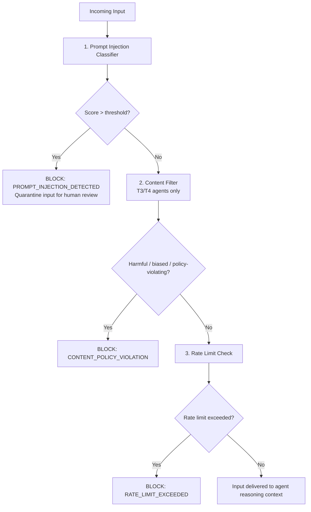
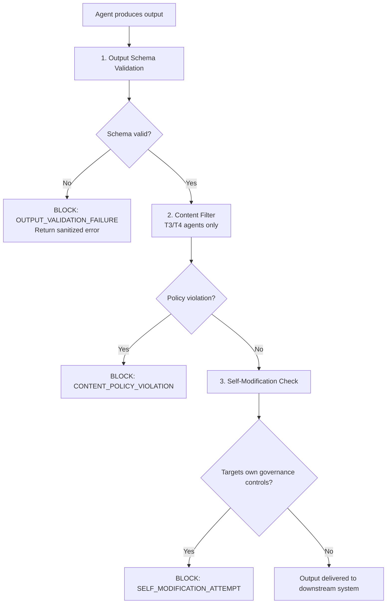

# EAAGF Specification — Security Controls Standard

**Document ID:** EAAGF-SPEC-09  
**Version:** 1.0.0  
**Status:** Draft  
**Last Updated:** 2025-07-14  
**Owner:** AI Governance Team

---

## 1. Purpose

This document defines the normative standard for security controls within the Enterprise AI Agent Governance Framework (EAAGF). It specifies how the Governance_Controller defends agents against prompt injection attacks, validates agent inputs and outputs, enforces sandbox isolation for high-risk agents, applies rate limiting, detects anomalous behavior, prevents agent self-modification, filters harmful content, integrates with enterprise SIEM/SOAR platforms, and requires security scan attestations before production deployment.

Security controls form the defense-in-depth layer that protects the enterprise from compromised, manipulated, or misbehaving agents. These controls operate at agent action boundaries — inspecting inputs before they reach the agent's reasoning context and validating outputs before they are delivered to downstream systems or users.

The key words "MUST", "MUST NOT", "REQUIRED", "SHALL", "SHALL NOT", "SHOULD", "SHOULD NOT", "RECOMMENDED", "MAY", and "OPTIONAL" in this document are to be interpreted as described in [RFC 2119](https://www.rfc-editor.org/rfc/rfc2119).

---

## 2. Scope

This standard applies to:

- All AI agents deployed on any enterprise-supported platform (Databricks, Salesforce AgentForce, Snowflake Cortex, Microsoft Copilot Studio, AWS Bedrock, Azure AI Foundry, GCP Vertex AI)
- The Governance_Controller component and its security enforcement interfaces
- The prompt injection detection classifier
- The output schema validation pipeline
- The content filtering pipeline for T3 and T4 agents
- The rate limiting and anomaly detection subsystems
- All teams that develop, deploy, or operate AI agents within the enterprise

For related standards, see:

| Related Domain | Document |
|---|---|
| Agent Identity | [02 — Agent Identity Standard](./02-agent-identity-standard.md) |
| Risk Classification | [03 — Risk Classification Standard](./03-risk-classification-standard.md) |
| Authorization | [04 — Authorization Standard](./04-authorization-standard.md) |
| Observability | [05 — Observability Standard](./05-observability-standard.md) |
| Human Oversight | [06 — Human Oversight Standard](./06-human-oversight-standard.md) |
| Interoperability | [07 — Interoperability Standard](./07-interoperability-standard.md) |
| Data Governance | [08 — Data Governance Standard](./08-data-governance-standard.md) |
| Compliance | [10 — Compliance Standard](./10-compliance-standard.md) |

---

## 3. Security Control Chain

### 3.1 Defense-in-Depth Architecture

The Governance_Controller SHALL apply security controls as a sequential chain at agent action boundaries. Every external input passes through the inbound security chain before reaching the agent, and every agent output passes through the outbound security chain before delivery to downstream systems.

The security control chain operates in the following order:

#### Inbound Security Chain (Input Processing)



#### Outbound Security Chain (Output Processing)



**Normative rules:**

1. The security control chain SHALL be applied to every agent action, regardless of Risk Tier. Specific controls within the chain MAY be conditionally applied based on Risk Tier (e.g., content filtering for T3/T4 only), but the chain itself SHALL always execute.
2. The security control chain SHALL execute synchronously with the governance decision flow. The chain MUST complete before the action result is returned to the agent or the agent's output is delivered downstream.
3. IF any control in the chain produces a BLOCK decision, the chain SHALL halt immediately. Subsequent controls in the chain SHALL NOT execute. The BLOCK decision and its reason code SHALL be returned to the Governance_Controller for audit event emission.
4. Each control in the chain SHALL emit its evaluation result (pass/block) and relevant metadata to the Telemetry_Emitter for inclusion in the audit event. Security-specific attributes SHALL use the `eaagf.security.*` namespace.
5. The total latency of the complete security control chain (inbound + outbound) SHALL NOT exceed 1,000 milliseconds under normal operating conditions. Conforming implementations SHALL monitor and report p50, p95, and p99 chain latency.

---

## 4. Prompt Injection Detection

### 4.1 Prompt Injection Classifier

The Governance_Controller SHALL apply a prompt injection detection classifier to all external inputs before they reach an agent's reasoning context, and SHALL block inputs with a confidence score above a configurable threshold (default: 0.85).

**Normative rules:**

1. The Governance_Controller SHALL operate a prompt injection detection classifier that evaluates all external inputs destined for an agent's reasoning context. "External inputs" include:
   - User-provided prompts and messages.
   - Data retrieved from external systems via MCP tool calls.
   - Inputs received from other agents via A2A delegation.
   - Content fetched from external APIs or web endpoints.
2. The classifier SHALL produce a confidence score between 0.0 (no injection detected) and 1.0 (high confidence injection detected) for each evaluated input.
3. The blocking threshold SHALL be configurable per agent via the agent's Conformance_Profile. The default threshold SHALL be **0.85**. Teams MAY lower the threshold for higher sensitivity or raise it to reduce false positives, subject to AI Governance Team approval for thresholds above 0.90.
4. WHEN the classifier's confidence score exceeds the configured threshold, the Governance_Controller SHALL:
   a. Block the input immediately, preventing it from reaching the agent's reasoning context.
   b. Emit a `PROMPT_INJECTION_DETECTED` security event containing:
      - The agent ID and task ID.
      - The classifier confidence score.
      - A sanitized summary of the input (with PII redacted per [08 — Data Governance Standard](./08-data-governance-standard.md)).
      - The configured threshold that was exceeded.
      - The input source (user, MCP tool, A2A delegation, external API).
   c. Quarantine the input for human review. Quarantined inputs SHALL be stored in a secure, access-controlled location accessible only to the AI Governance Team and the agent's owning team.
   d. Return a sanitized error to the agent indicating that the input was blocked for security reasons, without revealing the specific detection logic or threshold.
5. The classifier confidence score SHALL be recorded in the audit event as the `eaagf.security.prompt_injection_score` attribute for all evaluated inputs, regardless of whether the threshold was exceeded. This enables retrospective analysis of near-miss detections.
6. The classifier SHALL be updated periodically (at minimum quarterly) to incorporate new prompt injection techniques and attack patterns. Updates SHALL be deployed without requiring agent restarts.
7. Conforming implementations SHALL support configuring the classifier model or service endpoint, enabling enterprises to use their preferred prompt injection detection solution (e.g., custom ML models, third-party detection APIs, rule-based systems).
8. The classifier evaluation latency SHALL NOT exceed 200 milliseconds per input under normal operating conditions.

> **Validates: Requirement 8.1** — THE Governance_Controller SHALL apply a prompt injection detection classifier to all external inputs before they reach an agent's reasoning context, and SHALL block inputs with a confidence score above a configurable threshold (default: 0.85).

> **Validates: Requirement 8.2** — WHEN a prompt injection attempt is detected, THE Governance_Controller SHALL emit a PROMPT_INJECTION_DETECTED security event and quarantine the input for human review.

---

## 5. Output Schema Validation

### 5.1 Mandatory Output Validation

The Governance_Controller SHALL validate all agent outputs against a configurable output schema before the output is delivered to downstream systems or users.

**Normative rules:**

1. Every agent SHALL declare an output schema in its Conformance_Profile that defines the expected structure, data types, and constraints of its outputs. The output schema SHALL be expressed in JSON Schema (draft 2020-12 or later).
2. The Governance_Controller SHALL validate every agent output against the declared output schema before the output is delivered to any downstream system, user, or calling agent.
3. WHEN an agent output fails schema validation, the Governance_Controller SHALL:
   a. Block delivery of the output to the downstream consumer.
   b. Emit an `OUTPUT_VALIDATION_FAILURE` audit event containing:
      - The agent ID and task ID.
      - The validation errors (field paths, expected types, constraint violations).
      - A sanitized summary of the non-conforming output (with PII redacted).
      - The schema version that was used for validation.
   c. Return a sanitized error to the caller indicating that the agent's output did not conform to its declared schema. The error SHALL NOT include the raw output content.
4. Output schema validation SHALL check the following at minimum:
   - **Structural conformance** — The output matches the declared JSON structure (required fields present, no unexpected fields if `additionalProperties: false`).
   - **Type conformance** — Field values match their declared types (string, number, boolean, array, object).
   - **Constraint conformance** — Field values satisfy declared constraints (minLength, maxLength, pattern, minimum, maximum, enum).
   - **Size limits** — The total output size does not exceed the declared maximum (default: 1 MB).
5. Agents that produce unstructured text output (e.g., natural language responses) SHALL declare a minimal output schema that enforces size limits and content type. Unstructured outputs are NOT exempt from validation.
6. Output schema validation latency SHALL NOT exceed 100 milliseconds per output under normal operating conditions.
7. WHEN an agent's output schema is updated (e.g., due to a new agent version), the Governance_Controller SHALL apply the updated schema to all subsequent outputs within 30 seconds, consistent with the policy hot-reload mechanism defined in [04 — Authorization Standard](./04-authorization-standard.md).

> **Validates: Requirement 8.3** — THE Governance_Controller SHALL validate all agent outputs against a configurable output schema before the output is delivered to downstream systems or users.

> **Validates: Requirement 8.4** — WHEN an agent output fails schema validation, THE Governance_Controller SHALL block delivery, emit an OUTPUT_VALIDATION_FAILURE audit event, and return a sanitized error to the caller.

---

## 6. Sandbox Isolation

### 6.1 T3/T4 Sandbox Enforcement

The Governance_Controller SHALL enforce sandbox isolation for T3 and T4 agents, ensuring that agent execution cannot access host system resources, environment variables, or network interfaces outside the declared allowlist.

**Normative rules:**

1. All agents classified as T3 (Autonomous) or T4 (Critical) SHALL execute within a sandbox environment that provides the following isolation guarantees:
   - **Process isolation** — The agent's execution process SHALL be isolated from other processes on the host system. The agent SHALL NOT be able to read, write, or signal other processes.
   - **Filesystem isolation** — The agent SHALL NOT have access to the host filesystem beyond a designated working directory. The working directory SHALL be ephemeral and purged on task completion.
   - **Environment variable isolation** — The agent SHALL NOT have access to host environment variables. Only environment variables explicitly declared in the agent's Conformance_Profile SHALL be available within the sandbox.
   - **Network isolation** — The agent SHALL NOT have access to network interfaces beyond those required to communicate with the Governance_Controller and the endpoints declared in the agent's `approved_egress_endpoints`. All other network access SHALL be blocked at the sandbox boundary.
2. The sandbox SHALL enforce resource limits to prevent denial-of-service conditions:
   - **CPU** — Configurable CPU time limit per task execution (default: 300 seconds for T3, 600 seconds for T4).
   - **Memory** — Configurable memory limit per task execution (default: 2 GB for T3, 4 GB for T4).
   - **Disk** — Configurable temporary disk space limit (default: 1 GB).
   - **Network bandwidth** — Configurable egress bandwidth limit (default: 10 MB/s).
3. IF an agent attempts to access a resource outside the sandbox boundary (host filesystem, unauthorized network endpoint, host environment variable), the sandbox SHALL:
   a. Block the access attempt.
   b. Report the violation to the Governance_Controller.
   c. The Governance_Controller SHALL emit a `SANDBOX_VIOLATION` security event containing the agent ID, the type of violation (filesystem, network, environment), and the target resource.
4. T1 and T2 agents are NOT required to execute in a sandbox, but conforming implementations MAY apply sandbox isolation to T1/T2 agents as an additional security measure.
5. Platform Adapters SHALL implement sandbox isolation using platform-appropriate mechanisms:
   - **Container-based platforms** (Databricks, AWS Bedrock, GCP Vertex AI): Container isolation with restricted capabilities (no `CAP_SYS_ADMIN`, no `CAP_NET_RAW`), read-only root filesystem, and network policies.
   - **Managed platforms** (Salesforce AgentForce, Snowflake Cortex, Microsoft Copilot Studio): Platform-native isolation mechanisms supplemented by Governance_Controller egress enforcement.
   - **Hybrid platforms** (Azure AI Foundry): Combination of container isolation and platform-native controls.
6. The Governance_Controller SHALL verify sandbox integrity at agent startup. If the sandbox cannot be established or verified, the agent SHALL NOT be permitted to execute.
7. Sandbox configuration SHALL be immutable during task execution. Changes to sandbox parameters SHALL require a new task execution.

> **Validates: Requirement 8.5** — THE Governance_Controller SHALL enforce sandbox isolation for T3 and T4 agents, ensuring that agent execution cannot access host system resources, environment variables, or network interfaces outside the declared allowlist.

---

## 7. Rate Limiting

### 7.1 Action Rate Limiting

WHEN an agent's action rate exceeds a configurable threshold, the Governance_Controller SHALL throttle the agent and emit a `RATE_LIMIT_EXCEEDED` audit event.

**Normative rules:**

1. The Governance_Controller SHALL enforce per-agent action rate limits based on the agent's Risk Tier. The default rate limits are:

#### Rate Limiting Rules

| Risk Tier | Default Max Actions/Minute | Burst Allowance | Breach Action |
|---|---|---|---|
| T1 (Informational) | 100 | 120 (20% burst) | Throttle + `RATE_LIMIT_EXCEEDED` event |
| T2 (Transactional) | 100 | 120 (20% burst) | Throttle + `RATE_LIMIT_EXCEEDED` event |
| T3 (Autonomous) | 20 | 25 (25% burst) | Throttle + `RATE_LIMIT_EXCEEDED` event |
| T4 (Critical) | 20 | 25 (25% burst) | Throttle + `RATE_LIMIT_EXCEEDED` event |

2. Rate limits SHALL be evaluated using a sliding window algorithm with a 60-second window. The window SHALL slide in 1-second increments.
3. Teams MAY request custom rate limits for specific agents by updating the agent's Conformance_Profile (`max_actions_per_minute` field). Custom rate limits SHALL NOT exceed the tier default without AI Governance Team approval.
4. WHEN an agent's action rate exceeds the configured threshold (including burst allowance), the Governance_Controller SHALL:
   a. Throttle the agent by queuing or rejecting subsequent action requests until the rate drops below the threshold.
   b. Emit a `RATE_LIMIT_EXCEEDED` audit event containing:
      - The agent ID and task ID.
      - The current action rate (actions per minute).
      - The configured threshold.
      - The Risk Tier.
      - The number of actions throttled or rejected.
   c. Return a `RATE_LIMIT_EXCEEDED` error to the agent with a `Retry-After` header indicating the number of seconds before the agent may retry.
5. Rate limiting SHALL be applied per agent instance. If multiple instances of the same agent are running concurrently, each instance SHALL have its own rate limit counter.
6. The following action types SHALL count toward the rate limit:
   - Tool calls (MCP invocations).
   - Data access operations (read/write).
   - Agent delegation requests (A2A).
   - External connection attempts.
7. The following SHALL NOT count toward the rate limit:
   - Governance_Controller health checks.
   - Credential rotation operations.
   - Audit event emissions.
8. Rate limit counters SHALL reset when an agent task completes or times out.

> **Validates: Requirement 8.6** — WHEN an agent's action rate exceeds a configurable threshold (default: 100 actions/minute for T1/T2, 20 actions/minute for T3/T4), THE Governance_Controller SHALL throttle the agent and emit a RATE_LIMIT_EXCEEDED audit event.

---

## 8. Anomaly Detection

### 8.1 Behavioral Anomaly Monitoring

The Governance_Controller SHALL monitor agent behavior for anomaly patterns and SHALL alert the AI Governance Team when anomaly scores exceed a configurable threshold.

**Normative rules:**

1. The Governance_Controller SHALL continuously monitor agent behavior across the following dimensions:
   - **Data access volume** — The volume of data accessed by an agent within a time window, compared to the agent's historical baseline.
   - **External connection patterns** — The frequency and destination of outbound connections, compared to the agent's declared `approved_egress_endpoints`.
   - **Permission denial frequency** — The rate of permission denials (PERMISSION_NOT_DECLARED, COMPARTMENT_VIOLATION), which may indicate probing or misconfiguration.
   - **Action pattern deviation** — Changes in the agent's action sequence patterns compared to its historical behavior (e.g., an agent that normally performs read-only operations suddenly attempting writes).
   - **Temporal anomalies** — Agent activity outside expected operating hours or in unusual geographic regions.
   - **Error rate spikes** — Sudden increases in output validation failures, schema errors, or blocked actions.
2. The Governance_Controller SHALL compute an anomaly score for each monitored agent. The anomaly score SHALL be a normalized value between 0.0 (normal behavior) and 1.0 (highly anomalous behavior).
3. WHEN an agent's anomaly score exceeds the configured threshold (default: 0.75), the Governance_Controller SHALL:
   a. Emit an `ANOMALY_DETECTED` security alert containing:
      - The agent ID and current task ID.
      - The anomaly score.
      - The anomaly dimensions that contributed to the score (e.g., "data_access_volume: 0.9, permission_denial_frequency: 0.8").
      - The agent's Risk Tier.
      - A recommended action (MONITOR, THROTTLE, SUSPEND).
   b. Notify the AI Governance Team via the configured alerting channels.
   c. For T3 and T4 agents, automatically trigger a Human_Oversight_Gate with reason code `ANOMALY_DETECTED` if the anomaly score exceeds 0.90.
4. The anomaly detection baseline SHALL be established during the agent's first 7 days of operation in PRODUCTION. During the baseline period, anomaly alerts SHALL be generated but SHALL NOT trigger automatic enforcement actions.
5. The anomaly detection model SHALL be updated continuously as the agent's behavior evolves. Baseline recalculation SHALL occur at minimum every 30 days.
6. Anomaly detection SHALL operate asynchronously and SHALL NOT add latency to the governance decision path. Anomaly scores SHALL be computed from the audit event stream, not inline with action processing.
7. Teams MAY configure custom anomaly thresholds for specific agents via the Conformance_Profile. Custom thresholds below 0.50 SHALL require AI Governance Team approval to prevent alert fatigue.

> **Validates: Requirement 8.7** — THE Governance_Controller SHALL monitor agent behavior for anomaly patterns (unusual data access volumes, unexpected external connections, repeated permission denials) and SHALL alert the AI Governance Team when anomaly scores exceed a configurable threshold.

---

## 9. Self-Modification Prevention

### 9.1 Governance Control Immutability

IF an agent attempts to modify its own Conformance_Profile, Risk_Tier, or governance controls, THEN the Governance_Controller SHALL deny the action and emit a `SELF_MODIFICATION_ATTEMPT` security event.

**Normative rules:**

1. The Governance_Controller SHALL detect and block any agent action that targets the agent's own governance configuration. The following are classified as self-modification attempts:
   - Modifying the agent's own Conformance_Profile (permissions, approved endpoints, oversight mode, rate limits, compartments).
   - Changing the agent's Risk_Tier classification.
   - Altering the agent's oversight mode (e.g., changing from APPROVAL_REQUIRED to FULL_AUTO).
   - Modifying the agent's credential TTL or session duration.
   - Updating the agent's approved MCP server list or egress allowlist.
   - Changing the agent's lifecycle state (e.g., promoting itself from STAGING to PRODUCTION).
   - Modifying any Policy_Engine rules that apply to the agent.
2. WHEN a self-modification attempt is detected, the Governance_Controller SHALL:
   a. Deny the action immediately.
   b. Emit a `SELF_MODIFICATION_ATTEMPT` security event containing:
      - The agent ID and task ID.
      - The type of modification attempted (e.g., "conformance_profile_update", "risk_tier_change", "oversight_mode_change").
      - The target field or resource the agent attempted to modify.
      - The current value and the attempted new value (if determinable).
   c. Notify the AI Governance Team if the agent is classified as T3 or T4.
   d. Return a `SELF_MODIFICATION_ATTEMPT` error to the agent.
3. Self-modification detection SHALL apply regardless of the mechanism used:
   - Direct API calls to the Agent_Registry or Policy_Engine.
   - MCP tool invocations that target governance configuration endpoints.
   - A2A delegation to another agent with instructions to modify the originating agent's configuration.
   - SQL or data manipulation operations targeting governance data stores.
4. Governance configuration changes SHALL only be permitted through authorized human-initiated workflows:
   - Conformance_Profile updates: Submitted by the owning team and validated by the Governance_Controller.
   - Risk_Tier changes: Triggered by re-classification (see [03 — Risk Classification Standard](./03-risk-classification-standard.md)).
   - Oversight mode changes: Authorized by the AI Governance Team for T3/T4 agents.
5. The self-modification check SHALL be applied as part of the outbound security chain (Section 3) and SHALL also be applied to A2A delegation requests where the target of the delegated task is the originating agent's governance configuration.

> **Validates: Requirement 8.8** — IF an agent attempts to modify its own Conformance_Profile, Risk_Tier, or governance controls, THEN THE Governance_Controller SHALL deny the action and emit a SELF_MODIFICATION_ATTEMPT security event.

---

## 10. Content Filtering

### 10.1 T3/T4 Input and Output Content Filtering

The Governance_Controller SHALL perform input/output content filtering for T3 and T4 agents to detect and block harmful, biased, or policy-violating content before it enters or exits the agent.

**Normative rules:**

1. Content filtering SHALL be applied to all T3 (Autonomous) and T4 (Critical) agents. T1 and T2 agents are NOT subject to mandatory content filtering, but conforming implementations MAY apply content filtering to T1/T2 agents as an optional security measure.
2. The content filter SHALL evaluate both inbound inputs (before they reach the agent's reasoning context) and outbound outputs (before they are delivered to downstream systems or users).
3. The content filter SHALL detect and block the following content categories:
   - **Harmful content** — Content that promotes violence, self-harm, illegal activities, or exploitation.
   - **Biased content** — Content that exhibits discriminatory bias based on protected characteristics (race, gender, religion, disability, age, sexual orientation).
   - **Policy-violating content** — Content that violates enterprise-specific content policies (e.g., unauthorized disclosure of trade secrets, competitive intelligence, or internal strategy).
   - **Manipulative content** — Content designed to manipulate agent behavior through social engineering, jailbreaking, or role-playing attacks (complementing the prompt injection classifier in Section 4).
4. WHEN the content filter detects policy-violating content, the Governance_Controller SHALL:
   a. Block the content (input or output) from proceeding through the security chain.
   b. Emit a `CONTENT_POLICY_VIOLATION` security event containing:
      - The agent ID and task ID.
      - The content direction (INBOUND or OUTBOUND).
      - The violation category (HARMFUL, BIASED, POLICY_VIOLATING, MANIPULATIVE).
      - A confidence score for the detection.
      - A sanitized excerpt of the violating content (with PII redacted).
   c. Return a sanitized error to the agent or caller indicating that the content was blocked for policy reasons.
5. The content filter SHALL support configurable policy profiles. The AI Governance Team SHALL maintain a default content policy that applies to all T3/T4 agents. Teams MAY request additional policy rules specific to their agent's domain, subject to AI Governance Team approval.
6. Content filtering latency SHALL NOT exceed 300 milliseconds per input or output under normal operating conditions.
7. The content filter SHALL be updated at minimum quarterly to incorporate new content policy rules and detection patterns. Updates SHALL be deployed without requiring agent restarts.
8. Content filtering results (pass/block, category, confidence score) SHALL be included in the audit event for all evaluated inputs and outputs, enabling retrospective analysis.

> **Validates: Requirement 8.9** — THE Governance_Controller SHALL perform input/output content filtering for T3 and T4 agents to detect and block harmful, biased, or policy-violating content before it enters or exits the agent.

---

## 11. SIEM/SOAR Integration

### 11.1 Enterprise Security Platform Integration

The Governance_Controller SHALL integrate with enterprise SIEM and SOAR platforms to enable automated incident response workflows triggered by security events.

**Normative rules:**

1. The Governance_Controller SHALL publish all security events to the enterprise SIEM platform via the telemetry pipeline defined in [05 — Observability Standard](./05-observability-standard.md), Section 13. Security events include:
   - `PROMPT_INJECTION_DETECTED`
   - `OUTPUT_VALIDATION_FAILURE`
   - `SANDBOX_VIOLATION`
   - `RATE_LIMIT_EXCEEDED`
   - `ANOMALY_DETECTED`
   - `SELF_MODIFICATION_ATTEMPT`
   - `CONTENT_POLICY_VIOLATION`
2. Security events SHALL be published with sufficient context to enable SOAR playbook automation. Each security event SHALL include:
   - The full audit event attributes defined in [05 — Observability Standard](./05-observability-standard.md), Section 5.
   - Security-specific attributes in the `eaagf.security.*` namespace:
     - `eaagf.security.event_type` — The security event category (e.g., `PROMPT_INJECTION`, `RATE_LIMIT`, `ANOMALY`).
     - `eaagf.security.severity` — The event severity level: `LOW`, `MEDIUM`, `HIGH`, `CRITICAL`.
     - `eaagf.security.recommended_action` — The recommended response action (e.g., `MONITOR`, `THROTTLE`, `SUSPEND`, `EMERGENCY_STOP`).
     - `eaagf.security.confidence_score` — The detection confidence score, where applicable.
3. The Governance_Controller SHALL support configurable SOAR integration endpoints. SOAR platforms SHALL be able to:
   - Receive security events in real-time via webhook or message queue.
   - Trigger automated response actions via the Governance_Controller's management API (e.g., suspend agent, revoke credentials, trigger emergency stop).
   - Query the Governance_Controller for additional context about a security event (agent configuration, recent audit history, anomaly details).
4. Security event severity SHALL be assigned based on the following rules:

| Security Event | Default Severity | Escalation Condition |
|---|---|---|
| `PROMPT_INJECTION_DETECTED` | HIGH | Score > 0.95 → CRITICAL |
| `OUTPUT_VALIDATION_FAILURE` | MEDIUM | Repeated failures (>3 in 5 min) → HIGH |
| `SANDBOX_VIOLATION` | CRITICAL | Always CRITICAL |
| `RATE_LIMIT_EXCEEDED` | LOW | T3/T4 agents → MEDIUM |
| `ANOMALY_DETECTED` | MEDIUM | Score > 0.90 → HIGH; T4 agent → CRITICAL |
| `SELF_MODIFICATION_ATTEMPT` | HIGH | T4 agent → CRITICAL |
| `CONTENT_POLICY_VIOLATION` | MEDIUM | HARMFUL category → HIGH |

5. The Governance_Controller SHALL support bidirectional SOAR integration. SOAR platforms SHALL be able to invoke the following Governance_Controller actions via authenticated API calls:
   - **Suspend agent** — Pause all actions for a specified agent.
   - **Revoke credentials** — Immediately revoke all active credentials for a specified agent.
   - **Emergency stop** — Execute the emergency stop procedure defined in [06 — Human Oversight Standard](./06-human-oversight-standard.md).
   - **Update rate limit** — Temporarily reduce an agent's rate limit in response to a security event.
   - **Quarantine agent** — Move an agent to a quarantine state that blocks all actions pending investigation.
6. All SOAR-initiated actions SHALL be logged in the audit trail with the SOAR platform's identity as the actor, enabling full traceability of automated security responses.
7. Authentication between the Governance_Controller and SOAR platforms SHALL use mutual TLS or OAuth 2.0 client credentials. API keys SHALL NOT be used for SOAR integration.

> **Validates: Requirement 8.10** — THE Governance_Controller SHALL integrate with enterprise SIEM and SOAR platforms to enable automated incident response workflows triggered by security events.

---

## 12. Security Scan Attestation

### 12.1 Deployment Security Gate

WHEN a new agent version is deployed, the Governance_Controller SHALL require a security scan attestation (SAST, dependency vulnerability scan) before the agent is permitted to process production data.

**Normative rules:**

1. The Governance_Controller SHALL require a security scan attestation before any agent version is permitted to transition from STAGING to PRODUCTION, as defined in the lifecycle transition gates in [11 — Lifecycle Management Standard](./11-lifecycle-management-standard.md).
2. The security scan attestation SHALL include the results of the following scans:
   - **Static Application Security Testing (SAST)** — Analysis of the agent's source code for security vulnerabilities (e.g., injection flaws, insecure deserialization, hardcoded credentials).
   - **Dependency vulnerability scan** — Analysis of the agent's dependency tree for known vulnerabilities (CVEs). All dependencies with CRITICAL or HIGH severity CVEs SHALL be remediated or have documented exceptions approved by the AI Governance Team.
   - **Secret detection** — Scan for hardcoded secrets, API keys, credentials, or tokens in the agent's source code and configuration.
3. The security scan attestation SHALL be represented as a signed attestation document containing:

```json
{
  "attestation_id": "uuid-v4",
  "agent_id": "uuid-v4",
  "agent_version": "semver",
  "scan_timestamp": "ISO8601 UTC",
  "scans": [
    {
      "type": "SAST",
      "tool": "string (e.g., 'Semgrep', 'SonarQube', 'CodeQL')",
      "version": "string",
      "result": "PASS | FAIL | PASS_WITH_EXCEPTIONS",
      "findings_summary": {
        "critical": 0,
        "high": 0,
        "medium": 2,
        "low": 5,
        "informational": 12
      },
      "exceptions": [
        {
          "finding_id": "string",
          "severity": "MEDIUM",
          "justification": "string",
          "approved_by": "string",
          "approved_at": "ISO8601"
        }
      ]
    },
    {
      "type": "DEPENDENCY_SCAN",
      "tool": "string (e.g., 'Snyk', 'Dependabot', 'Trivy')",
      "version": "string",
      "result": "PASS | FAIL | PASS_WITH_EXCEPTIONS",
      "findings_summary": {
        "critical": 0,
        "high": 0,
        "medium": 1,
        "low": 3
      },
      "exceptions": []
    },
    {
      "type": "SECRET_DETECTION",
      "tool": "string (e.g., 'GitLeaks', 'TruffleHog')",
      "version": "string",
      "result": "PASS | FAIL",
      "findings_summary": {
        "secrets_found": 0
      }
    }
  ],
  "overall_result": "PASS | FAIL | PASS_WITH_EXCEPTIONS",
  "signed_by": "string (CI/CD pipeline identity)",
  "signature": "string (digital signature)"
}
```

4. The Governance_Controller SHALL validate the attestation document before permitting the STAGING → PRODUCTION transition:
   a. Verify the digital signature to ensure the attestation was produced by an authorized CI/CD pipeline.
   b. Verify that the `agent_id` and `agent_version` match the agent requesting promotion.
   c. Verify that the `overall_result` is `PASS` or `PASS_WITH_EXCEPTIONS`.
   d. Verify that no CRITICAL or HIGH findings exist without approved exceptions.
   e. Verify that the `scan_timestamp` is within the last 7 days (scans older than 7 days SHALL be rejected).
5. IF the attestation validation fails, the Governance_Controller SHALL:
   a. Block the STAGING → PRODUCTION transition.
   b. Emit a `SECURITY_ATTESTATION_FAILED` audit event containing the agent ID, version, and the specific validation failures.
   c. Return a detailed error to the CI/CD pipeline indicating which attestation requirements were not met.
6. Security scan attestations SHALL be retained as part of the agent's compliance evidence, linked to the agent version record in the Agent_Registry.
7. The Governance_Controller SHALL integrate with enterprise CI/CD platforms (GitHub Actions, GitLab CI, Azure DevOps, Jenkins) to receive attestation documents automatically as part of the deployment pipeline. Attestation documents SHALL be transmitted via signed webhook or artifact upload.
8. For T3 and T4 agents, the security scan attestation SHALL additionally require:
   - A penetration test summary or threat model review, conducted within the last 90 days.
   - Approval from the AI Governance Team confirming that the security scan results have been reviewed.

> **Validates: Requirement 8.11** — WHEN a new agent version is deployed, THE Governance_Controller SHALL require a security scan attestation (SAST, dependency vulnerability scan) before the agent is permitted to process production data.

---

## 13. Accountability Evidence Chain

### 13.1 Deterministic Accountability Framework

The Governance_Controller SHALL maintain an Accountability_Evidence_Chain for every T3 and T4 agent task execution — a structured, cryptographically linked sequence of evidence artifacts that establishes clear accountability for every consequential action, enabling deterministic assignment of responsibility when disputes or incidents arise.

**Normative rules:**

1. The Accountability_Evidence_Chain addresses a fundamental challenge in autonomous agent systems: when an agent acts on behalf of a human, and something goes wrong, who is accountable? The evidence chain provides the data needed to answer this question deterministically, rather than relying on ambiguous inference.
2. The Accountability_Evidence_Chain for a task execution SHALL consist of the following linked evidence artifacts, in chronological order:
   - **Authorization Evidence** — The Conformance_Profile that authorized the agent's capabilities, the Constrained_Delegation_Mandate (if applicable) that captured the human's intent, and the Human_Oversight_Gate approvals (if applicable) that authorized specific actions.
   - **Execution Evidence** — The sequence of Verifiable_Action_Receipts (as defined in [05 — Observability Standard](./05-observability-standard.md), Section 15) produced for each consequential action, each cryptographically signed by the Governance_Controller.
   - **Reasoning Evidence** — The structured reasoning chain summaries (as defined in [05 — Observability Standard](./05-observability-standard.md), Section 14) that record the agent's decision-making process.
   - **Outcome Evidence** — The final task outcome, including any errors, rollbacks, or downstream effects.
3. Each artifact in the chain SHALL reference the previous artifact via a cryptographic hash, creating a tamper-evident linked sequence. The chain SHALL be rooted in the agent's registration record in the Agent_Registry.
4. The Governance_Controller SHALL produce an Accountability_Summary for each completed T3/T4 task execution. The summary SHALL classify the accountability posture into one of the following categories:

| Category | Description | Accountability Signal |
|---|---|---|
| **HUMAN_AUTHORIZED** | The human explicitly approved the action via a Human_Oversight_Gate or signed a Constrained_Delegation_Mandate that covered the action. | Accountability leans toward the human delegator for actions within the approved scope. |
| **HUMAN_AUTHORIZED_AGENT_DEVIATED** | The human authorized a scope, but the agent's actions deviated from the authorized scope (plan deviation, mandate constraint violation). | Accountability leans toward the agent (and by extension, the agent's owning team) for the deviation. |
| **POLICY_AUTHORIZED** | The action was authorized by the Policy_Engine under FULL_AUTO or SUPERVISED mode without explicit human approval for this specific action. | Accountability is shared between the owning team (for the agent's configuration) and the AI Governance Team (for the policy that permitted the action). |
| **UNAUTHORIZED** | The action was not authorized — it bypassed governance controls or exploited a vulnerability. | Accountability falls on the security incident response process. |

5. The Accountability_Summary SHALL be stored alongside the task's audit trail and SHALL be queryable via the Query API. It SHALL include:
   - The task correlation ID.
   - The accountability category.
   - References to all evidence artifacts in the chain (mandate_id, receipt_ids, gate_ids).
   - The agent's intent_description (from the mandate, if applicable).
   - A human-readable summary of what the agent was authorized to do vs. what it actually did.
6. The Accountability_Evidence_Chain is designed to support multiple dispute resolution scenarios:
   - **Internal incident review** — The AI Governance Team can reconstruct the full authorization and execution chain to determine whether governance controls functioned correctly.
   - **Regulatory inquiry** — External auditors can verify the chain's cryptographic integrity and review the accountability classification.
   - **Cross-team disputes** — When an agent's action affects another team's systems, the evidence chain provides objective evidence of authorization scope and execution.
7. The Governance_Controller SHALL emit an `ACCOUNTABILITY_CHAIN_COMPLETED` audit event when a T3/T4 task execution completes, containing the task correlation ID, the accountability category, and the count of evidence artifacts in the chain.
8. Accountability_Evidence_Chains SHALL be retained for the same duration as audit records (minimum 7 years) as defined in [05 — Observability Standard](./05-observability-standard.md), Section 8.

> **Validates: Requirement 8.12** — THE Governance_Controller SHALL maintain an Accountability_Evidence_Chain for every T3 and T4 agent task execution that establishes clear, deterministic accountability for every consequential action.

---

## 14. Security Event Summary

The following table summarizes all security events defined in this standard, their trigger conditions, and their default severity levels:

| Event Code | Trigger | Default Severity | Section |
|---|---|---|---|
| `PROMPT_INJECTION_DETECTED` | Classifier score exceeds threshold | HIGH | 4 |
| `OUTPUT_VALIDATION_FAILURE` | Agent output fails schema validation | MEDIUM | 5 |
| `SANDBOX_VIOLATION` | T3/T4 agent accesses resource outside sandbox | CRITICAL | 6 |
| `RATE_LIMIT_EXCEEDED` | Agent action rate exceeds configured limit | LOW | 7 |
| `ANOMALY_DETECTED` | Agent anomaly score exceeds threshold | MEDIUM | 8 |
| `SELF_MODIFICATION_ATTEMPT` | Agent targets own governance controls | HIGH | 9 |
| `CONTENT_POLICY_VIOLATION` | Content filter detects harmful/biased/policy-violating content | MEDIUM | 10 |
| `SECURITY_ATTESTATION_FAILED` | Security scan attestation validation fails | HIGH | 12 |
| `ACCOUNTABILITY_CHAIN_COMPLETED` | T3/T4 task execution completed with accountability classification | LOW | 13 |

---

## 15. Conformance Requirements

A conforming implementation of this standard SHALL:

1. Implement the complete security control chain (Section 3) with both inbound and outbound processing.
2. Deploy a prompt injection detection classifier with configurable threshold (Section 4).
3. Validate all agent outputs against declared schemas (Section 5).
4. Enforce sandbox isolation for all T3 and T4 agents (Section 6).
5. Enforce per-agent rate limiting with tier-appropriate defaults (Section 7).
6. Operate behavioral anomaly detection with configurable thresholds (Section 8).
7. Detect and block all self-modification attempts (Section 9).
8. Apply content filtering to all T3 and T4 agent inputs and outputs (Section 10).
9. Publish all security events to enterprise SIEM/SOAR platforms (Section 11).
10. Require and validate security scan attestations for STAGING → PRODUCTION transitions (Section 12).
11. Maintain an Accountability_Evidence_Chain for every T3 and T4 agent task execution, with cryptographically linked evidence artifacts and deterministic accountability classification (Section 13).
12. Emit all security events to the audit trail as defined in [05 — Observability Standard](./05-observability-standard.md).

---

## 16. References

- [01 — EAAGF Overview](./01-overview.md)
- [02 — Agent Identity Standard](./02-agent-identity-standard.md)
- [03 — Risk Classification Standard](./03-risk-classification-standard.md)
- [04 — Authorization Standard](./04-authorization-standard.md)
- [05 — Observability Standard](./05-observability-standard.md)
- [06 — Human Oversight Standard](./06-human-oversight-standard.md)
- [07 — Interoperability Standard](./07-interoperability-standard.md)
- [08 — Data Governance Standard](./08-data-governance-standard.md)
- [10 — Compliance Standard](./10-compliance-standard.md)
- [RFC 2119 — Key words for use in RFCs to Indicate Requirement Levels](https://www.rfc-editor.org/rfc/rfc2119)
- [OpenTelemetry Specification](https://opentelemetry.io/docs/specs/)
- [JSON Schema Specification (draft 2020-12)](https://json-schema.org/specification)
