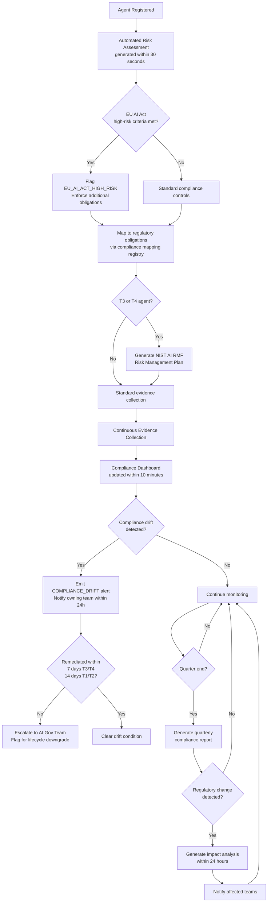
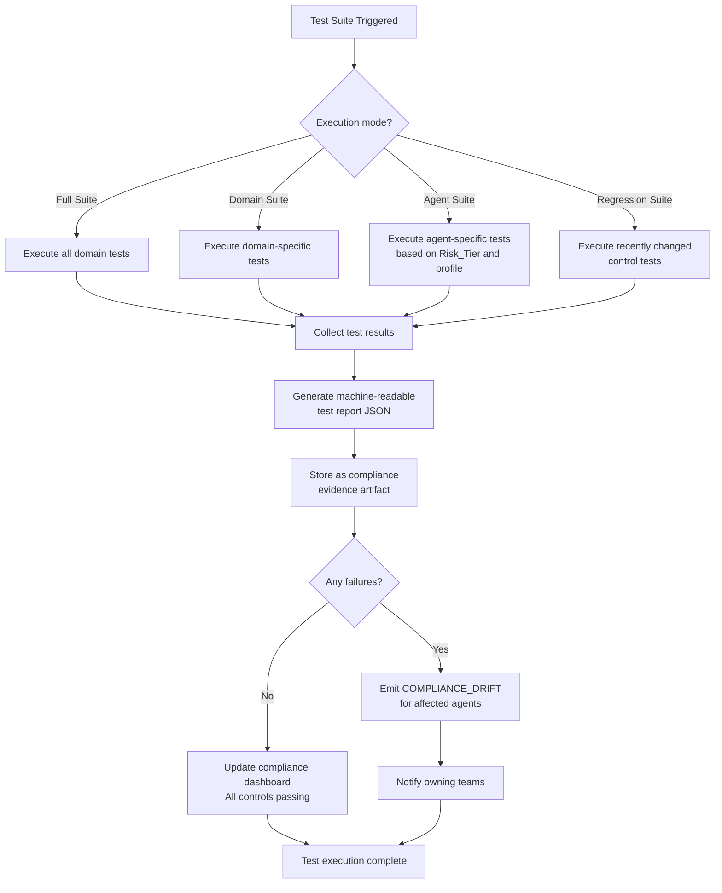

# EAAGF Specification — Compliance and Regulatory Alignment Standard

**Document ID:** EAAGF-SPEC-10  
**Version:** 1.0.0  
**Status:** Draft  
**Last Updated:** 2025-07-14  
**Owner:** AI Governance Team

---

## 1. Purpose

This document defines the normative standard for compliance and regulatory alignment within the Enterprise AI Agent Governance Framework (EAAGF). It specifies how the Governance_Controller maintains compliance mappings to EU AI Act, NIST AI RMF, and ISO 42001, automates risk assessment on agent registration, continuously collects compliance evidence, flags EU AI Act high-risk agents, generates NIST AI RMF plan templates, defines the conformance test suite specification, performs regulatory change impact analysis, produces quarterly compliance reports, detects compliance drift, and provides third-party audit access.

Compliance is not a periodic checkpoint — it is a continuous, automated process embedded in the governance lifecycle. The EAAGF compliance standard ensures that every agent's regulatory posture is assessed at registration, monitored throughout its lifecycle, and evidenced for audit at any time.

The key words "MUST", "MUST NOT", "REQUIRED", "SHALL", "SHALL NOT", "SHOULD", "SHOULD NOT", "RECOMMENDED", "MAY", and "OPTIONAL" in this document are to be interpreted as described in [RFC 2119](https://www.rfc-editor.org/rfc/rfc2119).

---

## 2. Scope

This standard applies to:

- All AI agents deployed on any enterprise-supported platform (Databricks, Salesforce AgentForce, Snowflake Cortex, Microsoft Copilot Studio, AWS Bedrock, Azure AI Foundry, GCP Vertex AI)
- The Governance_Controller component and its compliance enforcement interfaces
- The compliance mapping registry and its maintenance processes
- The conformance test suite and its execution framework
- The compliance evidence collection pipeline
- The quarterly reporting subsystem
- All teams that develop, deploy, or operate AI agents within the enterprise
- External auditors granted read-only audit access

For related standards, see:

| Related Domain | Document |
|---|---|
| Agent Identity | [02 — Agent Identity Standard](./02-agent-identity-standard.md) |
| Risk Classification | [03 — Risk Classification Standard](./03-risk-classification-standard.md) |
| Authorization | [04 — Authorization Standard](./04-authorization-standard.md) |
| Observability | [05 — Observability Standard](./05-observability-standard.md) |
| Human Oversight | [06 — Human Oversight Standard](./06-human-oversight-standard.md) |
| Interoperability | [07 — Interoperability Standard](./07-interoperability-standard.md) |
| Data Governance | [08 — Data Governance Standard](./08-data-governance-standard.md) |
| Security | [09 — Security Standard](./09-security-standard.md) |

---

## 3. Compliance Mapping Registry

### 3.1 Registry Structure and Maintenance

The Governance_Controller SHALL maintain a compliance mapping registry that links each EAAGF control to its corresponding obligations in EU AI Act, NIST AI RMF, and ISO 42001.

**Normative rules:**

1. The Governance_Controller SHALL maintain a machine-readable compliance mapping registry that maps every EAAGF governance control to its corresponding regulatory obligations across three frameworks:
   - **EU AI Act** — Articles, recitals, and implementing acts applicable to AI agent governance.
   - **NIST AI RMF** — Functions (GOVERN, MAP, MEASURE, MANAGE), categories, and subcategories.
   - **ISO 42001** — Clauses and controls from the AI Management System standard.
2. Each entry in the compliance mapping registry SHALL conform to the following schema:

#### Compliance Mapping Registry Schema

```json
{
  "control_id": {
    "type": "string",
    "pattern": "^EAAGF-[A-Z]+-\\d{3}$",
    "description": "Unique EAAGF control identifier (e.g., 'EAAGF-AUTH-001').",
    "required": true
  },
  "control_name": {
    "type": "string",
    "description": "Human-readable name of the governance control.",
    "required": true
  },
  "governance_domain": {
    "type": "string",
    "enum": ["IDENTITY", "CLASSIFICATION", "AUTHORIZATION", "OBSERVABILITY", "OVERSIGHT", "INTEROPERABILITY", "DATA_GOVERNANCE", "SECURITY", "COMPLIANCE", "LIFECYCLE"],
    "description": "The EAAGF governance domain this control belongs to.",
    "required": true
  },
  "requirement_refs": {
    "type": "array",
    "items": { "type": "string" },
    "description": "References to EAAGF requirements (e.g., ['3.1', '3.2', '3.3']).",
    "required": true
  },
  "regulatory_mappings": {
    "eu_ai_act": {
      "type": "array",
      "items": { "type": "string" },
      "description": "Applicable EU AI Act articles and recitals (e.g., ['Article 9 - Risk Management', 'Article 13 - Transparency']).",
      "required": true
    },
    "nist_ai_rmf": {
      "type": "array",
      "items": { "type": "string" },
      "description": "Applicable NIST AI RMF functions, categories, and subcategories (e.g., ['GOVERN 1.1', 'MANAGE 2.2']).",
      "required": true
    },
    "iso_42001": {
      "type": "array",
      "items": { "type": "string" },
      "description": "Applicable ISO 42001 clauses and controls (e.g., ['Clause 6.1 - Risk Assessment', 'Clause 8.4 - AI System Operation']).",
      "required": true
    }
  },
  "evidence_sources": {
    "type": "array",
    "items": { "type": "string" },
    "description": "The data sources that provide compliance evidence for this control (e.g., ['policy_engine_logs', 'credential_issuance_records']).",
    "required": true
  },
  "verification_method": {
    "type": "string",
    "enum": ["AUTOMATED_TEST", "LOG_ANALYSIS", "CONFIGURATION_REVIEW", "MANUAL_ATTESTATION"],
    "description": "How compliance with this control is verified.",
    "required": true
  },
  "last_reviewed": {
    "type": "string",
    "format": "ISO8601",
    "description": "The date this mapping was last reviewed for accuracy.",
    "required": true
  },
  "reviewed_by": {
    "type": "string",
    "description": "The identity of the person or team that last reviewed this mapping.",
    "required": true
  }
}
```

#### Example Compliance Mapping Entry

```json
{
  "control_id": "EAAGF-AUTH-001",
  "control_name": "Least Privilege Authorization",
  "governance_domain": "AUTHORIZATION",
  "requirement_refs": ["3.1", "3.2", "3.3"],
  "regulatory_mappings": {
    "eu_ai_act": ["Article 9 - Risk Management", "Article 13 - Transparency"],
    "nist_ai_rmf": ["GOVERN 1.1", "MANAGE 2.2", "MEASURE 2.5"],
    "iso_42001": ["Clause 6.1 - Risk Assessment", "Clause 8.4 - AI System Operation"]
  },
  "evidence_sources": ["policy_engine_logs", "credential_issuance_records", "permission_denial_events"],
  "verification_method": "AUTOMATED_TEST",
  "last_reviewed": "2025-07-01",
  "reviewed_by": "AI Governance Team"
}
```

3. The compliance mapping registry SHALL be versioned. Each update to the registry SHALL increment the registry version and record the change author, change date, and change description.
4. The registry SHALL be stored in a machine-readable format (JSON) and SHALL be accessible via the Governance_Controller's management API.
5. The AI Governance Team SHALL review the compliance mapping registry at minimum quarterly to ensure mappings remain accurate as regulatory requirements evolve.
6. The registry SHALL include mappings for ALL EAAGF governance controls across all ten governance domains (Identity, Classification, Authorization, Observability, Oversight, Interoperability, Data Governance, Security, Compliance, Lifecycle).
7. Each control in the registry SHALL have at least one evidence source identified. Controls without evidence sources SHALL be flagged as `EVIDENCE_GAP` and prioritized for remediation.

> **Validates: Requirement 9.1** — THE Governance_Controller SHALL maintain a compliance mapping registry that links each EAAGF control to its corresponding obligations in EU AI Act, NIST AI RMF, and ISO 42001.

---

## 4. Automated Risk Assessment on Registration

### 4.1 Registration-Time Compliance Assessment

WHEN a new agent is registered, the Governance_Controller SHALL automatically generate a risk assessment report that maps the agent's Risk_Tier and capabilities to applicable regulatory obligations.

**Normative rules:**

1. The Governance_Controller SHALL trigger an automated risk assessment immediately upon successful agent registration (after UUID assignment, Risk_Tier classification, and Conformance_Profile validation as defined in [02 — Agent Identity Standard](./02-agent-identity-standard.md)).
2. The risk assessment report SHALL include the following sections:
   - **Agent Summary** — Agent ID, name, owning team, platform, Risk_Tier, and lifecycle state.
   - **Capability Analysis** — A mapping of the agent's declared capabilities (from its Conformance_Profile) to the EAAGF governance controls that apply.
   - **Regulatory Obligation Mapping** — For each applicable EAAGF control, the corresponding EU AI Act, NIST AI RMF, and ISO 42001 obligations, resolved from the compliance mapping registry (Section 3).
   - **EU AI Act Classification** — Whether the agent meets the criteria for EU AI Act high-risk classification (see Section 5).
   - **Required Controls Summary** — A checklist of all governance controls that MUST be satisfied for the agent's Risk_Tier, with current compliance status (COMPLIANT, NON_COMPLIANT, NOT_ASSESSED).
   - **Evidence Requirements** — The evidence sources that must be collected for ongoing compliance monitoring.
3. The risk assessment report SHALL be generated in machine-readable format (JSON) and SHALL be stored as part of the agent's registration record in the Agent_Registry.
4. The risk assessment report SHALL be regenerated automatically when any of the following events occur:
   - The agent's Risk_Tier changes (re-classification).
   - The agent's Conformance_Profile is updated.
   - The compliance mapping registry is updated (new regulatory mappings).
   - The agent transitions to a new lifecycle state.
5. The risk assessment report SHALL be accessible via the Governance_Controller's management API and SHALL be included in the compliance evidence bundle for the agent.
6. The risk assessment generation latency SHALL NOT exceed 30 seconds from the triggering event.

> **Validates: Requirement 9.2** — WHEN a new agent is registered, THE Governance_Controller SHALL automatically generate a risk assessment report that maps the agent's Risk_Tier and capabilities to applicable regulatory obligations.

---

## 5. EU AI Act High-Risk Flagging

### 5.1 Automatic High-Risk Classification

WHEN the EU AI Act high-risk system classification criteria are met by an agent, the Governance_Controller SHALL flag the agent as EU_AI_ACT_HIGH_RISK and enforce additional obligations.

**Normative rules:**

1. The Governance_Controller SHALL evaluate every registered agent against the EU AI Act high-risk classification criteria. An agent SHALL be flagged as `EU_AI_ACT_HIGH_RISK` if it meets any of the following conditions:
   - The agent is classified as T4 (Critical).
   - The agent operates on Restricted data and performs write operations on external systems.
   - The agent makes or influences decisions that affect natural persons in areas covered by Annex III of the EU AI Act (employment, credit, law enforcement, migration, education, essential services).
   - The agent's owning team has explicitly declared the agent as high-risk in its Conformance_Profile.
2. WHEN an agent is flagged as `EU_AI_ACT_HIGH_RISK`, the Governance_Controller SHALL enforce the following additional obligations:
   - **Transparency** — The agent's outputs SHALL include a disclosure that the output was generated or influenced by an AI system. The disclosure format SHALL be configurable per platform.
   - **Documentation** — The agent SHALL maintain a technical documentation package that includes: system description, intended purpose, risk assessment, training data summary (if applicable), performance metrics, and human oversight provisions.
   - **Human Oversight** — The agent's oversight mode SHALL be set to APPROVAL_REQUIRED or HUMAN_IN_LOOP. FULL_AUTO and SUPERVISED modes SHALL NOT be permitted for EU_AI_ACT_HIGH_RISK agents without explicit AI Governance Team authorization and documented justification.
   - **Logging** — All agent actions SHALL be logged with enhanced detail, including reasoning chain summaries (as defined in [05 — Observability Standard](./05-observability-standard.md)).
   - **Accuracy Monitoring** — The agent's outputs SHALL be subject to periodic accuracy review (at minimum quarterly) by the owning team, with results recorded in the compliance evidence bundle.
3. The `EU_AI_ACT_HIGH_RISK` flag SHALL be recorded in the agent's registration record (`compliance_flags` field) and SHALL be included in all audit events via the `eaagf.compliance.eu_ai_act_applicable` attribute.
4. The high-risk evaluation SHALL be re-run automatically when the agent's Risk_Tier or Conformance_Profile changes.
5. Teams MAY appeal a high-risk classification by submitting a justification to the AI Governance Team. Appeals SHALL be reviewed within 10 business days.

> **Validates: Requirement 9.4** — WHEN the EU AI Act high-risk system classification criteria are met by an agent, THE Governance_Controller SHALL flag the agent as EU_AI_ACT_HIGH_RISK and enforce the additional transparency, documentation, and human oversight obligations required by the Act.

---

## 6. Continuous Evidence Collection

### 6.1 Automated Compliance Evidence Pipeline

The Governance_Controller SHALL continuously collect compliance evidence and make it available via a compliance dashboard.

**Normative rules:**

1. The Governance_Controller SHALL continuously collect and aggregate compliance evidence from the following sources:
   - **Audit logs** — All audit events emitted by the Telemetry_Emitter (as defined in [05 — Observability Standard](./05-observability-standard.md)).
   - **Policy configurations** — Current and historical Policy_Engine configurations, including permission policies, rate limits, and egress allowlists.
   - **Approval records** — All Human_Oversight_Gate decisions (approvals, rejections, escalations, timeouts) as defined in [06 — Human Oversight Standard](./06-human-oversight-standard.md).
   - **Test results** — Conformance test suite execution results (see Section 8).
   - **Risk assessment reports** — Registration-time and periodic risk assessments (see Section 4).
   - **Credential lifecycle records** — Credential issuance, rotation, and revocation events from the Agent_Registry.
   - **Security event records** — All security events (prompt injection, output validation, anomaly detection) from [09 — Security Standard](./09-security-standard.md).
   - **Data governance records** — Context_Compartment creation, purge, and data lineage records from [08 — Data Governance Standard](./08-data-governance-standard.md).
2. Evidence collection SHALL be automated and continuous. No manual intervention SHALL be required for routine evidence collection.
3. The Governance_Controller SHALL maintain a compliance evidence index that links each collected evidence artifact to:
   - The EAAGF control it supports.
   - The regulatory obligation it satisfies (via the compliance mapping registry).
   - The agent(s) it applies to.
   - The time period it covers.
4. The compliance dashboard SHALL provide the following views:
   - **Enterprise Overview** — Aggregate compliance posture across all agents, grouped by Risk_Tier and platform.
   - **Agent Detail** — Per-agent compliance status showing all applicable controls, their current status, and supporting evidence.
   - **Control Detail** — Per-control compliance status across all agents, with drill-down to individual evidence artifacts.
   - **Regulatory View** — Compliance status organized by regulatory framework (EU AI Act, NIST AI RMF, ISO 42001).
   - **Trend Analysis** — Compliance posture trends over time (weekly, monthly, quarterly).
5. The compliance dashboard SHALL be accessible to the AI Governance Team, team leads (scoped to their agents), and external auditors (read-only, see Section 12).
6. Evidence artifacts SHALL be retained for the same duration as audit logs (minimum 7 years, as defined in [05 — Observability Standard](./05-observability-standard.md)).
7. The evidence collection pipeline SHALL process new evidence within 5 minutes of the source event occurring. The compliance dashboard SHALL reflect updated evidence within 10 minutes.

> **Validates: Requirement 9.3** — THE Governance_Controller SHALL continuously collect compliance evidence (audit logs, policy configurations, approval records, test results) and SHALL make this evidence available via a compliance dashboard.

---

## 7. NIST AI RMF Plan Templates

### 7.1 Automated Risk Management Plan Generation

The Governance_Controller SHALL generate a NIST AI RMF-aligned AI Risk Management Plan template for each T3 and T4 agent, pre-populated with the agent's registered capabilities and risk assessment data.

**Normative rules:**

1. The Governance_Controller SHALL automatically generate a NIST AI RMF-aligned AI Risk Management Plan for every agent classified as T3 (Autonomous) or T4 (Critical). T1 and T2 agents MAY request plan generation, but it is not mandatory.
2. The generated plan SHALL be pre-populated with the following data from the agent's registration record and risk assessment:
   - **GOVERN function** — Organizational governance context: owning team, AI Governance Team oversight requirements, applicable policies, and escalation paths.
   - **MAP function** — AI system context: agent capabilities, intended use cases, data classifications accessed, platforms deployed on, and stakeholder impact analysis.
   - **MEASURE function** — Measurement and monitoring: applicable EAAGF controls, conformance test results, anomaly detection thresholds, and performance metrics.
   - **MANAGE function** — Risk management actions: identified risks (from risk assessment), mitigation controls (from Conformance_Profile), residual risk acceptance criteria, and incident response procedures.
3. The plan template SHALL include placeholder sections for information that requires human input:
   - Intended purpose and use case description.
   - Stakeholder impact assessment.
   - Residual risk acceptance justification.
   - Periodic review schedule and responsible parties.
4. The generated plan SHALL be stored as part of the agent's compliance evidence bundle and SHALL be versioned alongside the agent's registration record.
5. The plan SHALL be regenerated automatically when the agent's Risk_Tier, Conformance_Profile, or risk assessment changes.
6. The plan format SHALL be Markdown with embedded JSON data blocks for machine-readable sections, enabling both human review and automated processing.
7. Teams SHALL be required to complete the placeholder sections within 30 days of plan generation for T3 agents and within 15 days for T4 agents. Incomplete plans SHALL trigger a `COMPLIANCE_DRIFT` alert (see Section 10).

> **Validates: Requirement 9.5** — THE Governance_Controller SHALL generate a NIST AI RMF-aligned AI Risk Management Plan template for each T3 and T4 agent, pre-populated with the agent's registered capabilities and risk assessment data.

---

## 8. Conformance Test Suite Specification

### 8.1 Automated Conformance Testing

The Conformance_Test_Suite SHALL include automated tests that verify each EAAGF control is correctly implemented, producing machine-readable test results that serve as ISO 42001 audit evidence.

**Normative rules:**

1. The Conformance_Test_Suite SHALL include automated tests for every EAAGF governance control across all ten governance domains. Each test SHALL verify that the control is correctly implemented and enforced by the Governance_Controller and Platform Adapters.
2. The test suite SHALL be organized by governance domain:
   - **Identity Tests** — Verify UUID assignment, credential issuance, rotation, revocation, and decommission procedures.
   - **Classification Tests** — Verify three-dimension evaluation, tier assignment, multi-platform resolution, and re-classification triggers.
   - **Authorization Tests** — Verify least-privilege enforcement, credential TTL, compartment isolation, egress allowlist, and policy hot-reload.
   - **Observability Tests** — Verify audit event emission, OTLP format, blocked event SLA, immutability, retention, and SIEM integration.
   - **Oversight Tests** — Verify oversight mode enforcement, gate notification SLA, timeout escalation, pause/resume, and emergency stop.
   - **Interoperability Tests** — Verify MCP/A2A protocol enforcement, Agent Card validation, Conformance_Profile schema validation, and platform adapter compliance.
   - **Data Governance Tests** — Verify classification enforcement, compartment creation/purge, cross-scope blocking, PII detection, and geographic constraints.
   - **Security Tests** — Verify prompt injection detection, output validation, sandbox isolation, rate limiting, anomaly detection, self-modification prevention, and content filtering.
   - **Compliance Tests** — Verify registry accuracy, risk assessment generation, evidence collection, EU AI Act flagging, and drift detection.
   - **Lifecycle Tests** — Verify stage transitions, gate prerequisites, versioning, re-validation enforcement, and decommission procedures.
3. Each test SHALL produce a machine-readable result in the following format:

```json
{
  "test_id": "EAAGF-TEST-AUTH-001",
  "control_id": "EAAGF-AUTH-001",
  "test_name": "Verify least-privilege credential issuance",
  "governance_domain": "AUTHORIZATION",
  "result": "PASS | FAIL | SKIP | ERROR",
  "execution_time_ms": 1250,
  "timestamp": "2025-07-14T10:30:00Z",
  "agent_id": "uuid-v4 (if agent-specific)",
  "platform": "DATABRICKS | SALESFORCE | ... (if platform-specific)",
  "details": {
    "assertions_passed": 5,
    "assertions_failed": 0,
    "error_message": "null | string"
  },
  "evidence_artifacts": [
    "audit_log_snapshot_2025-07-14.json",
    "policy_config_2025-07-14.json"
  ]
}
```

4. Test results SHALL serve as ISO 42001 audit evidence. Each test result SHALL be linked to the corresponding EAAGF control and regulatory mapping via the `control_id` field.
5. The test suite SHALL support the following execution modes:
   - **Full Suite** — Execute all tests across all domains. Required for lifecycle transitions (DEVELOPMENT → STAGING, STAGING → PRODUCTION).
   - **Domain Suite** — Execute all tests within a specific governance domain. Useful for targeted validation after domain-specific changes.
   - **Agent Suite** — Execute all tests applicable to a specific agent based on its Risk_Tier and Conformance_Profile.
   - **Regression Suite** — Execute tests related to recently changed controls or configurations.
6. The test suite SHALL be executable via the Governance_Controller's management API and SHALL integrate with enterprise CI/CD platforms (GitHub Actions, GitLab CI, Azure DevOps, Jenkins) via webhooks.
7. Test results SHALL be retained as compliance evidence for the full 7-year retention period.
8. The test suite SHALL be updated whenever new EAAGF controls are added or existing controls are modified. Test coverage SHALL be reported as a percentage of total EAAGF controls with passing automated tests.

> **Validates: Requirement 9.6** — THE Conformance_Test_Suite SHALL include automated tests that verify each EAAGF control is correctly implemented, producing machine-readable test results that serve as ISO 42001 audit evidence.

---

## 9. Regulatory Change Impact Analysis

### 9.1 Change Impact Assessment

WHEN a regulatory requirement changes, the Governance_Controller SHALL provide a change impact analysis identifying which registered agents are affected and what control updates are required.

**Normative rules:**

1. The Governance_Controller SHALL support regulatory change impact analysis triggered by updates to the compliance mapping registry (Section 3). When a regulatory mapping is added, modified, or removed, the Governance_Controller SHALL automatically assess the impact on all registered agents.
2. The impact analysis SHALL produce a report containing:
   - **Change Summary** — Description of the regulatory change, the affected regulatory framework (EU AI Act, NIST AI RMF, ISO 42001), and the specific articles, clauses, or functions affected.
   - **Affected Controls** — The EAAGF controls whose regulatory mappings have changed, with before/after comparison.
   - **Affected Agents** — A list of all registered agents that are subject to the affected controls, grouped by Risk_Tier and platform.
   - **Required Actions** — For each affected agent, the specific control updates, configuration changes, or re-assessments required to maintain compliance.
   - **Timeline** — The deadline for compliance with the new or changed requirement, based on the regulatory framework's transition period.
   - **Risk Assessment** — The compliance risk if the required actions are not completed by the deadline (LOW, MEDIUM, HIGH, CRITICAL).
3. The impact analysis report SHALL be generated within 24 hours of the compliance mapping registry update.
4. The Governance_Controller SHALL notify the following stakeholders when an impact analysis is generated:
   - The AI Governance Team (always).
   - The owning teams of all affected agents (scoped to their agents).
   - The compliance team (if configured).
5. The impact analysis SHALL be stored as a compliance evidence artifact and SHALL be accessible via the compliance dashboard.
6. The Governance_Controller SHALL track remediation progress for each affected agent. Agents that have not completed required actions by the deadline SHALL be flagged with a `COMPLIANCE_DRIFT` alert (see Section 10).
7. The AI Governance Team SHALL review and approve all compliance mapping registry updates before they trigger impact analysis. This prevents erroneous mappings from generating false impact reports.

> **Validates: Requirement 9.7** — WHEN a regulatory requirement changes (e.g., new EU AI Act implementing act), THE Governance_Controller SHALL provide a change impact analysis identifying which registered agents are affected and what control updates are required.

---

## 10. Compliance Drift Detection

### 10.1 Continuous Compliance Monitoring

IF an agent's compliance posture degrades, THEN the Governance_Controller SHALL emit a COMPLIANCE_DRIFT alert and notify the owning team within 24 hours.

**Normative rules:**

1. The Governance_Controller SHALL continuously monitor the compliance posture of every registered agent. Compliance drift is defined as any condition where an agent that was previously compliant with an EAAGF control becomes non-compliant.
2. The following conditions SHALL trigger a `COMPLIANCE_DRIFT` alert:
   - **Overdue credential rotation** — An agent's credential has not been rotated within the required TTL window (as defined in [02 — Agent Identity Standard](./02-agent-identity-standard.md)).
   - **Missing security scan** — An agent in PRODUCTION does not have a current security scan attestation (as defined in [09 — Security Standard](./09-security-standard.md)).
   - **Overdue re-validation** — An agent has exceeded its re-validation period (90 days for T3/T4, 180 days for T1/T2) without re-validation (as defined in [11 — Lifecycle Management Standard](./11-lifecycle-management-standard.md)).
   - **Failed conformance tests** — An agent's most recent conformance test suite run includes failing tests.
   - **Incomplete NIST AI RMF plan** — A T3/T4 agent's NIST AI RMF plan has placeholder sections that remain incomplete beyond the required deadline (Section 7).
   - **Unresolved regulatory change actions** — An agent has not completed required actions from a regulatory change impact analysis by the deadline (Section 9).
   - **Policy configuration mismatch** — An agent's runtime policy configuration does not match its declared Conformance_Profile.
   - **Evidence collection gap** — Required compliance evidence has not been collected for an agent within the expected time window.
3. WHEN a `COMPLIANCE_DRIFT` condition is detected, the Governance_Controller SHALL:
   a. Emit a `COMPLIANCE_DRIFT` audit event containing:
      - The agent ID.
      - The drift condition type (e.g., `OVERDUE_CREDENTIAL_ROTATION`, `MISSING_SECURITY_SCAN`, `FAILED_CONFORMANCE_TESTS`).
      - The EAAGF control(s) affected.
      - The time since the drift condition began.
      - The agent's Risk_Tier.
   b. Notify the owning team within 24 hours via configured notification channels (email, Slack, Teams, PagerDuty).
   c. Record the drift condition in the agent's compliance evidence bundle.
   d. Update the agent's compliance status on the compliance dashboard.
4. For T3 and T4 agents, `COMPLIANCE_DRIFT` alerts SHALL additionally notify the AI Governance Team.
5. IF a `COMPLIANCE_DRIFT` condition persists for more than 7 days without remediation for T3/T4 agents (or 14 days for T1/T2 agents), the Governance_Controller SHALL escalate the alert to the AI Governance Team lead and SHALL flag the agent for potential lifecycle downgrade (PRODUCTION → STAGING).
6. The compliance drift detection pipeline SHALL evaluate all agents at minimum every 6 hours. Real-time drift detection (triggered by specific events such as failed tests or expired credentials) SHALL supplement the periodic evaluation.
7. Teams MAY acknowledge a `COMPLIANCE_DRIFT` alert with a remediation plan and timeline. Acknowledged alerts SHALL not escalate during the approved remediation window, but SHALL remain visible on the compliance dashboard.

> **Validates: Requirement 9.9** — IF an agent's compliance posture degrades (e.g., overdue credential rotation, missing security scan), THEN THE Governance_Controller SHALL emit a COMPLIANCE_DRIFT alert and notify the owning team within 24 hours.

---

## 11. Quarterly Compliance Reporting

### 11.1 Quarterly Report Generation

The Governance_Controller SHALL produce quarterly compliance summary reports covering agent population, policy violations, oversight activations, security events, and remediation status.

**Normative rules:**

1. The Governance_Controller SHALL automatically generate a quarterly compliance summary report at the end of each calendar quarter (Q1: January–March, Q2: April–June, Q3: July–September, Q4: October–December). The report SHALL be generated within 5 business days of the quarter end.
2. The quarterly report SHALL include the following sections:

   **a. Agent Population Summary**
   - Total registered agents by Risk_Tier (T1, T2, T3, T4).
   - Total registered agents by platform.
   - New agents registered during the quarter.
   - Agents decommissioned during the quarter.
   - Agents with EU_AI_ACT_HIGH_RISK flag.

   **b. Policy Violation Summary**
   - Total policy violations by type (PERMISSION_NOT_DECLARED, COMPARTMENT_VIOLATION, EGRESS_NOT_ALLOWED, RATE_LIMIT_EXCEEDED, etc.).
   - Policy violations by Risk_Tier.
   - Policy violations by platform.
   - Top 10 agents by violation count.
   - Trend comparison with previous quarter.

   **c. Human Oversight Gate Summary**
   - Total gate activations by oversight mode.
   - Gate approval rate vs. rejection rate.
   - Average gate response time.
   - Gate timeout and escalation count.
   - Emergency stop events.

   **d. Security Event Summary**
   - Total security events by type (PROMPT_INJECTION_DETECTED, OUTPUT_VALIDATION_FAILURE, SELF_MODIFICATION_ATTEMPT, ANOMALY_DETECTED, CONTENT_POLICY_VIOLATION).
   - Security events by severity (LOW, MEDIUM, HIGH, CRITICAL).
   - Security events by Risk_Tier.
   - Trend comparison with previous quarter.

   **e. Compliance Posture Summary**
   - Overall compliance rate (percentage of agents fully compliant with all applicable controls).
   - Compliance drift alerts issued during the quarter.
   - Compliance drift alerts resolved during the quarter.
   - Average time to remediate compliance drift.
   - Agents currently in drift status.

   **f. Remediation Status**
   - Open remediation actions by priority.
   - Remediation actions completed during the quarter.
   - Overdue remediation actions.
   - Regulatory change impact actions pending.

3. The quarterly report SHALL be generated in both human-readable format (Markdown/PDF) and machine-readable format (JSON) to support both executive review and automated processing.
4. The quarterly report SHALL be distributed to:
   - The AI Governance Team.
   - Enterprise compliance leadership.
   - Platform engineering leads.
   - External auditors (if audit access is active, see Section 12).
5. The quarterly report SHALL be stored as a compliance evidence artifact and retained for the full 7-year retention period.
6. The Governance_Controller SHALL support ad-hoc report generation for any custom time period, in addition to the standard quarterly cadence.

> **Validates: Requirement 9.8** — THE Governance_Controller SHALL produce quarterly compliance summary reports covering: total agents by Risk_Tier, policy violations, Human_Oversight_Gate activations, security events, and remediation status.

---

## 12. Third-Party Audit Access

### 12.1 Read-Only Audit Role

The Governance_Controller SHALL support third-party audit access — a read-only audit role that allows external auditors to query compliance evidence without accessing production agent data.

**Normative rules:**

1. The Governance_Controller SHALL define an `EXTERNAL_AUDITOR` role with the following access permissions:
   - **READ** access to the compliance mapping registry.
   - **READ** access to compliance evidence artifacts (audit logs, test results, risk assessments, quarterly reports).
   - **READ** access to the compliance dashboard (all views).
   - **QUERY** access to the Audit Event Query API (as defined in [05 — Observability Standard](./05-observability-standard.md), Section 11).
   - **NO** access to production agent data, agent runtime state, or agent execution contexts.
   - **NO** access to raw PII — all PII in audit records SHALL be masked or redacted before being presented to external auditors.
   - **NO** ability to modify any governance configuration, policy, or agent record.
2. The `EXTERNAL_AUDITOR` role SHALL be provisioned by the AI Governance Team. Each external auditor SHALL receive a unique identity with the following attributes:
   - Auditor name and organization.
   - Audit engagement identifier.
   - Access start date and end date.
   - Scope restrictions (if the audit is limited to specific agents, platforms, or governance domains).
3. External auditor access SHALL be time-bounded. Access SHALL automatically expire at the configured end date. The maximum access duration SHALL be 90 days per audit engagement. Extensions SHALL require AI Governance Team re-authorization.
4. All external auditor actions (queries, dashboard views, evidence downloads) SHALL be logged in the audit trail with the auditor's identity. These audit-of-audit records SHALL be retained for the standard 7-year period.
5. The Governance_Controller SHALL support scoped audit access. The AI Governance Team MAY restrict an external auditor's access to:
   - Specific agents (by agent ID or owning team).
   - Specific platforms.
   - Specific governance domains.
   - Specific time ranges.
6. External auditors SHALL access the Governance_Controller via the same Query API and compliance dashboard used by internal teams, with the `EXTERNAL_AUDITOR` role enforcing the access restrictions defined above.
7. The Governance_Controller SHALL provide an audit access report that summarizes all external auditor activity during an audit engagement, including queries executed, evidence accessed, and dashboard views. This report SHALL be generated automatically when the audit engagement ends.
8. External auditor credentials SHALL use short-lived tokens (maximum TTL: 8 hours) with automatic renewal during active sessions. Credentials SHALL be revoked immediately when the audit engagement ends or is terminated early.

> **Validates: Requirement 9.10** — THE Governance_Controller SHALL support third-party audit access — a read-only audit role that allows external auditors to query compliance evidence without accessing production agent data.

---

## 13. Compliance Process Flow

### 13.1 End-to-End Compliance Lifecycle

The following diagram illustrates the end-to-end compliance lifecycle from agent registration through continuous monitoring and reporting.



### 13.2 Conformance Test Execution Flow



---

## 14. Requirements Traceability

| Section | Requirement | Description |
|---|---|---|
| 3 — Compliance Mapping Registry | 9.1 | Compliance mapping registry linking EAAGF controls to EU AI Act, NIST AI RMF, ISO 42001 |
| 4 — Automated Risk Assessment | 9.2 | Automated risk assessment report on agent registration |
| 6 — Continuous Evidence Collection | 9.3 | Continuous compliance evidence collection and dashboard |
| 5 — EU AI Act High-Risk Flagging | 9.4 | EU AI Act high-risk classification and additional obligations |
| 7 — NIST AI RMF Plan Templates | 9.5 | NIST AI RMF-aligned risk management plan generation |
| 8 — Conformance Test Suite | 9.6 | Automated conformance tests producing ISO 42001 audit evidence |
| 9 — Regulatory Change Impact Analysis | 9.7 | Change impact analysis for regulatory requirement changes |
| 11 — Quarterly Compliance Reporting | 9.8 | Quarterly compliance summary reports |
| 10 — Compliance Drift Detection | 9.9 | Compliance drift detection with 24-hour notification SLA |
| 12 — Third-Party Audit Access | 9.10 | Read-only audit role for external auditors |
