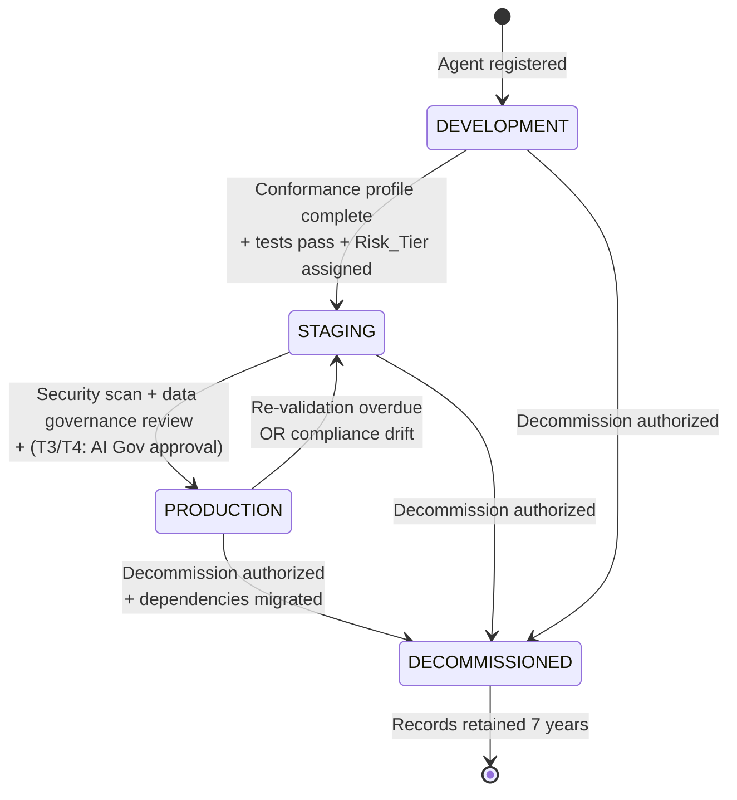
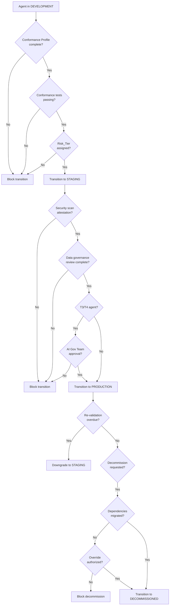
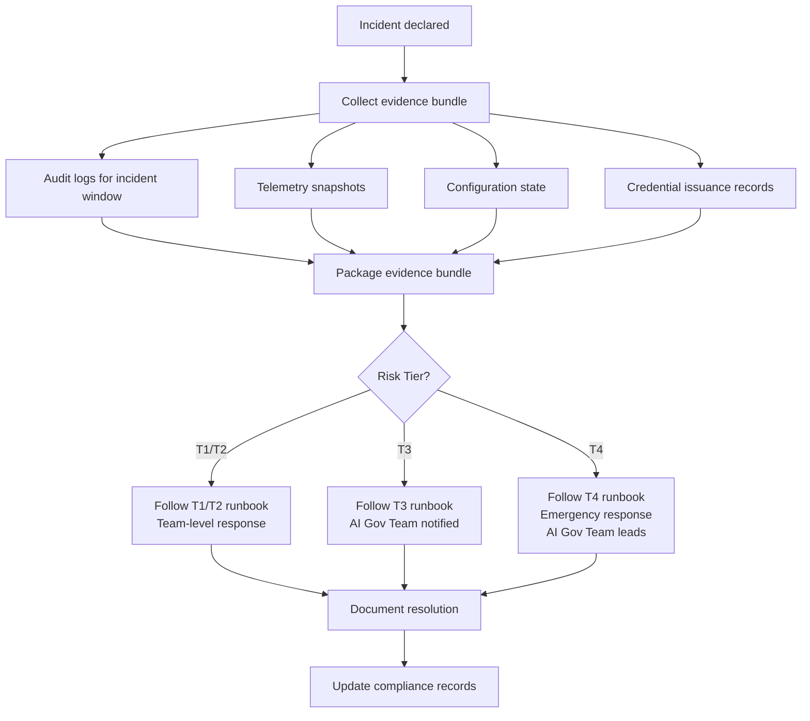

# EAAGF Specification — Lifecycle Management Standard

**Document ID:** EAAGF-SPEC-11  
**Version:** 1.0.0  
**Status:** Draft  
**Last Updated:** 2025-07-14  
**Owner:** AI Governance Team

---

## 1. Purpose

This document defines the normative standard for agent lifecycle management within the Enterprise AI Agent Governance Framework (EAAGF). It specifies the four-stage lifecycle that all agents follow, the governance gates that control transitions between stages, semantic versioning enforcement, canary deployment patterns, re-validation enforcement, deprecation notification, decommission dependency verification, CI/CD integration, incident response runbook templates, and evidence bundle collection.

Lifecycle management ensures that only compliant, tested, and approved agents reach production, and that deprecated or non-compliant agents are cleanly decommissioned with full audit traceability. The lifecycle is not a suggestion — it is a binding governance control enforced by the Governance_Controller at every stage transition.

The key words "MUST", "MUST NOT", "REQUIRED", "SHALL", "SHALL NOT", "SHOULD", "SHOULD NOT", "RECOMMENDED", "MAY", and "OPTIONAL" in this document are to be interpreted as described in [RFC 2119](https://www.rfc-editor.org/rfc/rfc2119).

---

## 2. Scope

This standard applies to:

- All AI agents deployed on any enterprise-supported platform (Databricks, Salesforce AgentForce, Snowflake Cortex, Microsoft Copilot Studio, AWS Bedrock, Azure AI Foundry, GCP Vertex AI)
- The Governance_Controller component and its lifecycle enforcement interfaces
- The Agent_Registry and its lifecycle state management
- All CI/CD pipelines that deploy AI agents
- All teams that develop, deploy, or operate AI agents within the enterprise

For related standards, see:

| Related Domain | Document |
|---|---|
| Agent Identity | [02 — Agent Identity Standard](./02-agent-identity-standard.md) |
| Risk Classification | [03 — Risk Classification Standard](./03-risk-classification-standard.md) |
| Authorization | [04 — Authorization Standard](./04-authorization-standard.md) |
| Observability | [05 — Observability Standard](./05-observability-standard.md) |
| Human Oversight | [06 — Human Oversight Standard](./06-human-oversight-standard.md) |
| Interoperability | [07 — Interoperability Standard](./07-interoperability-standard.md) |
| Data Governance | [08 — Data Governance Standard](./08-data-governance-standard.md) |
| Security | [09 — Security Standard](./09-security-standard.md) |
| Compliance | [10 — Compliance Standard](./10-compliance-standard.md) |

---

## 3. Lifecycle Stages

### 3.1 Four-Stage Lifecycle Model

The Governance_Controller SHALL define and enforce four lifecycle stages for all agents. Every registered agent MUST be in exactly one of these stages at any point in time.

| Stage | Description | Permitted Actions |
|---|---|---|
| `DEVELOPMENT` | Agent is under active development and testing. Not permitted to process production data or serve production traffic. | Tool calls against development/sandbox resources only. Conformance testing. |
| `STAGING` | Agent has passed initial conformance gates and is undergoing pre-production validation. May process synthetic or anonymized data. | Tool calls against staging resources. Integration testing. Security scanning. |
| `PRODUCTION` | Agent is fully approved and serving production traffic. Subject to continuous monitoring and re-validation. | All declared actions within Conformance_Profile scope. |
| `DECOMMISSIONED` | Agent is permanently retired. All credentials revoked. Records retained for compliance. | None. Read-only record access for audit purposes. |

**Normative rules:**

1. The Governance_Controller SHALL set the initial lifecycle state to `DEVELOPMENT` upon successful agent registration (as defined in [02 — Agent Identity Standard](./02-agent-identity-standard.md)).
2. Agents SHALL only transition between stages via the governed transition paths defined in Section 4. Direct transitions that skip stages (e.g., `DEVELOPMENT` → `PRODUCTION`) SHALL NOT be permitted.
3. The Governance_Controller SHALL record every lifecycle state transition as an immutable audit event containing: agent ID, previous state, new state, transition timestamp (UTC), authorizing identity, and the prerequisites that were verified.
4. Agents in `DEVELOPMENT` or `STAGING` SHALL NOT be permitted to access production data, production network endpoints, or production MCP servers. The Policy_Engine SHALL enforce this restriction via the agent's Conformance_Profile and lifecycle state.
5. Agents in `DECOMMISSIONED` state SHALL NOT be permitted to perform any actions. All credentials SHALL be revoked as defined in [02 — Agent Identity Standard](./02-agent-identity-standard.md), Section 6.

> **Validates: Requirement 10.1** — THE Governance_Controller SHALL define and enforce four lifecycle stages for all agents: DEVELOPMENT, STAGING, PRODUCTION, and DECOMMISSIONED.

For the full lifecycle state machine diagram, see [Agent Lifecycle Flow](../flows/agent-lifecycle-flow.md).

---

## 4. Lifecycle Transition Gates

### 4.1 Transition Gate Prerequisites

Each lifecycle transition requires a set of prerequisites to be satisfied before the Governance_Controller permits the transition. These gates are non-negotiable governance controls.

#### Lifecycle Transition Gates Table

| Transition | Prerequisites | Approver |
|---|---|---|
| `DEVELOPMENT` → `STAGING` | 1. Completed Conformance_Profile validated against EAAGF schema. 2. Passing Conformance_Test_Suite run (full suite). 3. Risk_Tier assigned and recorded. | Owning team lead |
| `STAGING` → `PRODUCTION` | 1. Security scan attestation (SAST + dependency vulnerability scan). 2. Completed data governance review. 3. AI Governance Team approval (T3/T4 agents only). 4. Passing Conformance_Test_Suite run (full suite). | Owning team lead + AI Governance Team (T3/T4) |
| `PRODUCTION` → `STAGING` | Triggered automatically by: 1. Re-validation overdue (see Section 7). 2. Compliance drift detected (see [10 — Compliance Standard](./10-compliance-standard.md)). 3. Failed conformance test suite run. | Automatic (Governance_Controller) |
| Any → `DECOMMISSIONED` | 1. Decommission authorization from owning team lead. 2. Dependency migration verified (see Section 9). 3. OR explicit override authorization from AI Governance Team. | Owning team lead + AI Governance Team (if override) |

### 4.2 DEVELOPMENT → STAGING Transition

WHEN an agent transitions from DEVELOPMENT to STAGING, the Governance_Controller SHALL require a completed Conformance_Profile, a passing Conformance_Test_Suite run, and a Risk_Tier assignment.

**Normative rules:**

1. The owning team SHALL submit a transition request via the Governance_Controller's management API or CI/CD webhook.
2. The Governance_Controller SHALL verify the following prerequisites before permitting the transition:
   a. The agent's Conformance_Profile is complete and validates against the EAAGF Conformance Profile schema (as defined in [02 — Agent Identity Standard](./02-agent-identity-standard.md), Section 7).
   b. The agent has a passing Conformance_Test_Suite run executed within the last 24 hours. All tests applicable to the agent's Risk_Tier and capabilities MUST pass.
   c. The agent has a valid Risk_Tier assignment (T1, T2, T3, or T4) recorded in the Agent_Registry.
3. IF any prerequisite is not satisfied, the Governance_Controller SHALL deny the transition and return a structured error response listing each unmet prerequisite.
4. WHEN the transition succeeds, the Governance_Controller SHALL:
   a. Update the agent's `lifecycle_state` to `STAGING`.
   b. Emit a `LIFECYCLE_TRANSITION` audit event.
   c. Grant the agent access to staging resources as declared in its Conformance_Profile.

> **Validates: Requirement 10.2** — WHEN an agent transitions from DEVELOPMENT to STAGING, THE Governance_Controller SHALL require: a completed Conformance_Profile, a passing Conformance_Test_Suite run, and a Risk_Tier assignment.

### 4.3 STAGING → PRODUCTION Transition

WHEN an agent transitions from STAGING to PRODUCTION, the Governance_Controller SHALL require security scan attestation, a data governance review, and AI Governance Team approval for T3/T4 agents.

**Normative rules:**

1. The Governance_Controller SHALL verify the following prerequisites before permitting the transition:
   a. A security scan attestation is on file, including: SAST scan results with no critical or high-severity findings, and a dependency vulnerability scan with no known exploitable vulnerabilities. The attestation MUST have been generated within the last 7 days.
   b. A completed data governance review confirming that the agent's data access patterns, classification handling, and geographic constraints are compliant with [08 — Data Governance Standard](./08-data-governance-standard.md).
   c. For T3 and T4 agents: explicit approval from the AI Governance Team. The approval record MUST include the approver's identity, approval timestamp, and any conditions attached to the approval.
   d. A passing Conformance_Test_Suite run (full suite) executed within the last 24 hours.
2. IF any prerequisite is not satisfied, the Governance_Controller SHALL deny the transition and return a structured error response.
3. WHEN the transition succeeds, the Governance_Controller SHALL:
   a. Update the agent's `lifecycle_state` to `PRODUCTION`.
   b. Emit a `LIFECYCLE_TRANSITION` audit event.
   c. Grant the agent access to production resources as declared in its Conformance_Profile.
   d. Initialize continuous compliance monitoring for the agent (as defined in [10 — Compliance Standard](./10-compliance-standard.md)).

> **Validates: Requirement 10.3** — WHEN an agent transitions from STAGING to PRODUCTION, THE Governance_Controller SHALL require: AI Governance Team approval for T3/T4 agents, a security scan attestation, and a completed data governance review.

### 4.4 PRODUCTION → STAGING Downgrade

The Governance_Controller SHALL automatically downgrade an agent from PRODUCTION to STAGING when governance conditions are no longer met.

**Normative rules:**

1. The Governance_Controller SHALL trigger an automatic downgrade from `PRODUCTION` to `STAGING` when any of the following conditions are detected:
   a. The agent's re-validation period has expired without re-validation (see Section 7).
   b. A `COMPLIANCE_DRIFT` condition has persisted beyond the escalation threshold (7 days for T3/T4, 14 days for T1/T2) as defined in [10 — Compliance Standard](./10-compliance-standard.md).
   c. The agent's most recent Conformance_Test_Suite run includes critical failures.
2. WHEN a downgrade occurs, the Governance_Controller SHALL:
   a. Update the agent's `lifecycle_state` to `STAGING`.
   b. Revoke the agent's production resource access.
   c. Emit a `LIFECYCLE_DOWNGRADE` audit event with the reason for downgrade.
   d. Notify the owning team via configured notification channels within 30 minutes.
3. The agent MUST satisfy all `STAGING` → `PRODUCTION` prerequisites again before being re-promoted.

> **Validates: Requirement 10.7** — IF an agent in PRODUCTION has not been re-validated within its configured review period (default: 90 days for T3/T4, 180 days for T1/T2), THEN THE Governance_Controller SHALL automatically downgrade the agent to STAGING and notify the owning team.


---

## 5. Semantic Versioning Enforcement

### 5.1 Version Management

The Governance_Controller SHALL enforce semantic versioning for all agents. Each new version SHALL be registered as a distinct agent record linked to its predecessor.

**Normative rules:**

1. All agent versions MUST conform to [Semantic Versioning 2.0.0](https://semver.org/) (`MAJOR.MINOR.PATCH`).
2. Each new agent version SHALL be registered as a distinct agent record in the Agent_Registry with its own UUID v4 identifier. The new record SHALL include a `predecessor_version` field linking to the previous version's `agent_id`.
3. The Governance_Controller SHALL enforce the following versioning rules:
   - **MAJOR** version increment: Required when the agent's capabilities, Risk_Tier, or Conformance_Profile changes in a backward-incompatible way. A MAJOR version change resets the lifecycle state to `DEVELOPMENT`.
   - **MINOR** version increment: Required when new capabilities are added in a backward-compatible manner. A MINOR version change resets the lifecycle state to `DEVELOPMENT`.
   - **PATCH** version increment: Required for bug fixes and minor adjustments that do not change capabilities or Conformance_Profile. A PATCH version change MAY be promoted directly to the predecessor's current lifecycle state, subject to passing the applicable transition gate prerequisites.
4. The Agent_Registry SHALL maintain a version history for each agent (identified by `name` + `owning_team`), enabling teams to trace the full version lineage.
5. The Governance_Controller SHALL NOT permit two versions of the same agent (same `name` + `owning_team`) to be in `PRODUCTION` state simultaneously, except during canary deployments (see Section 6).
6. When a new version is registered, the Governance_Controller SHALL emit an `AGENT_VERSION_REGISTERED` audit event linking the new version to its predecessor.

> **Validates: Requirement 10.4** — THE Governance_Controller SHALL enforce semantic versioning for all agents; each new version SHALL be registered as a distinct agent record linked to its predecessor.

---

## 6. Canary Deployment Pattern

### 6.1 Canary Deployment Support

WHEN a new agent version is promoted to PRODUCTION, the Governance_Controller SHALL support a canary deployment pattern.

**Normative rules:**

1. The Governance_Controller SHALL support canary deployments where a configurable percentage of traffic is routed to the new agent version while the previous version remains active.
2. The canary deployment configuration SHALL include:
   - `canary_percentage`: The percentage of traffic routed to the new version (1–99). Default: 10.
   - `canary_duration`: The minimum duration of the canary phase before full promotion is permitted. Default: 24 hours for T1/T2, 72 hours for T3/T4.
   - `rollback_trigger`: Configurable conditions that automatically roll back the canary (e.g., error rate threshold, latency threshold, policy violation count).
   - `success_criteria`: Conditions that must be met for the canary to be promoted to full production (e.g., zero critical errors, no policy violations, no Human_Oversight_Gate rejections).
3. During a canary deployment, BOTH the previous version and the new version SHALL be in `PRODUCTION` state. This is the only permitted exception to the single-production-version rule (Section 5.1, rule 5).
4. The Governance_Controller SHALL monitor the canary version using the same observability and security controls applied to the previous version (as defined in [05 — Observability Standard](./05-observability-standard.md) and [09 — Security Standard](./09-security-standard.md)).
5. IF the canary version triggers a rollback condition, the Governance_Controller SHALL:
   a. Route 100% of traffic back to the previous version.
   b. Downgrade the canary version to `STAGING`.
   c. Emit a `CANARY_ROLLBACK` audit event with the triggering condition.
   d. Notify the owning team.
6. WHEN the canary phase completes successfully, the Governance_Controller SHALL:
   a. Route 100% of traffic to the new version.
   b. Transition the previous version to `DECOMMISSIONED` (subject to deprecation notice, see Section 8).
   c. Emit a `CANARY_PROMOTED` audit event.
7. The Governance_Controller SHALL emit telemetry for both versions during the canary phase, tagged with the respective version identifiers, enabling side-by-side comparison.

> **Validates: Requirement 10.5** — WHEN a new agent version is promoted to PRODUCTION, THE Governance_Controller SHALL support a canary deployment pattern — routing a configurable percentage of traffic to the new version while the previous version remains active.

---

## 7. Re-Validation Enforcement

### 7.1 Periodic Re-Validation

Agents in PRODUCTION MUST be periodically re-validated to ensure continued compliance. The re-validation period is determined by the agent's Risk_Tier.

**Normative rules:**

1. The Governance_Controller SHALL enforce the following re-validation periods:

| Risk Tier | Re-Validation Period | Grace Period |
|---|---|---|
| T1 | 180 days | 14 days |
| T2 | 180 days | 14 days |
| T3 | 90 days | 7 days |
| T4 | 90 days | 7 days |

2. Re-validation SHALL consist of:
   a. A passing Conformance_Test_Suite run (full suite).
   b. A current security scan attestation (generated within the last 7 days).
   c. A review of the agent's Conformance_Profile to confirm it still accurately reflects the agent's capabilities and permissions.
   d. For T3/T4 agents: confirmation from the AI Governance Team that the agent's risk assessment remains current.
3. The Governance_Controller SHALL notify the owning team 30 days before the re-validation deadline, and again at 14 days and 7 days before the deadline.
4. IF the re-validation deadline passes without successful re-validation, the Governance_Controller SHALL enter the grace period. During the grace period:
   a. The agent remains in `PRODUCTION` but is flagged with a `REVALIDATION_OVERDUE` compliance flag.
   b. A `COMPLIANCE_DRIFT` alert is emitted (as defined in [10 — Compliance Standard](./10-compliance-standard.md)).
5. IF the grace period expires without successful re-validation, the Governance_Controller SHALL automatically downgrade the agent to `STAGING` (see Section 4.4).
6. The re-validation period resets upon successful completion of re-validation.

> **Validates: Requirement 10.7** — IF an agent in PRODUCTION has not been re-validated within its configured review period (default: 90 days for T3/T4, 180 days for T1/T2), THEN THE Governance_Controller SHALL automatically downgrade the agent to STAGING and notify the owning team.

---

## 8. Deprecation Notification

### 8.1 Deprecation Notice Requirements

WHEN an agent version is deprecated, the Governance_Controller SHALL notify all dependent agents and systems 30 days before the deprecation effective date.

**Normative rules:**

1. The Governance_Controller SHALL support explicit deprecation of agent versions. Deprecation is a declaration that an agent version will be decommissioned on a specified future date.
2. WHEN an agent version is marked as deprecated, the Governance_Controller SHALL:
   a. Record the deprecation declaration in the agent's registration record, including: deprecation timestamp, effective decommission date, replacement version (if applicable), and the identity of the human who authorized the deprecation.
   b. Identify all dependent agents and systems by querying the Agent_Registry for agents that reference the deprecated agent in their Conformance_Profile (via `approved_mcp_servers` or A2A delegation targets).
   c. Notify all identified dependents via configured notification channels within 24 hours of the deprecation declaration.
3. The deprecation notice SHALL include:
   - The deprecated agent's ID, name, and version.
   - The effective decommission date (minimum 30 days from the deprecation declaration).
   - The replacement agent version (if available).
   - Migration guidance or a link to migration documentation.
4. The Governance_Controller SHALL send reminder notifications at 14 days and 7 days before the effective decommission date.
5. IF dependents have not migrated by the effective decommission date, the Governance_Controller SHALL block the decommission and escalate to the AI Governance Team (see Section 9).
6. The Governance_Controller SHALL emit a `DEPRECATION_DECLARED` audit event when a deprecation is recorded, and a `DEPRECATION_REMINDER` event for each reminder notification.

> **Validates: Requirement 10.6** — WHEN an agent version is deprecated, THE Governance_Controller SHALL notify all dependent agents and systems 30 days before the deprecation effective date.

---

## 9. Decommission and Dependency Verification

### 9.1 Decommission Process

WHEN an agent is decommissioned, the Governance_Controller SHALL verify that all dependent agents and systems have migrated away before completing the decommission.

**Normative rules:**

1. The Governance_Controller SHALL perform a dependency verification check before completing any decommission operation. The check SHALL:
   a. Query the Agent_Registry for all agents that reference the target agent in their Conformance_Profile (A2A delegation targets, MCP server references).
   b. Query the observability backend for any agent-to-agent communication involving the target agent within the last 30 days.
   c. Compile a dependency report listing all identified dependents, their owning teams, and their current lifecycle states.
2. IF active dependencies are found (dependents in `DEVELOPMENT`, `STAGING`, or `PRODUCTION` state), the Governance_Controller SHALL:
   a. Block the decommission.
   b. Return the dependency report to the requesting team.
   c. Emit a `DECOMMISSION_BLOCKED` audit event with the dependency details.
3. The decommission MAY proceed despite active dependencies ONLY with explicit override authorization from the AI Governance Team. The override MUST include:
   - The authorizing AI Governance Team member's identity.
   - A documented justification for the override.
   - An acknowledgment of the impact on dependent agents.
4. WHEN the decommission is authorized (either through clean dependency verification or override), the Governance_Controller SHALL:
   a. Transition the agent's lifecycle state to `DECOMMISSIONED`.
   b. Revoke all credentials within 60 seconds (as defined in [02 — Agent Identity Standard](./02-agent-identity-standard.md), Section 6).
   c. Revoke all production resource access.
   d. Emit a `LIFECYCLE_TRANSITION` audit event with the decommission details.
   e. Retain the agent's registration record and audit history for a minimum of 7 years (as defined in [02 — Agent Identity Standard](./02-agent-identity-standard.md), Section 11).
5. The Governance_Controller SHALL notify all previously identified dependents when the decommission is completed.

> **Validates: Requirement 10.11** — WHEN an agent is decommissioned, THE Governance_Controller SHALL verify that all dependent agents and systems have migrated away from the decommissioned agent before completing the decommission, or SHALL require explicit override authorization.


---

## 10. CI/CD Integration

### 10.1 Enterprise CI/CD Platform Integration

The Governance_Controller SHALL integrate with enterprise CI/CD platforms to trigger governance quality gates as part of the agent deployment pipeline.

**Normative rules:**

1. The Governance_Controller SHALL provide webhook endpoints that CI/CD platforms can invoke to trigger lifecycle transition gates. The following CI/CD platforms SHALL be supported:

| CI/CD Platform | Integration Method | Webhook Format |
|---|---|---|
| GitHub Actions | GitHub webhook + custom action | JSON payload via HTTPS POST |
| GitLab CI | GitLab webhook + pipeline trigger | JSON payload via HTTPS POST |
| Azure DevOps | Service hook + pipeline gate | JSON payload via HTTPS POST |
| Jenkins | Jenkins webhook + shared library | JSON payload via HTTPS POST |

2. The CI/CD webhook payload SHALL conform to the following schema:

```json
{
  "event_type": "LIFECYCLE_TRANSITION_REQUEST",
  "agent_id": "uuid-v4",
  "agent_name": "string",
  "agent_version": "semver",
  "owning_team": "string",
  "requested_transition": "DEVELOPMENT_TO_STAGING | STAGING_TO_PRODUCTION | DECOMMISSION",
  "pipeline_id": "string",
  "pipeline_url": "string",
  "commit_sha": "string",
  "triggered_by": "string",
  "timestamp": "ISO8601",
  "attestations": {
    "conformance_test_suite_passed": true,
    "security_scan_attestation_id": "string",
    "data_governance_review_id": "string"
  }
}
```

3. The Governance_Controller SHALL respond to webhook requests with a synchronous decision:

```json
{
  "decision": "APPROVED | DENIED | PENDING_APPROVAL",
  "transition": "DEVELOPMENT_TO_STAGING | STAGING_TO_PRODUCTION | DECOMMISSION",
  "agent_id": "uuid-v4",
  "unmet_prerequisites": [
    {
      "prerequisite": "string",
      "status": "NOT_MET | EXPIRED | MISSING",
      "details": "string"
    }
  ],
  "approval_id": "uuid-v4 (if PENDING_APPROVAL for T3/T4)",
  "timestamp": "ISO8601"
}
```

4. For T3/T4 agents requesting `STAGING` → `PRODUCTION` transition, the webhook response SHALL return `PENDING_APPROVAL` and the CI/CD pipeline SHALL wait for AI Governance Team approval. The Governance_Controller SHALL provide a callback webhook that notifies the CI/CD platform when approval is granted or denied.
5. The Governance_Controller SHALL provide pre-built integration packages for each supported CI/CD platform:
   - **GitHub Actions**: A reusable GitHub Action (`eaagf/governance-gate`) that teams include in their workflow files.
   - **GitLab CI**: A CI/CD template (`.gitlab-ci-eaagf.yml`) that teams include in their pipeline configuration.
   - **Azure DevOps**: A pipeline extension and gate task that teams add to their release pipelines.
   - **Jenkins**: A shared library (`eaagf-jenkins-lib`) that teams import in their Jenkinsfiles.
6. The CI/CD integration SHALL support the following pipeline patterns:
   - **Gate-before-deploy**: The governance gate runs before the deployment step. If the gate denies the transition, the deployment is blocked.
   - **Gate-after-test**: The governance gate runs after the test step, using test results as attestation input.
   - **Gate-on-merge**: The governance gate runs when code is merged to a release branch, triggering a lifecycle transition request.
7. All CI/CD webhook interactions SHALL be logged as audit events, including the pipeline ID, commit SHA, and decision outcome.

> **Validates: Requirement 10.10** — THE Governance_Controller SHALL integrate with enterprise CI/CD platforms (GitHub Actions, GitLab CI, Azure DevOps, Jenkins) via webhooks to trigger governance quality gates as part of the agent deployment pipeline.

### 10.2 Example: GitHub Actions Integration

The following example shows a GitHub Actions workflow that integrates with the EAAGF governance gate:

```yaml
name: Agent Deployment Pipeline
on:
  push:
    branches: [main]

jobs:
  test:
    runs-on: ubuntu-latest
    steps:
      - uses: actions/checkout@v4
      - name: Run conformance tests
        run: npm run test:conformance
      - name: Run security scan
        run: npm run security:scan

  governance-gate:
    needs: test
    runs-on: ubuntu-latest
    steps:
      - name: Request EAAGF Governance Gate
        uses: eaagf/governance-gate@v1
        with:
          agent-name: "sales-forecast-agent"
          agent-version: "1.2.0"
          transition: "STAGING_TO_PRODUCTION"
          governance-controller-url: ${{ secrets.EAAGF_CONTROLLER_URL }}
          api-token: ${{ secrets.EAAGF_API_TOKEN }}
          conformance-test-report: "./reports/conformance.json"
          security-scan-report: "./reports/security.json"

  deploy:
    needs: governance-gate
    runs-on: ubuntu-latest
    steps:
      - name: Deploy to production
        run: ./scripts/deploy.sh
```

### 10.3 Example: Jenkins Integration

```groovy
@Library('eaagf-jenkins-lib') _

pipeline {
    agent any
    stages {
        stage('Test') {
            steps {
                sh 'npm run test:conformance'
                sh 'npm run security:scan'
            }
        }
        stage('Governance Gate') {
            steps {
                eaagfGovernanceGate(
                    agentName: 'sales-forecast-agent',
                    agentVersion: '1.2.0',
                    transition: 'STAGING_TO_PRODUCTION',
                    conformanceTestReport: 'reports/conformance.json',
                    securityScanReport: 'reports/security.json'
                )
            }
        }
        stage('Deploy') {
            steps {
                sh './scripts/deploy.sh'
            }
        }
    }
}
```

---

## 11. Incident Response

### 11.1 Incident Response Runbook Templates

The Governance_Controller SHALL provide an incident response runbook template for each Risk Tier that guides teams through containment, investigation, and remediation steps.

**Normative rules:**

1. The Governance_Controller SHALL maintain incident response runbook templates for each Risk Tier. The templates SHALL define the minimum required steps for incident handling:

#### T1/T2 Incident Response Runbook

| Phase | Actions | Responsible | SLA |
|---|---|---|---|
| **Detection** | Identify anomalous behavior via observability alerts or team report. | Owning team | — |
| **Containment** | Pause the agent (if still active). Restrict resource access. | Owning team | 4 hours |
| **Evidence Collection** | Trigger evidence bundle collection (see Section 12). | Governance_Controller (automatic) | 1 hour |
| **Investigation** | Review audit logs, telemetry, and configuration state. Identify root cause. | Owning team | 5 business days |
| **Remediation** | Fix root cause. Re-run conformance tests. Request re-promotion if downgraded. | Owning team | 10 business days |
| **Post-Incident Review** | Document findings, update runbook if needed, update compliance records. | Owning team | 15 business days |

#### T3 Incident Response Runbook

| Phase | Actions | Responsible | SLA |
|---|---|---|---|
| **Detection** | Identify anomalous behavior via observability alerts, security events, or team report. | Owning team + AI Governance Team notified | — |
| **Containment** | Pause the agent immediately. Revoke session credentials. Restrict all resource access. | Owning team (AI Governance Team oversight) | 2 hours |
| **Evidence Collection** | Trigger evidence bundle collection (see Section 12). | Governance_Controller (automatic) | 30 minutes |
| **Investigation** | Review audit logs, telemetry, security events, and data access patterns. Identify root cause. | Owning team + AI Governance Team | 3 business days |
| **Remediation** | Fix root cause. Re-run conformance and security tests. Obtain AI Governance Team re-approval. | Owning team + AI Governance Team approval | 7 business days |
| **Post-Incident Review** | Document findings, update runbook, update compliance records, brief AI Governance Team. | Owning team + AI Governance Team | 10 business days |

#### T4 Incident Response Runbook

| Phase | Actions | Responsible | SLA |
|---|---|---|---|
| **Detection** | Identify anomalous behavior via observability alerts, security events, or external report. | AI Governance Team leads | — |
| **Containment** | Execute emergency stop. Revoke ALL credentials. Block all resource access. Notify executive stakeholders. | AI Governance Team | 1 hour |
| **Evidence Collection** | Trigger evidence bundle collection (see Section 12). Preserve all state. | Governance_Controller (automatic) | 15 minutes |
| **Investigation** | Full forensic review: audit logs, telemetry, security events, data lineage, credential usage, A2A delegation history. | AI Governance Team + Security team | 2 business days |
| **Remediation** | Fix root cause. Full conformance and security re-certification. AI Governance Team re-approval required. | Owning team + AI Governance Team + Security team | 5 business days |
| **Post-Incident Review** | Formal incident report. Executive briefing. Compliance record update. Runbook update. Lessons learned distribution. | AI Governance Team | 7 business days |

2. Teams MAY customize the runbook templates for their specific agents, but the minimum required phases and SLAs defined above MUST be maintained.
3. The Governance_Controller SHALL make runbook templates available via the management API and the compliance dashboard.
4. WHEN an incident is declared, the Governance_Controller SHALL automatically select the appropriate runbook template based on the agent's Risk_Tier and present it to the responding team.

> **Validates: Requirement 10.8** — THE Governance_Controller SHALL provide an incident response runbook template for each Risk_Tier that guides teams through containment, investigation, and remediation steps.

For the full incident response flow diagram, see [Incident Response Flow](../flows/incident-response-flow.md).

---

## 12. Evidence Bundle Collection

### 12.1 Automated Evidence Collection

WHEN an agent incident is declared, the Governance_Controller SHALL automatically collect and package all relevant evidence into an incident evidence bundle.

**Normative rules:**

1. The Governance_Controller SHALL automatically trigger evidence bundle collection when any of the following events occur:
   a. An incident is declared for an agent (via the management API or automated detection).
   b. An emergency stop is executed.
   c. A lifecycle downgrade is triggered.
   d. A `COMPLIANCE_DRIFT` alert escalates beyond the initial notification.
2. The evidence bundle SHALL include the following artifacts, scoped to the incident time window (configurable, default: 24 hours before the incident to the current time):

| Artifact | Source | Description |
|---|---|---|
| Audit logs | Telemetry_Emitter | All audit events for the agent within the incident window |
| Telemetry snapshots | Observability backend | Performance metrics, error rates, latency data |
| Configuration state | Agent_Registry | The agent's Conformance_Profile, Risk_Tier, lifecycle state, and credential status at the time of the incident |
| Credential records | Agent_Registry | All credential issuance, rotation, and revocation events within the incident window |
| Policy decisions | Policy_Engine | All PERMIT, DENY, and GATE decisions for the agent within the incident window |
| Human oversight records | Human_Oversight_Gate | All gate triggers, approvals, rejections, and escalations within the incident window |
| Data access records | Data Governance | Context_Compartment creation, purge, and data lineage records within the incident window |
| Security events | Security controls | Prompt injection detections, output validation failures, rate limit events, anomaly alerts |

3. The evidence bundle SHALL be packaged as a single archive (ZIP or TAR.GZ) with a manifest file listing all included artifacts, their sources, and their time ranges.
4. The evidence bundle manifest SHALL conform to the following schema:

```json
{
  "bundle_id": "uuid-v4",
  "agent_id": "uuid-v4",
  "agent_name": "string",
  "agent_version": "semver",
  "risk_tier": "T1 | T2 | T3 | T4",
  "incident_type": "DECLARED | EMERGENCY_STOP | LIFECYCLE_DOWNGRADE | COMPLIANCE_DRIFT",
  "incident_timestamp": "ISO8601",
  "collection_timestamp": "ISO8601",
  "time_window": {
    "start": "ISO8601",
    "end": "ISO8601"
  },
  "artifacts": [
    {
      "artifact_type": "AUDIT_LOGS | TELEMETRY | CONFIGURATION | CREDENTIALS | POLICY_DECISIONS | OVERSIGHT_RECORDS | DATA_ACCESS | SECURITY_EVENTS",
      "file_name": "string",
      "record_count": 0,
      "time_range": {
        "start": "ISO8601",
        "end": "ISO8601"
      }
    }
  ],
  "collected_by": "Governance_Controller",
  "integrity_hash": "SHA-256 hash of the bundle contents"
}
```

5. The evidence bundle SHALL be integrity-protected using a SHA-256 hash of the bundle contents. The hash SHALL be recorded in the bundle manifest and in the corresponding audit event.
6. Evidence bundles SHALL be retained for the full 7-year compliance retention period.
7. The evidence bundle collection process SHALL complete within the following SLAs:

| Risk Tier | Collection SLA |
|---|---|
| T1/T2 | 1 hour |
| T3 | 30 minutes |
| T4 | 15 minutes |

8. The Governance_Controller SHALL emit an `EVIDENCE_BUNDLE_COLLECTED` audit event upon successful collection, including the `bundle_id` and the `integrity_hash`.

> **Validates: Requirement 10.9** — WHEN an agent incident is declared, THE Governance_Controller SHALL automatically collect and package all relevant audit logs, telemetry, and configuration snapshots into an incident evidence bundle.

---

## 13. Security Scan Attestation

### 13.1 Deployment Security Requirements

WHEN a new agent version is deployed, the Governance_Controller SHALL require a security scan attestation before the agent is permitted to process production data.

**Normative rules:**

1. A security scan attestation is a signed record confirming that the agent's codebase has passed the required security scans. The attestation MUST include:
   - **SAST results**: Static Application Security Testing scan with no critical or high-severity findings.
   - **Dependency vulnerability scan**: Software Composition Analysis (SCA) scan confirming no known exploitable vulnerabilities in dependencies.
   - **Scan tool identifiers**: The tools used for each scan (e.g., SonarQube, Snyk, Dependabot, Trivy).
   - **Scan timestamp**: When the scans were executed (MUST be within the last 7 days for production promotion).
   - **Scan operator**: The identity of the person or CI/CD pipeline that executed the scans.
2. The attestation SHALL be submitted as part of the `STAGING` → `PRODUCTION` transition request (see Section 4.3).
3. The Governance_Controller SHALL validate the attestation before permitting the transition. Invalid or expired attestations SHALL result in transition denial.
4. The attestation SHALL be stored as part of the agent's compliance evidence bundle and SHALL be accessible via the compliance dashboard.
5. For agents already in `PRODUCTION`, the security scan attestation SHALL be refreshed as part of the periodic re-validation process (see Section 7).

> **Validates: Requirement 10.3** (security scan component) and supports [09 — Security Standard](./09-security-standard.md) attestation requirements.

---

## 14. Lifecycle Flow Diagrams

### 14.1 Agent Lifecycle State Machine

The following diagram illustrates the complete agent lifecycle state machine with all permitted transitions and their prerequisites. For the full rendered diagram, see [Agent Lifecycle Flow](../flows/agent-lifecycle-flow.md).



### 14.2 Lifecycle Management Flow

The following diagram illustrates the detailed lifecycle management decision flow. For the full rendered diagram, see [Agent Lifecycle Flow](../flows/agent-lifecycle-flow.md).



### 14.3 Incident Response Flow

The following diagram illustrates the incident response process. For the full rendered diagram, see [Incident Response Flow](../flows/incident-response-flow.md).



---

## 15. Requirements Traceability

The following table maps each section of this standard to the requirements it validates:

| Section | Requirement | Summary |
|---|---|---|
| 3. Lifecycle Stages | 10.1 | Four lifecycle stages: DEVELOPMENT, STAGING, PRODUCTION, DECOMMISSIONED |
| 4.2 DEVELOPMENT → STAGING | 10.2 | Transition requires Conformance_Profile, passing tests, Risk_Tier |
| 4.3 STAGING → PRODUCTION | 10.3 | Transition requires security scan, data governance review, AI Gov approval (T3/T4) |
| 5. Semantic Versioning | 10.4 | Semantic versioning enforcement; each version is a distinct record |
| 6. Canary Deployment | 10.5 | Canary deployment pattern with configurable traffic routing |
| 8. Deprecation Notification | 10.6 | 30-day deprecation notice to all dependents |
| 7. Re-Validation / 4.4 Downgrade | 10.7 | Re-validation enforcement (90/180 days) with automatic downgrade |
| 11. Incident Response | 10.8 | Incident response runbook templates per Risk Tier |
| 12. Evidence Bundle | 10.9 | Automated evidence bundle collection on incident |
| 10. CI/CD Integration | 10.10 | CI/CD webhook integration (GitHub Actions, GitLab CI, Azure DevOps, Jenkins) |
| 9. Decommission | 10.11 | Dependency verification before decommission |

