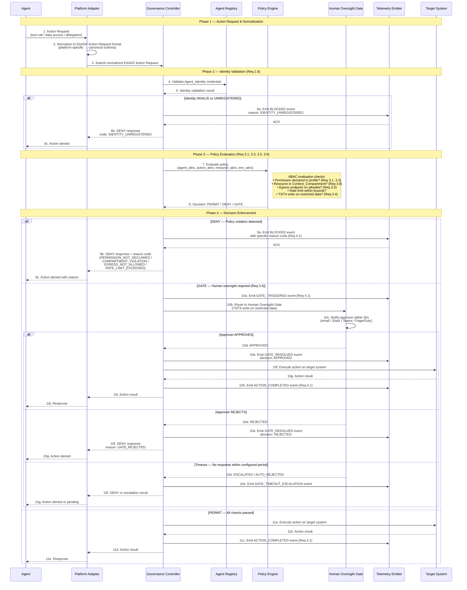

# Agent Action Governance Flow

## Overview

This document describes the end-to-end governance flow that every agent action passes through before reaching its target system. The flow ensures that all actions are identity-verified, policy-evaluated, and audit-logged regardless of the originating platform.

The agent action governance flow is the core enforcement pattern of the EAAGF. Every Platform Adapter MUST implement this flow for all agent-initiated actions, including tool calls, data access requests, agent-to-agent delegations, and external connections.

### Applicable Requirements

| Requirement | Description |
|---|---|
| 1.6 | Deny actions from agents without a valid registered Agent_Identity |
| 3.1 | Grant only minimum permissions declared in the Conformance_Profile |
| 3.3 | Deny permissions not declared in the Conformance_Profile |
| 3.4 | Route T3/T4 write operations on restricted data to Human_Oversight_Gate |
| 3.5 | Enforce network egress controls against the approved allowlist |
| 3.8 | Deny access to resources outside the declared Context_Compartment |
| 4.1 | Emit an audit event for every agent action with full context |

---

## End-to-End Agent Action Sequence

The following sequence diagram shows the complete governance decision path from action request to response delivery.

---

## Decision Point Annotations

### Decision Point 1: Platform Adapter Normalization (Steps 1–3)

The Platform Adapter translates the platform-native action request into the canonical EAAGF Action Request format. This normalization ensures that the Governance Controller processes all actions uniformly, regardless of whether the agent runs on Databricks, Salesforce, Snowflake, or any other supported platform.

The normalized request includes:
- `agent_id` — The registered UUID v4 identifier
- `action_type` — One of: `TOOL_CALL`, `DATA_ACCESS`, `AGENT_DELEGATION`, `EXTERNAL_CONNECTION`
- `target_resource` — The URI of the resource being accessed
- `input_summary` — A structured summary of the action input
- `context_compartment` — The compartment scope for this action
- `correlation_id` — The task-level correlation ID for trace reconstruction

### Decision Point 2: Identity Validation (Steps 4–6) — Requirement 1.6

The Governance Controller validates the agent's identity credential against the Agent Registry. This check verifies:

- The agent has a registered Agent_Identity (X.509 certificate or OAuth 2.0 token)
- The credential has not expired or been revoked
- The credential matches the agent_id in the action request

If validation fails, the action is immediately denied with reason code `IDENTITY_UNREGISTERED`, and a BLOCKED audit event is emitted. No further policy evaluation occurs.

### Decision Point 3: Policy Evaluation (Steps 7–8) — Requirements 3.1, 3.3, 3.5, 3.8

The Policy Engine evaluates the action request using an attribute-based access control (ABAC) model. The evaluation considers four attribute sets:

| Attribute Set | Attributes Evaluated |
|---|---|
| Agent attributes | `agent_id`, `risk_tier`, `lifecycle_state`, `conformance_profile` |
| Action attributes | `action_type`, `declared_in_profile`, `rate_within_limit` |
| Resource attributes | `classification`, `compartment`, `geographic_region` |
| Environment attributes | `time_of_day`, `active_incidents`, `platform` |

The policy evaluation performs the following checks in order:

1. **Permission declaration check (Req 3.1, 3.3)** — Is the requested permission declared in the agent's Conformance_Profile? If not, deny with `PERMISSION_NOT_DECLARED`.
2. **Context compartment check (Req 3.8)** — Is the target resource within the agent's declared Context_Compartment? If not, deny with `COMPARTMENT_VIOLATION`.
3. **Egress allowlist check (Req 3.5)** — For external connections, is the target endpoint on the agent's approved egress allowlist? If not, deny with `EGRESS_NOT_ALLOWED`.
4. **Rate limit check** — Has the agent exceeded its configured action rate limit? If so, deny with `RATE_LIMIT_EXCEEDED`.
5. **Human oversight check (Req 3.4)** — Is this a T3/T4 agent performing a write operation on restricted data? If so, route to the Human Oversight Gate.

If all checks pass, the decision is `PERMIT`.

### Decision Point 4: DENY Path (Step 9) — Requirement 4.1

When the Policy Engine returns DENY, the Governance Controller:

1. Emits a `BLOCKED` audit event via the Telemetry Emitter within 500ms of the decision
2. Returns the denial to the Platform Adapter with the specific reason code
3. The Platform Adapter translates the denial back to the platform-native error format

Possible reason codes:
- `PERMISSION_NOT_DECLARED` — Action not in Conformance_Profile
- `COMPARTMENT_VIOLATION` — Resource outside declared compartment
- `EGRESS_NOT_ALLOWED` — Endpoint not on approved allowlist
- `RATE_LIMIT_EXCEEDED` — Action rate limit breached

### Decision Point 5: GATE Path (Steps 10a–10j) — Requirements 3.4, 4.1

When the Policy Engine returns GATE (triggered by T3/T4 write operations on restricted data), the Governance Controller:

1. Emits a `GATE_TRIGGERED` audit event
2. Routes the action to the Human Oversight Gate
3. The gate notifies the designated approver within 30 seconds via configured channels
4. The agent execution is paused until the gate resolves

The gate can resolve in three ways:
- **APPROVED** — The action proceeds to the target system, and `GATE_RESOLVED` + `ACTION_COMPLETED` events are emitted
- **REJECTED** — The action is denied, and a `GATE_RESOLVED` event with decision `REJECTED` is emitted
- **TIMEOUT** — If no response is received within the configured timeout (default: 4 hours), the gate escalates to the secondary approver and emits a `GATE_TIMEOUT_ESCALATION` event

### Decision Point 6: PERMIT Path (Steps 11a–11e) — Requirements 3.1, 4.1

When the Policy Engine returns PERMIT, the Governance Controller:

1. Forwards the action to the target system for execution
2. Receives the action result
3. Emits an `ACTION_COMPLETED` audit event with the full context (agent ID, action type, target resource, outcome, timestamp, Risk_Tier, platform)
4. Returns the result through the Platform Adapter to the agent

---

## Audit Event Coverage

Every path through the governance flow produces at least one audit event, ensuring complete observability:

| Flow Path | Audit Events Emitted |
|---|---|
| Identity validation failure | `BLOCKED` (reason: IDENTITY_UNREGISTERED) |
| Policy DENY | `BLOCKED` (reason: specific violation code) |
| Gate triggered → Approved | `GATE_TRIGGERED`, `GATE_RESOLVED`, `ACTION_COMPLETED` |
| Gate triggered → Rejected | `GATE_TRIGGERED`, `GATE_RESOLVED` |
| Gate triggered → Timeout | `GATE_TRIGGERED`, `GATE_TIMEOUT_ESCALATION` |
| Permit → Success | `ACTION_COMPLETED` |
| Permit → Target system error | `ACTION_COMPLETED` (outcome: failure) |

All events include the `eaagf.task.correlation_id` field to enable end-to-end trace reconstruction across the full action lifecycle.

---

## Cross-References

- [Agent Identity and Registration Standard](../eaagf-specification/02-agent-identity-standard.md) — Identity validation rules
- [Authorization Standard](../eaagf-specification/04-authorization-standard.md) — Policy evaluation model and credential TTL rules
- [Observability Standard](../eaagf-specification/05-observability-standard.md) — Audit event schema and emission SLAs
- [Human Oversight Standard](../eaagf-specification/06-human-oversight-standard.md) — Gate workflow and escalation rules
- [Human Oversight Flow](./human-oversight-flow.md) — Detailed gate workflow diagram
- [Credential Lifecycle Flow](./credential-lifecycle-flow.md) — Credential rotation and revocation
