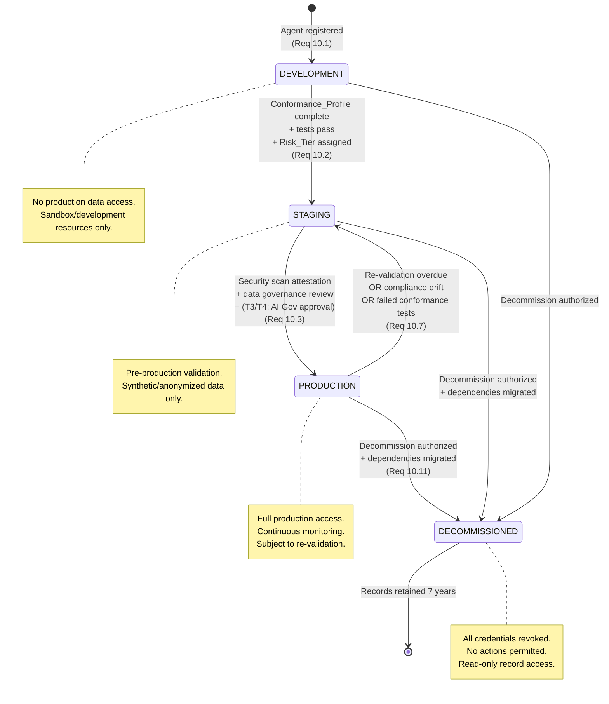
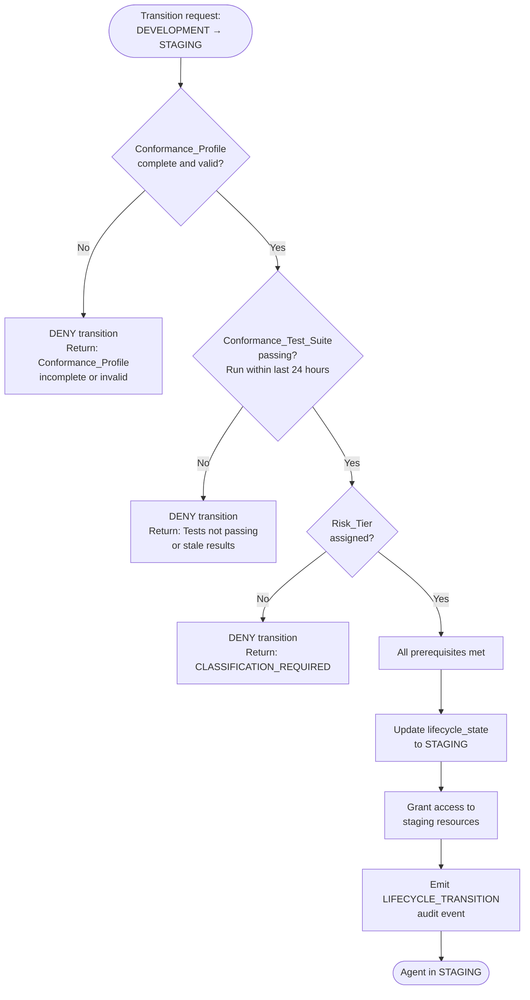
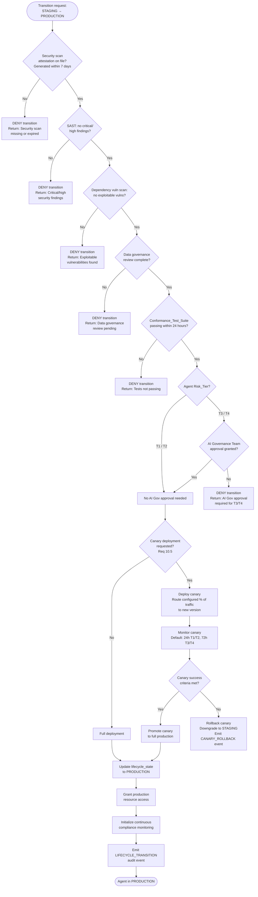
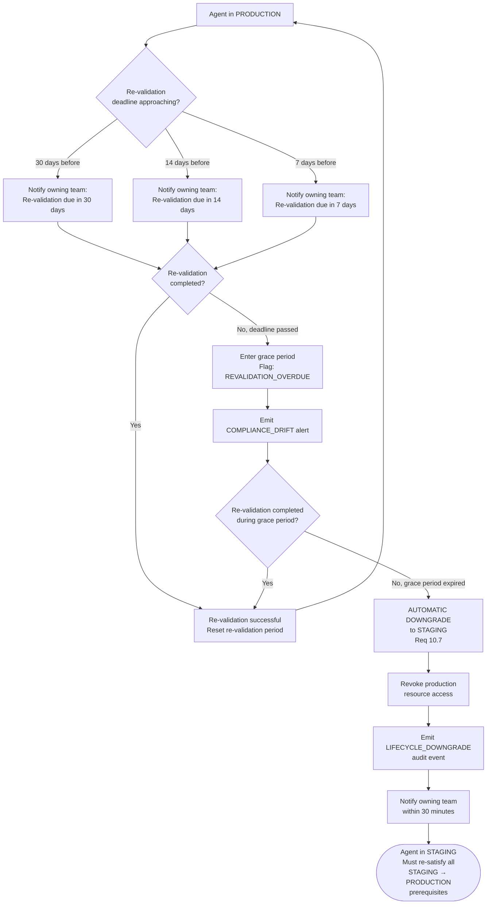
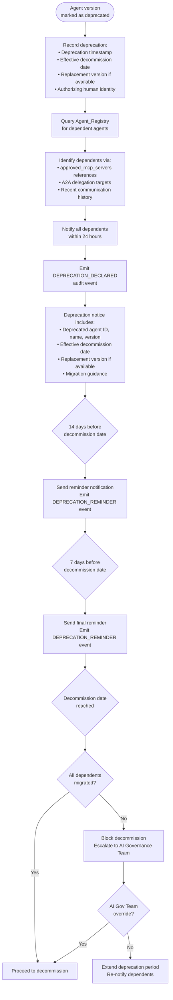
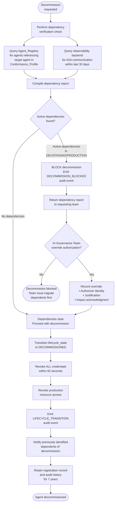
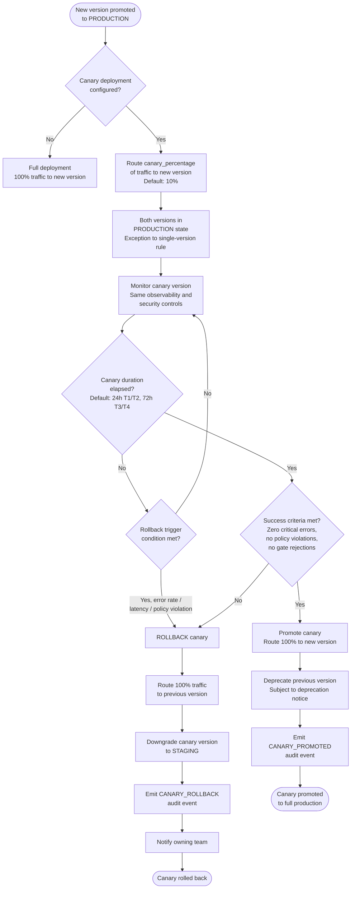

# Agent Lifecycle Flow

## Overview

This document describes the agent lifecycle flow within the EAAGF, covering the four-stage lifecycle state machine (DEVELOPMENT → STAGING → PRODUCTION → DECOMMISSIONED), transition gate prerequisites, re-validation enforcement and automatic downgrade, deprecation notification, and decommission dependency verification.

The lifecycle is a binding governance control — agents can only transition between stages by satisfying the prerequisites enforced by the Governance_Controller. Direct stage-skipping (e.g., DEVELOPMENT → PRODUCTION) is not permitted.

### Applicable Requirements

| Requirement | Description |
|---|---|
| 10.1 | Define and enforce four lifecycle stages: DEVELOPMENT, STAGING, PRODUCTION, DECOMMISSIONED |
| 10.2 | DEVELOPMENT → STAGING requires: Conformance_Profile, passing tests, Risk_Tier assignment |
| 10.3 | STAGING → PRODUCTION requires: security scan, data governance review, AI Gov approval (T3/T4) |
| 10.5 | Support canary deployment pattern for production promotion |
| 10.6 | Notify dependent agents and systems 30 days before deprecation |
| 10.7 | Automatically downgrade to STAGING if re-validation is overdue |
| 10.11 | Verify dependency migration before completing decommission |

---

## Lifecycle State Machine

### Lifecycle Stage Summary

| Stage | Permitted Actions | Data Access | Monitoring |
|---|---|---|---|
| DEVELOPMENT | Tool calls against sandbox resources, conformance testing | Development/sandbox only | Basic |
| STAGING | Tool calls against staging resources, integration testing, security scanning | Synthetic/anonymized only | Standard |
| PRODUCTION | All declared actions within Conformance_Profile scope | Production data | Continuous |
| DECOMMISSIONED | None (read-only record access for audit) | None | Archived |

---

## DEVELOPMENT → STAGING Transition (Requirement 10.2)

### Prerequisites Checklist

| # | Prerequisite | Validation |
|---|---|---|
| 1 | Conformance_Profile complete | Validated against EAAGF Conformance Profile JSON Schema |
| 2 | Conformance_Test_Suite passing | Full suite run within last 24 hours, all applicable tests pass |
| 3 | Risk_Tier assigned | T1, T2, T3, or T4 recorded in Agent_Registry |

---

## STAGING → PRODUCTION Transition (Requirement 10.3)

### Prerequisites Checklist

| # | Prerequisite | Validation |
|---|---|---|
| 1 | Security scan attestation | SAST + dependency scan, no critical/high findings, generated within 7 days |
| 2 | Data governance review | Data access patterns, classification handling, geographic constraints compliant |
| 3 | Conformance_Test_Suite passing | Full suite run within last 24 hours |
| 4 | AI Governance Team approval (T3/T4 only) | Approver identity, timestamp, and conditions recorded |

---

## Re-Validation and Automatic Downgrade (Requirement 10.7)

Agents in PRODUCTION must be periodically re-validated. Failure to re-validate triggers automatic downgrade to STAGING.

### Re-Validation Periods and Grace Periods

| Risk Tier | Re-Validation Period | Grace Period |
|---|---|---|
| T1 | 180 days | 14 days |
| T2 | 180 days | 14 days |
| T3 | 90 days | 7 days |
| T4 | 90 days | 7 days |

### Re-Validation Requirements

| # | Requirement | Applies To |
|---|---|---|
| 1 | Passing Conformance_Test_Suite run (full suite) | All tiers |
| 2 | Current security scan attestation (within 7 days) | All tiers |
| 3 | Conformance_Profile review (still accurate) | All tiers |
| 4 | AI Governance Team confirmation of current risk assessment | T3/T4 only |

---

## Deprecation Notification Flow (Requirement 10.6)

When an agent version is deprecated, all dependent agents and systems receive 30 days notice before the effective decommission date.

---

## Decommission Dependency Verification (Requirement 10.11)

Before completing a decommission, the Governance_Controller verifies that all dependent agents and systems have migrated away.

### Dependency Verification Sources

| Source | What It Checks |
|---|---|
| Agent_Registry | Agents referencing target in Conformance_Profile (A2A targets, MCP server references) |
| Observability backend | Agent-to-agent communication involving target within last 30 days |

### Decommission Override Requirements

An override requires:
- Authorizing AI Governance Team member's identity
- Documented justification
- Acknowledgment of impact on dependent agents

---

## Canary Deployment Pattern (Requirement 10.5)

---

## Audit Event Coverage

| Event | Trigger | Key Fields |
|---|---|---|
| `LIFECYCLE_TRANSITION` | Agent transitions between lifecycle stages | agent_id, previous_state, new_state, authorizing_identity, prerequisites_verified |
| `LIFECYCLE_DOWNGRADE` | Agent automatically downgraded from PRODUCTION | agent_id, downgrade_reason, timestamp |
| `DEPRECATION_DECLARED` | Agent version marked as deprecated | agent_id, effective_date, replacement_version, authorizer |
| `DEPRECATION_REMINDER` | Reminder sent before deprecation effective date | agent_id, days_remaining, dependent_count |
| `DECOMMISSION_BLOCKED` | Decommission blocked due to active dependencies | agent_id, dependency_count, dependency_report |
| `CANARY_ROLLBACK` | Canary deployment rolled back | agent_id, version, rollback_trigger, canary_duration |
| `CANARY_PROMOTED` | Canary deployment promoted to full production | agent_id, version, canary_duration, success_metrics |
| `AGENT_VERSION_REGISTERED` | New agent version registered | agent_id, version, predecessor_version |

---

## Cross-References

- [Lifecycle Management Standard](../eaagf-specification/11-lifecycle-management-standard.md) — Normative lifecycle rules, transition gates, and re-validation enforcement
- [Agent Identity and Registration Standard](../eaagf-specification/02-agent-identity-standard.md) — Credential revocation on decommission, record retention
- [Risk Classification Standard](../eaagf-specification/03-risk-classification-standard.md) — Risk_Tier assignment prerequisite
- [Compliance Standard](../eaagf-specification/10-compliance-standard.md) — Compliance drift triggers for downgrade
- [Agent Registration Flow](./agent-registration-flow.md) — Initial lifecycle state assignment
- [Credential Lifecycle Flow](./credential-lifecycle-flow.md) — Credential revocation on decommission
- [Incident Response Flow](./incident-response-flow.md) — Incident-triggered lifecycle actions
