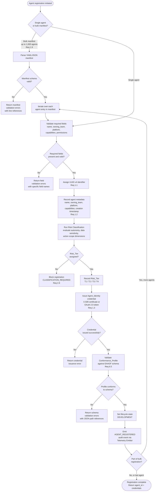

# Agent Registration Flow

## Overview

This document describes the end-to-end flow for registering an AI agent in the EAAGF Agent Registry. Registration is a prerequisite for any governed agent action — an unregistered agent cannot perform any action within the enterprise governance perimeter.

The registration flow covers single-agent registration and bulk registration (up to 1,000 agents via declarative manifest). Both paths converge at the same validation, classification, and credential issuance steps.

### Applicable Requirements

| Requirement | Description |
|---|---|
| 1.1 | Assign a globally unique UUID v4 identifier to every agent at registration |
| 1.2 | Record agent name, owning team, platform, Risk_Tier, creation timestamp, and Conformance_Profile |
| 1.3 | Issue a unique Agent_Identity credential (X.509 or OAuth 2.0) to each registered agent |
| 1.9 | Support bulk registration of up to 1,000 agents via declarative manifest (YAML or JSON) |
| 2.8 | Block deployment of agents without a valid Risk_Tier assignment |
| 6.5 | Validate Conformance_Profile against the EAAGF conformance schema |

---

## Registration Flow Diagram

---

## Decision Point Annotations

### Decision Point 1: Input Type — Single vs. Bulk (Requirement 1.9)

The registration flow supports two entry points:

- **Single agent** — A team submits a single agent manifest (YAML or JSON) via the registration API.
- **Bulk manifest** — A team submits a declarative manifest containing up to 1,000 agent entries. The manifest is parsed and each agent is processed through the same validation pipeline.

Bulk registration is atomic per-agent: if one agent in the manifest fails validation, that agent is rejected but other agents in the manifest continue processing. The response includes per-agent success/failure status.

### Decision Point 2: Field Validation (Requirement 1.2)

Every agent registration MUST include the following required fields:

| Field | Type | Description |
|---|---|---|
| `name` | string | Human-readable agent name |
| `owning_team` | string | Team responsible for the agent |
| `platform` | enum | Target platform (DATABRICKS, SALESFORCE, SNOWFLAKE, COPILOT_STUDIO, AWS, AZURE, GCP) |
| `capabilities` | array | Declared capabilities (TOOL_CALL, DATA_READ, DATA_WRITE, AGENT_DELEGATION, EXTERNAL_CONNECTION) |
| `declared_permissions` | array | Resource-action permission pairs |
| `version` | semver | Agent version (semantic versioning) |

Validation errors return the specific field name and the reason for failure (e.g., missing required field, invalid enum value, malformed semver string).

### Decision Point 3: UUID v4 Assignment (Requirement 1.1)

The Agent Registry assigns a globally unique UUID v4 identifier to the agent. This identifier is:

- Immutable for the lifetime of the agent record (including after decommission)
- Used as the primary key in all audit events, policy evaluations, and cross-references
- Unique across all platforms and all registration instances

### Decision Point 4: Risk Classification (Requirement 2.8)

The Governance Controller evaluates the agent's declared capabilities against the three classification dimensions (autonomy, data sensitivity, action scope) and assigns a Risk_Tier (T1–T4).

If the classification engine cannot determine a tier (e.g., insufficient information in the manifest), registration is blocked with error code `CLASSIFICATION_REQUIRED`. The team must provide additional information or complete the self-service risk classification questionnaire before retrying.

See [Risk Classification Flow](./risk-classification-flow.md) for the detailed classification process.

### Decision Point 5: Credential Issuance (Requirement 1.3)

After successful classification, the Agent Registry issues a unique Agent_Identity credential:

| Credential Type | Use Case | TTL |
|---|---|---|
| X.509 certificate | Long-lived agent identities, mTLS authentication | Configurable (default: 90 days) |
| OAuth 2.0 token | Short-lived session credentials, API authentication | Per Risk_Tier (T1/T2: 3600s, T3/T4: 900s) |

The credential is bound to the agent's UUID and includes the Risk_Tier and platform in its claims/attributes. Credential rotation is handled automatically when the credential reaches 80% of its TTL.

### Decision Point 6: Conformance Profile Validation (Requirement 6.5)

The Conformance_Profile declares the agent's capabilities, permissions, oversight requirements, and protocol support. The profile is validated against the EAAGF Conformance Profile JSON Schema.

Validation checks include:
- All required fields are present
- Declared permissions reference valid resource URIs
- Approved MCP servers are in the enterprise MCP directory
- Approved egress endpoints are well-formed
- Oversight mode is valid for the assigned Risk_Tier
- Protocol support includes at least MCP_1_0

Schema validation errors return JSON path references to the failing fields (e.g., `$.declared_permissions[2].resource`).

### Decision Point 7: Lifecycle State Initialization

All newly registered agents start in the `DEVELOPMENT` lifecycle state. Transition to `STAGING` and `PRODUCTION` requires additional governance gates (conformance tests, security scans, AI Governance Team approval for T3/T4).

See [Agent Lifecycle Flow](./agent-lifecycle-flow.md) for the complete lifecycle state machine.

---

## Error Codes

| Error Code | Trigger | Recovery Action |
|---|---|---|
| `MANIFEST_SCHEMA_INVALID` | Bulk manifest does not conform to the manifest schema | Fix manifest syntax and resubmit |
| `REQUIRED_FIELD_MISSING` | A required field is absent from the agent entry | Add the missing field and resubmit |
| `INVALID_FIELD_VALUE` | A field value does not match its expected type or enum | Correct the field value |
| `CLASSIFICATION_REQUIRED` | Risk classification could not assign a tier | Complete the risk classification questionnaire |
| `CREDENTIAL_ISSUANCE_FAILED` | Credential issuance encountered an infrastructure error | Retry; contact platform team if persistent |
| `CONFORMANCE_PROFILE_INVALID` | Conformance_Profile does not conform to the EAAGF schema | Fix profile against the schema and resubmit |

---

## Bulk Registration Behavior

When processing a bulk manifest (Requirement 1.9):

- The manifest is parsed and validated as a whole before individual agent processing begins
- Each agent entry is processed independently through the validation pipeline
- Per-agent failures do not block other agents in the manifest
- The response includes a summary with counts of successful and failed registrations
- Each failed agent entry includes the specific error code and field reference
- Maximum manifest size: 1,000 agent entries

---

## Cross-References

- [Agent Identity and Registration Standard](../eaagf-specification/02-agent-identity-standard.md) — Normative identity and registration rules
- [Risk Classification Standard](../eaagf-specification/03-risk-classification-standard.md) — Classification dimensions and tier definitions
- [Interoperability Standard](../eaagf-specification/07-interoperability-standard.md) — Conformance_Profile schema and validation
- [Risk Classification Flow](./risk-classification-flow.md) — Detailed classification process
- [Agent Lifecycle Flow](./agent-lifecycle-flow.md) — Lifecycle state transitions
- [Credential Lifecycle Flow](./credential-lifecycle-flow.md) — Credential rotation and revocation
