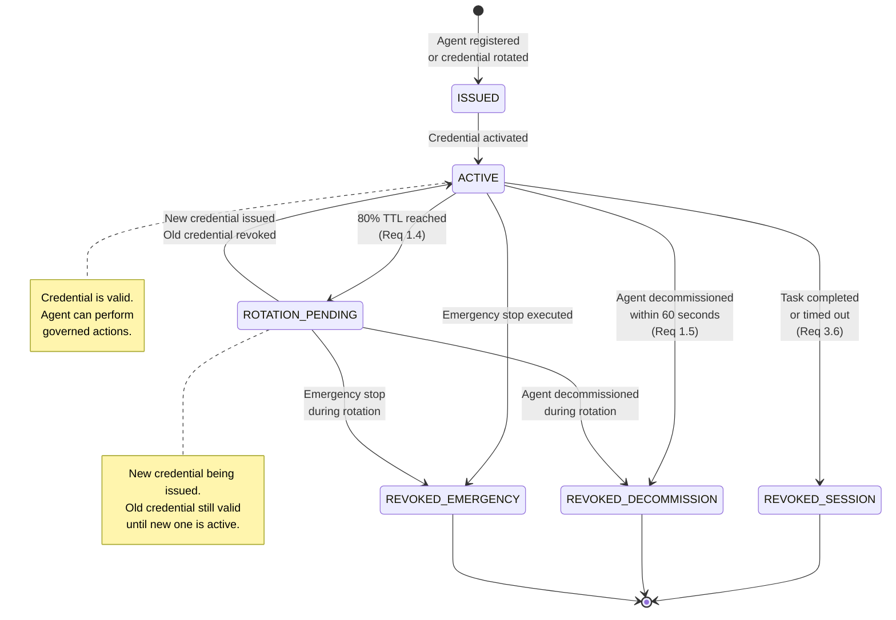
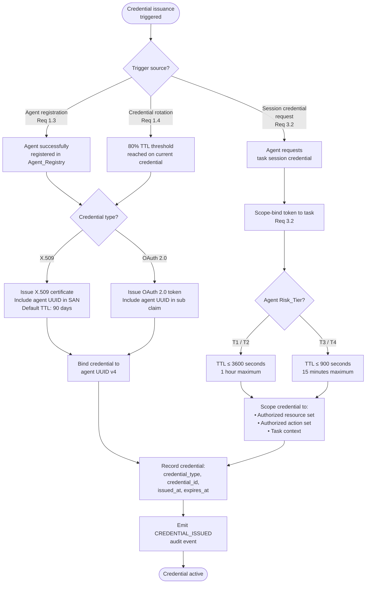
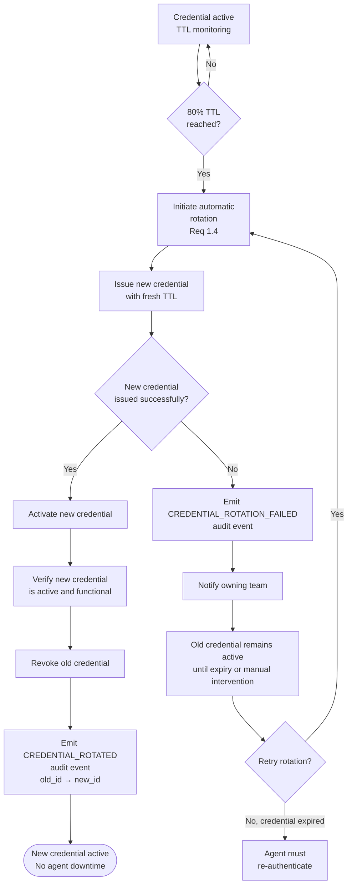
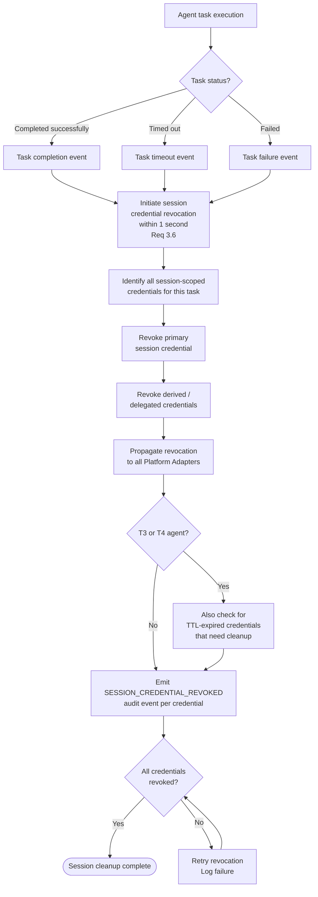
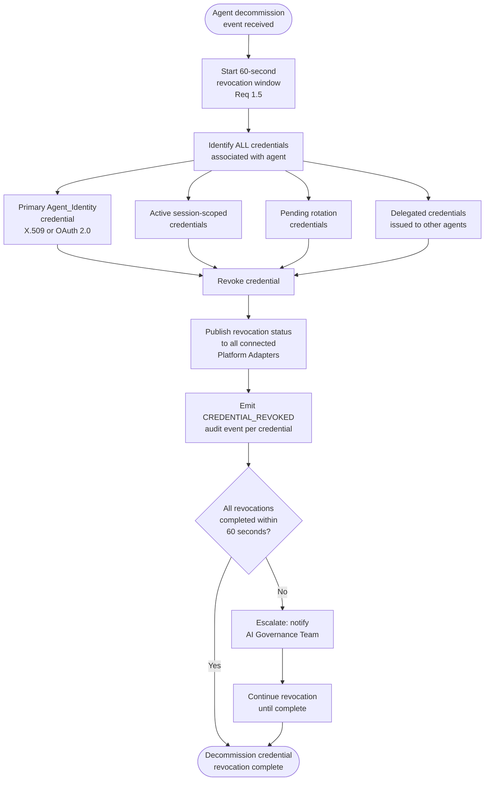
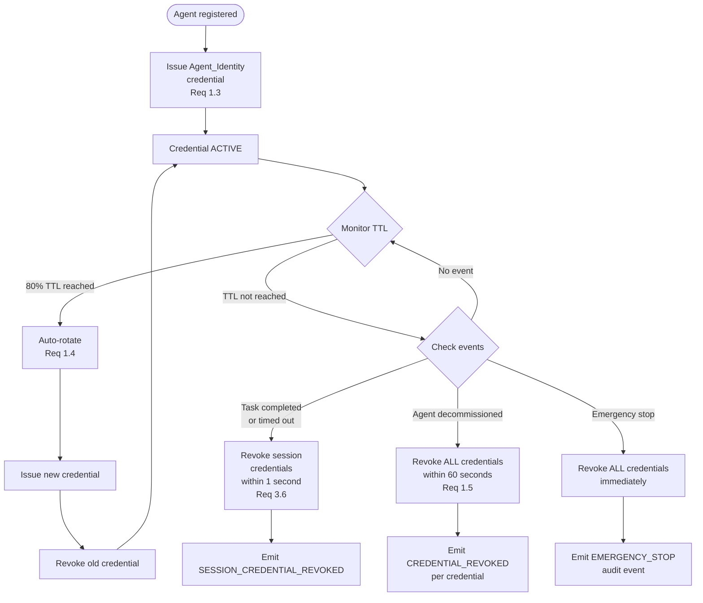

# Credential Lifecycle Flow

## Overview

This document describes the complete lifecycle of Agent_Identity credentials within the EAAGF, from initial issuance through active monitoring, automatic rotation at 80% TTL, revocation on task completion, and revocation on agent decommission.

Credentials are the mechanism by which agents prove their identity to the Governance_Controller and Platform Adapters. The credential lifecycle is tightly coupled to the agent's Risk_Tier, which determines TTL limits and session behavior.

### Applicable Requirements

| Requirement | Description |
|---|---|
| 1.3 | Issue a unique Agent_Identity credential (X.509 or OAuth 2.0) to each registered agent |
| 1.4 | Automatically rotate credentials at 80% TTL without agent downtime |
| 1.5 | Revoke all credentials within 60 seconds of agent decommission |
| 3.2 | Issue scope-bound tokens with TTL not exceeding tier-based maximums |
| 3.6 | Immediately revoke all session-scoped credentials on task completion or timeout |

---

## Credential Lifecycle State Diagram

---

## Credential Issuance Flow (Requirements 1.3, 3.2)

The following diagram shows the credential issuance process, which occurs at agent registration and after each rotation.

### Credential TTL Rules by Risk Tier

| Risk Tier | Maximum Credential TTL | Default Value | Session Behavior |
|---|---|---|---|
| T1 (Informational) | ≤ 3600 seconds | 3600 seconds (1 hour) | Revoke on task completion |
| T2 (Transactional) | ≤ 3600 seconds | 3600 seconds (1 hour) | Revoke on task completion |
| T3 (Autonomous) | ≤ 900 seconds | 900 seconds (15 minutes) | Revoke on task completion or timeout |
| T4 (Critical) | ≤ 900 seconds | 900 seconds (15 minutes) | Revoke on task completion or timeout |

---

## Automatic Rotation Flow (Requirement 1.4)

When a credential reaches 80% of its configured TTL, the Agent_Registry automatically rotates it without requiring agent downtime.

### Rotation Guarantees

- The new credential is activated before the old credential is revoked (no gap in validity).
- Rotation does not require agent downtime or restart.
- The agent continues operating with the existing credential until the new one is confirmed active.
- If rotation fails, the owning team is notified and the old credential remains valid until its natural expiry.

---

## Session Credential Revocation Flow (Requirement 3.6)

When an agent's task completes or times out, all session-scoped credentials are immediately revoked.

### Revocation Scope

All session-scoped credentials associated with the task are revoked, including:
- The primary session credential issued for the task
- Any derived or delegated credentials issued during the task (e.g., credentials passed to sub-tasks or delegated agents)
- Platform-specific tokens issued by Platform Adapters for the task

After revocation, any attempt to use the revoked credentials is rejected by all EAAGF components.

---

## Decommission Credential Revocation Flow (Requirement 1.5)

When an agent is decommissioned, ALL associated credentials must be revoked within 60 seconds.

### Decommission Revocation Guarantees

| Property | Value |
|---|---|
| Revocation window | 60 seconds from decommission event |
| Credential scope | ALL credentials (primary, session, rotation, delegated) |
| Platform propagation | Revocation published to all connected Platform Adapters within the 60-second window |
| Post-revocation enforcement | Any use of revoked credentials is rejected by all EAAGF components |
| Audit trail | CREDENTIAL_REVOKED event emitted for each revoked credential |

---

## Complete Credential Lifecycle Diagram

The following diagram shows the full credential lifecycle integrating issuance, monitoring, rotation, and all revocation paths.

---

## Audit Event Coverage

| Event | Trigger | Key Fields |
|---|---|---|
| `CREDENTIAL_ISSUED` | New credential issued at registration or rotation | agent_id, credential_id, credential_type, ttl, issued_at |
| `CREDENTIAL_ROTATED` | Automatic rotation at 80% TTL | agent_id, old_credential_id, new_credential_id, rotation_timestamp |
| `CREDENTIAL_ROTATION_FAILED` | Rotation attempt failed | agent_id, credential_id, failure_reason, timestamp |
| `SESSION_CREDENTIAL_ISSUED` | Task session credential issued | agent_id, credential_id, task_id, scope, ttl_seconds |
| `SESSION_CREDENTIAL_REVOKED` | Session credential revoked on task completion/timeout | agent_id, credential_id, task_id, revocation_reason |
| `CREDENTIAL_REVOKED` | Credential revoked on decommission or emergency stop | agent_id, credential_id, revocation_reason, timestamp |

---

## Cross-References

- [Agent Identity and Registration Standard](../eaagf-specification/02-agent-identity-standard.md) — Credential issuance, rotation, and decommission revocation rules
- [Authorization Standard](../eaagf-specification/04-authorization-standard.md) — Credential TTL rules and session revocation
- [Observability Standard](../eaagf-specification/05-observability-standard.md) — Audit event schema
- [Agent Registration Flow](./agent-registration-flow.md) — Credential issuance during registration
- [Human Oversight Flow](./human-oversight-flow.md) — Emergency stop credential revocation
