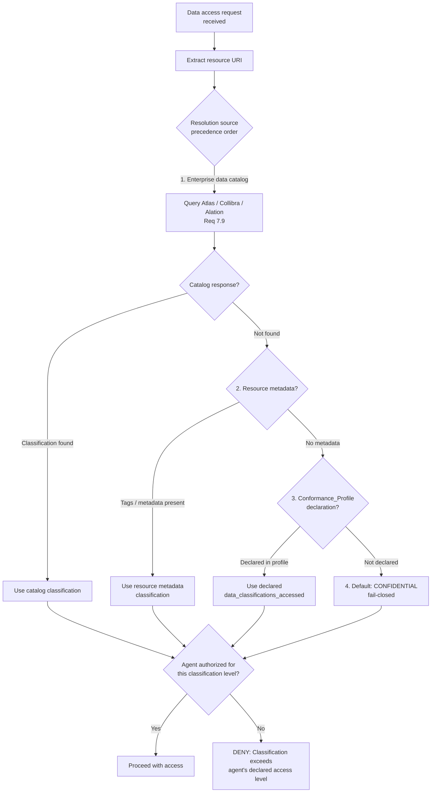
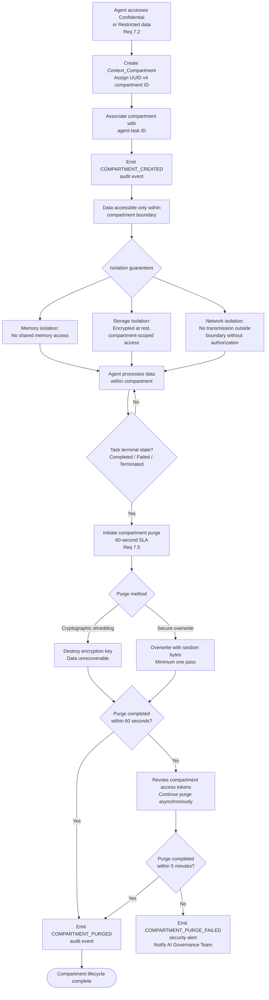
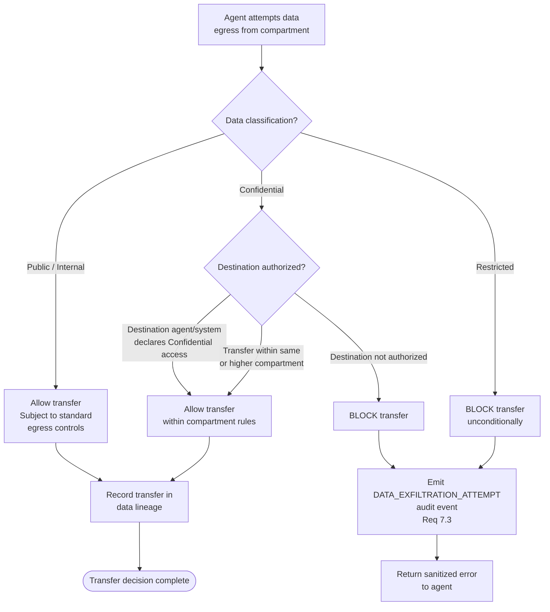
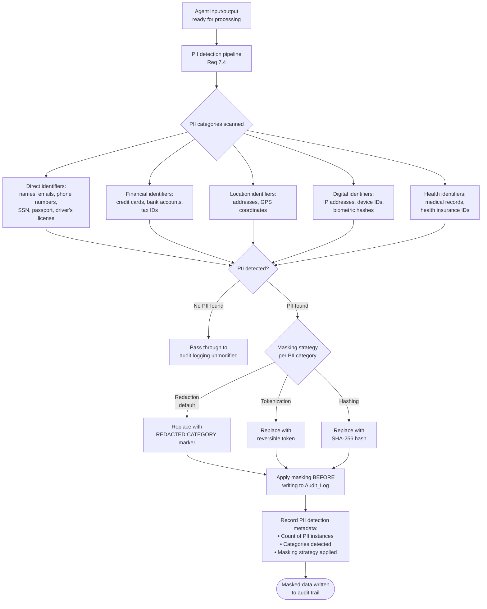
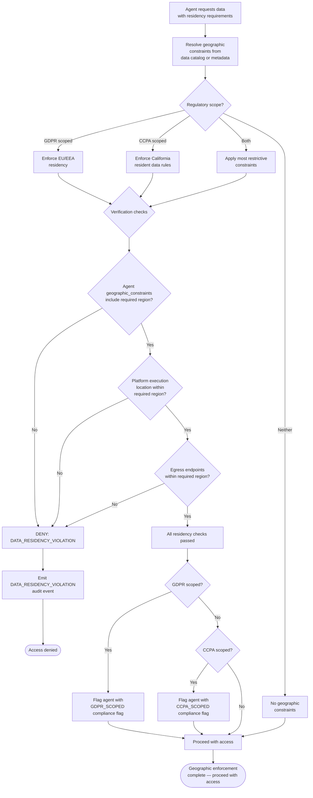
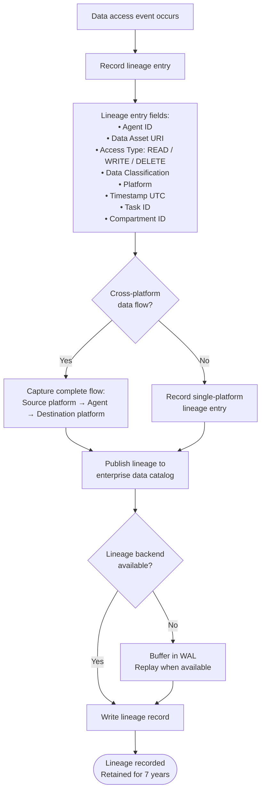
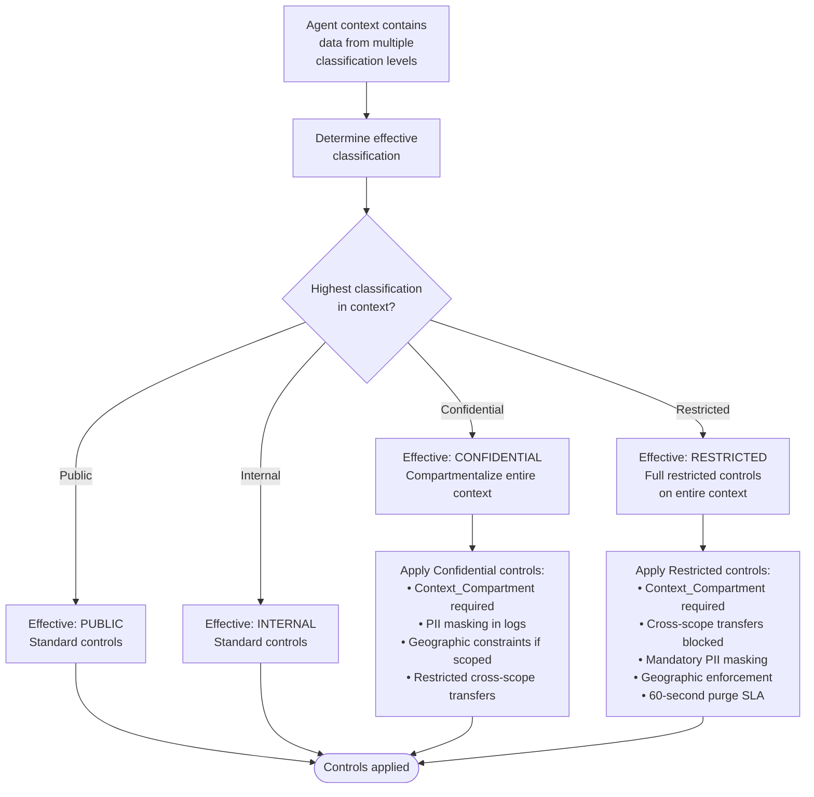

# Data Governance Flow

## Overview

This document describes the data governance flow within the EAAGF, covering the complete path from data access request through classification resolution, compartment creation, cross-scope transfer enforcement, PII detection and masking, compartment purge on task completion, and data lineage recording. It also covers geographic constraint enforcement for GDPR and CCPA compliance.

Data governance ensures that AI agents respect enterprise data classification policies, compartmentalize sensitive data within task contexts, and comply with privacy regulations. These controls prevent unauthorized data exposure, cross-contamination between agent tasks, and data exfiltration beyond authorized scopes.

### Applicable Requirements

| Requirement | Description |
|---|---|
| 7.1 | Enforce data classification labels (Public, Internal, Confidential, Restricted) on all agent data access |
| 7.2 | Create a Context_Compartment when an agent accesses Confidential or Restricted data |
| 7.3 | Block transfer of Restricted data outside authorized scope; emit DATA_EXFILTRATION_ATTEMPT |
| 7.4 | Detect PII in agent inputs/outputs and mask/redact PII in audit logs |
| 7.5 | Purge Confidential and Restricted data from Context_Compartment within 60 seconds of task completion |
| 7.6 | Maintain cross-platform data lineage records |
| 7.7 | Enforce GDPR/CCPA data residency constraints |
| 7.9 | Integrate with enterprise data catalogs (Atlas, Collibra, Alation) for runtime classification resolution |
| 7.10 | Apply highest classification level's controls when context contains mixed-classification data |

---

## End-to-End Data Governance Flow

```mermaid
flowchart TD
    START([Agent requests<br/>data access]) --> RESOLVE[Resolve data classification<br/>from enterprise data catalog<br/>Req 7.9]

    RESOLVE --> CATALOG{Data catalog<br/>available?}
    CATALOG -->|Yes| CATALOG_RESOLVE[Retrieve classification from<br/>Atlas / Collibra / Alation]
    CATALOG -->|No| FALLBACK{Cached classification<br/>available?}
    FALLBACK -->|Yes| USE_CACHE[Use cached classification<br/>TTL: 5 minutes default]
    FALLBACK -->|No| FAIL_CLOSED[Fail-closed: treat as<br/>CONFIDENTIAL]

    CATALOG_RESOLVE --> CLASS_CHECK
    USE_CACHE --> CLASS_CHECK
    FAIL_CLOSED --> CLASS_CHECK

    CLASS_CHECK{Data classification<br/>level?<br/>Req 7.1}

    CLASS_CHECK -->|Public| STD_ACCESS[Standard access controls<br/>No compartment required]
    CLASS_CHECK -->|Internal| STD_ACCESS
    CLASS_CHECK -->|Confidential| COMPARTMENT[Create Context_Compartment<br/>Req 7.2]
    CLASS_CHECK -->|Restricted| COMPARTMENT_ENHANCED[Create Context_Compartment<br/>+ enhanced controls<br/>Req 7.2]

    COMPARTMENT --> GEO_CHECK
    COMPARTMENT_ENHANCED --> GEO_CHECK
    STD_ACCESS --> GEO_CHECK

    GEO_CHECK{Geographic residency<br/>constraints apply?<br/>Req 7.7}
    GEO_CHECK -->|Yes| GEO_ENFORCE[Enforce data residency<br/>See geographic flow below]
    GEO_CHECK -->|No| MIXED_CHECK

    GEO_ENFORCE --> GEO_VALID{Residency<br/>constraints met?}
    GEO_VALID -->|Yes| MIXED_CHECK
    GEO_VALID -->|No| GEO_DENY[DENY: DATA_RESIDENCY_VIOLATION<br/>Emit audit event]

    MIXED_CHECK{Context contains<br/>mixed classification<br/>levels?<br/>Req 7.10}
    MIXED_CHECK -->|Yes| APPLY_HIGHEST[Apply highest classification<br/>controls to entire context]
    MIXED_CHECK -->|No| GRANT_ACCESS

    APPLY_HIGHEST --> GRANT_ACCESS[Grant data access<br/>within compartment]

    GRANT_ACCESS --> PII_SCAN[Scan for PII<br/>in inputs and outputs<br/>Req 7.4]

    PII_SCAN --> PII_FOUND{PII detected?}
    PII_FOUND -->|Yes| PII_MASK[Mask/redact PII<br/>in audit logs<br/>Req 7.4]
    PII_FOUND -->|No| AUDIT_LOG[Standard audit logging]

    PII_MASK --> AUDIT_LOG

    AUDIT_LOG --> LINEAGE[Record data lineage<br/>Req 7.6]

    LINEAGE --> EXECUTE[Agent processes data]

    EXECUTE --> TRANSFER_CHECK{Cross-scope transfer<br/>attempted?<br/>Req 7.3}
    TRANSFER_CHECK -->|Yes, Restricted data| BLOCK_TRANSFER[BLOCK: DATA_EXFILTRATION_ATTEMPT<br/>Emit audit event]
    TRANSFER_CHECK -->|Yes, Confidential data| CONF_TRANSFER_CHECK{Destination has<br/>Confidential access?}
    CONF_TRANSFER_CHECK -->|Yes| ALLOW_TRANSFER[Allow transfer<br/>within compartment rules]
    CONF_TRANSFER_CHECK -->|No| BLOCK_TRANSFER
    TRANSFER_CHECK -->|No| TASK_CHECK

    ALLOW_TRANSFER --> TASK_CHECK
    TASK_CHECK{Task complete?}
    TASK_CHECK -->|No| EXECUTE
    TASK_CHECK -->|Yes| PURGE[Purge compartment<br/>within 60 seconds<br/>Req 7.5]

    PURGE --> LINEAGE_FINAL[Record final<br/>data lineage entry]
    LINEAGE_FINAL --> DONE([Data governance<br/>flow complete])
```

---

## Classification Resolution Flow (Requirements 7.1, 7.9)

The Governance_Controller resolves data classification labels at runtime using enterprise data catalogs, with a fail-closed default for unresolvable resources.

### Classification Hierarchy

| Level | Sensitivity | Compartment Required | Controls |
|---|---|---|---|
| Public | Lowest | No | Standard access controls |
| Internal | Low | No | Standard access controls |
| Confidential | High | Yes | Compartmentalization, PII masking, geographic constraints if GDPR/CCPA scoped |
| Restricted | Highest | Yes | Enhanced compartmentalization, cross-scope transfer blocking, mandatory PII masking, geographic enforcement |

---

## Context Compartment Lifecycle (Requirements 7.2, 7.5)

---

## Cross-Scope Transfer Enforcement (Requirement 7.3)

### Transfer Rules by Classification

| Classification | A2A Delegation | External System | Storage Outside Compartment | Agent Output | Logs/Telemetry |
|---|---|---|---|---|---|
| Public | Allowed | Allowed | Allowed | Allowed | Allowed |
| Internal | Allowed | Allowed (egress controls) | Allowed | Allowed | Allowed |
| Confidential | Restricted (destination must declare access) | Restricted | Restricted | Restricted | PII masked |
| Restricted | Blocked | Blocked | Blocked | Blocked | PII masked |

---

## PII Detection and Masking Flow (Requirement 7.4)

---

## Geographic Constraint Enforcement (Requirement 7.7)

### GDPR-Specific Rules

- Data SHALL NOT be transferred outside the EU/EEA unless an adequate transfer mechanism is in place (Standard Contractual Clauses, adequacy decision).
- Cross-border transfers within the EU/EEA are permitted without additional authorization.
- Agents accessing GDPR-scoped data are flagged with `GDPR_SCOPED` in the Agent_Registry.

### CCPA-Specific Rules

- California resident data must be processed in accordance with CCPA requirements.
- Agents accessing CCPA-scoped data are flagged with `CCPA_SCOPED` in the Agent_Registry.

---

## Data Lineage Recording (Requirement 7.6)

### Lineage Query Capabilities

| Query Type | Description |
|---|---|
| Forward lineage | Which agents and systems consumed data from this asset? |
| Backward lineage | Where did the data in this agent's output originate? |
| Impact analysis | If this data asset is modified or deleted, which agents and downstream systems are affected? |

---

## Mixed-Classification Context Rules (Requirement 7.10)

When an agent's context contains data from multiple classification levels, the highest classification controls apply to the entire context.

---

## Audit Event Coverage

| Event | Trigger | Key Fields |
|---|---|---|
| `COMPARTMENT_CREATED` | Agent accesses Confidential/Restricted data | compartment_id, agent_id, task_id, classification_level |
| `COMPARTMENT_PURGED` | Task completes, compartment data erased | compartment_id, agent_id, purge_method, elapsed_time |
| `COMPARTMENT_PURGE_DELAYED` | Purge exceeds 60-second SLA | compartment_id, delay_reason |
| `COMPARTMENT_PURGE_FAILED` | Purge exceeds 5-minute maximum | compartment_id, failure_reason |
| `DATA_EXFILTRATION_ATTEMPT` | Restricted data transfer blocked | agent_id, compartment_id, destination, classification |
| `DATA_RESIDENCY_VIOLATION` | Geographic constraint violated | agent_id, data_asset_uri, required_region, violating_condition |
| `DATA_CATALOG_UNAVAILABLE` | Data catalog unreachable at access time | catalog_type, fallback_action |

---

## Cross-References

- [Data Governance Standard](../eaagf-specification/08-data-governance-standard.md) — Normative data governance rules
- [Authorization Standard](../eaagf-specification/04-authorization-standard.md) — Context_Compartment isolation and egress controls
- [Observability Standard](../eaagf-specification/05-observability-standard.md) — Audit event schema and retention
- [Agent Action Flow](./agent-action-flow.md) — How data governance integrates into the action governance flow
- [Credential Lifecycle Flow](./credential-lifecycle-flow.md) — Session credential revocation on task completion
