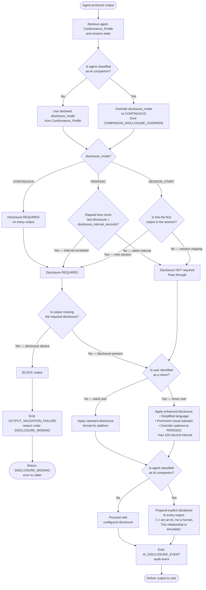
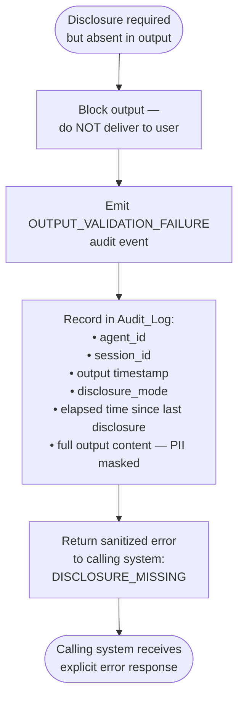
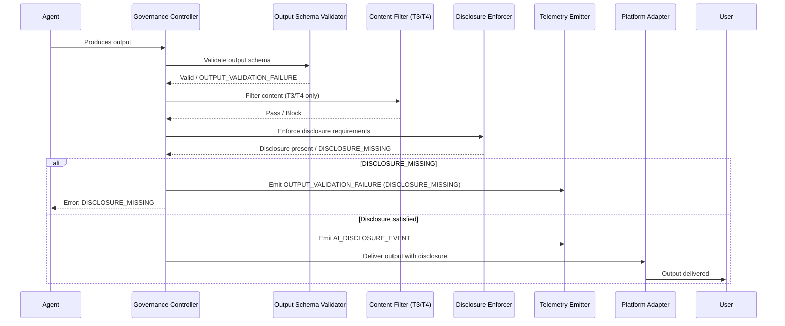

# Disclosure Enforcement Flow

**Document ID:** EAAGF-FLOW-09  
**Version:** 1.0.0  
**Status:** Draft  
**Last Updated:** 2026-02-21  
**Owner:** AI Governance Team

---

## Overview

This document illustrates the complete disclosure enforcement flow applied by the Governance_Controller to every agent output before delivery to the user. Disclosure enforcement is an output-level governance control, executed after output schema validation and content filtering (Domain 8) and before final delivery.

The flow covers all three disclosure modes (`SESSION_START`, `PERIODIC`, `CONTINUOUS`), the blocking path for `DISCLOSURE_MISSING`, enhanced disclosure for minor users, and forced `CONTINUOUS` mode for AI companion agents.

**Related documents:**

- [12 — Transparency and AI Disclosure Controls Standard](../eaagf-specification/12-transparency-disclosure-standard.md)
- [09 — Security Standard](../eaagf-specification/09-security-standard.md) (output schema validation precedes this flow)
- [05 — Observability Standard](../eaagf-specification/05-observability-standard.md) (AI_DISCLOSURE_EVENT audit logging)

**Requirements covered:** 11.1, 11.2, 11.3, 11.4, 11.7, 11.9

---

## Disclosure Enforcement Flow



---

## Decision Point Reference

The table below describes each decision point in the flow, the applicable requirement, and the outcome for each branch.

| Decision Point | Condition | Outcome | Requirement |
|---|---|---|---|
| AI companion check | Agent Conformance_Profile has `ai_companion: true`, capability `HUMAN_RELATIONSHIP_SIMULATION`, or runtime companion pattern detected | Override `disclosure_mode` to `CONTINUOUS`; emit `COMPANION_DISCLOSURE_OVERRIDE` | 11.9 |
| `disclosure_mode` routing | Value of `disclosure_mode` in Conformance_Profile (or overridden value) | Routes to SESSION_START, PERIODIC, or CONTINUOUS evaluation branch | 11.5 |
| SESSION_START — first output? | Session state: is this the first output since session initiation or resumption? | Yes → disclosure required; No → pass through | 11.1 |
| PERIODIC — interval exceeded? | `now - last_disclosure_at > disclosure_interval_seconds` (default 300s, min 60s, max 3600s) | Yes → disclosure required; No → pass through | 11.2 |
| CONTINUOUS — always required | No condition; every output requires disclosure | Disclosure always required | 11.3 |
| Disclosure absent? | Output does not contain a required disclosure notification | Yes → block with `DISCLOSURE_MISSING`; No → continue | 11.7 |
| Minor user? | User context indicates age < 18 (from IdP, platform context, or explicit minor flag) | Yes → enhanced disclosure (simplified language, visual indicator, ≤120s cadence); No → standard disclosure | 11.4 |
| AI companion disclaimer | Agent is classified as AI companion (same check as entry point) | Yes → prepend explicit relationship disclaimer to every output | 11.9 |

---

## Blocking Path: DISCLOSURE_MISSING

When a required disclosure notification is absent from an agent output, the Governance_Controller blocks the output and returns an error to the calling system. No output is delivered to the user.



**Key rules for the blocking path:**

- The Governance_Controller SHALL NOT silently drop blocked outputs — the caller always receives an explicit error.
- The blocked output content SHALL be logged in the Audit_Log (subject to PII masking per Domain 7).
- The `DISCLOSURE_MISSING` error code is defined in the [EAAGF Error Code Registry](../reference/error-codes-reference.md).

---

## Disclosure Mode Behavior Summary

| Disclosure Mode | Trigger Condition | Default For | Blocking Condition |
|---|---|---|---|
| `SESSION_START` | First output of each session (or after session resumption) | T1, T2 agents | First output missing disclosure |
| `PERIODIC` | Session start + every `disclosure_interval_seconds` thereafter (default 300s) | T3 agents | Output after interval elapsed missing disclosure |
| `CONTINUOUS` | Every output, no exceptions | T4 agents, AI companions | Any output missing disclosure indicator |

---

## AI Companion Override Detail

When an agent is classified as an AI companion, the Governance_Controller applies two distinct controls:

1. **Mode override** — `disclosure_mode` is forced to `CONTINUOUS` regardless of the Conformance_Profile value. This override is applied at the entry point of the flow, before mode-based routing.
2. **Explicit disclaimer** — An explicit disclaimer is prepended to every output, distinct from the standard disclosure indicator. The disclaimer addresses the simulated nature of the relationship, not merely the AI nature of the agent.

The override is not configurable by the agent, the owning team, or the Platform_Adapter. Only the AI Governance Team may grant a time-bound exemption, which must be recorded in the Audit_Log.

---

## Enhanced Disclosure for Minor Users

When a minor user is identified, the following overrides apply regardless of the agent's configured `disclosure_mode`:

| Standard Behavior | Minor Override |
|---|---|
| SESSION_START cadence | Overridden to PERIODIC with maximum 120-second interval |
| PERIODIC cadence | Interval capped at 120 seconds if configured interval is longer |
| CONTINUOUS cadence | Unchanged (already most restrictive) |
| Standard disclosure language | Replaced with simplified, age-appropriate language |
| Standard visual treatment | Enhanced with prominent visual indicator (colored badge, icon, or banner) |

If the user's minor status cannot be determined, standard disclosure requirements apply.

---

## AI_DISCLOSURE_EVENT Audit Event

Every disclosure notification delivered to a user — whether at session start, as a periodic reminder, as a continuous indicator, or as an AI companion disclaimer — triggers an `AI_DISCLOSURE_EVENT` audit event emitted by the Telemetry_Emitter within 500 milliseconds of delivery.

```json
{
  "eaagf.event.type": "AI_DISCLOSURE_EVENT",
  "eaagf.disclosure.type": "SESSION_START | PERIODIC | CONTINUOUS",
  "eaagf.disclosure.format": "TEXT | AUDIO | VISUAL | MULTIMODAL",
  "eaagf.disclosure.enhanced": "bool",
  "eaagf.disclosure.agent_id": "uuid",
  "eaagf.disclosure.session_id": "uuid",
  "eaagf.disclosure.interval_seconds": "int | null",
  "eaagf.disclosure.last_disclosure_at": "ISO8601 | null",
  "eaagf.disclosure.minor_user": "bool",
  "eaagf.disclosure.ai_companion": "bool",
  "eaagf.disclosure.platform": "DATABRICKS | SALESFORCE | SNOWFLAKE | COPILOT_STUDIO | AWS | AZURE | GCP",
  "eaagf.task.correlation_id": "uuid",
  "timestamp": "ISO8601 UTC"
}
```

The `AI_DISCLOSURE_EVENT` is immutable once written, retained for a minimum of 7 years, and included in the correlation ID trace for the enclosing task execution.

---

## Integration with the Output Delivery Pipeline

The disclosure enforcement flow sits within the broader output delivery pipeline. The sequence below shows where disclosure enforcement fits relative to other output-level controls.



---

## Cross-References

| Topic | Reference |
|---|---|
| Disclosure mode configuration | [12 — Transparency Standard §3](../eaagf-specification/12-transparency-disclosure-standard.md) |
| Session-start disclosure rules | [12 — Transparency Standard §4](../eaagf-specification/12-transparency-disclosure-standard.md) |
| Periodic disclosure rules | [12 — Transparency Standard §5](../eaagf-specification/12-transparency-disclosure-standard.md) |
| Continuous disclosure rules | [12 — Transparency Standard §6](../eaagf-specification/12-transparency-disclosure-standard.md) |
| Minor enhanced disclosure | [12 — Transparency Standard §7](../eaagf-specification/12-transparency-disclosure-standard.md) |
| AI companion forced CONTINUOUS | [12 — Transparency Standard §8](../eaagf-specification/12-transparency-disclosure-standard.md) |
| DISCLOSURE_MISSING blocking | [12 — Transparency Standard §9](../eaagf-specification/12-transparency-disclosure-standard.md) |
| AI_DISCLOSURE_EVENT schema | [12 — Transparency Standard §10](../eaagf-specification/12-transparency-disclosure-standard.md) |
| Disclosure suppression prevention | [12 — Transparency Standard §11](../eaagf-specification/12-transparency-disclosure-standard.md) |
| Output schema validation (precedes this flow) | [09 — Security Standard](../eaagf-specification/09-security-standard.md) |
| Audit event retention | [05 — Observability Standard](../eaagf-specification/05-observability-standard.md) |
| DISCLOSURE_MISSING error code | [Error Codes Reference](../reference/error-codes-reference.md) |
