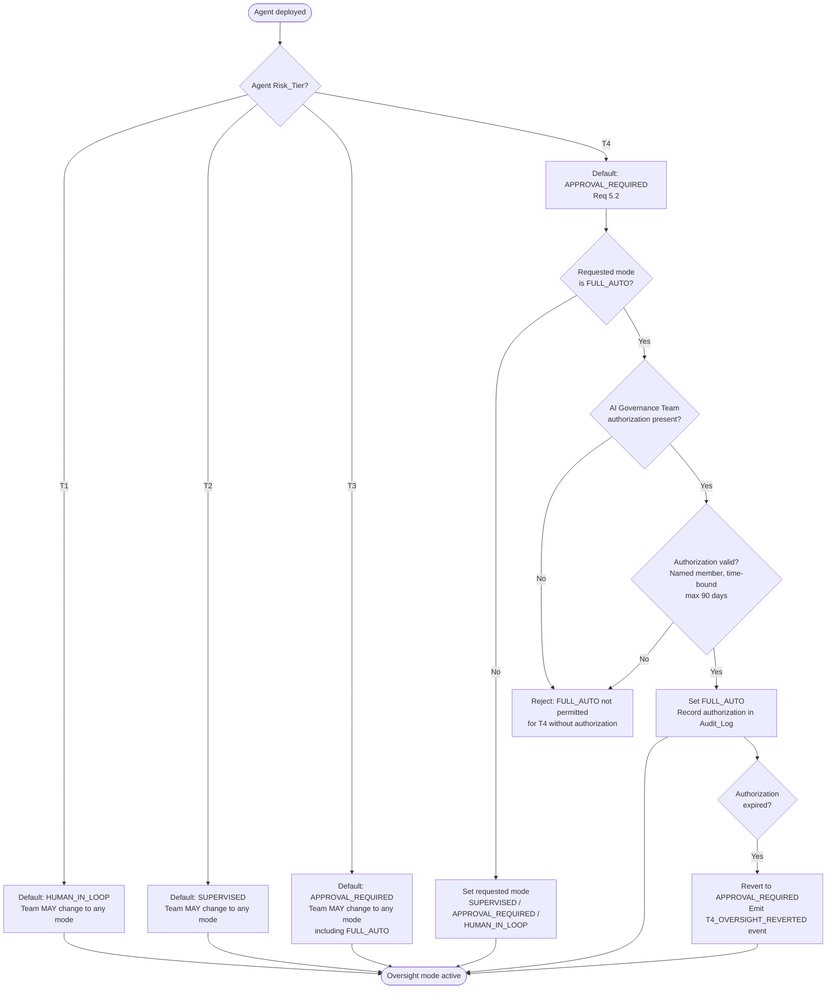
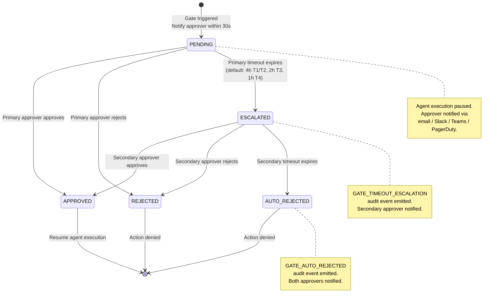
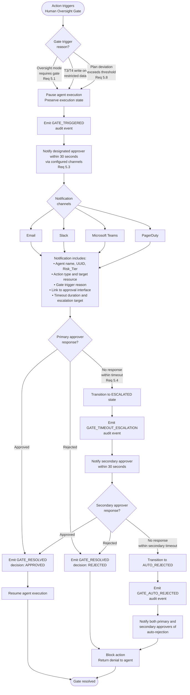
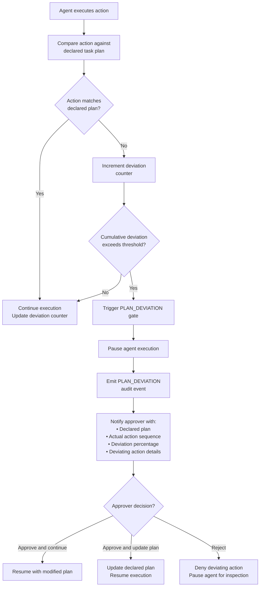
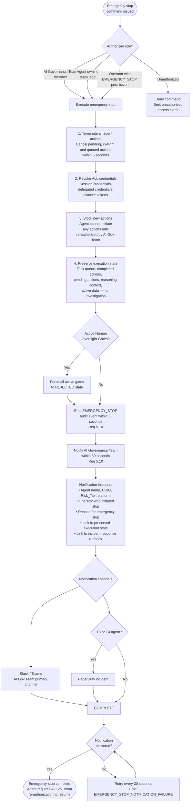

# Human Oversight Flow

## Overview

This document describes the human oversight governance flow within the EAAGF. It covers the gate trigger and approval workflow, the oversight mode selection logic, the gate state machine, timeout and escalation handling, and the emergency stop procedure.

Human oversight ensures that humans retain meaningful control over high-stakes agent decisions. The framework provides four oversight modes with increasing levels of human involvement, a gate-based approval workflow with notification and escalation, and an emergency stop capability for immediate intervention.

### Applicable Requirements

| Requirement | Description |
|---|---|
| 5.1 | Support four oversight modes: FULL_AUTO, SUPERVISED, APPROVAL_REQUIRED, HUMAN_IN_LOOP |
| 5.2 | Default T4 agents to APPROVAL_REQUIRED; block FULL_AUTO without AI Governance Team authorization |
| 5.3 | Notify designated approver within 30 seconds when a gate is triggered |
| 5.4 | Escalate to secondary approver on gate timeout (default: 4 hours) |
| 5.8 | Trigger a gate on plan deviation exceeding a configurable threshold |
| 5.9 | Support emergency stop that terminates all agent actions and revokes credentials |
| 5.10 | Emit EMERGENCY_STOP audit event and notify AI Governance Team within 60 seconds |

---

## Oversight Mode Selection Logic

The oversight mode determines which agent actions trigger a Human_Oversight_Gate. The mode is declared in the agent's Conformance_Profile and enforced by the Policy_Engine as part of the authorization decision flow.

### Oversight Mode Gate Trigger Matrix

The following table defines which action types trigger a Human_Oversight_Gate under each oversight mode (Requirement 5.1):

| Action Type | FULL_AUTO | SUPERVISED | APPROVAL_REQUIRED | HUMAN_IN_LOOP |
|---|---|---|---|---|
| Read-only data access | No gate | No gate | No gate | Gate |
| Write operation (internal) | No gate | Gate | Gate | Gate |
| Write operation (external) | No gate | Gate | Gate | Gate |
| External connection | No gate | No gate | Gate | Gate |
| Agent delegation (A2A) | No gate | No gate | Gate | Gate |
| Multi-step operation | No gate | No gate | Gate | Gate |
| Trivial read (e.g., health check) | No gate | No gate | No gate | Gate |

---

## Gate State Machine

The Human_Oversight_Gate follows a state machine that governs the lifecycle of every gate instance from trigger to resolution (Requirements 5.3, 5.4).

### State Definitions

| State | Description | Entry Condition | Exit Condition |
|---|---|---|---|
| PENDING | Gate triggered, awaiting primary approver response. | Gate triggered by oversight mode, plan deviation, or restricted data write. | Approver responds (→ APPROVED or REJECTED) or timeout expires (→ ESCALATED). |
| APPROVED | Gated action approved by a human approver. | Primary or secondary approver approves. | Terminal state. Agent execution resumes. |
| REJECTED | Gated action rejected by a human approver. | Primary or secondary approver rejects. | Terminal state. Action denied. |
| ESCALATED | Primary approver did not respond within timeout. Escalated to secondary approver. | Primary timeout expires without response. | Secondary approver responds or secondary timeout expires (→ AUTO_REJECTED). |
| AUTO_REJECTED | Neither approver responded within their timeouts. Action automatically rejected. | Secondary timeout expires without response. | Terminal state. Action denied. |

### State Transition Rules

1. Terminal states (APPROVED, REJECTED, AUTO_REJECTED) are immutable — once reached, no further transitions occur.
2. An emergency stop forces any active gate to REJECTED immediately, regardless of current state.
3. Each state transition produces an audit event.
4. The total maximum gate duration (primary + secondary timeout) SHALL NOT exceed a configurable maximum (default: 24 hours).

---

## End-to-End Human Oversight Flow

The following diagram shows the complete gate workflow from trigger through notification, approval/rejection, escalation, and resolution.

### Timeout Configuration by Risk Tier

| Risk Tier | Primary Timeout | Secondary Timeout | Maximum Gate Duration |
|---|---|---|---|
| T1 | 4 hours | 4 hours | 24 hours |
| T2 | 4 hours | 4 hours | 24 hours |
| T3 | 2 hours | 2 hours | 12 hours |
| T4 | 1 hour | 1 hour | 8 hours |

---

## Plan Deviation Gate (Requirement 5.8)

When an agent's action sequence deviates from its declared task plan beyond a configurable threshold, the Governance_Controller automatically triggers a Human_Oversight_Gate.

### Default Deviation Thresholds by Risk Tier

| Risk Tier | Default Deviation Threshold |
|---|---|
| T1 | 30% |
| T2 | 25% |
| T3 | 20% |
| T4 | 10% |

Agents in FULL_AUTO mode are exempt from plan deviation detection but deviation metrics are still logged for post-hoc analysis.

---

## Emergency Stop Procedure (Requirements 5.9, 5.10)

The emergency stop is a single authorized command that immediately terminates all agent actions and revokes all credentials. It is the most severe intervention available.

### Emergency Stop Characteristics

| Property | Value |
|---|---|
| Action termination SLA | Within 5 seconds |
| Credential revocation | All credentials (session, delegated, platform) |
| Audit event emission | Within 5 seconds |
| AI Governance Team notification | Within 60 seconds |
| Reversibility | Non-reversible. Requires AI Gov Team re-authorization. |
| Gate override | Forces all active gates to REJECTED |
| State preservation | Full execution state preserved for investigation |

---

## Audit Event Coverage

Every path through the human oversight flow produces audit events for complete observability:

| Flow Path | Audit Events Emitted |
|---|---|
| Gate triggered → Approved | `GATE_TRIGGERED`, `GATE_NOTIFICATION_SENT`, `GATE_RESOLVED` (APPROVED) |
| Gate triggered → Rejected | `GATE_TRIGGERED`, `GATE_NOTIFICATION_SENT`, `GATE_RESOLVED` (REJECTED) |
| Gate triggered → Timeout → Escalated → Approved | `GATE_TRIGGERED`, `GATE_NOTIFICATION_SENT`, `GATE_TIMEOUT_ESCALATION`, `GATE_RESOLVED` (APPROVED) |
| Gate triggered → Timeout → Escalated → Rejected | `GATE_TRIGGERED`, `GATE_NOTIFICATION_SENT`, `GATE_TIMEOUT_ESCALATION`, `GATE_RESOLVED` (REJECTED) |
| Gate triggered → Timeout → Escalated → Auto-rejected | `GATE_TRIGGERED`, `GATE_NOTIFICATION_SENT`, `GATE_TIMEOUT_ESCALATION`, `GATE_AUTO_REJECTED` |
| Plan deviation gate | `PLAN_DEVIATION`, `GATE_TRIGGERED`, `GATE_NOTIFICATION_SENT`, `GATE_RESOLVED` |
| Emergency stop | `EMERGENCY_STOP`, `EMERGENCY_STOP_NOTIFICATION_SENT` (or `EMERGENCY_STOP_NOTIFICATION_FAILURE`) |

---

## Cross-References

- [Human Oversight Standard](../eaagf-specification/06-human-oversight-standard.md) — Normative oversight rules, gate state machine, and emergency stop procedure
- [Authorization Standard](../eaagf-specification/04-authorization-standard.md) — Policy evaluation that triggers gates for T3/T4 restricted data writes
- [Observability Standard](../eaagf-specification/05-observability-standard.md) — Audit event schema and emission SLAs
- [Agent Action Flow](./agent-action-flow.md) — How gates integrate into the action governance flow
- [Incident Response Flow](./incident-response-flow.md) — Post-emergency-stop incident handling
