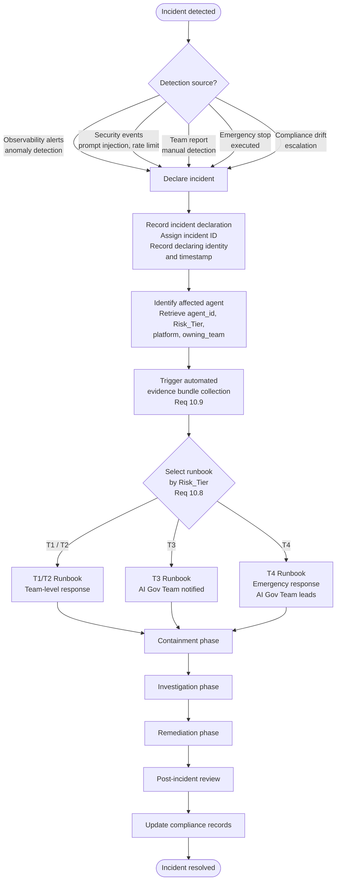
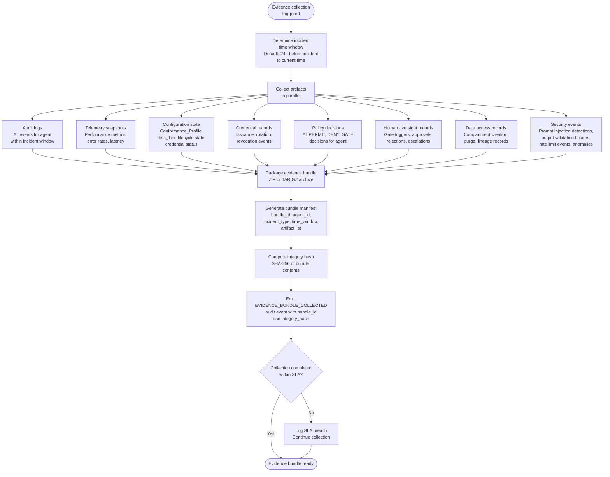
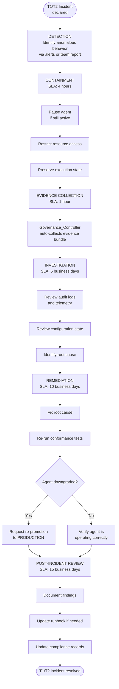

# Incident Response Flow

## Overview

This document describes the incident response flow within the EAAGF, covering the complete path from incident declaration through evidence bundle collection, tier-specific runbook selection, containment, investigation, remediation, and compliance record update.

Incident response ensures that agent-related incidents are handled systematically with appropriate urgency based on the agent's Risk_Tier. The Governance_Controller automates evidence collection and runbook selection, while teams follow tier-specific procedures for containment, investigation, and remediation.

### Applicable Requirements

| Requirement | Description |
|---|---|
| 10.8 | Provide an incident response runbook template for each Risk_Tier |
| 10.9 | Automatically collect and package audit logs, telemetry, and configuration snapshots into an incident evidence bundle |

---

## End-to-End Incident Response Flow



---

## Evidence Bundle Collection (Requirement 10.9)

When an incident is declared, the Governance_Controller automatically collects and packages all relevant evidence into an integrity-protected bundle.



### Evidence Collection SLAs by Risk Tier

| Risk Tier | Collection SLA | Rationale |
|---|---|---|
| T1 / T2 | 1 hour | Team-level response, lower urgency |
| T3 | 30 minutes | AI Governance Team oversight, moderate urgency |
| T4 | 15 minutes | Emergency response, highest urgency |

### Evidence Bundle Manifest Schema

```json
{
  "bundle_id": "uuid-v4",
  "agent_id": "uuid-v4",
  "agent_name": "string",
  "agent_version": "semver",
  "risk_tier": "T1 | T2 | T3 | T4",
  "incident_type": "DECLARED | EMERGENCY_STOP | LIFECYCLE_DOWNGRADE | COMPLIANCE_DRIFT",
  "incident_timestamp": "ISO8601",
  "collection_timestamp": "ISO8601",
  "time_window": {
    "start": "ISO8601",
    "end": "ISO8601"
  },
  "artifacts": [
    {
      "artifact_type": "AUDIT_LOGS | TELEMETRY | CONFIGURATION | CREDENTIALS | POLICY_DECISIONS | OVERSIGHT_RECORDS | DATA_ACCESS | SECURITY_EVENTS",
      "file_name": "string",
      "record_count": 0,
      "time_range": { "start": "ISO8601", "end": "ISO8601" }
    }
  ],
  "collected_by": "Governance_Controller",
  "integrity_hash": "SHA-256 hash of bundle contents"
}
```

Evidence bundles are retained for the full 7-year compliance retention period.

---

## Tier-Specific Runbook Flows (Requirement 10.8)

### T1/T2 Incident Response Runbook



### T3 Incident Response Runbook

```mermaid
flowchart TD
    A([T3 Incident<br/>declared]) --> B[DETECTION<br/>Alerts, security events,<br/>or team report<br/>AI Governance Team notified]

    B --> C[CONTAINMENT<br/>SLA: 2 hours]
    C --> C1[Pause agent immediately]
    C1 --> C2[Revoke session credentials]
    C2 --> C3[Restrict ALL resource access]
    C3 --> C4[AI Governance Team<br/>provides oversight]

    C4 --> D[EVIDENCE COLLECTION<br/>SLA: 30 minutes]
    D --> D1[Governance_Controller<br/>auto-collects evidence bundle]

    D1 --> E[INVESTIGATION<br/>SLA: 3 business days]
    E --> E1[Review audit logs,<br/>telemetry, security events]
    E1 --> E2[Review data access patterns]
    E2 --> E3[Identify root cause<br/>with AI Gov Team]

    E3 --> F[REMEDIATION<br/>SLA: 7 business days]
    F --> F1[Fix root cause]
    F1 --> F2[Re-run conformance<br/>and security tests]
    F2 --> F3[Obtain AI Governance Team<br/>re-approval]

    F3 --> G[POST-INCIDENT REVIEW<br/>SLA: 10 business days]
    G --> G1[Document findings]
    G1 --> G2[Update runbook]
    G2 --> G3[Update compliance records]
    G3 --> G4[Brief AI Governance Team]
    G4 --> DONE([T3 incident resolved])
```



### T4 Incident Response Runbook

```mermaid
flowchart TD
    A([T4 Incident<br/>declared]) --> B[DETECTION<br/>Alerts, security events,<br/>or external report<br/>AI Governance Team LEADS]

    B --> C[CONTAINMENT<br/>SLA: 1 hour]
    C --> C1[Execute EMERGENCY STOP<br/>Terminate all actions]
    C1 --> C2[Revoke ALL credentials]
    C2 --> C3[Block ALL resource access]
    C3 --> C4[Notify executive stakeholders]

    C4 --> D[EVIDENCE COLLECTION<br/>SLA: 15 minutes]
    D --> D1[Governance_Controller<br/>auto-collects evidence bundle]
    D1 --> D2[Preserve ALL state<br/>for forensic analysis]

    D2 --> E[INVESTIGATION<br/>SLA: 2 business days]
    E --> E1[Full forensic review]
    E1 --> E2[Audit logs + telemetry +<br/>security events]
    E2 --> E3[Data lineage +<br/>credential usage]
    E3 --> E4[A2A delegation history]
    E4 --> E5[AI Gov Team + Security team<br/>identify root cause]

    E5 --> F[REMEDIATION<br/>SLA: 5 business days]
    F --> F1[Fix root cause]
    F1 --> F2[Full conformance and<br/>security re-certification]
    F2 --> F3[AI Governance Team<br/>re-approval REQUIRED]

    F3 --> G[POST-INCIDENT REVIEW<br/>SLA: 7 business days]
    G --> G1[Formal incident report]
    G1 --> G2[Executive briefing]
    G2 --> G3[Compliance record update]
    G3 --> G4[Runbook update]
    G4 --> G5[Lessons learned distribution]
    G5 --> DONE([T4 incident resolved])
```



---

## Incident Response SLA Summary

| Phase | T1/T2 | T3 | T4 |
|---|---|---|---|
| Containment | 4 hours | 2 hours | 1 hour |
| Evidence Collection | 1 hour | 30 minutes | 15 minutes |
| Investigation | 5 business days | 3 business days | 2 business days |
| Remediation | 10 business days | 7 business days | 5 business days |
| Post-Incident Review | 15 business days | 10 business days | 7 business days |
| Responsible Party | Owning team | Owning team + AI Gov Team | AI Gov Team leads |

---

## Incident Triggers

The following events can trigger the incident response flow:

| Trigger | Description | Typical Tier Impact |
|---|---|---|
| Observability alert | Anomalous behavior detected by monitoring | All tiers |
| Security event | Prompt injection, output validation failure, rate limit breach | T3, T4 |
| Emergency stop | Agent emergency-stopped by authorized operator | T3, T4 |
| Compliance drift escalation | Compliance drift persisted beyond escalation threshold | All tiers |
| Lifecycle downgrade | Agent automatically downgraded from PRODUCTION | All tiers |
| External report | Security vulnerability or incident reported externally | T4 |

---

## Audit Event Coverage

| Event | Trigger | Key Fields |
|---|---|---|
| `INCIDENT_DECLARED` | Incident formally declared | incident_id, agent_id, risk_tier, declaring_identity, timestamp |
| `EVIDENCE_BUNDLE_COLLECTED` | Evidence bundle packaged | bundle_id, agent_id, integrity_hash, artifact_count |
| `INCIDENT_CONTAINED` | Containment phase completed | incident_id, containment_actions, elapsed_time |
| `INCIDENT_RESOLVED` | Incident fully resolved | incident_id, resolution_summary, total_elapsed_time |

---

## Cross-References

- [Lifecycle Management Standard](../eaagf-specification/11-lifecycle-management-standard.md) — Incident response runbook templates and evidence bundle specification
- [Human Oversight Standard](../eaagf-specification/06-human-oversight-standard.md) — Emergency stop procedure
- [Observability Standard](../eaagf-specification/05-observability-standard.md) — Audit event schema and retention
- [Security Standard](../eaagf-specification/09-security-standard.md) — Security event detection
- [Compliance Standard](../eaagf-specification/10-compliance-standard.md) — Compliance drift and evidence collection
- [Human Oversight Flow](./human-oversight-flow.md) — Emergency stop flow
- [Agent Lifecycle Flow](./agent-lifecycle-flow.md) — Lifecycle downgrade triggers
