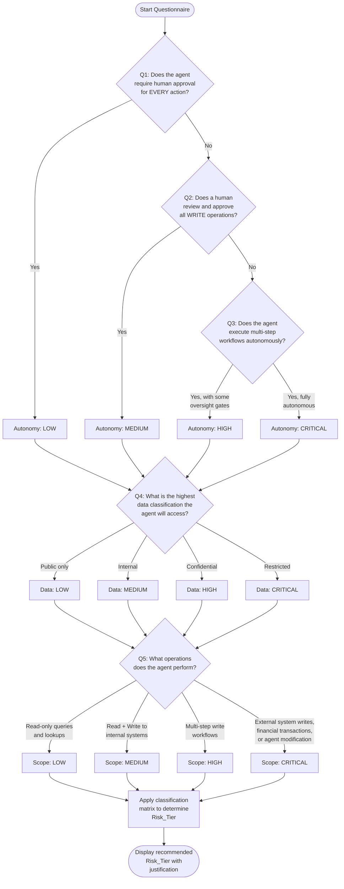
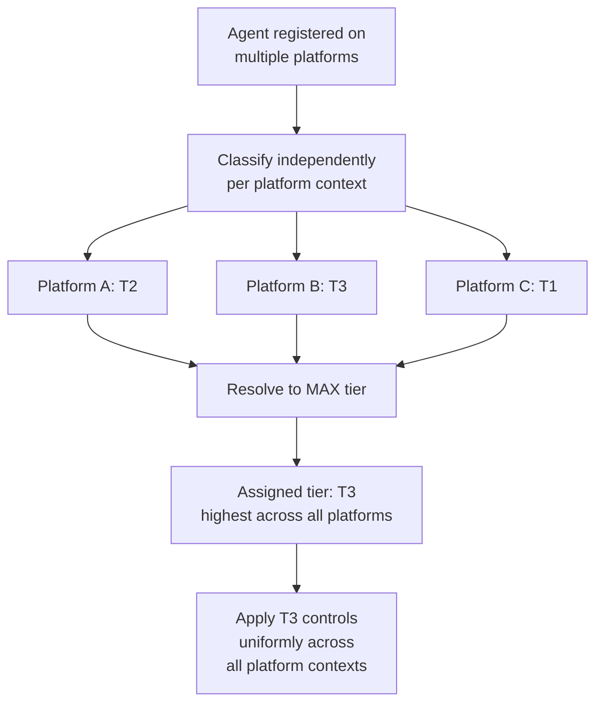
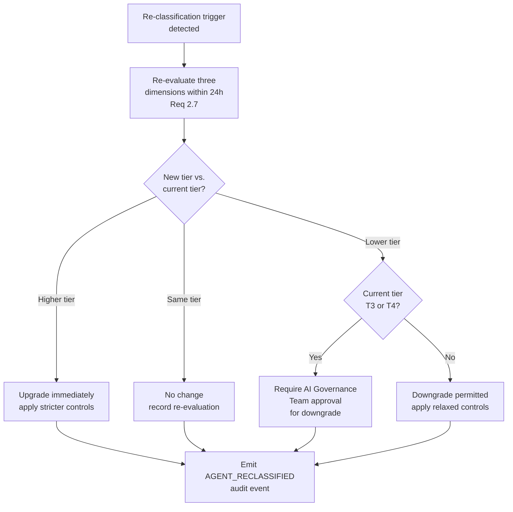

# Risk Classification Flow

## Overview

This document describes the flow for classifying an AI agent into one of four Risk Tiers (T1–T4) based on three dimensions: autonomy level, data sensitivity, and action scope. Risk classification is mandatory — no agent may be deployed without a valid Risk_Tier assignment.

The classification flow supports both automated classification (based on manifest declarations) and self-service classification (via an interactive questionnaire for teams that need guidance).

### Applicable Requirements

| Requirement | Description |
|---|---|
| 2.1 | Classify every registered agent into exactly one of four Risk_Tiers: T1, T2, T3, or T4 |
| 2.2 | Evaluate three dimensions: autonomy level, data sensitivity, and action scope |
| 2.3 | Assign T1 to read-only agents on non-sensitive data with human approval for every action |
| 2.4 | Assign T2 to transactional write agents on internal data with human-in-loop for writes |
| 2.5 | Assign T3 to autonomous agents on confidential data with multi-step writes |
| 2.6 | Assign T4 to agents on restricted data, external systems, financial transactions, or self-modifying capabilities |
| 2.7 | Re-evaluate Risk_Tier within 24 hours when agent capabilities change |
| 2.9 | Provide a self-service risk classification questionnaire |
| 2.10 | Assign the highest applicable Risk_Tier when an agent spans multiple platforms |

---

## Classification Flow Diagram

```mermaid
flowchart TD
    START([Classification initiated]) --> SOURCE{Classification<br/>source?}

    %% --- Automated path ---
    SOURCE -->|Automated<br/>from manifest| EXTRACT[Extract capability<br/>declarations from<br/>agent manifest]
    EXTRACT --> DIM1

    %% --- Self-service questionnaire path ---
    SOURCE -->|Self-service<br/>questionnaire<br/>Req 2.9| Q_START[Start questionnaire]
    Q_START --> Q_AUTO[Questionnaire:<br/>Autonomy questions]
    Q_AUTO --> Q_DATA[Questionnaire:<br/>Data sensitivity questions]
    Q_DATA --> Q_SCOPE[Questionnaire:<br/>Action scope questions]
    Q_SCOPE --> DIM1

    %% --- Dimension 1: Autonomy ---
    DIM1[Evaluate Dimension 1<br/>AUTONOMY LEVEL<br/>Req 2.2]
    DIM1 --> AUTO_LEVEL{Agent autonomy?}

    AUTO_LEVEL -->|Human approves<br/>every action| AUTO_LOW[Autonomy: LOW]
    AUTO_LEVEL -->|Human-in-loop<br/>for write operations| AUTO_MED[Autonomy: MEDIUM]
    AUTO_LEVEL -->|Autonomous<br/>multi-step execution| AUTO_HIGH[Autonomy: HIGH]
    AUTO_LEVEL -->|Fully autonomous<br/>no human gates| AUTO_CRIT[Autonomy: CRITICAL]

    %% --- Dimension 2: Data Sensitivity ---
    AUTO_LOW --> DIM2[Evaluate Dimension 2<br/>DATA SENSITIVITY<br/>Req 2.2]
    AUTO_MED --> DIM2
    AUTO_HIGH --> DIM2
    AUTO_CRIT --> DIM2

    DIM2 --> DATA_LEVEL{Data classification<br/>accessed?}

    DATA_LEVEL -->|Public only| DATA_LOW[Data: LOW]
    DATA_LEVEL -->|Internal /<br/>Public + Internal| DATA_MED[Data: MEDIUM]
    DATA_LEVEL -->|Confidential| DATA_HIGH[Data: HIGH]
    DATA_LEVEL -->|Restricted| DATA_CRIT[Data: CRITICAL]

    %% --- Dimension 3: Action Scope ---
    DATA_LOW --> DIM3[Evaluate Dimension 3<br/>ACTION SCOPE<br/>Req 2.2]
    DATA_MED --> DIM3
    DATA_HIGH --> DIM3
    DATA_CRIT --> DIM3

    DIM3 --> SCOPE_LEVEL{Action scope?}

    SCOPE_LEVEL -->|Read-only| SCOPE_LOW[Scope: LOW]
    SCOPE_LEVEL -->|Read + Write<br/>internal systems| SCOPE_MED[Scope: MEDIUM]
    SCOPE_LEVEL -->|Read + Write<br/>multi-step operations| SCOPE_HIGH[Scope: HIGH]
    SCOPE_LEVEL -->|Write + External<br/>+ Financial transactions| SCOPE_CRIT[Scope: CRITICAL]

    %% --- Classification Matrix ---
    SCOPE_LOW --> MATRIX[Apply Classification<br/>Matrix]
    SCOPE_MED --> MATRIX
    SCOPE_HIGH --> MATRIX
    SCOPE_CRIT --> MATRIX

    MATRIX --> TIER_RESULT{Tier assignment}

    TIER_RESULT -->|All LOW| T1[T1: Informational<br/>Req 2.3]
    TIER_RESULT -->|Max dimension<br/>is MEDIUM| T2[T2: Transactional<br/>Req 2.4]
    TIER_RESULT -->|Max dimension<br/>is HIGH| T3[T3: Autonomous<br/>Req 2.5]
    TIER_RESULT -->|Any dimension<br/>is CRITICAL| T4[T4: Critical<br/>Req 2.6]

    %% --- Multi-platform resolution ---
    T1 --> MULTI{Agent spans<br/>multiple platforms?<br/>Req 2.10}
    T2 --> MULTI
    T3 --> MULTI
    T4 --> MULTI

    MULTI -->|Yes| RESOLVE[Resolve to MAXIMUM<br/>tier across all<br/>platform contexts]
    MULTI -->|No| RECORD[Record Risk_Tier<br/>in Agent Registry]
    RESOLVE --> RECORD

    RECORD --> EMIT[Emit AGENT_CLASSIFIED<br/>audit event]
    EMIT --> DONE([Classification complete])
```

---

## Classification Matrix

The Risk_Tier is determined by the maximum severity level across the three dimensions. If any single dimension evaluates to CRITICAL, the agent is classified as T4 regardless of the other dimensions.

| Autonomy | Data Sensitivity | Action Scope | Assigned Tier |
|---|---|---|---|
| LOW | LOW | LOW | T1 (Informational) |
| LOW | MEDIUM | LOW | T2 (Transactional) |
| LOW | MEDIUM | MEDIUM | T2 (Transactional) |
| MEDIUM | LOW | MEDIUM | T2 (Transactional) |
| MEDIUM | MEDIUM | MEDIUM | T2 (Transactional) |
| HIGH | MEDIUM | MEDIUM | T3 (Autonomous) |
| MEDIUM | HIGH | MEDIUM | T3 (Autonomous) |
| MEDIUM | MEDIUM | HIGH | T3 (Autonomous) |
| HIGH | HIGH | HIGH | T3 (Autonomous) |
| CRITICAL | any | any | T4 (Critical) |
| any | CRITICAL | any | T4 (Critical) |
| any | any | CRITICAL | T4 (Critical) |

The general rule: **Tier = max(autonomy_level, data_sensitivity_level, action_scope_level)** mapped as LOW→T1, MEDIUM→T2, HIGH→T3, CRITICAL→T4.

---

## Tier Definitions

### T1 — Informational (Requirement 2.3)

- **Autonomy**: Human approves every action
- **Data**: Public or non-sensitive internal data only
- **Scope**: Read-only operations
- **Default oversight**: HUMAN_IN_LOOP
- **Credential TTL**: 3600 seconds (1 hour)
- **Re-validation period**: 180 days
- **AI Governance approval**: Not required

### T2 — Transactional (Requirement 2.4)

- **Autonomy**: Human-in-the-loop for write operations
- **Data**: Internal or confidential data
- **Scope**: Read and write on internal systems
- **Default oversight**: SUPERVISED
- **Credential TTL**: 3600 seconds (1 hour)
- **Re-validation period**: 180 days
- **AI Governance approval**: Not required

### T3 — Autonomous (Requirement 2.5)

- **Autonomy**: Autonomous multi-step execution without per-action human approval
- **Data**: Confidential data
- **Scope**: Read, write, and multi-step operations
- **Default oversight**: APPROVAL_REQUIRED
- **Credential TTL**: 900 seconds (15 minutes)
- **Re-validation period**: 90 days
- **AI Governance approval**: Required

### T4 — Critical (Requirement 2.6)

- **Autonomy**: Fully autonomous
- **Data**: Restricted data
- **Scope**: Write to external systems, financial transactions, or ability to modify other agents/governance controls
- **Default oversight**: APPROVAL_REQUIRED (cannot be set to FULL_AUTO without AI Governance Team authorization)
- **Credential TTL**: 900 seconds (15 minutes)
- **Re-validation period**: 90 days
- **AI Governance approval**: Required

---

## Self-Service Questionnaire Decision Tree (Requirement 2.9)

The self-service questionnaire guides teams through the three classification dimensions with structured questions. Each question maps to a dimension level.

### Questionnaire Questions

| # | Question | Dimension | Possible Answers |
|---|---|---|---|
| Q1 | Does the agent require human approval for every action it takes? | Autonomy | Yes → LOW |
| Q2 | Does a human review and approve all write operations? | Autonomy | Yes → MEDIUM |
| Q3 | Does the agent execute multi-step workflows autonomously? | Autonomy | With oversight gates → HIGH; Fully autonomous → CRITICAL |
| Q4 | What is the highest data classification the agent will access? | Data Sensitivity | Public → LOW; Internal → MEDIUM; Confidential → HIGH; Restricted → CRITICAL |
| Q5 | What operations does the agent perform? | Action Scope | Read-only → LOW; Read+Write internal → MEDIUM; Multi-step writes → HIGH; External/financial/agent-mod → CRITICAL |

---

## Multi-Platform Tier Resolution (Requirement 2.10)

When an agent operates across multiple platforms, the Risk_Tier MUST be resolved to the maximum tier across all platform contexts.

Example: An agent classified as T2 on Salesforce (internal data, supervised writes) and T3 on Databricks (confidential data, autonomous multi-step) is assigned T3 across all platforms. T3 governance controls apply even when the agent operates on Salesforce.

---

## Re-Classification Triggers (Requirement 2.7)

The Governance Controller SHALL re-evaluate an agent's Risk_Tier within 24 hours when any of the following changes occur:

| Trigger | Description |
|---|---|
| Capability change | Agent's declared capabilities are updated (e.g., adding EXTERNAL_CONNECTION) |
| Data scope change | Agent begins accessing a higher data classification level |
| Permission change | Agent's Conformance_Profile permissions are expanded |
| Platform addition | Agent is deployed to an additional platform |
| Oversight mode change | Agent's oversight mode is relaxed (e.g., SUPERVISED → FULL_AUTO) |
| Incident-driven review | A security incident or policy violation triggers mandatory re-assessment |

Re-classification follows the same three-dimension evaluation flow. If the new tier is higher than the current tier, the upgraded controls take effect immediately. If the new tier is lower, the downgrade requires AI Governance Team approval for T3/T4 agents.

---

## Cross-References

- [Risk Classification Standard](../eaagf-specification/03-risk-classification-standard.md) — Normative classification rules and tier definitions
- [Agent Identity and Registration Standard](../eaagf-specification/02-agent-identity-standard.md) — Registration prerequisites
- [Agent Registration Flow](./agent-registration-flow.md) — Registration flow that triggers classification
- [Agent Action Flow](./agent-action-flow.md) — How Risk_Tier affects action governance
