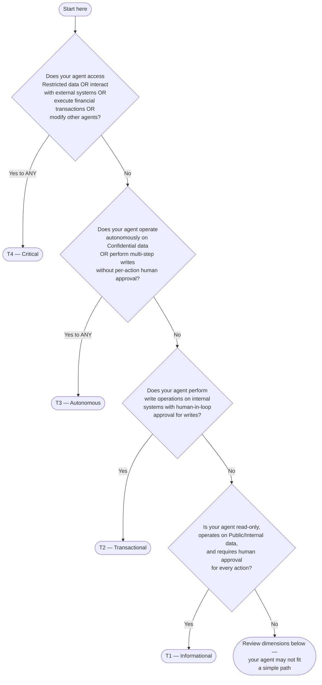

# Risk Assessment Guide

This guide helps product teams self-assess the risk tier of their AI agents using the EAAGF three-dimension classification model. By the end of this guide, you will have a recommended Risk_Tier (T1–T4) for your agent and understand the governance controls that apply.

For the normative specification, see [Risk Classification and Tiering Standard](../eaagf-specification/03-risk-classification-standard.md). For the classification flow diagram, see [Risk Classification Flow](../flows/risk-classification-flow.md).

---

## How Risk Classification Works

Every agent is classified across three dimensions:

1. **Autonomy Level** — How much human involvement is required in the agent's decision-making
2. **Data Sensitivity** — The highest classification level of data the agent accesses
3. **Action Scope** — The breadth and impact of actions the agent can perform

Each dimension is scored as LOW, MEDIUM, HIGH, or CRITICAL. The scores are combined using the classification matrix to produce a Risk_Tier (T1–T4). When scores point to multiple tiers, the highest tier wins.

---

## Decision Tree

Use this decision tree to quickly determine your agent's Risk_Tier. Start at the top and follow the path that matches your agent.

If the decision tree does not clearly resolve your tier, work through the detailed dimension assessment below.

---

## Dimension 1: Autonomy Level

Answer the questions below. Select the highest level that applies to your agent.

| # | Question | If Yes → Level |
|---|---|---|
| A1 | Does the agent require human approval before executing **every** action? | LOW |
| A2 | Does the agent execute read operations independently but require human approval for **write** operations? | MEDIUM |
| A3 | Does the agent execute multi-step workflows (including writes) **without** per-action human approval? | HIGH |
| A4 | Does the agent operate with **full autonomy**, making all decisions without any human intervention? | CRITICAL |

**Rule:** If multiple answers are "Yes", use the highest level. For example, if A2 and A3 are both "Yes", your autonomy level is HIGH.

### How to Evaluate

- Consider the agent's behavior in production, not just during testing.
- "Human approval" means a human explicitly approves or rejects each action before the agent executes it.
- "Human-in-loop for writes" means reads happen automatically but writes are gated.
- "Autonomous multi-step" means the agent chains multiple actions (reads and writes) without stopping for approval between steps.

**Your Autonomy Level:** _______________

---

## Dimension 2: Data Sensitivity

Identify the highest classification level of data your agent accesses. Data classification labels come from the enterprise data catalog.

| # | Question | If Yes → Level |
|---|---|---|
| D1 | Does the agent access **only** Public or Internal data? | LOW |
| D2 | Does the agent access **Confidential** data? | HIGH |
| D3 | Does the agent access **Restricted** data? | CRITICAL |

**Rule:** The highest classification level of any data the agent touches determines this dimension. If your agent reads Internal data and writes to a table containing Confidential data, your level is HIGH.

### Data Classification Quick Reference

| Classification | Examples |
|---|---|
| **Public** | Published documentation, public APIs, marketing materials |
| **Internal** | Internal wikis, team dashboards, non-sensitive operational data |
| **Confidential** | Customer records, employee data, financial reports, trade secrets |
| **Restricted** | Payment card data (PCI), health records (HIPAA), classified government data, authentication secrets |

If you are unsure about the classification of a data source, check the enterprise data catalog (Apache Atlas, Collibra, or Alation) or contact the Data Governance team.

**Your Data Sensitivity Level:** _______________

---

## Dimension 3: Action Scope

Identify the broadest category of actions your agent performs.

| # | Question | If Yes → Level |
|---|---|---|
| S1 | Does the agent perform **read-only** operations? | LOW |
| S2 | Does the agent perform **write** operations on **internal** systems? | MEDIUM |
| S3 | Does the agent perform **multi-step write** operations or **orchestrate workflows**? | HIGH |
| S4 | Does the agent interact with **external systems**, execute **financial transactions**, or **modify other agents/governance controls**? | CRITICAL |

**Rule:** Use the highest applicable level. If your agent reads data (S1) and also writes to internal systems (S2), your level is MEDIUM.

### How to Evaluate

- "Internal systems" means systems within the enterprise network boundary (databases, CRMs, internal APIs).
- "External systems" means any system outside the enterprise boundary (third-party APIs, partner systems, public cloud services accessed over the internet).
- "Financial transactions" includes payment processing, fund transfers, invoice generation, and any action that directly moves money.
- "Modify other agents" means the agent can change another agent's configuration, permissions, or governance controls.

**Your Action Scope Level:** _______________

---

## Applying the Classification Matrix

Now combine your three dimension scores using this matrix:

| Dimension | T1 (Informational) | T2 (Transactional) | T3 (Autonomous) | T4 (Critical) |
|---|---|---|---|---|
| **Autonomy** | LOW | MEDIUM | HIGH | CRITICAL |
| **Data Sensitivity** | LOW | MEDIUM (Internal/Confidential) | HIGH (Confidential) | CRITICAL (Restricted) |
| **Action Scope** | LOW | MEDIUM | HIGH | CRITICAL |

### Assignment Rules

1. **If ANY dimension is CRITICAL → T4.** Restricted data, external system interaction, financial transactions, or full autonomy each independently trigger T4.

2. **If ANY dimension is HIGH (and none are CRITICAL) → T3.** Autonomous multi-step operations or Confidential data access triggers T3.

3. **If ALL dimensions are MEDIUM or below, and at least one is MEDIUM → T2.** Human-in-loop writes on Internal/Confidential data.

4. **If ALL dimensions are LOW → T1.** Read-only, non-sensitive, human-approves-everything.

**Your Risk_Tier:** _______________

---

## Governance Controls by Tier

Once you know your tier, these governance controls apply automatically:

| Control | T1 | T2 | T3 | T4 |
|---|---|---|---|---|
| **Default Oversight Mode** | HUMAN_IN_LOOP | SUPERVISED | APPROVAL_REQUIRED | APPROVAL_REQUIRED |
| **Max Credential TTL** | 3600s (1 hour) | 3600s (1 hour) | 900s (15 min) | 900s (15 min) |
| **Max Actions/Minute** | 100 | 100 | 20 | 20 |
| **Re-validation Period** | 180 days | 180 days | 90 days | 90 days |
| **AI Gov Team Approval for Production** | No | No | Yes | Yes |
| **EU AI Act High-Risk Candidate** | No | Possible | Likely | Yes |

These are minimums — you can set stricter values but cannot relax them.

---

## Examples

### Example 1: Internal FAQ Bot → T1

| Dimension | Assessment | Level |
|---|---|---|
| Autonomy | Human approves every response before delivery | LOW |
| Data Sensitivity | Accesses only Public knowledge base articles | LOW |
| Action Scope | Read-only — retrieves and presents information | LOW |

All dimensions are LOW → **T1 (Informational)**.

### Example 2: CRM Update Agent → T2

| Dimension | Assessment | Level |
|---|---|---|
| Autonomy | Reads CRM data independently; human approves all writes | MEDIUM |
| Data Sensitivity | Accesses Internal and Confidential customer records | MEDIUM |
| Action Scope | Reads and writes to internal CRM system | MEDIUM |

All dimensions are MEDIUM → **T2 (Transactional)**.

### Example 3: Data Pipeline Orchestrator → T3

| Dimension | Assessment | Level |
|---|---|---|
| Autonomy | Executes multi-step ETL workflows without per-action approval | HIGH |
| Data Sensitivity | Processes Confidential financial data | HIGH |
| Action Scope | Reads, transforms, and writes across multiple internal systems | HIGH |

Dimensions are HIGH → **T3 (Autonomous)**.

### Example 4: Payment Processing Agent → T4

| Dimension | Assessment | Level |
|---|---|---|
| Autonomy | Fully autonomous transaction processing | CRITICAL |
| Data Sensitivity | Accesses Restricted payment card data | CRITICAL |
| Action Scope | Executes financial transactions with external payment providers | CRITICAL |

Any CRITICAL dimension → **T4 (Critical)**.

### Example 5: Mixed Dimensions → T4

| Dimension | Assessment | Level |
|---|---|---|
| Autonomy | Human approves every action | LOW |
| Data Sensitivity | Accesses Restricted data | CRITICAL |
| Action Scope | Read-only | LOW |

Even though autonomy and scope are LOW, Restricted data access makes this **T4 (Critical)**. Any single CRITICAL dimension triggers T4.

---

## Multi-Platform Agents

If your agent runs on more than one platform, the EAAGF applies the **maximum tier rule**: evaluate the agent's dimensions independently for each platform, then assign the highest tier across all platforms.

### Example: Cross-Platform Agent

| Platform | Autonomy | Data Sensitivity | Action Scope | Platform Tier |
|---|---|---|---|---|
| Salesforce | MEDIUM | MEDIUM | MEDIUM | T2 |
| Databricks | HIGH | HIGH | HIGH | T3 |

**Final Tier: T3** — the maximum across both platforms. T3 governance controls (15-minute credential TTL, 20 actions/min, APPROVAL_REQUIRED oversight) apply on all platforms, including Salesforce where the agent would otherwise be T2.

### What This Means in Practice

- Declare the highest tier in your agent manifest.
- All governance parameters (credential TTL, rate limits, oversight mode) must meet the highest tier's requirements across all platforms.
- If you later remove a platform context, the Governance_Controller will re-evaluate and may lower the tier.

---

## Re-Classification

Your agent's Risk_Tier is not permanent. Re-classification is triggered when your agent's capabilities change.

### Automatic Re-Classification Triggers

The Governance_Controller monitors your agent's Conformance_Profile and automatically triggers re-classification within 24 hours when any of the following changes:

| Change | Example |
|---|---|
| Capabilities added | Adding `EXTERNAL_CONNECTION` to a T2 agent |
| Data classification access changed | Adding `RESTRICTED` to `data_classifications_accessed` |
| Oversight mode changed | Moving from `SUPERVISED` to `FULL_AUTO` |
| Permission scope expanded | Adding write permissions to new resource types |
| Platform context added/removed | Deploying to an additional platform |

### What Happens During Re-Classification

1. Your agent continues operating under its current tier during the 24-hour re-classification window.
2. If the new tier is **higher**, the stricter controls apply immediately upon assignment.
3. If the new tier is **lower**, the Governance_Controller may apply the lower controls, but downgrading T3/T4 agents may require AI Governance Team approval.
4. A `RISK_TIER_CHANGED` audit event is emitted recording the previous tier, new tier, and triggering change.

### Periodic Re-Validation

Even without capability changes, agents must be re-validated periodically:

- **T1/T2:** Every 180 days
- **T3/T4:** Every 90 days

If re-validation is overdue, the Governance_Controller automatically downgrades the agent to `STAGING` and notifies the owning team.

### Requesting Manual Re-Classification

If you believe your agent's tier should change (e.g., you have reduced its capabilities), you can request manual re-classification through the Agent Registry API or by contacting the AI Governance Team.

---

## Frequently Asked Questions

**Q: What if my agent's dimensions don't clearly map to one tier?**  
A: Use the highest applicable tier. The classification matrix and assignment precedence rules always resolve to exactly one tier. If you are unsure, err on the side of a higher tier — you can request a downgrade after review.

**Q: Can I set my agent to a higher tier than the assessment suggests?**  
A: Yes. You can always apply stricter governance controls. Setting a higher tier is allowed and sometimes recommended for agents in sensitive business contexts.

**Q: What happens if I get the tier wrong?**  
A: The Governance_Controller validates your declared tier against your agent's actual capabilities during registration and at each lifecycle transition. If your declared tier is too low for your capabilities, registration or promotion will be blocked.

**Q: Do I need AI Governance Team approval for T1/T2 agents?**  
A: No. T1 and T2 agents can be promoted to production without AI Governance Team approval. T3 and T4 agents require explicit approval.

**Q: How do I handle an agent that will eventually access Restricted data but doesn't yet?**  
A: Register it at the tier that matches its current capabilities. When you add Restricted data access, the Governance_Controller will trigger re-classification within 24 hours.

---

## Cross-References

- [Risk Classification and Tiering Standard](../eaagf-specification/03-risk-classification-standard.md) — Normative specification
- [Agent Registration Guide](./agent-registration-guide.md) — How to register your agent after classification
- [Risk Classification Flow](../flows/risk-classification-flow.md) — Classification flow diagram
- [Human Oversight Standard](../eaagf-specification/06-human-oversight-standard.md) — Oversight mode definitions
- [Authorization Standard](../eaagf-specification/04-authorization-standard.md) — Credential TTL and rate limit rules
- [Lifecycle Management Standard](../eaagf-specification/11-lifecycle-management-standard.md) — Re-validation and lifecycle transitions
- [Glossary](../reference/glossary.md) — EAAGF terminology
